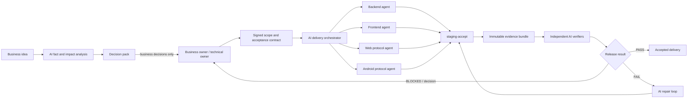

# Armada AI 交付与验收体系

> 状态：规划基线
> 日期：2026-08-25
> 适用范围：Armada 后端、前端、Web 协议、Android 协议
> 目标：用更多 AI 执行和验证时间，换取更少的人工决策、等待、点击和证据整理

## 先看结论

如果目标是独立判断这套设计是否符合最初预想，不要从本页开始。先按
[独立设计合理性复核指南](independent-design-review.md)只读取
[原始目标](original-intent.md)，形成不受当前方案影响的基准设计，再回来评估本方案。

Armada 当前不缺少代码生产能力，真正的约束是两个人工串行环节：

1. 业务原始想法需要技术负责人反复补做产品决策。
2. 代码本地验证后，需要技术负责人手工完成测试环境、真实 WhatsApp、Kafka、Redis、实例资源和流量验收。

并行增加编码 agent 只会继续增加“本地完成、等待验收”的在制品。本规划不再优化单纯编码速度，而是建立两套新能力：

- **需求决策系统**：AI 负责查事实、找矛盾、给方案、准备业务沟通材料；人只处理必须由人承担的业务取舍。
- **自动验收控制面**：四个项目共用 `staging-accept` 编排，脚本独立运行、有界等待、断点恢复，无论成败都生成证据包。

最终人工不再盯着每个步骤，只收到三类东西：

- 需要业务决定的选项包。
- 需要授权的测试环境或真实 WhatsApp 操作。
- AI 无法自动收敛的缺陷簇和发布风险。

## 四项目边界

| 组件 | 仓库 | 核心责任 | 验收适配器 |
|---|---|---|---|
| 后端 | `armada/` | Java/Spring、MySQL、Flyway、Kafka 消费与业务状态 | `backend` |
| 前端 | `wheel-saas-pure-web/` | Vue 页面、登录、菜单、用户业务流 | `frontend` |
| Web 协议 | `armada-protocol/protocol-layer/` | Baileys、Web 账号、Redis Stream、Kafka、Web WhatsApp 流量 | `web-protocol` |
| Android 协议 | `whatsapp-server-feature-android-zhuan/` | Go/Gin、coordinator、fleet、Android 账号、Android WhatsApp 流量 | `android-protocol` |

根工作区 `AGENTS.md` 必须保持这四条路由，不再把 Web 和 Android 协议合并为一个项目。

## 交付系统概览

图的核心约束是：实现 agent 不能自己宣布完成；必须由独立验证 agent 从验收合同和真实证据重新判断。

可独立渲染的图源与预览：

- [delivery-system.mmd](diagrams/delivery-system.mmd)
- [delivery-system.svg](diagrams/delivery-system.svg)

## 证据、结论与改进路径

| 证据 | 结论 | 改进路径 |
|---|---|---|
| `request-analysis` 只规定“关键歧义先问人” | 缺少决策分类、推荐默认值和批量提问限制 | 实施需求决策包与决策权限矩阵 |
| 前端 E2E 等待已停用验证码；菜单接口失败时路由 Promise 不结束 | 部分“浏览器 agent 超时”是确定性测试漂移 | 先修快速失败和稳定 fixture，再扩展 UI smoke |
| 后端已有部署深检与 perf2 专项压测 | 有可复用的采样和恢复零件，不需要重造 | 先包装成始终落盘的通用验收阶段 |
| Web 协议已有 metrics、流量三层对账和长跑采样，但 E2E、readiness 和告警存在漂移 | 信号数量多，但当前不能全部信任 | 先修“信号真实性”，再把它们接入放行门禁 |
| Android 协议已有代理字节、业务域分类、Kafka/CPU/内存采样，但节点 health 较弱、Redis 观测不足 | Android 必须是独立的验收分支 | 增加 Android adapter，分开快速门禁与真实账号 canary |
| 变更文档大量出现“本地完成、待部署/真实验收” | 当前在优化代码完成量，不是可验收交付量 | 将进度指标改为“验收完成的业务纵切”并限制 WIP |

## 完成的统一定义

一个变更只能处于以下状态之一：

| 状态 | 含义 | 能否统计为完成 |
|---|---|---|
| `INTAKE` | 业务原始输入，未通过准入 | 否 |
| `NEEDS_DECISION` | 等待业务语义或高风险授权 | 否 |
| `READY` | 范围与验收合同已锁定 | 否 |
| `IMPLEMENTING` | 代码和测试实施中 | 否 |
| `LOCAL_VERIFIED` | 本地自动化验证完成 | 否 |
| `STAGING_BLOCKED` | 环境、账号、代理或外部 WhatsApp 阻塞 | 否 |
| `STAGING_VERIFIED` | 必要的测试环境 profiles 通过 | 否 |
| `ACCEPTED` | 业务验收合同与发布门禁全部满足 | **是** |
| `RELEASED_OBSERVED` | 已发布并完成规定观察窗口 | **是** |

“代码完成、未部署”不能再记为“已完成”。

## 系统组成

| 文档 | 用途 |
|---|---|
| [original-intent.md](original-intent.md) | 不包含当前方案的原始目标与成功标准，供独立评审先形成自己的设计 |
| [independent-design-review.md](independent-design-review.md) | 从原始预想到当前设计、实际进度和替代方案的独立复核流程 |
| [requirements-governance.md](requirements-governance.md) | 业务需求准入、决策权限、批量提问、范围锁定和变更控制 |
| [staging-acceptance.md](staging-acceptance.md) | 四项目 `staging-accept`、测试资源池、WhatsApp canary、流量、性能和证据包 |
| [ai-validation-fleet.md](ai-validation-fleet.md) | 多账号/多会话的 AI 角色、独立复核、长跑、故障注入与升级规则 |
| [acceptance-report.schema.json](acceptance-report.schema.json) | 验收结果的机器可读合同 |
| [acceptance-report.example.json](acceptance-report.example.json) | 可直接用于 runner 初版测试的最小报告样例 |
| [implementation-backlog.md](implementation-backlog.md) | 分阶段工作包、依赖、权限边界、退出证据和推荐实施 PR |

## 建成后的日常工作方式

这套体系的目标不是让你管理更多 agent，而是让 agent 管理等待、复核和证据。日常节奏应变成：

| 时点 | AI 自动完成 | 你只需要做什么 |
|---|---|---|
| 新需求到来 | 四轮静默分析、四仓事实对账、竞品差异、推荐纵切、非目标和决策包 | 将业务确认消息转发给 owner；只处理 `D2` 产品取舍 |
| 范围确认后 | 生成验收合同、`scope_hash`、实施依赖和四项目任务 | 确认范围，不参与函数/字段/测试细节问答 |
| 开发期间 | 多 agent 分仓实施，本地测试、静态复核和冲突检查 | 只看被升级的跨项目契约冲突 |
| 候选冻结后 | 核对四项目版本，运行 quick，自动收集 Kafka/Redis/资源证据 | 如涉及远程、部署或真实账号，仅批准具体环境和安全信封 |
| 夜间 | 独立验证、随机重复、故障注入、traffic/soak 观察、失败聚类和断点接班 | 不盯页面、不读整段日志、不陪 runner 等待 |
| 次日 | 生成一页 `GREEN/RED/BLOCKED` 摘要、代表性证据和自动下一步 | 10～15 分钟看结论；最多回答 0～3 个问题 |

任何 AI 会话超时都不应让测试消失。真正执行测试的是带 deadline、心跳和 checkpoint 的 runner；AI 会话只负责启动、分析和接班。

## 分期落地

### 阶段 0：止血与口径统一

产出：

- 根 `AGENTS.md` 补齐 Android 协议路由。
- `request-analysis` 增加“先查事实、决策分类、一次提问、必带推荐默认值”。
- 修复前端验证码等待与路由永久 pending。
- 修复 Web 协议 `test:e2e` 入口与已知失效信号。
- 确立统一状态和“只计 `ACCEPTED`”的进度口径。

退出条件：新需求不再进入逐题问答；浏览器和 E2E 的已知必然超时被消除。

### 阶段 1：可用的验收骨架

产出：

- `staging-accept` CLI 骨架与四个 adapter。
- `fast`、`ui-smoke` 两个 profile。
- 统一 run ID、总 deadline、步骤 timeout、部分证据落盘与恢复执行。
- Markdown/JSON 报告、截图、trace、日志摘要和文件哈希。

退出条件：任一步失败或超时都会在无人值守时自行结束，并留下可诊断证据。

### 阶段 2：信号真实性与运行态门禁

产出：

- 后端 liveness/readiness 与 JVM、Hikari、DB、Kafka、Redis 指标。
- Web 协议 readiness/liveness、Prometheus 规则、Grafana 装配和流量补丁制品检查。
- Android 节点依赖 health、全部 Kafka group 和 Redis Stream 指标。
- 四项目统一的 Kafka lag、Redis pending/latency、CPU/内存/重启/OOM 快照。

退出条件：系统不再因“进程活着”就被判定为可放行。

### 阶段 3：真实 WhatsApp 与流量闭环

产出：

- 可租赁的测试租户、Web/Android 账号、管理员群、代理和冷却期资源池。
- `web-wa-canary`、`android-wa-canary`、`traffic-short` profiles。
- Web/Android 分开的上下行、分类、业务域、重连账单、未归因差额和采集健康证据。
- 快速返回 `BLOCKED_ACCOUNT`、`BLOCKED_PROXY`、`BLOCKED_WHATSAPP`，不把外部条件假冒为代码失败。

退出条件：真实协议验收不再临时从库和日志里寻找“也许可用”的账号与群。

### 阶段 4：AI 验证车队与长跑

产出：

- 主控、实现、独立验证、对抗评审、长跑观测和证据综合角色。
- 无共享对话上下文的独立复核，降低实现者自证造成的盲点。
- 重复测试、并发/race、随机化、故障注入、压测与 1h/12h/24h soak profiles。
- AI 自动聚类重复失败，只将最小决策集升级给人。

退出条件：增加 AI 时间不会线性增加人工协调时间。

## 工作量与 WIP 约束

- 初始只允许最多 2 个跨项目业务变更同时处于 `IMPLEMENTING`。
- 每套测试环境最多只允许 1 个变更处于有破坏性操作的 canary 阶段。
- `LOCAL_VERIFIED` 队列超过验收系统一个正常清空周期时，停止启动新功能，优先清理验收库存。
- 并行 agent 数量由“验收能力”而不是“剩余账号额度”决定。多出的额度优先用于独立复核、重复测试和长跑观测。

## 人类仅保留的决策

- 业务目标、优先级和不可同时满足的产品取舍。
- 需求范围锁定与锁定后的变更。
- 真库、远程、SSH、部署、批量数据修改和真实 WhatsApp 破坏性操作授权。
- 生产发布、降级、回滚和对业务承诺的风险接受。

其余能通过代码、文档、测试、快照或可逆决定解决的事项，默认由 AI 处理并记录。

## 下一个执行切片

第一个实施切片应仅包含：

1. 更新 `request-analysis` 和变更模板，引入决策包、验收合同和新状态。
2. 修复前端两个确定性超时与 Web 协议失效的 E2E 入口。
3. 在 `armada-deploy/tools/` 内建立只读的 `staging-accept --profile fast` 骨架，仅复用已有检查并落盘报告，不自动部署、不操作真实账号。
4. 用两个独立 AI 验证者只读复核报告与失败分类。

这个切片先证明“AI 可以自己等待、自己停止、自己留证”，然后再开放部署与真实 WhatsApp 权限。
