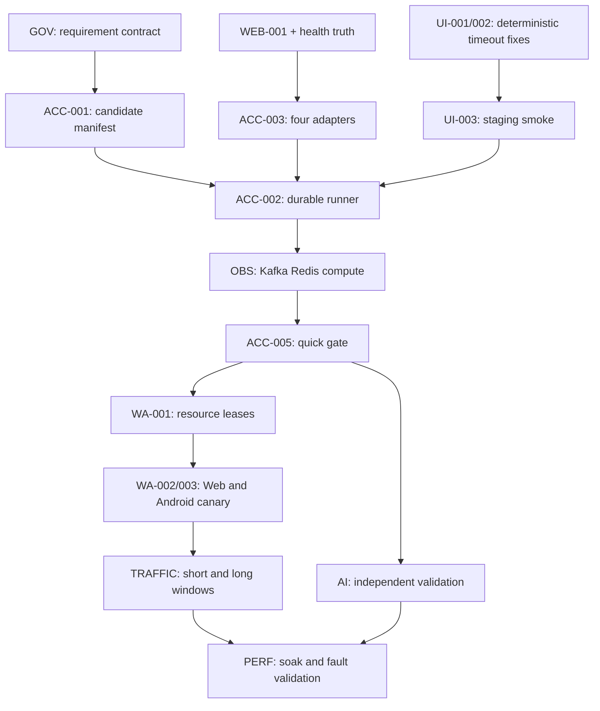

# AI 交付系统实施清单

本文把总体规划拆成可排期、可并行、可验收的工作包。它不是要求一次性重构四个项目；每一阶段都先交付一个能减少人工操作的闭环，再扩展覆盖面。

## 排序原则

1. 先消除确定性超时和虚假健康，再增加测试数量。
2. 先让 runner 无人值守地结束并留证，再接入真实 WhatsApp。
3. 先固定候选版本和验收合同，再允许多个 AI 并行。
4. 先建立采集健康，再讨论性能与流量阈值。
5. 一次只推进一个跨项目业务纵切；平台工作包可以并行，但不能修改同一文件或共享测试状态。

工作包状态统一使用：`NOT_STARTED`、`READY`、`IN_PROGRESS`、`BLOCKED`、`VERIFIED`。只有满足“退出证据”才可标为 `VERIFIED`。

## 依赖图



## 阶段 A：止血与统一事实源

目标：停止把已知的测试漂移、逐题问答和测错版本继续转化为人的等待。

### GOV-001：四项目路由

- **位置**：根工作区 `AGENTS.md`。
- **改动**：明确后端、前端、Web 协议、Android 协议四条路由；模糊的 WhatsApp 问题先查路径、`protocol_id`、`cred_format` 和错误来源。
- **依赖**：无。
- **退出证据**：四个项目均能由关键词唯一定位；Android 不再被归入 Web 协议。
- **当前状态**：`VERIFIED`，本规划已完成规则更新。

### GOV-002：需求分析技能升级

- **位置**：`armada/.agents/skills/request-analysis/SKILL.md`、`armada/.harness/agents/owner.md`。
- **改动**：落实四轮静默分析、准入原因码、`D0～D3` 决策权限、最多 7 个阻断问题、推荐默认值和决策重开。
- **依赖**：GOV-001。
- **退出证据**：用一个历史高歧义需求重放，AI 能先产出事实对账和一次性决策包，不逐题询问可查事实。
- **权限**：只改规则文件，不改变业务代码。

### GOV-003：变更记录模板

- **位置**：`armada/.harness/changes/_TEMPLATE.md`。
- **改动**：增加 `change_id`、`scope_hash`、业务 owner、非目标、Given/When/Then、必要 profiles、四项目版本、状态和决策日志。
- **依赖**：GOV-002。
- **退出证据**：新建样例变更能通过模板校验；缺 owner、验收合同或 `scope_hash` 时不能进入 `READY`。

### UI-001：移除过期验证码等待

- **位置**：前端两个 Playwright E2E 的登录 fixture。
- **改动**：以当前登录契约为准，删除等待 `/api/public/auth/captcha` 和填写图片验证码的逻辑；共享一个登录 helper。
- **依赖**：无。
- **退出证据**：登录失败在 45 秒内给出明确原因；不再等待已停用接口直到 90 秒总超时；现有登录契约测试仍通过。
- **风险**：若测试环境与当前代码的验证码配置不同，先由版本核对返回 `VERSION_MISMATCH`，不在 fixture 中兼容未知环境。

### UI-002：路由初始化快速失败

- **位置**：`wheel-saas-pure-web/src/router/utils.ts` 与登录后的导航处理。
- **改动**：`initRouter()` 完整转发 reject/catch；菜单 API 失败时清除 loading、显示可诊断错误并允许重试。
- **依赖**：无。
- **退出证据**：菜单接口 401、403、500、timeout 四类用例均在预算内结束；页面无永久 spinner；`pageerror` 与网络证据可定位失败。

### WEB-001：修复 Web 协议 E2E 入口

- **位置**：`armada-protocol/protocol-layer/package.json`、Jest 配置与相关测试。
- **改动**：修正当前失效的 Jest CLI 参数；将“测试命令可运行”与“真实 WhatsApp E2E”分开命名。
- **依赖**：无。
- **退出证据**：命令不因参数错误退出；无真实资源时明确 `BLOCKED/WA_RESOURCE_UNAVAILABLE` 或运行模拟链路，不假报 E2E 通过。

### A 阶段门禁

- 一个历史需求完成重放，人工问题不超过 7 个，推荐项和非目标齐全。
- 前端已知两类必然挂起被自动测试覆盖。
- Web E2E 命令的名字、能力和退出码一致。
- 不部署、不接触远程、不操作真实账号即可完成本阶段。

## 阶段 B：耐久验收骨架

目标：即使 Codex 对话结束、网络抖动或某个步骤超时，验收也会自行收尾并留下证据。

### ACC-001：候选版本与 change manifest

- **位置建议**：`armada/armada-deploy/staging-accept/contracts/`。
- **输入**：`change_id`、`scope_hash`、profile、环境别名、四个期望 commit/image/artifact digest、场景列表。
- **行为**：从运行环境读取四个实际版本并逐项核对。
- **退出证据**：四个版本都写入 `summary.json`；任一不一致立即 `BLOCKED/VERSION_MISMATCH`；报告能指出哪个组件错版。
- **安全**：manifest 只允许非敏感别名，不含 URL 凭据、Token、号码或消息正文。

### ACC-002：可恢复 runner

- **位置建议**：`armada/armada-deploy/staging-accept/`。
- **能力**：`run/status/resume/report/cancel`；全局 deadline、步骤 timeout、有界重试、心跳、检查点、收尾 hook、进程互斥锁。
- **执行模型**：只读阶段可并行；部署、共享数据写入、真实账号动作和 cleanup 串行。
- **退出证据**：人工 kill runner 后可恢复；单步 hang 会超时；失败、中断、取消都生成完整或明确不完整的报告。
- **不包含**：自动部署和真实 WhatsApp 动作。

### ACC-003：四项目 adapter 接口

统一接口：

```text
capabilities(env) -> supported stages and evidence
preflight(run) -> PASS | FAIL | BLOCKED
execute(stage, checkpoint) -> stage result
collect(window) -> timestamped valid samples
cleanup(lease) -> cleanup result
```

四个 adapter：

- `backend`：包装 `deploy-test.sh --check`、`deep-check.sh`、只读业务探针。
- `frontend`：调用 staging Playwright project，收集 trace、截图、console 与 API 摘要。
- `web-protocol`：健康、worker、模拟链路、真实 canary 和 Web 流量采集。
- `android-protocol`：coordinator/fleet、节点依赖、模拟链路、真实 canary 和 Android 流量采集。

退出证据：缺失能力返回 `BLOCKED/OBSERVABILITY_GAP`，不能用空数组或 HTTP 200 伪装 PASS。

### ACC-004：证据目录与报告合同

- **合同**：本目录的 `acceptance-report.schema.json`。
- **产物**：`summary.json`、`summary.md`、`events.ndjson`、`heartbeat.json`、stage attempt、原始采样、截图/trace 索引和 SHA-256。
- **退出证据**：报告通过 JSON Schema 校验；引用文件全部存在且哈希一致；中断 run 也能指出缺了什么。
- **脱敏门禁**：在写索引前扫描 Authorization、Cookie、PEM、二维码、号码/JID 和消息正文模式；命中则隔离原件，只保留脱敏摘要。

### ACC-005：`preflight` 与 `quick`

- `preflight`：版本、能力、现有 deep check、环境与测试资源可观察性。
- `quick`：`preflight + ui-smoke`，默认只读，不等待 Kafka 排空、不执行真实 WhatsApp。
- **退出证据**：连续 20 次运行都有终态与报告；环境正常时 p95 目标先定为 7 分钟内，收集基线后再收紧。
- **重要口径**：2～5 分钟仅是已部署且 readiness 通过后的 UI smoke 目标，不是四项目总验收承诺。

### B 阶段门禁

- Runner 可无人值守、可恢复、必留证。
- 四项目版本不会混测。
- `quick` 不隐含真实账号、流量、压测或长跑结论。
- 验收报告只记录资源别名并通过 schema 与脱敏检查。

## 阶段 C：运行态信号真实性

目标：把 Kafka、Redis、CPU、内存和真实健康从临时人工查日志，变成自动放行证据。

### OBS-001：Kafka 全链路采集

- **范围**：本次变更涉及的 allowlist topic/group，覆盖后端、Web 和 Android 消费链路。
- **指标**：start/peak/end lag、生产/消费速率、排空秒数、group state、rebalance delta、最旧消息年龄（可得时）。
- **门禁**：脏基线 `BLOCKED/DIRTY_BASELINE`；增量不排空 `FAIL/KAFKA_NOT_DRAINED`；无观测权限 `BLOCKED/KAFKA_UNOBSERVABLE`。
- **退出证据**：用一组可控积压验证 start→peak→drain；报告能区分基线旧积压与本次新增积压。

### OBS-002：Redis 与 Stream 采集

- **范围**：Web Redis 和 Android Redis 独立契约。
- **安全读操作**：INFO、短 PING、LATENCY LATEST、SLOWLOG LEN、allowlist XLEN/XINFO GROUPS/XPENDING summary。
- **指标**：p50/p95/max、pending start/peak/end、oldest idle、blocked clients、eviction delta、fragmentation 和采集有效率。
- **门禁**：不使用 `SCAN *`、`FLUSH*`、`DEL`、offset/group 修改。
- **退出证据**：构造测试 Stream pending 后可识别并在恢复后确认排空。

### OBS-003：实例与进程资源

- **范围**：后端、nginx、Web PM2 各实例、Android coordinator、每个 Android node 和宿主。
- **指标**：CPU、RSS/working set、heap/GC（可得时）、limit、restart delta、OOMKilled、event-loop、连接数、在线账号数。
- **短门禁**：restart delta 为 0、无 OOM、健康未下降、采样有效率满足 profile。
- **退出证据**：主动重启隔离实例时能识别 restart delta；采集器中断时返回观测缺口而非 0。

### HEALTH-001：后端健康契约

- **短期**：明确复用容器、宿主与业务探针，不假设 Actuator 已存在。
- **中期**：评估加入 Actuator/Micrometer、JVM、Hikari、DB、Kafka、Redis 指标的最小安全暴露面。
- **退出证据**：liveness 只判进程；readiness 明确依赖；业务 probe 验证最小只读闭环，三个概念不混用。

### HEALTH-002：Web 协议信号修复

- **改动**：readiness 覆盖实际依赖；liveness 增加 event-loop/worker 心跳；逐条校验 Prometheus 规则与 Grafana 查询对应真实指标。
- **制品门禁**：验证 Baileys 流量 patch 已进入实际部署 artifact。
- **退出证据**：依赖断开、worker 卡死、patch 缺失三类情形分别失败，且 reason code 不同。

### HEALTH-003：Android 节点健康

- **改动**：节点 health 不再只证明 Swagger/HTTP；至少覆盖 Redis、Kafka、事件环、coordinator 心跳与账号可操作信号。
- **采集器独立性**：业务健康和 traffic collector 健康分开报告。
- **退出证据**：traffic 初始化失败时业务可为 PASS，但 traffic profile 必须 `BLOCKED/TRAFFIC_UNOBSERVABLE`。

### C 阶段门禁

- 每个样本都有 timestamp、source、valid、error。
- 所有关键 queue/stream 都有 start/peak/end 与排空证据。
- “采不到”与“值为 0”不会混淆。
- CPU/内存没有可靠历史基线时只报告趋势，不拍脑门设硬阈值。

## 阶段 D：真实 WhatsApp 与流量

目标：用极少、受控的真实动作证明 Web/Android 协议兼容性，并把流量采集健康与费用相关信号纳入报告。

### WA-001：测试资源目录与租约

- **资源**：测试租户、操作用户、Web/Android 账号、接收账号、私有群、sentinel 群、代理。
- **状态**：`AVAILABLE → LEASED → COOLDOWN → AVAILABLE`，异常进入 `DIRTY/QUARANTINED/REPAIR`。
- **能力**：TTL、heartbeat、唯一租约、动作配额、冷却期、允许动作、cleanup 状态。
- **退出证据**：并发申请同一资源只有一个成功；runner 崩溃后租约可过期或被安全接管；报告不出现真实标识。

### WA-002：Web 协议 canary

- **动作**：专用资源上读取群元数据，经 Armada 正常入口提交一个最小操作，追踪 request→DB/outbox→Kafka/Redis→Web worker→WA ack/event→最终状态与接收端。
- **次数**：通常 1～3 次，不随 AI 额度放大。
- **中止**：离线、锁定、限流、代理异常、采集不完整、无法确认动作是否提交。
- **退出证据**：correlation ID 能串起所有阶段；外部 WhatsApp 故障返回 BLOCKED，不污染代码缺陷统计。

### WA-003：Android 协议 canary

- **动作**：与 Web 同样的最小业务闭环，但资源、adapter、节点 owner 和流量证据完全独立。
- **额外门禁**：coordinator 与 node owner 一致；主 Noise 连接能映射测试账号资源别名。
- **退出证据**：节点漂移、账号归因缺失和 traffic collector 关闭均有明确结果。

### TRAFFIC-001：Web 流量短窗口

- **层次**：代理 wire 为费用近似真值；加密协议帧用于协议归因；明文节点用于业务分类。
- **输出**：上下行字节、安静基线、动作增量、重连账单、业务分类、未归因差额、重复查询节省机会、采集丢弃。
- **退出证据**：至少两个完整 bucket；三层时间窗可对齐；patch 缺失或 persistence disabled 时不判 PASS。

### TRAFFIC-002：Android 流量短窗口

- **现状约束**：代理连接 Read/Write 与业务分类可复用；TCP payload 不是完整 NIC 计费；直连流量当前不在代理统计内。
- **必要修复**：主 WA Noise 连接传入稳定账号资源别名；直连、代理和不可归因差额分开显示。
- **退出证据**：每个 canary 账号有上下行、分类、窗口完整性和采集健康；缺账号归因时为 BLOCKED。

### TRAFFIC-003：基线与费用口径

- **窗口**：安静、操作、恢复三个窗口；Web 与 Android 分开统计。
- **维度**：每账号小时/天、每成功业务动作、重连占比、媒体/群快照/消息等业务分类、未归因占比。
- **阈值建立**：先收集至少 7 天稳定测试基线，再审批相对回归阈值；历史 Android 群快照占比只能作调查线索，不能直接当当前门禁。
- **费用声明**：报告明确“代理 wire/TCP payload/明文节点”测量层，不把 TCP payload 等同云厂商 NIC 账单。

### D 阶段门禁

- 所有真实动作都有安全信封、配额、中止与 cleanup。
- Web/Android 资源和流量证据不混合。
- 采集健康、时间窗完整性和未归因差额进入门禁。
- 真实账号测试数量由风险控制决定，不由账号额度决定。

## 阶段 E：多 AI 独立验证与长跑

目标：让额外账号额度承担重复验证、对抗测试和长时观察，而不是让技术负责人同时陪多个会话。

### AI-001：文件化交接协议

- **输入**：验收合同、`scope_hash`、固定四项目版本、环境别名、profile、安全信封。
- **输出**：每个 agent 写自己的 run/finding，不覆盖原始证据。
- **退出证据**：一个全新上下文只读上述文件即可复现验证；候选版本变化后旧结果自动失效。

### AI-002：独立黑盒与对抗复核

- **三账号模式**：A 主控/需求，B 实现，C 独立验证。
- **两账号模式**：A 主控/实现，B 使用不同新任务分别做黑盒、对抗与晨报。
- **约束**：验证者先读合同和候选，不先读实现者解释；验证者不改实现分支。
- **退出证据**：同一候选至少有一个独立结论；YELLOW 冲突由第三个干净上下文复核。

### AI-003：失败聚类与自动重试

- **指纹**：阶段、项目、test ID、失败步骤、endpoint/status、异常类型/标准化栈顶、候选版本。
- **策略**：瞬态最多 clean retry 两次；同 seed 两次失败视为可复现；账号锁定/限流不重试轰炸。
- **退出证据**：100 次注入失败能自动聚类，人工看到不超过 3 个代表性新簇。

### PERF-001：只读基线

- **profile**：`perf-readonly`。
- **窗口**：至少 30 分钟；不造业务写入。
- **输出**：API、Kafka、Redis、CPU/内存、Web/Android 在线与流量采集的稳定性和采样完整度。
- **退出证据**：能建立阈值候选，并明确当前证据不足项。

### PERF-002：隔离模拟压测

- **profile**：`perf-simulated`，只在 perf2 或同等级隔离环境。
- **复用**：后端 `perf2_loadtest` 的 dry-run、`--execute`、`--expected-count`、状态恢复和报告。
- **负载**：阶梯、突发、持续、恢复；协议侧优先模拟器，不批量触发真实 WhatsApp。
- **退出证据**：吞吐、p95/p99、错误、Lag、pending、资源峰值和恢复时间都有基线对比。

### PERF-003：故障注入

- **允许**：隔离环境的 API 5xx/延迟、单实例重启、Kafka pause/rebalance/重复/乱序、Redis 延迟/短断、协议模拟锁定/限流/断连。
- **禁止**：生产注入、真库破坏、Kafka offset/topic 删除、Redis 删除/flush、真实 WhatsApp 重连风暴或批量动作。
- **退出证据**：每种故障有预期的检测、停止、恢复和证据路径。

### SOAK-001：1h/6h/12h/24h 子 run

- **执行**：由 runner/CI 后台存活，AI 会话按 checkpoint 接班；不要求一个对话持续在线。
- **窗口**：基线→候选负载→恢复。
- **自动停止**：版本漂移、采集断层、账号异常、重连风暴、阈值越界、重复失败不再产出新信息。
- **退出证据**：每个窗口有完整度、趋势、异常簇和恢复时间；到点自动出晨报。

### E 阶段门禁

- 实现者不再自证完成。
- 额外额度主要消耗在独立验证、随机 seeds、故障注入、失败归并和长跑。
- 真实 WhatsApp 动作不随 AI 轮数线性增加。
- 每天人读摘要控制在 10～15 分钟，只含 0～3 个需要人决定的问题。

## 推荐的前六个实施 PR

按依赖和减负收益，建议先做六个小而闭环的 PR，而不是启动大平台重构：

| 顺序 | PR | 仓库 | 预计解掉的人工痛点 | 合并门禁 |
|---:|---|---|---|---|
| 1 | GOV-002 + GOV-003 | `armada` | 需求逐题问、范围漂移 | 历史需求重放与模板校验 |
| 2 | UI-001 + UI-002 | `wheel-saas-pure-web` | 浏览器必然超时、永久 loading | 登录/菜单错误注入 + E2E |
| 3 | WEB-001 + HEALTH-002 的最小修复 | `armada-protocol` | 失效测试入口和虚假信号 | 命令、依赖断开、worker 卡死测试 |
| 4 | ACC-001 + ACC-002 + ACC-004 骨架 | `armada` | Codex 超时后无结论、无证据 | kill/resume/timeout/schema/脱敏 |
| 5 | ACC-003 + ACC-005 | 四项目只读 adapter | 手工逐项目检查 | 连续 20 次 quick 有明确终态 |
| 6 | OBS-001 + OBS-002 + OBS-003 | 验收控制面 | Kafka/Redis/CPU/内存靠人查 | 脏基线、积压、重启、采集断层演练 |

前三个 PR 可并行，因为分别修改不同仓库。第四个 PR 在前三个接口稳定后开始。真实 WhatsApp、流量和长跑不应抢在这六个 PR 前面。

## 每个工作包的统一完成检查

实施 agent 在交接前必须回答并留证：

1. 改动引用的 `change_id`、`scope_hash` 和四项目候选版本是什么？
2. 正常、错误、超时、中断和恢复路径分别有什么测试？
3. 是否可能产生真实业务状态；若会，安全信封和 cleanup 在哪里？
4. Kafka、Redis、实例资源和 Web/Android 流量哪些适用，哪些不适用，依据是什么？
5. 失败会返回 `FAIL`、`BLOCKED` 还是 `INCONCLUSIVE`，reason code 是什么？
6. 证据在哪里，是否通过脱敏、索引和哈希校验？
7. 独立验证者能否仅凭合同和证据复现结论？
8. 回滚或关闭新能力后，测试资源与运行态如何恢复？

缺任一必要答案，工作包只能是 `LOCAL_VERIFIED`，不能标记 `ACCEPTED`。
