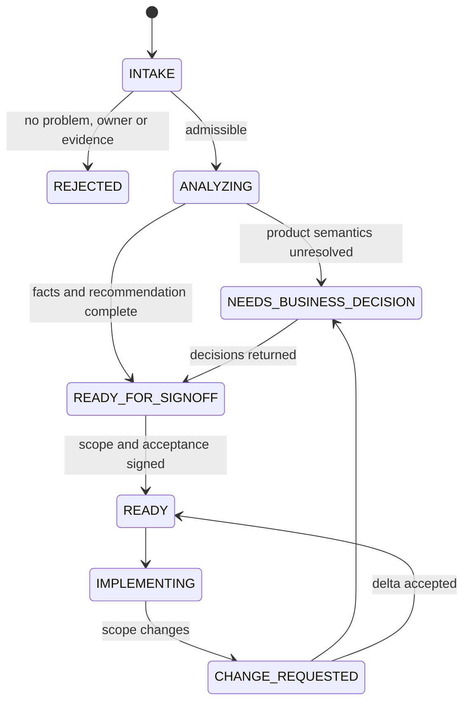

# 用 AI 收敛需求与决策

本规范解决两个问题：业务人员以竞品功能代替问题定义，以及 AI 在实施前将大量细节问题转交给技术负责人。

## 从业务想法到可开发需求

需求必须经过以下状态，不允许从业务聊天记录直接进入编码：



### 准入字段

业务输入可以是自由文本、语音转写、截图或竞品链接，但 AI 必须将它整理成以下字段：

| 字段 | 说明 | 缺失时处理 |
|---|---|---|
| `problem` | 当前哪类用户在什么场景遇到什么问题 | 不进入开发 |
| `evidence` | 客诉、业务数据、人工耗时、失败样例或已知机会 | 标记证据置信度低 |
| `affected_users` | 角色、租户、账号类型与大致覆盖面 | 业务确认 |
| `current_workaround` | 现在怎样解决，哪里最贵 | AI 补查后确认 |
| `desired_outcome` | 希望用户最终能完成什么 | 业务确认 |
| `success_signal` | 发布后如何知道有效 | 不允许用“功能上线”代替 |
| `urgency` | 不做的损失和真实截止日期 | 默认普通优先级 |
| `competitor_reference` | 竞品仅作解法参考，不是需求事实 | 不影响准入 |
| `owner` | 谁对业务取舍和验收负责 | 不进入开发 |
| `capacity_tradeoff` | 这项需求进入时，愿意延后或移出哪项 | 进入候选池，不进入当前 WIP |

“某竞品有，我们也要有”只能填入 `competitor_reference`，不能自动推导出 `problem`、`desired_outcome` 或 `priority`。

### 准入结论与原因码

AI 必须给出明确准入结论，不能只写“需求还不清楚”。

| 结论 | 原因码 | 安全处理 |
|---|---|---|
| `ADMIT` | `INTAKE_COMPLETE` | 进入静默分析，不代表已经排期 |
| `HOLD` | `PROBLEM_UNDEFINED` | 请业务补充用户、场景和当前损失 |
| `HOLD` | `OWNER_MISSING` | 未指定承担业务取舍与验收的人，不进入开发 |
| `HOLD` | `EVIDENCE_WEAK` | AI 先整理已有客诉/数据；证据仍弱时只进入探索池 |
| `HOLD` | `SUCCESS_SIGNAL_MISSING` | 补一个发布后可观察的结果，不接受“功能上线” |
| `HOLD` | `CAPACITY_TRADEOFF_MISSING` | 当前 WIP 已满时，必须说明替换或延后哪项 |
| `REJECT` | `COMPETITOR_COPY_ONLY` | 只有竞品截图，没有本方问题和目标 |
| `MERGE` | `DUPLICATE_OR_OVERLAP` | 合并到已有 `change_id`，保留新增证据和差异 |
| `REJECT` | `OUTSIDE_PRODUCT_BOUNDARY` | 说明边界与可行替代，不进入四项目实施 |
| `HOLD` | `RISK_AUTHORIZATION_REQUIRED` | 等待真实环境、数据或 WhatsApp 风险授权 |

`HOLD` 不是把一串问题转给技术负责人。AI 先给出当前可确认内容、唯一缺口、推荐补充方式和不回答时的安全默认行为。

## AI 先查事实，再提决策

AI 在向人提问前必须完成：

1. 确认涉及后端、前端、Web 协议和 Android 协议中的哪些项目。
2. 按仓库规则查业务文档、当前代码、测试、数据模型和同主题变更记录。
3. 区分已有能力、真缺口、文档过期、现有实现偏差和跨仓契约缺口。
4. 列出 API、数据、租户、状态机、Kafka、Redis、WhatsApp 行为、流量、部署和回滚影响。
5. 为可逆实现决策生成推荐默认值，不将其转交给人。

不允许询问可从当前工作区、已授权诊断端点或现有证据中得到的事实。

### 四轮静默分析

“静默”指 AI 先独立完成分析，不在每发现一个不确定点时就打断人。四轮结束前，除缺少必要文件或需要新权限外，不提产品问题。

1. **语义轮**：把业务原话拆成角色、场景、痛点、目标、约束、成功信号、竞品参考和潜在非目标；识别一句话中互相冲突的诉求。
2. **事实轮**：检查四仓代码、API、表、事件、Kafka、Redis、现有测试和同主题变更记录；给每项事实标记 `CONFIRMED/LIKELY/UNKNOWN/CONTRADICTED` 和证据路径。
3. **反例轮**：主动推演权限、租户隔离、重复、乱序、并发、超时、恢复、版本兼容、Web/Android 差异、真实 WhatsApp 限制、流量和回滚。
4. **收敛轮**：生成最小业务纵切、推荐方案、最多两个备选、明确非目标、验收示例和剩余的 `D2/D3` 决策。

四轮产物先进入 `uncertainty-register`：

| 不确定项 | 分类 | AI 下一步 |
|---|---|---|
| 工作区可查事实 | `D0` | 继续查，不问人 |
| 可逆技术选择 | `D1` | 采用推荐默认值并记录 |
| 业务含义或取舍 | `D2` | 压缩进一次性业务决策包 |
| 环境/数据/发布风险 | `D3` | 说明具体动作与风险，等待授权 |
| 不影响第一纵切 | `DEFERRED` | 写入非目标或后续候选，不阻塞当前需求 |

这样 AI 的问题数量由“真正需要人承担的决策”决定，而不是由系统细节数量决定。

## 决策权限矩阵

| 级别 | 典型事项 | 决策者 | 无回答时的处理 |
|---|---|---|---|
| `D0_DISCOVER` | 文件位置、当前 API、现有行为、环境版本 | AI 查证 | 继续查证，不问人 |
| `D1_REVERSIBLE` | 类名、函数拆分、测试写法、组件复用、可回退默认值 | AI 自决 | 按推荐值实施并记录 |
| `D2_PRODUCT` | 业务语义、权限口径、状态转移、成功指标、范围和优先级 | 业务 owner | 未确认部分不进入实施 |
| `D3_RISK` | 真库、SSH、远程、部署、批量数据、真实 WhatsApp 破坏性动作、生产回滚 | 技术负责人 | 禁止执行 |

`D2_PRODUCT` 不应由技术负责人代替业务猜测。AI 负责将它们改写成业务人员可回答的选项，并给出推荐和后果。

## 一次性决策包

AI 不再逐题提问。完成第一轮事实和影响分析后，只生成一份决策包。

每个决策必须包含：

| 字段 | 用途 |
|---|---|
| `decision_id` | 稳定编号，用于后续追踪 |
| `owner` | 应回答的业务角色或技术负责人 |
| `question` | 用业务语言描述的唯一问题 |
| `why_blocking` | 不决定会导致的具体风险 |
| `recommended` | AI 推荐选项 |
| `alternatives` | 最多两个有实质差异的备选 |
| `impact` | 对用户、数据、跨项目、验收和运维的影响 |
| `default_behavior` | 未回答时是排除该范围还是禁止实施 |
| `acceptance_example` | 选定后可直接转成验收的 Given/When/Then 示例 |

批量规则：

- 一份决策包最多 7 个真正阻断问题。
- 超过 7 个时，AI 先拆分业务纵切，不把大量问题整包丢给人。
- 同一决策不能重复询问；已确认结论进入决策日志。
- 新证据与旧决策冲突时，AI 提交“决策重开”，说明新证据和不重开的后果。

### 决策包示例

业务原话：“竞品有群标签，我们也要搬过来。”

AI 不询问字段名、表名或页面组件，而是产出：

```yaml
decision_id: GROUP_LABEL_SCOPE
owner: 群业务负责人
question: 标签是用来帮助运营查找群，还是会改变任务选群和营销执行规则？
why_blocking: 后者会改变任务数据模型、可用资源计算和回滚风险
recommended: 第一期只用于管理和筛选，不参与自动调度
alternatives:
  - 同时支持手动标签和任务条件选群
  - 延后整个需求，先补充使用频率与目标用户证据
default_behavior: 未确认时不进入自动调度范围
acceptance_example: 运营可为群添加标签并在群列表筛选，现有任务选群结果不受标签影响
```

这份材料可直接转发给业务，技术负责人不需要再将技术矛盾手工翻译成业务语言。

## AI 同时准备业务沟通材料

每份决策包同时生成四种视图，避免技术负责人再做二次翻译：

1. **业务一页纸**：当前问题、受影响用户、推荐的第一纵切、明确不做什么、成功信号。
2. **技术附录**：四项目影响、数据与事件契约、风险、迁移、回滚和验收 profiles。
3. **可直接转发的确认消息**：最多 7 个决定，每项只需选择 A/B/C；首项标明推荐与后果。
4. **会议包**：只在异步无法决定时生成，包含 30 分钟议程、争议点、常见反对意见、可接受折中和会后决策记录。

业务会议不再现场探索所有细节。会前材料已经把事实与方案收敛，会议只作 `D2` 取舍；会后 AI 把结论写回决策日志和验收合同。

## 验收合同与范围锁定

需求进入 `READY` 前必须有一份验收合同，包含：

- 一句话业务目标。
- 目标角色和真实使用场景。
- 本次必须完成的业务纵切。
- 明确排除的竞品能力和延后项。
- Given/When/Then 正向、反向、权限和恢复示例。
- 数据、Kafka、Redis、Web/Android 协议、流量、性能和回滚约束。
- 必须运行的 `staging-accept` profiles。
- 业务 owner 和技术 owner 确认结论。

锁定时生成 `scope_hash`。实现计划、测试和验收报告都引用该值，避免验收时使用了另一版需求。

### Definition of Ready

只有同时满足以下条件，状态才可从 `READY_FOR_SIGNOFF` 进入 `READY`：

- 问题、目标用户、当前替代方案、成功信号和业务 owner 完整。
- 第一业务纵切能够独立交付，明确列出非目标和后续项。
- 所有阻断 `D2` 已由业务 owner 确认；所有必要 `D3` 动作已标注授权时点，未授权动作不会被偷偷执行。
- 正向、反向、权限、幂等/重复、超时/恢复和回滚验收示例齐全。
- 后端、前端、Web 协议、Android 协议分别标明 `CHANGED/VERIFIED_NOT_CHANGED/NOT_APPLICABLE` 及依据。
- Kafka、Redis、实例资源、Web/Android 流量分别标明适用性与必要 profiles。
- 数据兼容、迁移、灰度、回滚和观测要求可执行。
- `scope_hash` 已生成，业务 owner 和技术 owner 的确认时间已记录。
- 当前 WIP 有容量；若无容量，需求停在候选池，不用“已经开始”制造假进度。

任何一项缺失时，AI 应准确指出缺口和安全默认值，不允许一边编码一边用大量追问补 PRD。

## 锁定后的变更控制

锁定后新增需求不允许口头插入当前开发。AI 自动生成变更差异包：

- 新增、删除和改变了哪些验收示例。
- 四个项目中哪些已完成工作会失效。
- 新增的数据迁移、兼容、部署、回滚、流量和真实 WhatsApp 风险。
- 需要延后或移出当前 WIP 的事项。
- 新 `scope_hash` 与作废的旧值。

业务只需回答“接受差异”、“保持旧范围”或“取消需求”，不需要重新参与整轮技术讨论。

## 不再使用单一“完成百分比”

一项需求同时报告四个维度，防止“代码 90%”掩盖验收库存：

| 维度 | 示例状态 | 负责人看到的含义 |
|---|---|---|
| 产品 | `INTAKE/NEEDS_DECISION/READY/CHANGED` | 业务语义和范围是否稳定 |
| 实施 | `NOT_STARTED/IMPLEMENTING/LOCAL_VERIFIED` | 四项目代码与本地测试进展 |
| 验证 | `NOT_RUN/RUNNING/BLOCKED/FAIL/PASS` | 测试环境和证据结论 |
| 发布 | `NOT_DEPLOYED/CANARY/OBSERVING/RELEASED/ROLLED_BACK` | 当前运行态与观察窗口 |

日报默认按业务纵切列出上述四列。只有验证为 `PASS` 且发布状态满足合同，才汇总为 `ACCEPTED`；其余都显示真实阻塞原因。

## 需求阶段的 AI 交付物

每个需求在编码前由 AI 产出：

1. `intake-summary.md`：业务原话、问题、证据和准入结论。
2. `fact-reconciliation.md`：文档、代码、数据和四项目契约对账。
3. `decision-pack.md`：一次性阻断决策。
4. `acceptance-contract.md`：已确认范围、非目标、示例、profiles 和 `scope_hash`。
5. `implementation-impact.md`：四项目影响、任务依赖、风险和回滚。
6. `business-one-pager.md`：可直接发给业务的目标、推荐纵切、非目标与成功信号。
7. `business-confirmation.md`：可复制的选项式确认消息与确认记录。

这些文件应放在现有 `armada/.harness/changes/<change-id>/` 的同主题记录中，其他仓库只保留该 `change-id` 和仓库内实施证据。

## 需要落入项目规则的改动

后续实施时，应修订：

- `armada/.agents/skills/request-analysis/SKILL.md`：增加决策权限、批量问题和推荐默认值。
- `armada/.harness/agents/owner.md`：将“需求有歧义必须问人”收窄为 `D2/D3`。
- `armada/.harness/changes/_TEMPLATE.md`：增加准入、决策日志、`scope_hash`、验收合同、profiles 和统一状态。
- 前端、Web 协议和 Android 协议的项目规则：要求任务引用同一 `change-id` 和 `scope_hash`。
