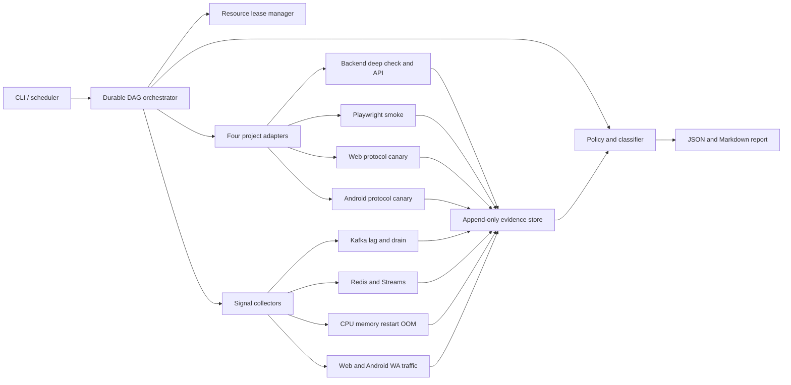
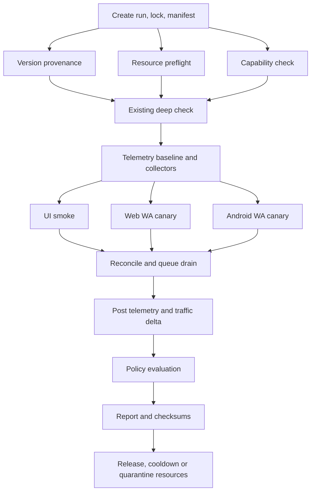

# 四项目测试环境验收控制面

`staging-accept` 的目标是让验收与 Codex 对话生命周期解耦：一个可恢复 runner 执行阶段 DAG、管理资源租约、持续写检查点，多个 AI 任务可随时读取状态、做独立分析和收尾。

## 验收 profiles 必须拆开

2～5 分钟的 UI smoke 只验证页面和关键只读 API，绝不代表真实 WhatsApp、流量、性能或长跑验收。

| Profile | 目标时间 | 产生业务状态 | 验证范围 |
|---|---:|---:|---|
| `preflight` | 1～2 分钟 | 否 | 四项目版本、已有部署深检、健康信号、资源池可用性 |
| `ui-smoke` | 初期 2～5 分钟 | 仅管理后台登录 session | 登录、菜单、首页、3～5 个核心页面和只读 API |
| `quick` | 3～7 分钟 | 否 | `preflight + ui-smoke`，适合每次部署后立即运行 |
| `integration` | 按场景设置 | 仅隔离测试数据 | API、DB、Kafka、Redis、事件投影与恢复 |
| `release-canary` | 10～20 分钟级 | 是，严格限量 | Web 和 Android 协议各 1 个真实 WhatsApp canary |
| `traffic-short` | 5～10 分钟级 | 依赖 canary | 采集健康、安静基线、操作前后流量差和归因 |
| `soak-60m/6h/24h` | 独立后台 run | 默认低频或无主动动作 | 重连、积压、内存漂移、账号小时流量和长期恢复 |
| `perf-readonly` | 5～30 分钟 | 否 | 基线、采集有效性和资源趋势 |
| `perf-simulated` | 30 分钟以上 | 只限隔离 perf2 | 模拟器阶梯负载、积压与容量 |
| `perf-real-canary` | 10～20 分钟级 | 极少量真实 WhatsApp | 只证明当前协议兼容性，不用于推导容量 |

`quick`、`release-canary`、`soak` 和 `perf` 是不同 run。不允许在 `quick` 返回 PASS 后，把必要的长跑隐藏在报告之外。对于规定 soak 是放行门禁的变更，父候选状态在 soak 结束前只能是 `RUNNING` 或 `STAGING_VERIFIED_PENDING_SOAK`。

## 可复用能力与必须修复的信号

### 直接复用

- 后端 `deploy-test.sh --check` 和 `deep-check.sh` 已覆盖多环境、组件状态、Kafka 元数据、Web/Android 协议和跨组件连通性。
- 前端已安装 Playwright，能保留 trace、截图和 HTML report。
- Web 协议已有 `/healthz`、`/readyz`、`/livez`、`/metrics`、PM2 和宿主资源长跑采样。
- Web 协议已有代理真值、协议帧和明文节点三层流量对账，以及重连账单和重复查询可节省榜。
- Android coordinator 已有检查 Redis/Kafka 的 `/healthz`，已有 fleet 节点注册、`perf-monitor`、代理连接字节、业务域分类和流量看板。
- 后端 `perf2_loadtest` 已有 dry-run、显式 execute、expected-count、安全预检、恢复状态、Kafka Lag、CPU/内存采样和报告。

### 放行前必须修正

- 前端两个 E2E 仍等待已停用的验证码接口。
- 前端 `initRouter()` 在菜单接口失败时可永久 pending。
- 后端没有 Actuator/Micrometer 和标准 JVM/Hikari/DB 可观测性，初期必须明确使用容器、宿主和业务探针，不能假设指标存在。
- 已有 Kafka deep check 只查 topic/partition/group 状态，不查 start/peak/end lag 和排空时间。
- Web `/readyz` 对依赖的校验不完整，`/livez` 不能证明 worker 心跳或 event-loop 健康；部分 Prometheus/Grafana 查询与实际指标已漂移。
- Web `test:e2e` 入口失效，当前不是真实协议链路 E2E。
- Web 流量语义依赖 Baileys patch，必须证明 patch 已进入部署制品。
- Android 节点 healthcheck 主要证明 HTTP/Swagger 进程活着，不证明 Redis、Kafka、WA 事件环和账号可操作。
- Android traffic 初始化失败时会降级关闭而不影响业务，因此“业务健康”不能代替“流量采集健康”。
- Android `perf-monitor` 当前 Kafka 采样范围有限，Redis pending/延迟/内存未形成统一指标。

关键事实路径：

- 后端深检：`armada/armada-deploy/lib/deep-check.sh`
- 前端登录 E2E：`wheel-saas-pure-web/e2e/group-marketing.spec.ts`
- 前端路由：`wheel-saas-pure-web/src/router/utils.ts`
- Web 流量：`armada-protocol/protocol-layer/docs/TRAFFIC-OBSERVABILITY.md`
- Android 连接计量：`whatsapp-server-feature-android-zhuan/internal/traffic/conn.go`
- Android 历史流量基线：`whatsapp-server-feature-android-zhuan/docs/operations/2026-08-21-group-snapshot-traffic-baseline.md`

## 组件架构



模块责任：

1. `profile loader`：分开环境非敏感契约、验收策略和 change manifest。
2. `resource lease manager`：租赁测试租户、账号、群、代理和接收端，同一资源仅允许一个状态变更 run。
3. `DAG scheduler`：并行运行只读检查，串行运行候选冻结、共享数据写入和真实 WhatsApp 动作。
4. `collectors`：每个样本都带 timestamp、source、valid 和 error，不用空值伪装正常。
5. `policy engine`：将事实映射成 `PASS/FAIL/BLOCKED`，区分产品错误、环境阻塞、工具失败和证据缺失。
6. `evidence store`：为每个阶段和 attempt 保存输入、输出、日志、证据索引和文件哈希。
7. `AI supervision`：允许 UI、数据面、基础设施和流量由不同会话并行分析，但只有一个 conductor 可产生外部状态。

## 计划中的 CLI

以下是待实现契约，当前不可直接运行：

```bash
./staging-accept run \
  --env test1 \
  --profile quick \
  --change-manifest changes/CHANGE_ID.yaml \
  --components backend,frontend,web-protocol,android-protocol

./staging-accept run \
  --env test1 \
  --profile release-canary \
  --change-manifest changes/CHANGE_ID.yaml \
  --execute-canary \
  --expected-resource-count 2

./staging-accept status --run-id RUN_ID
./staging-accept resume --run-id RUN_ID
./staging-accept report --run-id RUN_ID

./staging-accept run \
  --env perf2 \
  --profile perf-simulated \
  --execute \
  --expected-count 100
```

安全规则：

- `quick` 默认只读。
- 真实 WhatsApp 必须显式 `--execute-canary` 并引用已授权安全信封。
- 压测继续使用 `--execute + --expected-count` 双保险。
- 部署和验收分离，验收器不隐式部署。
- 真库、远程、SSH、部署、批量数据和真实 WhatsApp 状态动作仍必须确认目标环境。
- secret 只由运行时 resolver 注入，不通过 CLI 参数、YAML、日志或报告传递。

## 配置分层

### 环境契约

```yaml
environment: test1
extendsDeployProfile: ../envs/test1.conf
components:
  backend:
    publicUrlRef: ARMADA_PUBLIC_URL
    expectedInstances: 1
  frontend:
    baseUrlRef: ARMADA_PUBLIC_URL
  webProtocol:
    runtime: pm2
    expectedWorkers: 5
  androidProtocol:
    runtime: fleet
    expectedNodes: 3
kafka:
  contractsRef: contracts/test1-kafka.yaml
redis:
  webRef: redis/web-test1
  androidRef: redis/android-test1
traffic:
  webRef: traffic/web-test1
  androidRef: traffic/android-test1
```

环境契约只放非敏感别名、期望数量和契约引用。

### Profile 契约

```yaml
name: release-canary
requiredStages:
  - version-provenance
  - deep-check
  - telemetry-baseline
  - ui-smoke
  - web-wa-canary
  - android-wa-canary
  - kafka-drain
  - redis-drain
  - traffic-short
  - telemetry-post
thresholds:
  queueDrainSeconds: 300
  restartDelta: 0
  oomKilled: false
  traffic:
    minimumCompleteBuckets: 2
    dropped: 0
    persistenceDisabled: false
```

### Change manifest

```yaml
changeId: REQ-042
scopeHash: sha256:0000000000000000000000000000000000000000000000000000000000000000
expectedBuilds:
  backend: 0123456789abcdef
  frontend: 123456789abcdef0
  webProtocol: 23456789abcdef01
  androidProtocol: 3456789abcdef012
changedCapabilities:
  - login
  - group-send
requiredScenarios:
  - ui-login
  - one-message-web
  - one-message-android
```

manifest 必须同时记录期望与实际部署的四份 commit/image/artifact digest。任一不一致时返回 `BLOCKED/VERSION_MISMATCH`，不得验收混合版本。

## 阶段 DAG



只读 baseline collectors 并行启动。Web 和 Android canary 只有在租赁了完全独立资源时才可并行。否则必须由唯一 conductor 串行。

`soak` 和 `perf` 建立关联 child run，不将同步验收 DAG 锁死数小时。

可独立渲染的 DAG 图源与预览：

- [staging-accept-dag.mmd](diagrams/staging-accept-dag.mmd)
- [staging-accept-dag.svg](diagrams/staging-accept-dag.svg)

## 如何实现 2～5 分钟 UI smoke

时间从“已部署、已通过 readiness 与版本核对”开始计算，不包含 Maven 构建、镜像构建、部署、真实 WhatsApp 上线、Kafka/Redis 排空或压测。

新建独立 Playwright project `staging-smoke`：

1. 一条用例真正通过 UI 登录，验证登录接口、令牌存储、菜单和 `app-ready`。
2. 登录 setup 保存 `storageState`，后续页面用例复用登录态，不每个 spec 重复登录。
3. 仅打开首页、账号/任务列表与本次变更涉及的 1 个核心页面。
4. 使用 `data-testid`、`app-ready`、`page-ready`、明确 API response 和 DOM 状态，不用固定 sleep 或可能永不达成的 `networkidle`。
5. 每页只验证页面可用、权限正确、关键只读 API 无 401/403/5xx，不在 smoke 中直连 DB、等待 Kafka 或执行真实 WhatsApp 写操作。
6. 保存 screenshot、trace、console error、pageerror 和关键 API 摘要；HAR 默认不保存 body 和 Authorization。

初始 timeout：

| 步骤 | 上限 | 重试 |
|---|---:|---:|
| UI 登录 | 45 秒 | 全新 context 1 次 |
| 单页导航 | 20 秒 | 1 次 |
| 整套 smoke | 300 秒 | 最多 1 次 clean retry |

必须先修复：

- 过期验证码等待。
- `initRouter()` 的 reject/catch 和用户可见错误。
- 稳定选择器、共享登录 fixture 与测试数据。
- 进程已失败时 readiness 循环仍等满整个 timeout 的脚本。

目标先定为“在当前测试环境稳定地5分钟内完成”。收集多轮实际时间后，再决定是否将 p95 目标收紧到2分钟，不在无基线时做虚假承诺。

## Kafka、Redis 与实例资源门禁

### Kafka

每个 profile 维护显式 allowlist，为每个 topic/group 采集：

- topic 和 partition 契约。
- consumer group state 和 rebalance 次数。
- start lag、peak lag、end lag。
- produce/consume rate。
- 本次操作的增量与排空时间。
- 最旧未消费消息时间，在契约可支持时采集。

判定：

- 基线已严重积压：`BLOCKED/DIRTY_BASELINE`。
- canary 或集成测试的增量未在预算内排空：`FAIL/KAFKA_NOT_DRAINED`。
- 无权限、无法连接或契约未配置：`BLOCKED/KAFKA_UNOBSERVABLE`。
- 不允许用“group 存在”代替 Lag 与排空证据。

可复用 Android `perf-monitor` 与后端 `perf2_loadtest` 的 offset 采样逻辑，但需要扩展到测试环境所有必要 topic/group。

### Redis

Web 与 Android Redis 分开采集和判定，只执行安全读操作：

- `INFO server/clients/memory/stats/commandstats`。
- PING 短时采样 p50/p95/max。
- `LATENCY LATEST` 与 `SLOWLOG LEN`。
- allowlist Stream 的 `XLEN`。
- `XINFO GROUPS`。
- `XPENDING` summary、pending 数和 oldest idle。
- 连接池使用、blocked clients、evicted keys 和 fragmentation，在环境可观测时采集。

禁止默认 `SCAN *`，禁止 `LATENCY RESET`、`FLUSH*`、`DEL`、修改 consumer group 或转移 pending。

基线已有大量 pending 时返回 `BLOCKED/DIRTY_BASELINE`。本次增量不排空或 oldest idle 持续增长时返回 `FAIL/REDIS_STREAM_NOT_DRAINED`。

### CPU、内存、重启和 OOM

短验收至少采集：

- 每台宿主机的 CPU、内存、load 和磁盘。
- 每容器 CPU%、working set、limit、OOMKilled 和 restart delta。
- Web PM2 每实例 RSS、heap、event-loop、重启与在线账号数。
- Android coordinator 和每个 node 分开采集。
- 后端与 nginx 容器分开采集。

短 canary 的硬门禁优先是：

- restart delta = 0。
- OOMKilled = false。
- 健康状态未下降。
- 采样有效率达到 profile 要求。

CPU 和内存单点尖峰在无基线时先报告而不直接 FAIL。性能 profile 使用多轮 clean baseline 后批准的 p95/p99、峰值、趋势和恢复阈值。

## 真实 WhatsApp 测试资源池

验收不再临时从数据库和日志中寻找“也许可用”的账号与群。

至少准备：

- Web 协议专用账号、接收账号、私有群和代理。
- Android 协议专用账号、接收账号、私有群和代理。
- 专用测试租户与操作用户。
- 固定只读 sentinel 群，用于健康读取。
- 可恢复或 disposable 群，仅供已授权的状态变更用例。

资源状态：

```text
AVAILABLE → LEASED → COOLDOWN → AVAILABLE
                 ├─→ DIRTY
                 ├─→ QUARANTINED
                 └─→ REPAIR
```

租约包含：

- `runId`、所有者、TTL 和 heartbeat。
- 小时/每日动作配额与冷却期。
- 当前在线状态和最近一次健康 canary。
- 协议 backend、当前节点 owner 与版本。
- 群管理员/成员状态。
- 代理健康与最近锁定/限流信号。
- 允许动作、禁止动作和 cleanup 状态。

下列情况直接 quarantine：

- session 失效、需要重新配对、账号锁定或限流。
- 协议节点 owner 异常或 DB/运行态不一致。
- 群状态不可恢复。
- 接收端、代理或采集证据不可信。
- canary 中断后无法确认写操作是否已提交。

配对、代理更换和资源修复是独立运维任务，不应在 release 验收里临时完成。资源不足时快速返回 `BLOCKED/WA_RESOURCE_UNAVAILABLE`。

## Web 和 Android 真实 canary

Web 和 Android 各使用自己的专用资源，一套最小场景：

1. 确认账号 ONLINE、节点 owner、代理和采集器健康。
2. 读取专用群元数据，对账角色和可操作性。
3. 通过 Armada 正常业务入口提交一个带 correlation ID 的最小操作。
4. 追踪 Armada request、DB/outbox、Kafka、Redis Stream、目标协议实例、WhatsApp ack/event 和最终 DB 状态。
5. 接收端确认结果到达。
6. 等待 Kafka/Redis 队列回落到基线。
7. 读取操作前后资源和流量窗口。

普通 release canary 建议使用可清理的专用消息或本次变更的最小功能场景。只有变更确实涉及群设置、加人、建群或退群时，才追加对应动作，且操作前快照、操作后恢复。

状态变更默认不自动重试。只有存在幂等 key，且权威状态证明第一次未被接收时才允许重发。超时后先根据 correlation ID 对账，不盲目补一次。

## WhatsApp 流量门禁

Web 和 Android 必须分开判定，不先相加再看总量。

### Web 口径

Web 已区分：

- `proxy_wire`：底层 socket 代理真值。
- `noise_frame`：带业务分类的加密帧。
- `node_plain`：解密节点字节。
- 传输开销、协议开销、业务域、重连账单和可节省查询。

验收必须证明：

- 预/后 snapshot 属于同一 worker 和同一 `runId`。
- 所有期望 worker 均存在，live freshness 不超过两个采样周期。
- `dropped=0`、`writeFailures=0`、`serializeFailures=0`。
- attribution share 和 reconciliation gap 在 profile 阈值内。
- 实际镜像中的 Baileys traffic patch 自检通过，不存在“只有总量、语义静默丢失”。

Web 每个进程有独立 run ID，落盘失败不一定使业务失败。跨 restart 直接做 counter subtraction 是无效证据，必须返回 `BLOCKED/TRAFFIC_WINDOW_DISCONTINUITY`。

### Android 口径

Android 通过包装实际代理 `net.Conn` 成功 Read/Write 返回值统计上下行，并已有营销、媒体、心跳、握手、重连、群操作和入站事件分类。

该口径是应用到代理连接的 TCP payload，包含代理协商，不包含 IP/TCP 包头；直连流量不一定进入代理总量，不能直接等同云厂商 NIC 账单。

验收必须检查：

- `/api/live` 时间鲜度、stable run ID 和 collector started。
- persistence 未降级关闭。
- dropped、classification errors 和 reconciliation gap。
- 容器 restart delta。
- 预/后窗口内 run ID 不变。
- 主 WhatsApp 连接当前账号归因的覆盖缺口在报告中明确标记，不伪造账号级结论。

### 短窗

```text
采集器健康
→ 安静基线
→ 极少量 canary
→ 等待至少 2 个完整 summary bucket
→ 后快照和增量归因
```

短窗输出：

- bytes/op、up/down。
- account/category/scope，仅在归因可信时输出账号维度。
- Web 的 proxy/noise/plain 三层。
- 重连与账号维护背景量。
- attribution share、reconciliation gap、dropped 和 collector health。
- 相对 clean baseline 的 delta。

因需要完整 summary bucket，`traffic-short` 通常需要 5～10 分钟，不能塞进 UI smoke。

### 长窗

- `60m`：部署后内存、队列、重连初筛。
- `6h`：工作时段稳定性。
- `24h`：日流量、保活、重连账单和长周期资源漂移。

长窗使用稳定 cohort 和低频操作，不通过大量真实 WhatsApp 动作压测。先运行 3～5 次 clean run 建立当前版本基线，再设 warning/block 阈值。Android 历史 82%～85.6% 群快照占比只是旧流程证据，不是当前硬阈值。

## 压测分层

1. `perf-readonly`：只采集基线，不发业务操作。
2. `perf-simulated`：只在隔离 perf2，使用保留加密/序列化/队列路径的 simulator，运行阶梯并发、延迟、积压和恢复。
3. `perf-real-canary`：真实账号只做几个已批准操作，证明 WhatsApp 兼容和全链路，绝不用于推导容量。

真实群创建、批量拉人、营销和媒体发送不能作为无人值守压测。现有真实 HTTP/WhatsApp 负载脚本只能在明确 action budget 和目标环境授权后使用。

## Timeout、重试与断点续跑

| 阶段 | 初始硬超时 | 自动重试 |
|---|---:|---:|
| version/preflight | 60 秒 | 只读探针 2 次 |
| deep-check | 120 秒 | 整阶段不盲重试，单探针可重试 |
| UI login | 45 秒 | 新 context 1 次 |
| UI page | 20 秒/页 | 1 次 |
| UI smoke | 300 秒 | 最多 1 次 clean retry |
| readiness convergence | 180 秒 | 轮询，不重复部署 |
| Web/Android canary | 15 分钟 | 写请求默认 0 次 |
| Kafka/Redis drain | 300 秒 | 轮询，不改 offset/队列 |
| traffic-short | 10 分钟 | 采样可重连，业务不重发 |
| perf | profile 配置 | 仅无状态探针可自动重试 |
| soak | 1h/6h/24h | 分段 checkpoint，不自动改版本 |

运行目录：

```text
run.json
state.json
leases.json
stages/{stage-id}/attempt-1/
  input.json
  result.json
  stdout.log
  stderr.log
  evidence.json
  .complete
```

`run.json` 在启动后不可修改；`state.json` 原子更新；完成标记只在结果和证据已落盘后写入。

resume 前必须验证：

- 目标环境和四项目实际 build ID 没有变化。
- 资源租约仍归当前 run。
- 流量 collector run ID 和 baseline 窗口是否连续。
- canary correlation 是否已存在或操作已提交。
- 中断发生在写请求之后时，必须先 reconcile，不得重发。

## 结果分类

### `PASS`

所有 required 断言真正被执行，证据完整且满足契约。

### `FAIL`

系统可测，但行为违反验收契约，例如：

- UI/API/业务结果错误。
- WhatsApp canary 未到达或最终状态错误。
- Kafka/Redis 增量未排空。
- OOM 或未预期重启。
- 性能越过已批准硬阈值。
- 相对有效 baseline 的流量回归。

### `BLOCKED`

无法形成可信判断，例如：

- 版本不一致。
- 账号离线、代理不可用、群状态不满足。
- Kafka/Redis 没有权限或契约未配置。
- baseline 已脏。
- traffic stale、run ID 变化或 collector disabled。
- Playwright 工具故障、环境网络不可达或凭据缺失。
- 证据损坏或采集不完整。

聚合规则：

```text
任一 required stage FAIL        → run FAIL
否则任一 required stage BLOCKED → run BLOCKED
否则                              → run PASS
```

required stage 不允许静默 `SKIPPED`。无法执行时顶层必须是 BLOCKED。

统一 reason code 以 [acceptance-report.schema.json](acceptance-report.schema.json) 为准，常用映射如下：

```text
VERSION_MISMATCH
DIRTY_BASELINE
WA_RESOURCE_UNAVAILABLE
WA_EXTERNAL_OR_ACCOUNT
BLOCKED_PROXY
BLOCKED_WHATSAPP
KAFKA_NOT_DRAINED
REDIS_STREAM_NOT_DRAINED
OBSERVABILITY_GAP
TRAFFIC_UNOBSERVABLE
TRAFFIC_REGRESSION
UI_FLOW
HARNESS_FAILURE
DEADLINE_EXCEEDED
EVIDENCE_INCOMPLETE
```

## 证据包

```text
_codex_artifacts/acceptance/{change-id}/{run-id}/
├── run.json
├── state.json
├── summary.json
├── report.md
├── manifests/
├── stages/
├── ui/
│   ├── screenshots/
│   ├── trace/
│   ├── console.json
│   └── api-summary.json
├── canary/
│   ├── web/
│   └── android/
├── telemetry/
│   ├── kafka/
│   ├── redis/
│   ├── hosts/
│   ├── web-protocol/
│   ├── android-protocol/
│   ├── traffic-web/
│   └── traffic-android/
├── logs/
├── artifacts/checksums.sha256
└── redaction-report.json
```

机器契约见 [acceptance-report.schema.json](acceptance-report.schema.json)。

Schema 负责字段、类型、四项目版本、真实 canary 安全信封和 PASS 证据完整性等静态约束。Runner 还必须执行下列跨字段语义校验：

- `stageId`、`assertionId`、`findingId` 和 `evidenceId` 在各自范围唯一。
- 所有 `evidenceRefs` 均能解析，文件存在且 SHA-256 一致。
- stage counts 与实际 `stages` 聚合一致，时间戳单调，duration 与窗口相符。
- 顶层结果严格按 required stage 聚合，不能手工覆盖为 PASS。
- `PASS` 时所有 required assertion 已执行，四个 build 匹配，证据完整且脱敏检查完成。
- canary 中的租约、correlation ID、traffic window 和 cleanup 属于同一 run。
- 报告只含资源别名；别名 resolver 由受控运行时持有，不能反向把真实号码、JID 或凭据写入证据。

报告不保存 PEM、token、cookie、密码、原始 JID/手机号、消息正文、完整 Authorization 或无脱敏数据库行。Playwright trace 和截图可能含业务数据，必须私有存储、限制保留周期并生成 redaction report。

## AI 并行观测，单 conductor 执行动作

多个 AI 会话建议分工：

- `conductor`：唯一控制 DAG、租约和状态变更。
- `UI observer`：只跑 Playwright，分析截图和 trace。
- `data-plane observer`：只读 Kafka、Redis 和 DB 对账。
- `infra observer`：只读 CPU、内存、容器、PM2 和节点。
- `traffic observer`：处理 Web/Android 短窗和长窗流量。
- `independent verifier`：只读复核 summary、证据哈希和放行阈值。
- `diagnosis agent`：只在 FAIL/BLOCKED 后启动，不在健康 run 里浪费上下文。

长跑由 runner 持续写 JSON/NDJSON，AI 定期读取和判断。单个账号、任务或对话超时不导致测试中断。

## 实施顺序

1. **P0：结果可信**
   - `run/state/summary`、PASS/FAIL/BLOCKED、证据目录和 resume。
   - 包装已有 `deploy-test.sh --check` 和 `deep-check.sh`。
   - 四项目候选版本核对。

2. **P0：确定性 UI smoke**
   - 修验证码漂移和路由 pending。
   - 登录 setup + `storageState`。
   - 先覆盖3～5个页面，p95 有数据后再收紧时间目标。

3. **P0：基础观测**
   - Kafka Lag、Redis/Stream pending、四项目 CPU/内存/restart/OOM。
   - Web metrics、Android coordinator/fleet 状态。
   - 无论中途失败都产出报告。

4. **P1：真实 WhatsApp 资源池和 canary**
   - Web/Android 隔离资源、租约、冷却和 quarantine。
   - 单 conductor、correlation 对账、状态变更不盲重试。

5. **P1：流量短窗**
   - collector health、stable run ID、完整 bucket。
   - Web/Android 分开归因、口径和判定。

6. **P2：长跑和基线**
   - 60m、6h、24h child runs。
   - 3～5 次 clean run 后批准队列、资源和流量阈值。

7. **P2：隔离压测**
   - 扩展现有 perf2，覆盖多 topic/group、多 Web/Android 实例和队列排空曲线。
   - 使用 simulator 承担容量，真实 WhatsApp 只做兼容 canary。

8. **P3：观测硬化**
   - 后端 Actuator/Micrometer。
   - Android node 真实 `/readyz`。
   - Web readiness/liveness、MySQL/event-loop 和告警看板漂移修正。

最小可用版本不是一开始搭建大平台，而是：

```text
四项目版本核对
+ 已有 deep-check
+ 确定性 UI smoke
+ Kafka/Redis/CPU/内存前后快照
+ 无论结果都落盘的结构化报告
```

这一版首先解决“AI 自己等、自己停、自己留证”。紧接着补 Web、Android 各一个 canary 和 `traffic-short`，才开始减少真实环境的人工盯盘。
