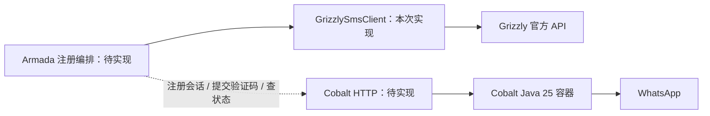

# Grizzly SMS 接入 Armada

> 阶段说明：下文保留初次客户端接入边界。当前主仓已新增多档价格查询、Cobalt HTTP 客户端和注册任务本地实现；「账号管理 / 新号注册」发布范围及验证见 [新号注册变更记录](../../.harness/changes/account-registration-menu/summary.md)。本次展示发布不启用真实采购或注册。

## 本次交付与职责

需求：在 Armada 程序内调用 Grizzly 接码，后续与独立 Docker Java 25 的 Cobalt 注册服务串联。

本次实现 Armada Java 17 内可注入的 `GrizzlySmsClient`，覆盖查询、取号、查询验证码和供应商订单状态修改。它是真实 HTTP 适配器；单元测试使用测试目录内的 HTTP 响应替身和本机回环服务器，不需要真实密钥或余额。

当前 Cobalt 工程 `cobalt-registration-service` 是交互式 CLI：从终端读取号码和验证码，每个数据卷保存一个号码，尚无 HTTP 端口。其 test1 部署由任务“查找安卓和Web注册功能”负责。因此本次接码适配不等于已完成自动注册联调。



## 已实现的内部 Java 能力

通过构造器注入 `com.armada.platform.sms.grizzly.GrizzlySmsClient`。没有新增面向浏览器的购买接口、后台定时任务或进程启动自动取号行为。

| Java 方法 | 供应商 action | 用途 |
|---|---|---|
| `getBalance()` | `getBalance` | 查询供应商账户余额，返回 `BigDecimal` |
| `getServices()` | `getServicesList` | 查询当前服务代码，避免猜测目标产品代码 |
| `getCountries()` | `getCountries` | 查询供应商国家 ID，与国际电话区号区分 |
| `getPrices(service, country)` | `getPrices` | 查询指定服务和国家的单价、库存 |
| `acquireNumber(request)` | `getNumberV2` | 按服务、国家及最高价取号，返回激活 ID 与号码 |
| `getStatus(activationId)` | `getStatus` | 单次查询验证码状态，由上层控制轮询 |
| `setStatus(activationId, update)` | `setStatus` | 显式就绪、等待下一条、完成或取消 |

`getNumber` 旧版、`getStatusV2` 短信详情结构、价格 V2/V3、供应商合作伙伴 API、充值和自动活动订单对账未实现。当前自动注册所需的基础短信路径使用上表接口。`setStatus(1)` 只改变 Grizzly 订单状态，真正申请 WhatsApp 验证码由 Cobalt 执行。

## Docker 环境配置

配置由 Armada 容器环境注入，供应商地址固定为 `https://api.grizzlysms.com`。密钥不允许通过用户请求指定，也不写入源码、业务 DTO 或示例文件。

| 环境变量 | 默认值 | 含义 |
|---|---|---|
| `GRIZZLY_SMS_ENABLED` | `false` | 启用供应商查询和适配器调用 |
| `GRIZZLY_SMS_PURCHASES_ENABLED` | `false` | 另外允许取号及订单状态修改 |
| `GRIZZLY_SMS_API_KEY` | 空 | 开启接码后必须提供的服务端密钥 |
| `GRIZZLY_SMS_CONNECT_TIMEOUT` | `5s` | TCP 连接及连接池等待时间 |
| `GRIZZLY_SMS_READ_TIMEOUT` | `20s` | 响应及 socket 读取时间 |

只开启 `ENABLED`、注入密钥，可以做查询验证；并不会开启取号。两个超时各自必须为 1ms 至 60s，属于阶段超时，不是完整任务期限。注册任务仍需自己的总时限。

密钥属于供应商账户，当前是平台级配置。后续若开放给多个租户下单，必须由服务端鉴权和持久化任务绑定租户、预算及订单；不能把本客户端直接包装成接受任意激活 ID 的公共 API。轮询也必须先检查当前租户的订单归属。

不要开启 HTTP wire/header/完整 URL 调试日志：供应商把密钥放在查询参数中。HTTP 错误在客户端边界转换为固定错误码和脱敏消息，不保留携带原始 URL 的异常 cause。

## 订单结果和错误语义

- 所有供应商请求均为 GET，但取号和状态修改具有副作用。专用 Apache HttpClient 关闭自动重试、HTTP 重定向、Cookie 与 HTTP 认证重发。
- `HTTP 200` 不代表成功；客户端识别 `BAD_KEY`、`NO_KEY`、`NO_BALANCE`、`NO_NUMBERS` 等供应商错误并抛业务异常。未知文本不能默认为“等待短信”。
- `GrizzlySmsException.isOutcomeUnknown()` 为 `true` 时，供应商可能已受理操作。不得自动重复取号，也不得通过并发中的活动列表差集随便归属号码。
- `STATUS_WAIT_RETRY` 附带的是先前的错误验证码，保存在 `previousCode`；可提交的 `code` 仍为空。只有 `STATUS_OK` 提供本次收到的验证码。
- `STATUS_WAIT_RESEND` 不自动触发重发或完成；官方关于该状态的文字与 `setStatus(6)` 的完成含义存在冲突，动作必须由编排明确决定。
- 号码与验证码的模型输出做 `toString()` 脱敏；业务调用方不得自行打印字段或把整个结果写入审计日志。
- 费用使用 `BigDecimal`。取号响应原样保留币种；余额/报价接口没有明确返回币种，不能擅自标成美元。国家 ID 不能直接当作电话区号。
- `activationTime`、`activationEnd`、`activationCancel` 保留供应商原始时间文本。当前文档没有时区，取消时间描述不精确，不做臆测转换。
- `canGetAnotherSms` 保存原始标记，不自动转换成后续动作；当前英文文档与旧版对 `0/1` 的说明矛盾。

## 与 Cobalt 联调仍需完成的合同

以下是下一阶段的要求，尚不是现有 Cobalt HTTP API：

1. **创建注册会话**：Armada 提供持久化的请求幂等键及号码，Cobalt 返回稳定的会话引用；同一请求超时后可查询，不能重复申请短信或重建密钥。
2. **查询注册状态**：至少区分申请短信、等待验证码、需要额外验证、注册成功、失败与结果未知；保留明确错误原因和服务端要求的等待时间。
3. **提交验证码**：绑定原会话提交，由 Cobalt 完成 `/register`；不在日志中记录验证码，不把人工 PIN/验证码挑战当普通重试。
4. **独立登录验证**：注册成功后，使用已持久化的同一会话，在后续进程启动时验证连接上线；不能把注册响应成功等同可用账号。
5. **保存完整会话**：Cobalt 保存密钥与设备状态，Armada 只保存引用。当前没有到 Go Android 协议层或 Baileys 的凭据转换合同。

Armada 注册编排需要真实 MySQL/Flyway 订单表、租户绑定、费用上限、持久化状态机、串行状态迁移及重复任务防护。数据库状态应在外部请求前后分别记录，避免把慢 HTTP 调用包在长事务中。购买请求存在崩溃窗口且供应商未提供幂等键；超时只能保留“待核对”，不能宣称严格一次购买。

本次不新建上述尚无调用方的数据库模型，也不修改既有账号类型或上线凭据。正式打通注册时，与 Cobalt HTTP 合同一起落实和验证。

## 验证与回滚

本地验证命令：

```bash
cd armada-api
mvn -Dtest='Grizzly*Test' test
```

测试覆盖文本/JSON 协议、错误和脱敏、购买参数、旧验证码、默认关闭、Spring 装配，以及真实回环 HTTP 连接断开/503/重定向不重发。无 MyBatis/Flyway/租户数据库代码变更，无需数据库测试。

运行结果和后续验证记录见 [变更记录](../../.harness/changes/grizzly-sms-integration/summary.md)。关闭两个开关可停止后续客户端调用，但不会取消已存在的供应商订单，也不能停止已经发出的请求；回滚前须处理在途订单。

## 依据

- [Grizzly Activation API](https://grizzlysms.com/docs/activation)
- [Grizzly Utility API](https://grizzlysms.com/docs/utility)
- [Grizzly Client Swagger](https://api.grizzlysms.com/docs/client)
- [固定版本 Cobalt 注册实现](https://github.com/Auties00/Cobalt/blob/cb9fbf172507626948fbc3611d0a6fb00bb3a0f1/modules/lib/src/main/java/com/github/auties00/cobalt/registration/MobileClientRegistration.java)

文档核对日期：2026-09-15。实时可用性需要真实号码、真实短信及重新登录验收，本次未进行该操作。
