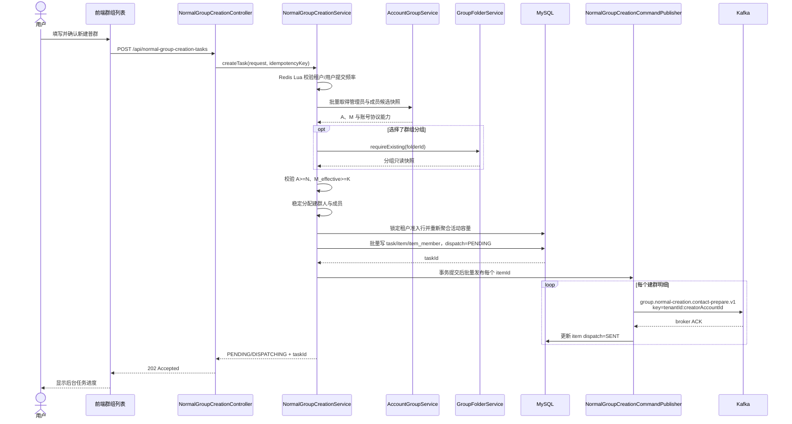
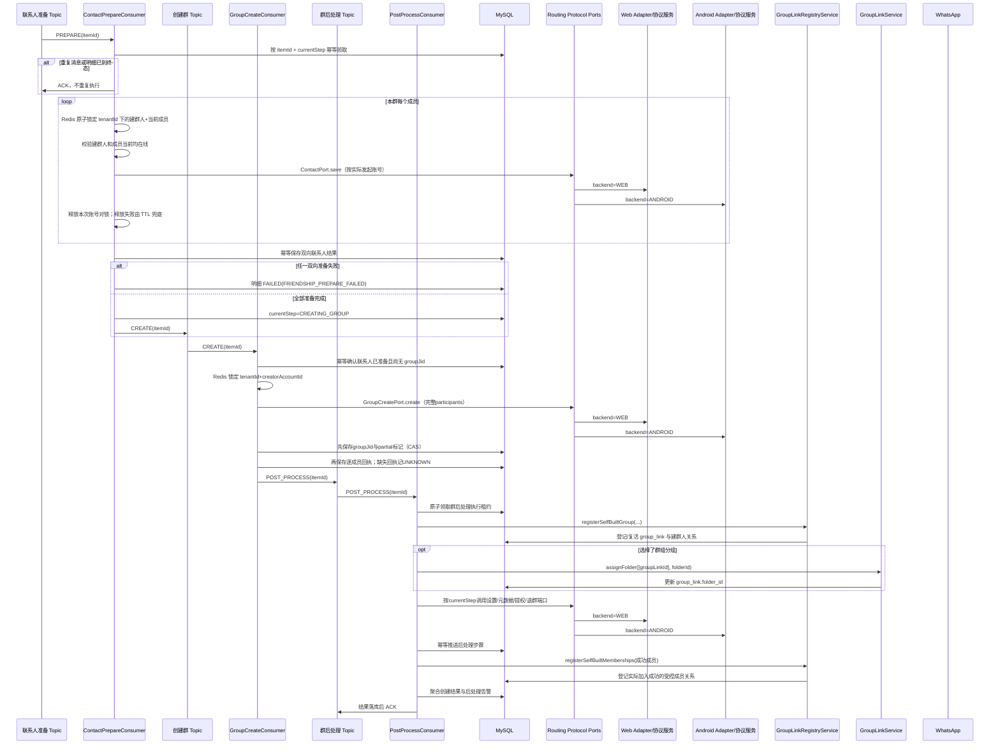
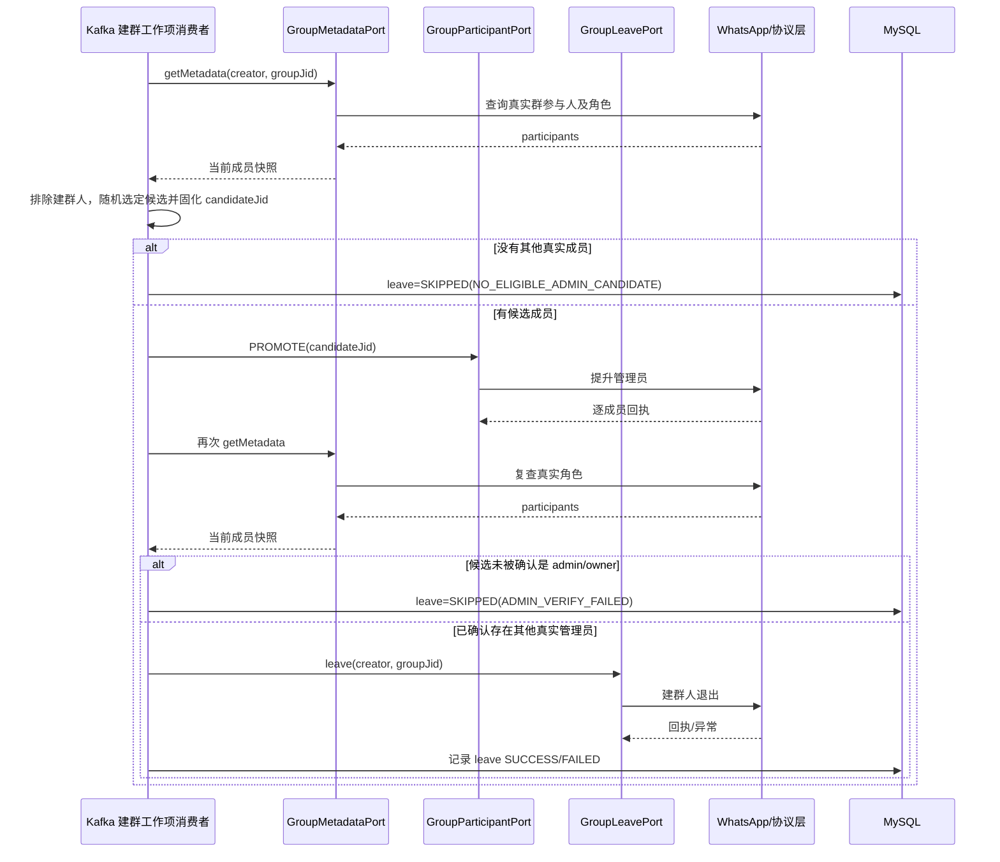

# 群组列表「新建普群」完整开发设计（实施版）

> **2026-08-06 架构修正（当前实现优先）**：本功能已改为三个专用 Topic：
> `protocol.web.normal-group.commands.v1`、`protocol.android.normal-group.commands.v1`、
> `protocol.normal-group.events.v1`。Armada 仅生产协议命令并消费统一结果，不再
> 消费联系人准备、建群、后处理三个内部阶段 Topic，也不再通过内部阶段消费者直调协议
> Port。本文后续凡描述“三个 Armada 阶段 Topic / 统一 Routing Port 直调 / 不使用协议
> Outbox 或结果 Topic”的内容均为被替代的早期方案。当前 Topic、action、状态推进、默认值
> 和并发约束以 `.harness/changes/normal-group-creation/summary.md` 为准。新建普群不得复用
> Web master、Android group-action 或 `protocol.group.events.v1`；同一协议账号跨旧/新 Topic
> 必须串行，不同账号允许并行。

> 文档状态：已完成关键口径收敛，可进入 createQ 分支开发与联调
> 需求来源：《群组列表与新建普群_产品需求文档_PRD_V1.3》、本次业务补充、ZERO「群组列表 / 新建普群」只读交互参考
> 设计范围：Armada 后端、前端和现有 Web/Android 统一协议端口的任务编排、测试与部署校验
> 事实优先级：本次业务明确补充 > PRD V1.3 > Armada 当前代码事实 > ZERO 竞品交互参考

## 1. 结论摘要

本功能应实现为 Armada 群组域内一个独立的「异步普群创建任务」，不能复用营销建群任务的数据表和业务语义。一次提交产生一个任务，任务按用户指定数量拆成多个建群明细；每个明细只调用一次 WhatsApp 建群能力，并在这次调用中携带完整初始成员，禁止先创建空壳群再逐个拉人。

整体方案遵循以下原则：

1. 建群人来自“管理员账号分组”，同一任务内一个建群人只能创建一个群，不复用。
2. 群成员来自“成员账号分组”，同一成员可以进入本任务中的多个不同群。
3. 建群前对建群人与本群每个初始成员执行两次定向联系人保存：建群人保存成员、成员保存建群人。加好友是**尽力而为的可选前置动作**：两个方向都拿到最终回执（SUCCESS/FAILED/UNKNOWN 任一）后即进入建群调用，加好友失败不阻断建群，也不改变建群的成员名单；每个方向的结果与失败原因只记录在成员行上。禁止为此查询双方完整通讯录。
4. 建群调用一次性传入全部初始成员；协议返回部分成功时，不再使用 ADD 动作补人。
5. 建群成功后复用现有 `GroupLinkRegistryService.registerSelfBuiltGroup` 登记群，并通过现有群分组能力设置 `group_link.folder_id`，使其可在 Armada 群组列表中查询。
6. 建群人自动退群时，必须先选出群内其他真实成员、提升为管理员，并通过 WhatsApp 实时群元数据确认其已成为真实管理员；确认后才允许建群人退出。
7. 建群工作项由“联系人准备、创建群、群后处理”三个 Kafka 主 Topic 组成流水线，不再新增每秒扫描 `PENDING` 明细的执行 Worker。阶段消费者调用现有统一协议 Port，由 Routing Port 按冻结的 `ProtocolAccountRef.backend` 分发到 Web 或 Android Adapter；不再为本功能复制一套协议命令 JSON、Outbox 状态机和结果消费者。
8. 全链路必须幂等。协议超时且结果未知时先对账，禁止直接重试创建，避免重复群。
9. 账号分组是候选池，不要求候选账号全部进入本次新群；候选数量超过本次所需人数时不报错，只抽取满足目标人数的账号，剩余账号不参与本次任务。
10. 新建普通群的默认权限采用本文件第 5.2 节的明确固定值，不再以“保持 WhatsApp 服务端默认值”作为不可验证的产品口径；创建后按协议能力显式设置并读取群元数据校验。
11. 本期必须同时支持 Web 协议账号和 Android 协议账号。前端不增加协议选择项，Armada 根据账号绑定的协议类型自动路由；现有两套 Adapter 必须通过同一组端口契约测试，禁止 Web 账号进入 Android Adapter 或 Android 账号进入 Web Adapter。

## 2. 设计依据与现状核对

### 2.1 ZERO 可借鉴的交互结构

ZERO 的“新建普群”把建群配置集中在一次表单内，主要包含：建群人分组、建群人是否自动退群、成员来源、成员分组及人数、群组分组、群名称、建群数量、开始编号、权限和账号迁移设置。确认后转为后台任务执行。

本设计只借鉴其交互分区和批量任务思路，不直接复制其后端实现、字段含义或风控策略。

### 2.2 Armada 已有能力

| 能力 | 当前事实 | 本功能处理 |
|---|---|---|
| 账号分组 | 已有 Armada 账号分组及账号状态 | 通过账号域 Service 获取候选快照，不跨域直查 Mapper |
| 群组运营分组 | 已有 `group_folder`，`group_link.folder_id` 可为空 | 复用，不新建第二套群分组 |
| 自建群登记 | 已有 `registerSelfBuiltGroup`，可登记群 JID、群名、建群账号和人数 | 复用并补充分组赋值编排；对实际加入成功的受控成员补充语义正确的批量关系登记入口 |
| 一次性建群 | `GroupCreatePort.create(GroupCreateCommand)` 支持完整 `participants` 和 `operationId` | 作为唯一建群调用 |
| 联系人保存 | `ContactPort.save` 可指定账号保存另一 WhatsApp 用户 | 用于双向联系人准备；业务已确认以双方定向保存调用均成功作为通过条件，不要求额外好友关系查询 |
| 群角色变更 | `GroupParticipantPort` 支持 `PROMOTE` | 用于自动退群前提升管理员 |
| 群实时详情 | `GroupMetadataPort` 返回当前参与人和真实角色 | 用于提权后的强校验 |
| 退群 | `GroupLeavePort.leave` | 仅在真实管理员校验通过后调用 |
| 群权限 | `GroupSettingsPort` 已覆盖发言、编辑、加人、邀请链接、审批、限时消息 | 按能力矩阵调用，逐项记录结果 |
| 建群幂等 | `GroupCreateCommand.operationId` 和现有幂等适配链路 | 同一明细同一次逻辑创建始终复用同一 operationId |

### 2.3 已确认边界与当前缺口

1. **双向好友判定已闭环**：不查询管理员或成员账号的完整通讯录，也不新增全量好友关系扫描接口。对本群每一对“建群人—成员”只执行两次定向 `ContactPort.save`，调用正常完成（当前 `void` 接口表现为未抛异常）即视为该方向加好友成功。加好友是尽力而为的可选动作，不作为建群的前置条件：两个方向都落定后无论成败都继续建群。该口径表达的是 Armada 的业务记录方式，不额外承诺 WhatsApp 存在可查询的“真实好友”状态。
2. **默认群分组缺口**：现有 `group_folder` 没有默认分组标识，`folder_id = NULL` 表示“未分组”。本设计建议 V1 将“未选择群组分组”落入现有“未分组”口径，不新增默认分组表或默认标记。若业务必须显示一个有名称的“默认分组”，需单独确认并扩展数据模型。
3. **完整建群部分成功边界**：协议可能返回群 JID，但个别初始成员失败。此时群已经真实存在，不能简单当作“什么都没发生”，也不能盲目再建一个群。
4. **协议隔离已复用**：现有 Routing Port 以 `ProtocolAccountRef.backend` 为唯一选择依据，Web/Android Adapter 均已覆盖联系人保存、一次性建群、群设置、固定账号元数据、成员提权和退群。本功能复用该边界，不新增协议类型分支和第二套状态机；提交时冻结 backend，重试不得换协议。
5. **V1 交互口径已收敛**：群名必填；未选择群组分组时进入现有“未分组”；空群模式固定选择 1 个成员；邀请链接权限不在本期五项权限中，不展示、不传参、不调用。

## 3. 业务术语与统计口径

| 术语 | 定义 |
|---|---|
| 普群 | 普通 WhatsApp 群，不是 WhatsApp 社群/社区；本期对应 `isChannel = 0` 的业务语义 |
| 管理员账号分组 | Armada 控端账号分组，提供建群执行账号；这里的“管理员”是任务角色，不代表该账号在建群前已经是某个 WhatsApp 群管理员 |
| 成员账号分组 | Armada 控端账号分组，提供新群初始成员；这些账号需要具备执行反向联系人保存的协议能力 |
| 建群人 | 某一建群明细实际调用 WhatsApp 建群接口的 Armada 账号；新群创建后通常是群主/管理员 |
| 群成员数量 K | 每个群除建群人之外，需要在一次建群调用中携带的初始成员数量 |
| 建群数量 N | 本次任务计划创建的群数量 |
| 可用管理员数 A | 提交时满足账号状态、在线状态、协议能力和分组归属的管理员候选数 |
| 可用成员数 M | 提交时满足账号状态、在线状态、协议能力和分组归属的成员候选数；同一群内需排除该群建群人并去重 |
| 空群模式 | 按本次业务补充定义，并非 0 个成员，而是“1 个建群人 + 1 个成员”组成的最小群，因此 K 固定为 1 |
| 群组分组 | Armada 内部运营分类，对应 `group_folder`；不是 WhatsApp 原生概念 |
| 完整建群 | 一次 `GroupCreatePort.create` 携带该群全部初始成员，不在建群后使用 ADD 补齐成员 |

## 4. 资源校验与分配规则

### 4.1 权威计算公式

受控成员模式：

```text
A >= N
M_effective(item) >= K
K >= 1
N >= 1
```

空群模式：

```text
K = 1
A >= N
每个明细至少能找到 1 个不等于该建群人的可用成员
```

由于成员允许跨群复用，成员需求不是 `N × K` 个不同账号；只要每个群能分配到 K 个互不重复且不等于本群建群人的成员即可。管理员账号在同一任务内不复用，因此 N 不能超过 A。

> **已确认业务口径**：请求 `K > M` 时拦截；`K <= M` 时允许提交。`M > K` 表示候选资源充足，不是异常，不得因为候选账号多于群目标人数而报错。

管理员候选池与成员候选池必须分开校验，不能把 `A + M` 作为一个可互换的账号池：

- 创建 N 个群只从管理员分组选择 N 个建群人，剩余管理员候选本次不使用；
- 每个群从成员分组选择 K 个成员，候选成员超过 K 时只抽取 K 个，剩余成员本群不使用；
- 同一普通成员在同一个群内不能重复，但允许出现在本任务的多个不同群中；
- 例如创建 1 个群、每群需要 K=10 个初始成员，即使管理员和成员候选数量远大于 10，也不报错：只选择 1 个建群人和 10 个成员执行一次性建群，其余候选不参与本次任务；
- 若前端产品字段“群上限人数”定义为**包含建群人在内的群总人数**，前端和后端必须先换算成员槽位 `K = 群上限人数 - 1`。不得在同一字段中混用“群总人数”和“除建群人外的初始成员数”；本设计其他章节中的 K 均沿用第 3 节定义，即不包含建群人。

### 4.2 可用账号口径

账号候选必须同时满足：

- 当前租户数据；
- 账号和分组关系未删除；
- 账号业务状态可用，非封禁、禁言或风险禁用；
- 当前登录在线；
- 具有本步骤要求的协议能力；
- 能构造完整 `ProtocolAccountRef`；
- 成员执行反向联系人保存时，也必须在线且支持联系人保存；
- 同一建群明细内，建群人不能再次作为普通成员；成员号码/JID 必须去重。

协议类型不在业务层硬编码为 Web 或 Android，按照账号能力矩阵选择：

- 建群人：至少支持 `CONTACT_SAVE + GROUP_CREATE + GROUP_METADATA`；若自动退群，还需支持 `PROMOTE + GROUP_LEAVE`；
- 普通成员：至少支持 `CONTACT_SAVE`；
- 群权限：选择的建群人协议需支持相应设置项，否则提交阶段直接提示不支持，不进入任务。

#### 4.2.1 Web/Android 双协议统一能力契约

Web 与 Android 是本期同等必交范围，不是二选一，也不允许长期依靠其中一种协议兜底另一种协议。两个协议都必须满足以下契约：

| 能力步骤 | Web 协议要求 | Android 协议要求 | Armada 统一验收结果 |
|---|---|---|---|
| 账号在线与引用 | 能判断在线并构造协议账号引用 | 能判断在线并构造协议账号引用 | 提交时能形成可执行候选快照 |
| 定向保存联系人 | 支持 `creator -> member` 与 `member -> creator` | 支持 `creator -> member` 与 `member -> creator` | 两次调用均成功才进入建群 |
| 一次性完整建群 | 一次请求携带完整初始成员 | 一次请求携带完整初始成员 | 返回群 JID 和逐成员结果，不使用 ADD 补人 |
| 群元数据查询 | 返回当前成员、真实角色和五项权限元数据 | 返回当前成员、真实角色和五项权限元数据 | 能完成权限回查及管理员提权校验 |
| 五项默认权限设置 | 支持发言、修改群资料、添加成员、入群审批、限时消息 | 支持发言、修改群资料、添加成员、入群审批、限时消息 | 设置后元数据与第 5.2 节期望值一致 |
| 提升管理员 | 支持 PROMOTE 并返回可判断结果 | 支持 PROMOTE 并返回可判断结果 | 回查确认其他真实管理员后才退群 |
| 建群人退群 | 支持 LEAVE 并返回可判断结果 | 支持 LEAVE 并返回可判断结果 | 留痕 SUCCESS/FAILED，不掩盖已建群事实 |
| 结果未知对账 | 能查询该账号当前群列表/群元数据 | 能查询该账号当前群列表/群元数据 | 超时后先对账，禁止直接重复建群 |

统一路由规则：

1. 建群、群设置、群元数据、提权和退群均走本群建群人的协议适配器；Web 建群人走 Web，Android 建群人走 Android。
2. `建群人保存成员`走建群人的协议适配器；`成员保存建群人`走该成员自己的协议适配器。因此同一任务的账号分组可以同时包含 Web 与 Android 账号。
3. 跨协议传参使用标准化后的 WhatsApp 手机号/JID，不得把 Web 或 Android 的内部账号 ID 当成另一协议的用户标识。
4. 某账号所属协议缺少当前步骤能力时，在提交校验阶段排除并计算具体缺口；任务执行后协议服务暂时不可用时按原协议重试，不静默切换协议、换账号或重分配成员。
5. 任务、明细和成员快照必须冻结 `armada_account_id / protocol_account_id / protocol_backend / ws_phone`；失败重试始终复用冻结值，不在发布阶段重新推断协议类型。新建普群不允许把空值或未知 `protocol_backend` 默认降级为 Web，提交校验时应直接排除并返回能力缺口。
6. 三个业务阶段 Topic 只允许 Armada 后端消费；阶段消费者调用既有统一 Routing Port，并由 `ProtocolAccountRef.backend` 选择 Web HTTP Adapter 或 Android Native Adapter。Web 账号不会进入 Android Adapter，Android 账号也不会进入 Web Adapter。
7. 本功能不新增协议命令 JSON、协议 Outbox、协议结果 Topic 或第二套协议状态机。协议类型在任务快照中冻结，执行和重试始终使用同一账号的同一 Adapter；backend 为空或不支持时直接失败并记录能力缺口。
8. 任务、明细和成员快照必须保存协议类型，失败日志和任务明细显示失败发生在 Web 还是 Android，但不向业务暴露凭据或底层敏感响应。

### 4.3 分配算法

1. 一次批量查询管理员分组和成员分组的候选快照，避免逐账号查询。
2. 管理员按稳定顺序分配（优先使用分组成员排序；没有显式排序时按账号 ID 升序），取前 N 个，每个仅出现一次。
3. 成员候选在任务提交时随机打散一次，再按循环窗口分配：每个群内不重复，跨群允许重复；候选数大于 K 时只取本群所需的 K 个，不因存在剩余候选而报错。
4. 将本次随机结果以及最终账号 ID、协议账号 ID、号码/JID、协议类型和分配顺序冻结到任务明细；失败重试复用同一份分配，不重新随机，任务执行期间也不因分组内容变化而换人。
5. 执行前仍做轻量状态复核；账号离线或失效时该明细失败，不静默换人，避免任务实际执行对象与确认页面不一致。

### 4.4 并发任务中的账号保护

“管理员同一任务内不复用”通过任务明细唯一分配保证。不同任务可能分配到同一账号，但协议调用阶段必须使用 `tenantId + accountId` 维度的短时分布式锁串行，避免同一账号同时建多个群。V1 不增加永久占用表，锁只保护正在执行的协议步骤。

## 5. 产品交互设计

### 5.1 入口

群组列表页增加/复用“新建普群”按钮。用户具备新建权限时可点击，打开抽屉或弹窗；无权限时按钮隐藏或禁用。

### 5.2 表单分区

#### A. 建群人设置

- 管理员账号分组：必选，展示“可用账号数 / 分组总账号数”。
- 建群人自动退群：`留群` / `自动退群`。
- 成功建群账号迁移分组：可选。
- 失败建群账号迁移分组：可选。

#### B. 群成员设置

- 成员类型：`控上号` / `空群`；`自定义号码`本期禁用并提示“本期暂不支持”。
- 成员账号分组：必选。空群模式同样必选，因为仍需 1 个成员与建群人共同组成群。
- 每群成员数量：控上号模式必填；空群模式固定为 1 且不可编辑。
- 资源提示：动态展示 A、M、N、K 及校验结论；当 M>K 时提示“候选成员充足，本次每群抽取 K 个”，不显示错误。提交接口仍须重新权威校验。

#### C. 群信息设置

- 群名称：可选或按评审结论设为必填。
- 建群数量 N：必填。
- 开始编号：当批量群名需要编号时必填。
- 群组分组：可选；未选择时 V1 进入“未分组”。
- 建群速度：只展示“正常”，快速模式本期禁用。

#### D. 群权限设置

新建普通群的五项默认权限已确认如下：

| 产品字段 | 默认值 | WhatsApp/协议元数据期望值 | 默认业务含义 |
|---|---:|---|---|
| 普通成员是否可发言 | `true` | `announce=false` | 所有成员可发言 |
| 普通成员是否可修改群资料 | `false` | `restrict=true` | 默认关闭普通成员修改权限，仅管理员可修改群资料 |
| 普通成员是否可添加成员 | `true` | `memberAddMode=true` | 所有成员可添加成员 |
| 是否开启入群审批 | `false` | `joinApprovalMode=false` | 关闭管理员入群审批 |
| 限时消息时长 | `0` | `ephemeralDuration=0` | 关闭限时消息 |

“是否允许邀请链接入群”不属于本期五项权限，V1 不在表单展示、不接收请求字段，也不调用协议设置；后续若产品单独开放，应新增明确默认值和双协议能力验收后再扩展。

前后端不得把缺省值保存为 `null` 后继续依赖 WhatsApp 服务端未来不变。请求未传上述五项时，由后端补齐表中固定默认值；其中 Armada 控端“普通成员修改群资料”默认关闭。群创建成功后，Web 和 Android 都必须显式应用各自支持的设置调用，并重新读取群元数据校验最终结果。当前 WS 创群底层只在创建请求中携带群名和初始成员，`announceOnly=false` 仅表示不主动切换为“仅管理员发言”，其余设置不能仅凭“不传”认定已经满足产品默认值；Android 也必须以相同业务值完成设置和回查，不能形成第二套默认口径。

### 5.3 提交确认

确认页至少展示：

- 计划建群 N 个；
- 可用建群人 A 个，本次占用 N 个；
- 每群初始成员 K 个；
- 成员允许跨群复用；
- 自动退群策略；
- 目标群分组；
- 预计远程操作量约为 `N × (2K 次联系人准备 + 1 次建群 + 权限步骤 + 可选提权/退群)`；
- 正常速度为步骤间隔 3～5 秒，耗时只给区间提示，不承诺固定 SLA。

### 5.4 任务结果

提交成功后立即返回任务 ID，页面展示：任务状态、计划数、创建成功数、创建失败数、后处理告警数和逐群明细。支持只重试失败明细，不重复执行已经得到群 JID 的明细。

## 6. 核心业务流程

### 6.1 提交与资源冻结



### 6.2 单群执行



### 6.3 建群人自动退群



### 6.4 部分成功和结果未知

| 场景 | 处理规则 |
|---|---|
| 未返回群 JID，明确且不可重试的失败 | 明细创建失败，可人工重试；重试复用原计划群、建群人和成员快照 |
| 超时或连接中断，无法判断是否创建 | 标记 `RESULT_UNKNOWN`，先通过账号群列表/事件对账；未完成对账前禁止重建 |
| 已返回群 JID，但个别初始成员失败 | 登记真实群，标记 `CREATED_PARTIAL`，不调用 ADD 补人、不自动重建；保留建群人，交由业务处置 |
| 群已完整创建，权限设置失败 | 群创建计为成功，记录后处理告警；权限步骤自动重试一次 |
| 群已完整创建，提权或自动退群失败 | 群创建计为成功，建群人留群，记录后处理告警；不得为了退群失败重建群 |
| 分组赋值失败 | 群仍登记到群组列表并处于“未分组”，记录后处理告警，可本地重试赋值 |
| 账号迁移失败 | 不改变群创建结果，记录告警并自动重试一次 |

### 6.5 Kafka Topic 与消息契约

本功能采用 **3 个 Armada 业务主 Topic + 1 个共享 DLT，共 4 个物理 Topic**。三个业务主 Topic 按有明确依赖关系的阶段拆分，不按 Web/Android、租户或单个协议动作重复建设状态机：

| Topic | 用途 | 处理原则 |
|---|---|---|
| `group.normal-creation.contact-prepare.v1` | 联系人准备主 Topic | 完成建群人与本群每个成员的两次定向联系人保存；全部成功才发布下一阶段 |
| `group.normal-creation.create.v1` | 创建群主 Topic | 一次性携带完整初始成员建群；结果未知时停止自动重建并进入人工对账 |
| `group.normal-creation.post-process.v1` | 群后处理主 Topic | 设置权限、登记群、分组赋值、提权校验、建群人退群和账号迁移；从数据库当前步骤恢复 |
| `group.normal-creation.commands.v1.DLT` | 三个主 Topic 共用的死信 Topic，名称遵循仓库现有 `.DLT` 约定 | 只接收非法消息、无法反序列化、持续基础设施异常等无法安全归类的消息，不接收普通业务失败 |

三个业务主 Topic 只允许 Armada 后端消费，Web/Android 协议服务不得订阅。阶段消费者直接调用以下既有统一能力端口：

| 阶段 | 统一 Routing Port | 路由规则 |
|---|---|---|
| 联系人准备 | `ContactPort` | 每次调用按动作发起账号冻结的 backend 选择 Web 或 Android Adapter |
| 一次性建群 | `GroupCreatePort` | 按建群人 backend 路由，完整初始成员一次传入 |
| 群后处理 | `GroupSettingsPort`、`FixedAccountGroupMetadataPort`、`GroupParticipantPort`、`GroupLeavePort` | 始终按建群人 backend 路由，失败重试不得换协议或换账号 |

这里的“统一”是 Java 端口契约统一，不是 Web/Android 账号共用消费者或协议连接。既有 Adapter 内部已经按 `ProtocolAccountRef.backend` 隔离实际调用链路，因此本功能不再新增协议命令 Topic、协议命令 JSON、协议 Outbox、协议结果 Topic 或协议端消费者。只有在契约测试证明某个现有 Adapter 缺少能力时，才在对应协议仓库做最小补齐，并保持另一套协议逻辑不变。

#### 6.5.1 协议隔离与防串调用不变量

1. `建群人保存成员`按建群人 backend 路由，`成员保存建群人`按成员 backend 路由；同一明细可以同时调用 Web Adapter 和 Android Adapter，但每次调用只有一个明确发起账号。
2. 建群、权限、元数据、提权和退群统一按建群人冻结的 backend 路由，失败重试不得切换协议。
3. 任务提交时必须冻结 `armadaAccountId / protocolAccountId / backend / wsPhone`；backend 为空、未知或 Adapter 不支持时在执行协议副作用前失败。
4. 阶段日志必须同时记录 `taskId / itemId / actorAccountId / backend / operationId`，便于定位调用落到了哪套协议；不得记录 Cookie、Token 或联系人敏感载荷。

三个主 Topic 初始均建议 12 个分区，最终以测试环境压测为准；共享 DLT 至少 12 个分区，避免按原分区投递时失败。三个阶段分别使用独立消费组：

- `armada-normal-group-contact-prepare-v1`；
- `armada-normal-group-create-v1`；
- `armada-normal-group-post-process-v1`。

所有主 Topic 的 Kafka Key 固定使用 `tenantId:creatorAccountId`，保证同一租户同一建群账号在每个阶段内进入固定分区并保持顺序；各阶段消费并发不得超过对应 Topic 分区数。三个消费组可以同时处理不同群，但一个群必须由数据库 `current_step` 保证 `联系人准备 -> 创建群 -> 群后处理` 的顺序，任何跨阶段提前或重复消息都直接按当前状态幂等跳过。

消息体只携带调度和定位字段，不携带手机号、联系人列表、Cookie 或协议凭据：

```json
{
  "schemaVersion": 1,
  "eventId": "uuid",
  "tenantId": 1,
  "taskId": 1001,
  "itemId": 100101,
  "action": "PREPARE",
  "occurredAt": 1780000000000
}
```

`action` 只允许 `PREPARE / CREATE / POST_PROCESS`，并且必须与目标 Topic 匹配。人工重试通过数据库 `current_step` 重置并重新发布对应阶段 action，不引入额外 `RESUME` 消息类型。消费者必须以数据库中的 `status/current_step/group_jid` 为事实，而不是相信消息携带的业务状态：

- `PENDING + PREPARING_CONTACTS` 只允许联系人准备 Topic 执行；全部成功后落库，再发布 `CREATE`；
- `CREATING_GROUP` 只允许创建群 Topic 执行；获得 `group_jid` 并落库后，再发布 `POST_PROCESS`；
- 已有 `group_jid` 时只允许群后处理 Topic 继续权限、登记、提权、退群等未完成步骤，创建群 Topic 不得再次调用 create；
- 已到终态、阶段不匹配或相同 `eventId` 已处理时直接 ACK，保证 Kafka 至少一次投递不会造成重复群。
- 协议一旦返回有效 `group_jid`，必须先用条件更新落库，再写逐成员回执；若 JID 落库 CAS 失败，立即转 `RESULT_UNKNOWN`，不得把明细标记为明确失败或再次建群。

本期不创建 retry Topic。可明确重试的短暂网络/基础设施异常在当前消费者内执行最多 1 次退避重试，数据库按阶段累计尝试次数，默认每阶段最多 3 次；达到上限后 PREPARE 转 `FAILED`、CREATE 转 `RESULT_UNKNOWN`、POST_PROCESS 转 `CREATED_PARTIAL`，停止数据库补偿重新发布：

- 可识别的业务失败或协议失败写入数据库阶段状态后 ACK，不进入 DLT；
- 用户点击重试失败明细时，根据 `current_step/group_jid` 重新发布到对应主 Topic；
- 创建群结果未知时标记 `RESULT_UNKNOWN` 并停止自动重建，由人工结合账号群列表/群元数据对账后再决定；
- 只有反序列化失败、Schema 不支持、数据库持续不可用或无法安全归类的程序异常才进入共享 DLT。

每个阶段的数据库提交与下一阶段 Kafka 发布不具备天然原子性，采用“阶段结果先落库、事务提交后异步发布下一阶段、broker ACK 回调更新 `dispatch_stage/dispatch_status`”的最小方案。正常执行完全由三个主 Topic 驱动；只保留每 60 秒一次、每次最多 100 条、严格命中索引的小页恢复：

1. 查询 `dispatch_status='PENDING' AND next_dispatch_at<=now` 的漏发项并重新发布；
2. 查询超过 5 分钟仍为 `PROCESSING` 的执行租约；只有尚未产生不可逆群副作用的联系人准备阶段恢复为 `PENDING`。创建群阶段转 `RESULT_UNKNOWN`；后处理阶段可能已经完成管理员移交或建群人退群，统一转 `CREATED_PARTIAL` 并要求人工对账，二者都不得自动重放；
3. 跨租户扫描只允许位于 `platform.dispatch` 基础设施 Mapper；取得 `tenant_id` 后恢复租户上下文，再调用业务 Mapper 做租户内条件更新。业务 Mapper 不得使用 `@InterceptorIgnore`。

所有阶段完成、失败和释放重试的条件更新必须同时校验 `last_event_id=当前 eventId`。租约被恢复并由新消息重新领取后，陈旧消费者的完成或失败写入必须更新 0 行，不能覆盖新租约。账号级 Redis 锁使用令牌校验和看门狗续租；若续租失败或令牌丢失，本次协议结果按不可安全重放处理，不得继续当作普通成功或自动重试。

该恢复任务不扫描全部业务 `PENDING/RUNNING` 明细，不直接调用协议，也不使用同步 `KafkaTemplate.get()` 阻塞 HTTP 提交线程。

## 7. 状态机

### 7.1 任务状态

```text
PENDING -> RUNNING -> SUCCESS
                   -> PARTIAL
                   -> FAILED
```

- `SUCCESS`：所有计划群均完成创建；允许存在非关键后处理告警，但 UI 要显示告警数。
- `PARTIAL`：至少一个群创建成功，至少一个群创建失败或部分创建。
- `FAILED`：没有任何群完成创建。

### 7.2 明细状态与当前阶段

主状态只表达结果：

```text
PENDING / RUNNING / CREATED / CREATED_PARTIAL / RESULT_UNKNOWN / FAILED
```

`current_step` 表达执行位置：

```text
PREPARING_CONTACTS
CREATING_GROUP
POST_PROCESSING
DONE
```

V1 只单独记录 `settings_status` 与 `creator_leave_status`；群登记、分组和账号迁移由后处理编排执行并通过明细错误摘要定位。避免“群已成功创建但自动退群失败”被错误归类为建群失败。

Kafka 投递状态单独使用 `dispatch_status` 表达，不与建群业务结果混用：

```text
PENDING -> SENT -> PROCESSING -> PENDING（未达上限的短暂故障或 PREPARE 租约恢复）
                           \-> NONE（阶段完成或终态）
```

`SENT` 只代表 broker 已接收消息，不代表已建群；`PROCESSING` 表示消费者已原子领取并持有执行租约；`NONE` 表示没有下一条业务阶段消息。最终结果仍以明细 `status/current_step` 为准。非法 JSON、阶段不匹配等不可安全处理消息由 Kafka 错误处理器投递共享 DLT，不把 DLT 伪装成明细业务状态。

## 8. 数据模型

本功能新增任务事实，不新增第二套群列表、群分组或 WhatsApp 群成员快照表。

### 8.1 `normal_group_creation_task`

保存一次用户提交及冻结配置：

| 关键列 | 用途 |
|---|---|
| `id`, `tenant_id` | 主键和租户 |
| `idempotency_key` | 防止重复点击重复建任务，租户内唯一 |
| `admin_account_group_id`, `member_account_group_id` | 来源分组快照引用 |
| `member_count`, `group_count`, `start_no` | 每群成员数、请求冻结群数和群名起始序号 |
| `creator_leave_policy` | `KEEP/LEAVE` |
| `folder_id` | 可空；为空表示未分组 |
| `group_name_template` | 群名模板快照 |
| 权限配置列 | 建群时冻结的权限意图 |
| 成功/失败迁移分组 ID | 可空 |
| `status`, `total_count`, 各结果计数 | `total_count` 为实际生成明细数；`group_count` 为创建后不可变的请求值 |
| `created_by`, `created_at`, `updated_at`, `deleted_at` | 创建、更新时间与软删除审计字段 |

关键索引：

- 唯一索引 `(tenant_id, idempotency_key)`；
- 状态查询索引 `(tenant_id, deleted_at, status, created_at, id)`。

### 8.2 `normal_group_creation_item`

每个计划群一行：

| 关键列 | 用途 |
|---|---|
| `task_id`, `item_no` | 任务内明细序号，唯一 |
| 建群账号快照列 | Armada 账号 ID、协议账号 ID、协议类型、手机号 |
| `group_subject` | 本群最终名称 |
| `status`, `current_step` | 主状态与当前阶段 |
| `group_jid`, `group_link_id` | 建群成功后的真实身份与 Armada 群入口 |
| `create_partial` | 协议是否返回部分成功 |
| `settings_status`, `creator_leave_status` | 权限设置与建群人退群结果；管理员候选按已随机冻结的 `member_order` 选择首个仍在群成员 |
| `last_error_code`, `last_error_message` | 稳定错误码和脱敏摘要 |
| `dispatch_stage`, `dispatch_status`, `last_event_id` | 下一目标阶段、Kafka 发布状态和当前执行事件 fencing token |
| 三个阶段尝试次数、`next_dispatch_at` | 记录尝试与发布补偿时间，不用高频扫描驱动协议执行 |
| `processing_started_at` | 当前阶段执行租约起点，用于宕机后的安全恢复 |

关键索引：

- 唯一索引 `(tenant_id, task_id, item_no)`；
- 唯一索引 `(tenant_id, task_id, creator_account_id)`，保证同一任务建群人不复用；
- 发布补偿索引 `(dispatch_status, next_dispatch_at, id)`；该索引只服务低频异常补偿，不做高频任务扫描；
- 执行租约索引 `(dispatch_status, processing_started_at, id)`；
- 任务明细索引 `(tenant_id, task_id, deleted_at, id)`；
- 群 JID 索引 `(tenant_id, group_jid)`。

### 8.3 `normal_group_creation_item_member`

保存每个明细的初始成员冻结快照和双向联系人准备结果：

| 关键列 | 用途 |
|---|---|
| `item_id`, `member_order` | 明细内顺序 |
| 成员账号快照列 | Armada 账号 ID、协议账号 ID、协议类型、手机号/JID |
| `creator_saved_member_status` | 建群人保存成员结果 |
| `member_saved_creator_status` | 成员保存建群人结果 |
| `participant_status`, `participant_raw_status` | 一次性建群逐成员回执 |
| 错误摘要和时间 | 定位失败 |

唯一索引 `(tenant_id, item_id, member_account_id)`，保证同一群内成员不重复。`task_id` 有意保留，索引 `(tenant_id, task_id, member_account_id)` 用于任务级核查成员复用；索引 `(tenant_id, item_id, member_order)` 用于稳定恢复原成员顺序。该表不做软删除，不存在 `deleted_at`。

### 8.4 复用现有数据

- `group_folder`：运营分组；
- `group_link`：群组列表统一入口；
- `group_link_preview`：已有群详情快照；
- `account_group_membership`：Armada 账号在 WhatsApp 群中的已知关系；
- 现有账号、账号分组和状态表。

禁止把运营分组写入 `group_link.label_id`；该字段仍是 WS 导入链接分组语义。

当前 `registerKnownMembership` 内部来源语义固定为拉群营销，不能直接拿来伪装自建群来源。实现时应在 `GroupLinkRegistryService` 增加窄的批量自建群成员登记方法，或把来源收敛为受控枚举参数；仅登记一次性建群回执中明确成功的 Armada 成员。协议返回失败或结果未知的成员不得写成“已在群”。

## 9. 后端接口设计

### 9.1 选项数据

优先复用现有接口：

- 账号分组选项及可用数：复用/扩展账号域现有选项接口；
- `GET /api/group-folders/options`：群组运营分组选项。

前端展示的可用数只用于预估，不能替代提交接口的权威校验。

### 9.2 创建任务

```http
POST /api/normal-group-creation-tasks
Idempotency-Key: <客户端生成的唯一值>
```

请求示意：

```json
{
  "adminAccountGroupId": 101,
  "creatorLeavePolicy": "LEAVE",
  "memberSource": "CONTROLLED_GROUP",
  "memberAccountGroupId": 202,
  "memberCount": 5,
  "folderId": 12,
  "groupNameTemplate": "Brazil-{no}",
  "groupCount": 10,
  "startNo": 1,
  "speed": "NORMAL",
  "successMigrationGroupId": 301,
  "failedMigrationGroupId": 302,
  "settings": {
    "sendMessagesAllowed": true,
    "editGroupSettingsAllowed": false,
    "addMembersAllowed": true,
    "joinApprovalEnabled": false,
    "ephemeralDurationSeconds": 0
  }
}
```

响应使用 `202 Accepted`，返回任务 ID、状态和资源摘要，不等待协议执行。

### 9.3 查询任务与明细

```http
GET /api/normal-group-creation-tasks/{taskId}
```

V1 任务数量上限为 1000，任务摘要和按序明细由同一个详情接口返回。前端采用有限轮询：运行中 2～3 秒一次；页面失焦、抽屉关闭或任务进入终态时立即停止，不允许无界循环。后续若单任务上限扩大，再把明细拆成分页接口，不在 V1 提前增加双接口状态同步复杂度。

出参除 `task` 与 `items` 外还带 `contactFailures`：加好友是尽力而为的可选动作，失败不阻断建群，因此失败明细必须单独保留。该列表只包含存在未成功方向（`FAILED`/`UNKNOWN`）的成员，逐方向给出状态和已本地化的失败原因，按 `itemId` 归属到计划群；加好友全部成功时为空数组。计划群明细上的 `contactPrepareFailed` 是同一事实的行级标记，便于列表里直接筛出「群建成功但加好友没全成」的群，它为真时 `status` 仍可能是 `CREATED`。

### 9.4 重试失败明细

```http
POST /api/normal-group-creation-tasks/{taskId}/items/{itemId}/retry
```

重试通过数据库条件更新原子领取失败项；重复点击在明细已恢复为待执行后返回“当前状态不允许重试”，不另建重试记录表或 retry Topic。

只允许：

- 明确建群失败且没有群 JID的明细重新建群；
- 已建群明细只重试失败的本地/后处理步骤；
- `RESULT_UNKNOWN` 必须先完成对账，不得直接重建。

本期不新增暂停、取消、批量重跑和通知中心。

## 10. 服务与代码结构建议

后续实现遵循 `Controller -> Service -> Mapper`：

```text
com.armada.group.normalcreation
├── controller
│   └── NormalGroupCreationTaskController
├── service
│   ├── NormalGroupCreationTaskService
│   ├── NormalGroupCreationAllocationService
│   ├── NormalGroupCreationExecutionService
│   └── NormalGroupCreationReconciliationService
├── kafka
│   ├── config
│   │   └── NormalGroupCreationKafkaProperties
│   ├── producer
│   │   └── NormalGroupCreationCommandPublisher
│   ├── consumer
│   │   ├── NormalGroupContactPrepareConsumer
│   │   ├── NormalGroupCreateConsumer
│   │   └── NormalGroupPostProcessConsumer
│   └── model
│       └── NormalGroupCreationCommand
├── mapper
├── model
│   ├── dto
│   ├── entity
│   ├── enums
│   └── vo
└── support
```

控制类只做鉴权、参数校验和响应封装；资源分配、状态推进和协议编排分别收敛到 Service。账号候选通过账号域 Service 获取，群分组和群登记通过 group 域现有 Service 获取，禁止跨域直接引用对方 Mapper。

协议路由继续收敛在现有 Port/Adapter 边界：业务 Service 只表达统一的联系人、建群、群设置、元数据、成员角色和退群命令；Web 与 Android 分别提供适配器实现。禁止在 `NormalGroupCreationExecutionService` 中通过大量 `if (protocolType)` 拼接两套业务流程，也禁止为了双协议支持复制两套任务状态机。

不建议直接复用 `group_creation_marketing_task/item`，原因是其一对一素材、营销模板、发送链路和失败口径与本功能不同，强行复用会造成字段污染和状态机耦合。可以复用现有 Kafka 配置、`.DLT` 错误处理、短事务和并发控制经验，但不复制现有每秒扫描业务明细的调度方式。

## 11. 幂等、事务与一致性

### 11.1 三层幂等

1. **请求幂等**：`tenant_id + Idempotency-Key` 唯一，重复提交返回原任务。
2. **消息幂等与租约 fencing**：阶段领取时把消息 `eventId` 写入 `last_event_id`；重复投递先读取明细当前状态，已完成消息直接 ACK，完成/失败写入必须仍持有相同 `last_event_id`。
3. **执行幂等**：每个消息固定 `eventId`，按 `itemId + currentStep + dispatchStatus + eventId` 条件更新原子领取；已有 `group_jid` 时禁止再次创建。
4. **本地登记幂等**：同一 `group_jid` 复用/复活已有 `group_link`，不产生重复群入口。

### 11.2 事务边界

- Redis 提交频率校验、账号候选批量查询、成员分配和群名生成均在取得租户准入行锁之前完成，不在数据库锁内调用外部服务；
- 同一创建事务只在最终落库前确保并 `FOR UPDATE` 锁定租户级准入行，再以 `SELECT total_count ... FOR UPDATE` 当前读读取活动任务并在 Java 聚合；活动任务本身受默认 20 个硬上限约束，不能使用会复用 MySQL RR 旧快照的普通聚合读。该行锁持续到任务和冻结明细批量提交，保证不同幂等键的并发请求不能同时穿透容量上限；
- 任务事务提交后立即异步发送 Kafka；broker ACK 回调只更新对应明细的 `dispatch_status`；
- Kafka 消费者按 `itemId + 当前可执行状态` 条件更新领取明细，领取事务必须短小；
- 任何 WhatsApp/协议调用都不放在数据库事务里；
- 协议结果落库、群登记和分组赋值分步骤提交，失败可按步骤补偿；
- Kafka 手工 ACK 必须发生在本阶段执行结果成功落库、下一阶段消息已进入发送流程之后；可识别业务失败落库后 ACK，只有无法安全归类的消息异常才进入共享 DLT；
- 消费者不通过全表扫描领取任务，也不依赖 `FOR UPDATE SKIP LOCKED` 批量抢占；同一消息的并发重复消费通过条件更新、`processing_started_at` 执行租约和 `eventId` 幂等拦截。
- 幂等键唯一冲突后的回读使用 `SELECT ... FOR UPDATE` 当前读，避免 MySQL RR 事务快照看不到并发事务刚提交的任务。

### 11.3 群创建与后处理结果分离

群真实创建一旦得到 group JID，就必须先落库，再做权限、分组、提权和退出。后处理失败不得回滚或掩盖已经发生的 WhatsApp 建群事实。

## 12. 性能与容量设计

### 12.1 查询与写入

- 管理员、成员候选均使用批量查询，禁止 N 个群执行 N 次账号分组全量查询；
- 好友准备只执行 `2 × N × K` 次定向联系人保存调用，禁止为每对账号或每个任务拉取、遍历、比对管理员/成员的完整通讯录；
- 任务创建时一次批量插入 items、一次回查 item 主键，并按固定小批次插入 item_members；禁止逐群 `insert + select id + insert members`；
- 任务列表只查汇总列，明细分页查询，不在列表实时聚合全量步骤表；
- 群列表继续走已有 `group_link` 索引和分页，不新增联查任务大表；
- 错误详情限制长度，原始超大协议响应不写数据库。

### 12.2 并发和限流

当前技术默认值（均可通过环境变量调整，压测后再收紧，不是业务承诺）：

- 三个主 Topic 初始建议 12 个分区；共享 DLT 由 Kafka 自动选择分区，不要求与三个来源 Topic 分区数完全一致；每个阶段的消费并发不得大于对应 Topic 分区数；
- 联系人准备、创建群、群后处理三个消费者默认并发均为 4，且不得超过各自 Topic 分区数；
- 三个消费组均设置 `max.poll.records=1`，一个消费者线程同一时刻只推进一个群的一个阶段；`max.poll.interval.ms` 必须覆盖对应阶段最坏执行时长并留有余量；
- 应用内全局隔离舱和 Web/Android 独立隔离舱是最终并发上限；三个消费组并发相加不得绕过该上限；
- 单租户同时执行：3；
- 同一账号协议步骤：1；
- Web 与 Android 分别设置可配置的协议并发/QPS 上限，某一协议拥塞不得挤占另一协议全部执行额度；
- 单明细联系人准备默认串行，压测确认安全后最多开放为 2 对；不得让“Kafka 消费并发 × 单明细成员并发”无界放大协议请求数；
- V1 只接受 `NORMAL` 执行速度，`SLOW/FAST` 暂不进入请求契约，避免保存无效配置；
- 权限/提权/退群/迁移失败自动重试：1 次，指数退避并加随机抖动。
- 创建入口按服务端当前租户活动任务和在途群执行强制准入：默认最多 20 个活动任务、5000 个在途群；容量读取和任务写入由 `normal_group_creation_admission_lock` 的租户行锁原子串行。为缩短锁时间，账号候选查询和分配先完成，最终容量超限时仍会在任何任务落库和 Kafka 发布前拒绝。
- 创建提交采用 Redis 分钟窗口限流：默认单租户每分钟 10 次、单用户每分钟 5 次；同一租户键与用户键使用共同 `{tenant:<id>}` hash tag，兼容 Redis Cluster 多 Key Lua；幂等键已命中的重复请求直接返回原任务，不重复消耗准入额度；Redis 不可用时失败关闭。

管理员分组账号数量只决定业务最大建群数，不直接等于线程数。大量群创建进入三个阶段 Topic，由各阶段 lag 分别吸收峰值；不能一次创建 N 个线程，也不能因为待建群数量增加而同步放大 Web/Android HTTP 并发。同一 `tenantId:creatorAccountId` 在三个 Topic 中使用相同 Kafka Key，并继续保留账号维度分布式锁，防止其它业务链路绕过该 Topic 与本功能并发操作同一账号。

### 12.3 容量保护

提交阶段设置单任务群数量、每群成员数量和成员快照总行数上限：

```text
pairCount = N × K
remoteContactCalls ≈ 2 × pairCount
```

V1 后端硬边界为 `N<=1000`、`K<=1024` 且 `pairCount<=10000`；任一边界超出即要求拆分任务。前端只做同口径预校验，最终以后端权威校验为准。后续需以 Web/Android 协议压测和风控结果决定是否调低或配置化，禁止只做前端限制。

单请求边界不等于系统总容量。创建接口还必须执行第 12.2 节的租户活动任务、在途群和分钟提交频率校验，调用方更换 `Idempotency-Key` 不能绕过这些服务端限制。

## 13. 错误码与业务提示

| 错误码 | 对外提示 |
|---|---|
| `ADMIN_GROUP_REQUIRED` | 请选择管理员账号分组 |
| `ADMIN_ACCOUNT_INSUFFICIENT` | 可用建群账号不足：计划建群 {N} 个，当前可用 {A} 个 |
| `MEMBER_GROUP_REQUIRED` | 请选择成员账号分组 |
| `MEMBER_ACCOUNT_INSUFFICIENT` | 每群需要 {K} 个成员，当前可用 {M} 个（已排除本群建群人） |
| `ACTIVE_TASK_LIMIT_REACHED` | 当前租户活动建群任务已达上限，请等待任务完成 |
| `IN_FLIGHT_GROUP_LIMIT_REACHED` | 当前租户在途群数量将超过上限，请拆分或稍后提交 |
| `SUBMISSION_RATE_LIMITED` | 新建普群提交过于频繁，请稍后再试 |
| `ACCOUNT_CAPABILITY_UNSUPPORTED` | 所选分组中账号不支持本次建群所需协议能力 |
| `KAFKA_DISPATCH_FAILED` | 建群任务已保存，但工作消息暂未成功投递，系统将补偿重发 |
| `KAFKA_MESSAGE_DLT` | 建群工作消息无法安全解析或处理，已进入共享死信等待人工处置 |
| `FRIENDSHIP_PREPARE_FAILED` | 建群人与成员双向联系人准备失败 |
| `GROUP_CREATE_FAILED` | WhatsApp 建群失败 |
| `GROUP_CREATE_RESULT_UNKNOWN` | 建群结果暂无法确认，系统正在对账，请勿重复提交 |
| `GROUP_CREATE_PARTIAL` | 群已创建，但部分初始成员未加入成功 |
| `TARGET_FOLDER_INVALID` | 目标群组分组不存在或已删除 |
| `PERMISSION_APPLY_FAILED` | 群已创建，部分群权限设置失败 |
| `NO_ELIGIBLE_ADMIN_CANDIDATE` | 群已创建，但没有可提升的其他真实成员，建群人已保留在群中 |
| `ADMIN_PROMOTE_FAILED` | 群已创建，但提升新管理员失败，建群人已保留在群中 |
| `ADMIN_VERIFY_FAILED` | 群已创建，但未确认其他真实管理员，建群人已保留在群中 |
| `CREATOR_LEAVE_FAILED` | 群已创建且已确认其他管理员，但建群人退出失败 |
| `CREATOR_LEAVE_RESULT_UNKNOWN` | 群已创建；建群人退群请求已发出但结果无法确认，必须人工对账，系统不会自动重放退群 |

日志必须包含 `tenantId/taskId/itemId/eventId/accountId/groupJid/currentStep/errorCode` 等定位字段；手机号和协议异常内容需要脱敏，不记录凭据。协议异常和非协议异常写入数据库/返回页面时都只能使用稳定错误码与白名单文案；服务端日志只记录异常类型和结构化定位字段，不直接打印可能携带下游响应正文的异常消息。

建议同步增加以下指标和告警，便于发现性能与协议异常：

- 任务提交量、成功率、部分成功率、失败率；
- 双向联系人准备失败率及按协议类型分布；
- 建群耗时 P50/P95/P99；
- `RESULT_UNKNOWN` 数量和未完成对账时长；
- 联系人准备、创建群、群后处理三个主 Topic 各自的 Kafka lag、最老消息等待时长、消费速率和 rebalance 次数；
- 各阶段 Kafka 发布失败数、重复/越序消息跳过数、消费者内短重试次数和共享 DLT 消息数；
- 权限设置、提权校验、自动退群失败率；
- 单账号单位时间建群数和协议限流/风控错误数。

所有协议相关指标至少按 `protocolType=WEB/ANDROID` 分维度统计，使同一业务步骤能比较两套协议的成功率和耗时；不得把完整手机号、群 JID 或协议账号标识放入指标标签。

告警只使用任务、明细和账号内部 ID，禁止在监控标签中放完整手机号、群名或群 JID，避免高基数和敏感信息泄露。

## 14. 权限、租户与审计

- 独立权限固定为 `tenant:normal_group:create`、`tenant:normal_group:view`、`tenant:normal_group:retry`；创建、查询、重试接口分别做方法级鉴权，禁止在 Controller 类级用群列表查看权限覆盖副作用接口；
- 群组列表和拉群任务页的“新建普群”入口同时要求 create 与 view 权限，确保创建成功后可以读取并轮询任务；失败项“重试”按钮使用 retry 权限控显；前端只负责交互辅助，后端鉴权是最终准入；
- 租户 ID 一律来自鉴权上下文，禁止信任请求体传入；
- 账号分组、群组分组、任务和明细的查询与写入都受租户隔离；
- 任务表持久化创建人；人工重试输出包含租户、任务、明细、操作人和时间的结构化审计日志，失败原因保存为稳定错误码与白名单文案；
- 导出/日志中的号码按现有数据权限进行脱敏；
- 不在任务表、步骤表或日志中保存协议凭据、Cookie、Token、私钥。

## 15. 测试设计

### 15.1 单元与数据访问测试

- A=3、N=4：提交失败；
- A=4、N=4：四个建群人不重复；
- M=5、K=5：允许；M=4、K=5：拒绝；
- M=20、K=5：允许且每群只冻结 5 个成员，剩余候选不进入该群；失败重试保持原 5 个成员不重新随机；
- 管理员分组与成员分组重叠时，正确排除本群建群人；
- 空群模式固定 K=1，生成“1 建群人 + 1 成员”；
- N 个群的成员可复用，但每个群内无重复；
- 幂等键重复提交只产生一个任务；
- 并发插入相同幂等键时使用当前读拿到原任务，不因 RR 快照误报或重复创建；
- 不同幂等键并发提交时必须先争用同一租户准入锁；即使第二个事务在锁前已建立 RR 一致性快照，取得锁后仍必须通过任务行 `FOR UPDATE` 当前读看到第一个事务已提交任务，活动任务和在途群硬上限不得穿透；
- 大请求验证 Redis 和候选查询发生在准入锁之前，锁内 items 使用批量插入、item 主键只回查一次、members 使用有限批次写入；
- `N×K>10000` 时拒绝提交，避免一次事务和成员快照无限膨胀；
- task/item/member 批量写入失败整体回滚；
- item 发布状态及发布补偿索引能准确命中，不执行无条件任务表扫描；
- Mapper 所有读写均验证租户隔离和索引命中方向；
- Flyway 在 H2 测试配置和 MySQL 兼容规则下通过结构校验。

### 15.2 协议编排测试

- 任务提交后按计划群明细数向联系人准备 Topic 发布 `PREPARE`，Kafka Key 为 `tenantId:creatorAccountId`；
- 联系人准备全部成功且状态落库后只发布一次 `CREATE`；创建群得到明确结果并保存 `group_jid` 后只发布一次 `POST_PROCESS`；
- 同一 `eventId` 或同一 `itemId + dispatchStage` 重复投递时只执行一次，已经存在 `group_jid` 的明细绝不再次调用 create；
- 同一建群账号的多条消息在每个阶段内保持顺序；三个消费组并发、单租户并发和 Web/Android 协议并发均不超过配置上限；
- 混合协议联系人准备验证两次动作分别按发起账号路由，例如 Web 建群人保存 Android 成员走 Web Adapter，Android 成员反向保存建群人走 Android Adapter；
- backend 为空、未知或与 Adapter 不匹配时，统一 Routing Port 必须拒绝调用且不产生 WhatsApp 副作用；
- Web/Android Adapter 使用同一组契约测试，验证联系人保存、一次性建群、权限设置/回查、提权和退出能力；
- 可重试传输错误只在当前消费者内退避重试一次，不创建 retry Topic；可识别业务失败落库后 ACK，非法或无法安全归类的消息进入共享 `.DLT`；
- `RESULT_UNKNOWN` 不得自动重发 `CREATE`，必须停止并等待人工对账；
- `PROCESSING` 租约过期时，只有未达到尝试上限的 PREPARE 可恢复到待发布；PREPARE 达到上限转 `FAILED`，CREATE 转 `RESULT_UNKNOWN`，POST_PROCESS 转 `CREATED_PARTIAL`，后两者均不得自动重放；
- GroupCreate 返回 JID 后先保持 CREATE 租约落 JID，再保存全部逐成员回执，最后才切换为 POST_PROCESS 待发布；JID 条件更新失败不得转普通 FAILED，后处理不得早于成员回执执行；
- `GroupCreateResult.partial=true` 或任一成员缺失/失败回执时最终为 `CREATED_PARTIAL`，缺失回执不得默认成功；
- Redis 账号锁冲突或 Redis 暂不可用时释放阶段为待重试，不并发操作同一账号；协议动作正常返回后必须停止续租、校验锁令牌并确认释放全部账号锁，任一步失败按锁所有权丢失收敛，不能把结果当作安全成功；
- 只有普通 `FAILED` 明细允许人工重试；`RESULT_UNKNOWN` 和 `CREATED_PARTIAL` 必须先人工对账，禁止直接重放协议操作；
- 模拟 `CREATE` 消息提前到达、`POST_PROCESS` 消息重复或越序到达，消费者按数据库 `current_step/group_jid` 跳过，不推进错误阶段；
- 模拟数据库提交后应用宕机、Kafka 未收到消息，发布补偿只按 `dispatch_status + next_dispatch_at` 索引重新发布遗漏项；
- 消费结果落库失败时不 ACK；重投后从数据库 `current_step` 恢复，不重做已确认成功的远程步骤；
- 建立一套协议契约测试，并分别对 Web Adapter、Android Adapter 执行；任一实现失败都不能通过本功能合并/部署门禁；
- 每个成员的 creator→member、member→creator 两个方向都拿到最终回执后才调用 create；
- 两次定向 `saveContact` 均成功时直接判定好友准备通过，不调用通讯录列表查询接口；
- 任一方向加好友失败或结果未知时仍照常调用 create，只把该方向的失败原因记录到成员行；
- create 只调用一次且携带全部 participants；
- 未传五项群权限时后端补齐已确认默认值；设置后读取 metadata，校验 `announce=false`、`restrict=true`、`memberAddMode=true`、`joinApprovalMode=false`、`ephemeralDuration=0`；
- 超时结果未知时不自动再次 create；
- partial 回执保存群 JID和逐成员结果，不使用 ADD 补人；
- PROMOTE 成功但 metadata 未确认管理员时不调用 leave；
- metadata 确认其他真实管理员后才调用 leave；
- 建群人退群调用已经发出后如发生超时、断网或锁丢失，明细直接转 `RESULT_UNKNOWN` 等待人工对账，不得从后处理起点自动重放退群；
- 权限、分组、迁移、自动退群失败不覆盖已成功的建群事实；
- 协议不支持某权限时提交阶段或执行阶段返回稳定可定位结果。
- 同一业务输入分别由纯 Web 账号、纯 Android 账号执行，得到相同的任务状态、群登记和五项权限结果；
- 混合协议账号场景中，建群人和每个成员的联系人保存操作走各自协议适配器，标准化手机号/JID 不串用协议内部 ID；
- Web 或 Android 服务临时不可用时只重试原协议，不切换协议、不换人、不重复建群。
- 同一任务的轮询、手动刷新和重试后刷新发生响应乱序时，只允许最新详情请求更新页面状态；组件卸载或切换任务后旧请求不得恢复轮询。

### 15.3 端到端验收

1. 从群组列表点击“新建普群”，完成配置并提交；
2. 页面快速返回任务 ID，任务异步推进且有限轮询；
3. 一次提交大量群时由 Kafka lag 吸收积压，Web/Android 协议并发保持在配置上限内，Armada 不出现每秒全表扫描或按群创建无界线程；
4. 按管理员分配的 N 个群均由不同建群人创建；
5. 每个群初始参与人数量与配置一致，未执行先建群再拉人；
6. 成功群能在 Armada 群组列表按群名/JID查询，并位于所选群组分组或未分组；
7. 自动退群场景能在 WhatsApp 实时元数据中确认新管理员，建群人才退出；
8. 部分成功、结果未知和后处理失败都有可理解的明细，不产生重复群；
9. 只重试失败项不会重复创建已成功群。
10. 分别使用 Web 建群人和 Android 建群人完成真实小批量验收；两类群均能在 Armada 群组列表查询，并完成双向联系人准备、一次性完整建群、权限回查及可选管理员移交/建群人退群。

## 16. 实施拆分与部署顺序

### 阶段 0：评审闭环

按第 18 节已确认口径实施，并完成 Web/Android 现有 Routing Port 能力矩阵逐项验证；只有契约测试确认缺口时才形成对应协议仓库的最小实现任务。

### 阶段 1：后端任务骨架

Flyway、实体/Mapper、任务提交、资源冻结、状态查询、失败明细、阶段消息幂等、三个 Kafka 主 Topic、一个共享 DLT、阶段发布器和三个消费者骨架。正常执行链路不新增高频业务表扫描 Worker，也不创建 retry Topic。

### 阶段 2：协议编排

复用并验证现有统一 Routing Port 及 Web/Android Adapter：双向联系人准备、一次性建群、五项权限设置与回查、提权校验和退出。阶段消费者传入冻结的 `ProtocolAccountRef`，不新增协议命令 JSON、协议 Outbox 或协议结果消费者；发现缺口时只补对应 Adapter/协议实现。

### 阶段 3：群列表接入

复用自建群登记和群分组赋值，验证群列表实时可查、软删除/复活和同 JID 去重。

### 阶段 4：前端

ZERO 风格的分区表单、资源摘要、确认页、任务进度、明细和失败项重试。

### 阶段 5：验证与灰度

单测/H2 Mapper 测试、Kafka 三阶段流转/重复/越序/DLT/积压恢复测试、Web/Android Adapter 契约测试、两套协议测试环境真实小批量验证、协议风控与 Kafka 背压压测、日志与监控校验后再扩大任务上限。部署顺序为：确认 Web/Android 现有能力 → 创建并校验 3 个业务主 Topic和 1 个共享 DLT → Armada 数据库与后端 → 前端。只有两套协议核心能力和三个 Kafka 消费链路都通过冒烟后才开启功能入口。

## 17. 非目标

- 本期不做新建社群/社区；
- 不做自定义号码成员；
- 不做快速建群模式；
- 不做“先建群再 ADD 补齐成员”；
- 不做任务暂停、取消、通知中心；
- 不把三个 Armada 业务阶段 Topic 复制成 Web/Android 两套业务状态机；协议执行层复用统一 Routing Port 与现有 Web/Android Adapter，不新增协议命令 JSON、协议命令 Topic、协议 Outbox 或协议结果 Topic；
- 不创建 retry Topic；普通业务失败落数据库，短暂传输异常只在消费者内有限重试，共享 DLT 只保留无法安全处理的消息；
- 不新增每秒扫描全部待建群明细的执行调度器；
- 不为本功能新建第二套群组列表、群分组或群成员快照；
- 不把 ZERO 的数据结构或风控实现视为 Armada 的事实；
- 不承诺固定的分钟级 SLA。

## 18. 已确认结论与联调前待确认决策

### 已确认，可直接作为开发与验收依据

1. **资源比较方向**：每群请求成员数 `K <= 可用成员数 M` 才允许提交；`K > M` 拒绝。`M > K` 不报错，只从候选池抽取 K 个成员并冻结结果；管理员候选与成员候选分池处理，剩余候选不参与本次任务。
2. **五项群权限默认值**：所有成员可发言、普通成员不可修改群资料（仅管理员可修改）、所有成员可添加成员、关闭入群审批、关闭限时消息。后端使用明确默认值，创建后按协议能力显式设置并读取元数据校验，不再把“保持 WhatsApp 服务端默认值”作为验收标准。
3. **双向好友判定**：建群人和成员都在线，且“建群人保存成员、成员保存建群人”两次定向联系人保存调用均成功，即视为本功能好友准备成功。不得查询或遍历双方完整通讯录，不新增全量好友列表交互。
4. **协议能力范围**：本期 Web 与 Android 必须同时支持完整新建普群链路，前端无协议选择项，由 Armada 根据账号协议类型自动路由。两套协议使用同一业务规则、状态机、默认权限和验收标准。
5. **异步执行方式**：建群明细使用 Kafka 三阶段流水线驱动，数据库保存任务事实与幂等状态；正常执行不依赖高频扫描 `PENDING` 明细。新增联系人准备、创建群、群后处理三个业务主 Topic和一个共享 DLT，不创建 retry Topic。
6. **协议隔离**：本功能同时支持 Web 与 Android，阶段消费者调用统一 Routing Port，由冻结的 `ProtocolAccountRef.backend` 选择 Web 或 Android Adapter；错误或未知 backend 不执行 WhatsApp 副作用。
7. **邀请链接权限**：不属于本期五项权限，V1 不展示、不接收、不调用该设置。
8. **群组分组默认值**：未选择时进入现有“未分组”。
9. **空群成员来源**：空群模式固定从成员账号分组选择 1 个可用成员。
10. **群名称规则**：V1 群名模板必填，不采用尚未明确 JD 来源的随机命名规则。

### P1：建议在联调前确认

11. **任务容量**：单任务最大群数、每群最大成员数、租户并发和协议限流值需通过测试环境压测确定。
12. **账号迁移时点**：建议以“群是否真实创建成功”为分流依据，后处理告警不改变成功/失败迁移目标，是否确认？

## 19. 评审结论模板

评审通过后填写：

```text
产品结论：
- 资源比较方向：已确认 K<=M 允许；M>K 抽取所需成员，不报错
- 双向好友判定：已确认双方在线且两次定向保存联系人成功，不查询完整通讯录
- 未选群组分组口径：已确认进入现有“未分组”
- 群名为空规则：已确认 V1 群名模板必填
- 成员轮转规则：已确认任务提交时随机一次并冻结，重试不重新随机

协议结论：
- Web 支持能力：已复用并通过统一 Routing Port / Web Adapter 定向契约测试
- Android 支持能力：已复用并通过统一 Routing Port / Android Adapter 定向契约测试
- 双向联系人确认回执：以定向 saveContact 正常完成/不抛异常为成功
- 群权限字段映射：已按第 5.2 节五项固定业务值映射；邀请链接权限不在 V1 范围
- 建群结果未知对账方式：进入 `RESULT_UNKNOWN`，禁止自动重建，完成对账后再人工处理

技术结论：
- 单任务上限：
- 单租户并发：
- 全局并发：
- 任务/步骤记录保留时长：
```
