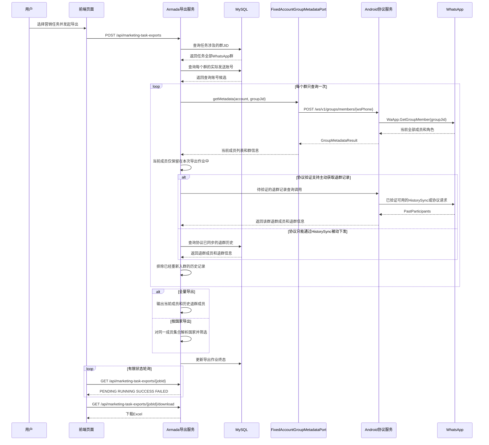
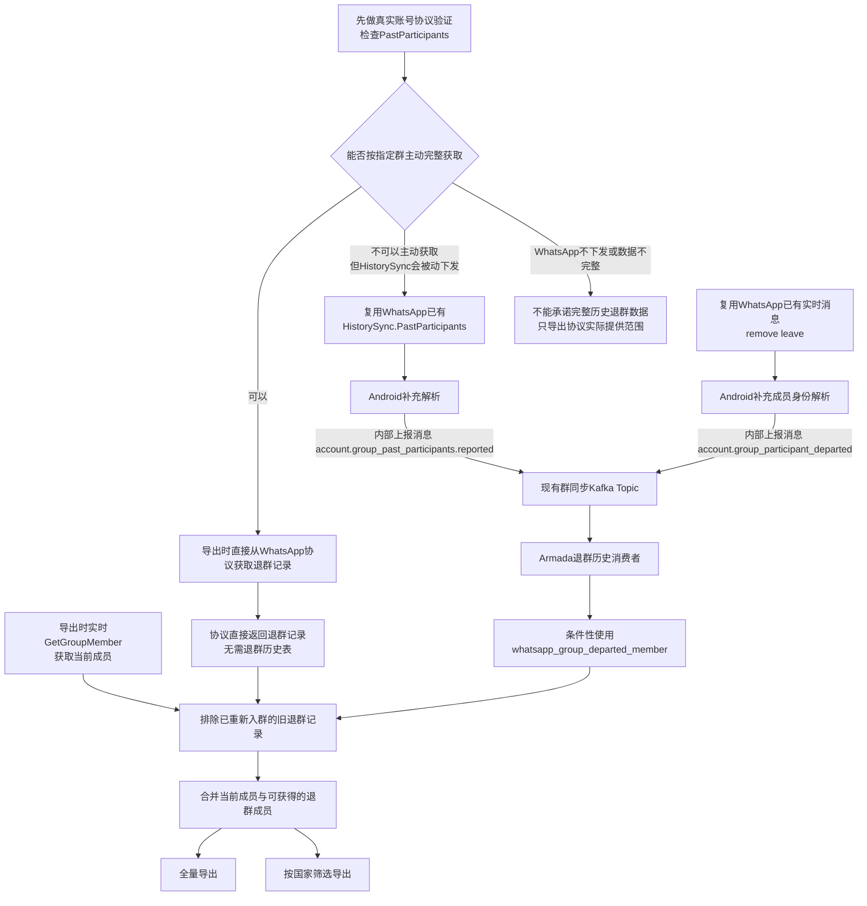

# 营销任务 WhatsApp 群成员导出优化方案

> 实施状态（2026-08-03）：已按“当前成员实时查询 + HistorySync/实时通知被动采集退群事实”分支完成代码开发，尚未部署。现有协议没有按群主动查询完整退群历史的接口，因此未实现文中待验证的主动查询分支；历史完整性仍须在第二套测试环境用真实账号验证。

> 文档状态：待评审
>
> 文档版本：V1.0
>
> 编制日期：2026-08-03
> 适用范围：Armada 后端、Android WhatsApp 协议层、营销任务导出功能

## 1. 评审摘要

本方案解决营销任务导出中的两个核心问题：

1. 全量导出必须覆盖营销任务涉及的所有 WhatsApp 群，并导出群内全部当前成员及 WhatsApp 已提供的历史退群成员，不能只导出 Armada 控端账号。
2. 按国家导出必须从同一批 WhatsApp 群成员中按号码归属国家筛选，不能再从 Armada 成功进群账号中筛选。

推荐方案遵循“复用现有能力、最小化改造”的原则：

- 保留现有导出创建、状态轮询、文件下载接口。
- 复用 Armada 已有 `FixedAccountGroupMetadataPort` 和 Android 群成员 HTTP 接口。
- 导出任务按群 JID 直接查询 WhatsApp 当前成员，不新增 Kafka 查询回传链路。
- 先验证 WhatsApp 是否能够按指定群主动返回 `PastParticipants`；能够主动获取时直接合并导出，不新增退群历史表。
- 如果 WhatsApp 只能通过 HistorySync 被动下发退群历史，再新增一张最小退群历史表。
- 复用 WhatsApp 已有的 `HistorySync.PastParticipants` 和实时 `remove/leave` 原始消息；Android 只补充解析及向 Armada 的内部上报。
- 全量导出和按国家导出共用同一个群成员数据源。
- 不采用上一版的多层快照表、事件事实表、导出临时表和循环重试方案。

## 2. 业务背景

以营销任务 179 为例：

- 页面显示营销群组数量为 45 个。
- 某个 WhatsApp 群当前人数为 51 人。
- 当前群成员明细只导出约 5 条数据。
- 导出的 5 条数据是 Armada 控端账号，而不是该 WhatsApp 群的全部群成员。
- 全量导出中可以看到某国家的群成员，但选择该国家进行模式一导出时提示没有可导出数据。

上述现象表明当前“群组数量”“群人数”“全量成员明细”“按国家导出”使用了不同的数据源，导致统计口径不一致。

## 3. 当前实现问题

### 3.1 群人数和成员明细数据源不一致

当前群人数主要来自 WhatsApp 群预览或群健康数据：

```text
group_link_health.current_count
或
group_link_preview.member_size
```

但群成员明细查询的是：

```text
account_group_membership
JOIN account
```

因此群人数可以显示 51，而成员明细只能得到 Armada 控端已登记的 5 个账号。

### 3.2 按国家导出使用了错误的数据源

当前模式一主要从以下数据中查找号码：

```text
join_task_result
JOIN account
```

这表示查询的是 Armada 成功执行进群任务的账号，而不是 WhatsApp 群中的实际成员。

因此，全量导出看到某国家成员，并不能保证模式一能导出该国家数据，因为两个模式使用的是两套成员数据。

### 3.3 协议层没有把退群历史送到 Armada

Android 协议定义的 `PastParticipant` 已经包含：

```text
userJID
leaveReason = LEFT | REMOVED
leaveTS
```

但是当前代码没有消费 `HistorySync.PastParticipants`。

实时群成员事件虽然能够识别 `add/remove/leave`，但目前只保存：

- 事件是否涉及当前登录账号；
- 受影响成员数量。

具体成员 JID、号码、退出方式和事件时间没有进入 Armada，因此导出无法获得完整退群信息。

## 4. 建设目标

### 4.1 全量导出

对每一个被选择的营销任务：

1. 找到任务涉及的全部 WhatsApp 群 JID。
2. 每个群必须查询一次 WhatsApp 当前群成员。
3. 导出当前全部群成员，不受 Armada 控端账号范围限制。
4. 同时导出 WhatsApp 已提供的历史退群成员。
5. 退群成员必须标记：
   - 是否在群：否；
   - 退群时间；
   - 退出方式：主动退群或被移出群。

### 4.2 按国家导出

1. 使用与全量导出完全相同的 WhatsApp 群成员集合。
2. 根据成员手机号解析国家或地区。
3. 根据用户选择的国家进行筛选。
4. 不再使用 `join_task_result` 或 Armada `account` 作为群成员来源。

### 4.3 数据一致性

如果全量导出中某任务的群成员包含 10 个美国号码，那么同一时间、同一任务选择美国进行模式一导出，应当得到相同口径的 10 条数据。

## 5. 非目标

本次方案不包含以下内容：

- 不修改营销任务的发送逻辑。
- 不改变群拉取、进群、退群等现有业务流程。
- 不要求把 WhatsApp 普通成员创建为 Armada `account`。
- 不对不同群中的相同手机号做跨群去重。
- 不伪造协议没有提供的历史时间字段。
- 不引入生产内存数据库或生产假数据兜底。

## 6. 总体方案

总体数据来源分为两部分：

```text
当前群成员
    ← 导出时调用 Android GetGroupMember(groupJid)

历史退群成员
    ← WhatsApp HistorySync.PastParticipants
    ← WhatsApp 实时 remove/leave 通知
```

导出时按群合并：

```text
当前群成员 + 历史退群成员 = 群成员导出集合
```

全量模式直接输出该集合；按国家模式对该集合进行国家筛选后输出。

## 7. 详细设计

### 7.1 确定任务涉及的群

继续复用当前营销任务导出中的任务群维度查询，以：

```text
tenantId + taskId + groupJid
```

作为群查询范围。

任务 179 显示 45 个群时，应当得到 45 个可查询的 WhatsApp 群 JID。导出成员明细不得从营销账号数量反推群范围。

如果同一个成员同时存在于多个群中，应当在每个群下分别导出，不做跨群去重。

### 7.2 选择群查询账号

每个群需要一个在线且仍在该群内的 Android 账号向 WhatsApp 发起群详情查询。

账号选择顺序：

1. 优先选择该营销任务在该群最近一次成功发送的 Android 账号。
2. 要求账号当前在线且仍然在群中。
3. 首选账号不可用时，只允许切换一次该群的其他实际发送账号。
4. 所有候选账号均不可用时，明确记录该群查询失败。

该 Android 账号只是 WhatsApp 查询的认证载体，不是导出对象，也不能作为成员过滤条件。

例如：一个 Armada 账号查询一个 51 人的 WhatsApp 群，返回结果应为完整的 51 人，而不是只返回该 Armada 账号。

### 7.3 查询当前群成员

复用现有调用链：

```text
FixedAccountGroupMetadataPort.getMetadata(account, groupJid)
    ↓
AndroidNativeFixedAccountGroupMetadataAdapter
    ↓
POST /ws/v1/groups/members/{wsPhone}
    ↓
WaApp.GetGroupMember(groupJid)
    ↓
WhatsApp 群 metadata IQ
```

现有 Android 接口已经可以返回：

- 群 JID；
- 群名称；
- 当前成员数量；
- 当前成员号码；
- 当前成员角色。

本次只需在原响应中补充 `announceOnly/announce`，用于计算发言权限，不需要修改底层 `GetGroupMember` 公共查询逻辑。

### 7.4 WhatsApp 退群记录获取方案

退群记录必须首先尝试从 WhatsApp 协议获取，不能默认 Armada 或 MySQL 已经存在这些数据。

#### 7.4.1 WhatsApp 已有的原始数据

WhatsApp 协议中已经存在两类来源，不需要新增 WhatsApp 事件：

```text
历史退群记录
    ← HistorySync.PastParticipants
       ├── groupJID
       └── userJID + leaveReason + leaveTS

实时退群记录
    ← w:gp2 notification
       ├── remove
       └── leave
```

其中：

- `LEFT` 或 `leave` 表示成员主动退群。
- `REMOVED` 或 `remove` 表示成员被管理员移出。
- `leaveTS` 或通知服务端时间表示退群时间。

#### 7.4.2 当前实现能力

当前 `GetGroupMember(groupJid)` 只能实时返回仍在群里的成员和角色，不能返回已退群成员。

当前 Android 代码虽然定义了 `PastParticipants`，但尚未消费；实时 `remove/leave` 消息虽然能够到达协议层，但普通成员身份、退群时间和退出方式没有上报给 Armada。

当前不存在以下能力：

```text
GetPastParticipants(groupJid)
```

因此，不能在未验证的情况下承诺点击导出时能够主动获取任务所涉及45个群的全部历史退群成员。

#### 7.4.3 协议可行性验证

开发业务链路前，必须先完成 Android 协议验证：

1. 准备一个存在已知主动退群和被移出成员的真实测试群。
2. 使用仍在群内的 Android 账号完成一次完整 HistorySync。
3. 检查 `history.GetPastParticipants()` 是否包含该群。
4. 核对 `groupJID`、`userJID`、`leaveReason`、`leaveTS`。
5. 验证一次 HistorySync 能够覆盖该账号所在的多少个群。
6. 验证 `FULL`、`RECENT`、`ON_DEMAND` 等同步类型的实际返回范围。
7. 验证是否可以主动触发 ON_DEMAND HistorySync，而不是只能重新登录等待被动下发。
8. 使用任务涉及的多个群验证历史记录覆盖率、保留周期和重复下发情况。

协议验证必须输出真实样本和覆盖结论，不能仅凭 protobuf 存在字段就认定 WhatsApp 一定完整下发。

#### 7.4.4 验证结果决策

| 验证结果 | 采用方案 |
|---|---|
| 能按指定群主动、完整获取 | 导出时直接从协议获取当前成员和退群成员，不新增退群历史表 |
| 不能按群主动获取，但 HistorySync 能被动下发 | Android 解析后通过内部消息上报，Armada 保存最小退群历史 |
| WhatsApp 不下发或只下发部分数据 | 只能承诺协议实际提供的历史范围，不能承诺全部历史退群成员 |

这里所说的“内部消息”是 Android 与 Armada 之间的业务上报消息，不是新增 WhatsApp 事件。

### 7.5 条件性保存最小退群历史

只有协议验证确认“不能在导出时主动获取，但能够通过 HistorySync 被动收到退群历史”时，才启用本节的数据表。当前成员仍在导出时实时查询 WhatsApp，不保存当前成员快照。

建议新增一张只保存退群事实的最小历史表：

```text
whatsapp_group_departed_member
```

建议字段如下：

| 字段 | 含义 |
|---|---|
| id | 主键 |
| tenant_id | 租户 ID |
| group_jid | WhatsApp 群 JID |
| participant_jid | 退群成员 JID |
| phone | 归一化手机号，可空 |
| exited_at | 最近一次退群时间 |
| exit_type | 主动退群或被移出群 |
| event_at | WhatsApp 协议事件时间 |
| source_event_id | 协议事件 ID，用于幂等 |
| source_type | HistorySync 或实时退群通知 |
| created_at | 创建时间 |
| updated_at | 更新时间 |

建议唯一键：

```text
tenant_id + group_jid + participant_jid
```

该表不保存当前群成员、当前角色、当前群人数和当前观察时间。本需求按“一个群成员保留最近一次退群事实”设计，不记录同一成员每一次进退群的完整流水。如果以后需要导出完整生命周期，应单独立项设计事件流水表。

### 7.6 当前成员实时查询规则

每次导出成功调用 `GetGroupMember` 后：

- 当前成员列表只在本次导出作业中使用，不写入退群历史表。
- 当前角色和群人数以本次 WhatsApp 实时响应为准。
- 使用当前成员 JID 集合排除已经重新入群的历史退群记录。
- 如果某成员历史上曾经退群、但本次实时查询又出现在群内，本次按当前成员导出，不显示旧退群状态。
- 不得因为某成员没有出现在一次实时查询结果中，就直接推断其已经退群。
- 只有协议明确提供 `leave/remove` 事件时，才写入退群时间和退出方式。

### 7.7 历史退群成员更新规则

Android 在现有 HistorySync 处理入口增加 `PastParticipants` 解析：

| 协议字段 | Armada 字段 |
|---|---|
| `userJID` | `participant_jid/phone` |
| `leaveReason=LEFT` | `exit_type=主动退群` |
| `leaveReason=REMOVED` | `exit_type=被移出群` |
| `leaveTS` | `exited_at` |

在“HistorySync 被动下发”分支中，新增独立的 Android → Armada 内部上报消息，避免修改当前只服务于控端账号群同步的事件语义：

```text
account.group_past_participants.reported
```

`HistorySync.PastParticipants` 是 WhatsApp 已有原始消息；`account.group_past_participants.reported` 是系统内部新增的对接消息，两者不能混称为同一个协议事件。

建议批量字段：

```json
{
  "eventType": "account.group_past_participants.reported",
  "account": "查询账号",
  "groupJid": "群JID",
  "participants": [
    {
      "participantJid": "成员JID",
      "phone": "成员号码",
      "leaveReason": "LEFT或REMOVED",
      "leaveTs": 0
    }
  ]
}
```

Armada 消费后只写入或更新 `whatsapp_group_departed_member`，不写入当前群成员。

### 7.8 实时退群事件更新规则

保留现有 `GroupParticipantsChangedEvent` 的原有用途，不改变当前控端账号群快照逻辑。

WhatsApp 的 `remove/leave` 原始消息已经存在。Android 需要补充解析成员身份，并新增一个身份明确的 Android → Armada 内部上报消息：

```text
account.group_participant_departed
```

包含：

- 群 JID；
- 成员 JID；
- 成员号码；
- 动作：`REMOVE` 或 `LEAVE`；
- WhatsApp 服务端事件时间；
- 协议事件 ID。

Armada 消费后写入或更新 `whatsapp_group_departed_member` 表。

更新必须比较协议事件时间，旧的退群事件不能覆盖新的退群事实；重复事件通过事件 ID 和唯一键实现幂等。成员重新入群不需要写入当前成员状态，导出时由 WhatsApp 实时成员列表排除旧退群记录。

### 7.9 PN、JID 和 LID 归一化

成员身份优先使用 PN JID 和手机号码。只有 LID 时，应使用协议层现有 PN/LID 映射进行解析。

无法解析手机号时：

- 全量导出仍保留成员 JID。
- 国家/地区显示未知。
- 按国家模式不能把未知号码错误归入某个国家。

### 7.10 全量导出逻辑

全量导出第二个工作表的数据源调整为：

```text
任务群集合
    JOIN WhatsApp 当前群成员结果
    UNION 不在当前成员集合中的 WhatsApp 历史退群记录
```

不再使用：

```text
account_group_membership
JOIN account
```

作为导出成员来源。

建议字段口径：

| 导出字段 | 数据来源 |
|---|---|
| 群名称 | Android 当前群详情，失败时使用任务群名称 |
| 群人数 | 当前 `GetGroupMember` 返回成员数 |
| 群成员 | WhatsApp 成员号码或成员 JID |
| 角色 | WhatsApp participant role |
| 国家/地区 | 手机号国家解析器 |
| 是否在群 | 当前成员=true，历史退群成员=false |
| 退出方式 | `LEFT/REMOVED` 映射 |
| 进群时间 | 协议有可信时间时填写；未提供时为空 |
| 退群时间 | `leaveTS` 或实时退群事件时间 |

### 7.11 按国家导出逻辑

模式一不再执行独立的“成功进群账号”查询，而是复用全量导出的成员提供器：

```text
WhatsApp 群成员集合
    ↓
根据 phone 解析国家 ISO2
    ↓
按用户选择的国家筛选
    ↓
写入模式一 Excel
```

必须移除以下数据依赖：

```text
join_task_result 作为成员来源
account 作为成员来源
```

`join_task_result` 可以继续用于营销任务自身的执行统计，但不能代表 WhatsApp 群成员。

## 8. 人数口径

需要区分：

| 指标 | 含义 |
|---|---|
| 群人数 | 查询时 WhatsApp 当前仍在群中的人数 |
| 成员明细行数 | 当前成员与历史退群成员的合计行数 |

例如：

```text
当前群成员：51
历史退群成员：9
群人数列：51
成员明细行数：60
```

这是正常结果，退群成员通过“是否在群=否”进行区分。

## 9. 发言权限

Android 当前群详情需要补充返回 `announce`：

| announce | 查询账号角色 | 导出显示 |
|---|---|---|
| false | 任意 | 所有成员可发言 |
| true | 管理员/群主 | 仅管理员可发言（发送账号可发言） |
| true | 普通成员 | 无发言权限 |

只有协议明确没有返回该字段时才允许显示“未确认”。正常 Android 群详情查询成功后不应继续显示“未确认”。

## 10. 性能与失败控制

### 10.1 并发策略

- 同一个 Android 账号负责的多个群顺序查询。
- 不同 Android 账号之间最多 4 路并发。
- 每批群查询完成后，当前成员和该批退群事实立即逐行写入 SXSSF；不在 JVM 内保留完整成员结果集。
- 一个群正常只调用一次协议接口。
- 首选账号失败后最多切换一个候选账号。
- 禁止通过定时器不断重新请求同一批群。

该策略可以避免同一个 WhatsApp 连接同时积压大量 IQ 请求，同时利用任务中多个在线账号提高整体速度。

### 10.2 失败策略

业务要求导出完整的任务群数据，因此建议采用严格完整性策略：

- 45 个群全部查询成功后才生成 Excel。
- 任意群最终查询失败，则整个导出作业标记失败。
- 错误信息必须包含失败群数量及脱敏后的失败原因。
- 不生成“文件成功但部分群没有成员”的不完整文件。

按国家导出只有在所有群查询完成后，才能判断选择国家确实没有匹配成员；不能因为 `join_task_result` 没数据而提前返回“无数据”。

## 11. 现有外部接口

前端调用方式保持不变。

### 11.1 创建导出作业

```http
POST /api/marketing-task-exports
```

请求继续包含：

- `exportMode`；
- `taskIds`；
- `countryIso2s`。

### 11.2 查询作业状态

```http
GET /api/marketing-task-exports/{jobId}
```

前端可以继续进行短轮询，但必须在以下终态停止：

- `SUCCESS`；
- `FAILED`。

### 11.3 下载文件

```http
GET /api/marketing-task-exports/{jobId}/download
```

## 12. 导出交互流程图



## 13. WhatsApp 退群记录获取与采集流程图



## 14. 改动边界

### 14.1 Armada 后端

- 营销任务导出服务接入 `FixedAccountGroupMetadataPort`。
- 统一全量模式和国家模式的成员数据提供器。
- 调整成员明细查询，去除 Armada 账号过滤。
- 根据协议验证结论接入主动退群记录查询，或条件性新增最小退群历史表及 Mapper/Service。
- 被动 HistorySync 分支新增 Android → Armada 退群历史内部消息消费者。
- 补充作业失败群统计及明确错误信息。

### 14.2 Android 协议层

- `GetGroupMember` 底层逻辑保持不变。
- 群成员 HTTP 响应增加 `announce` 字段。
- 先验证 WhatsApp 实际下发 `PastParticipants` 的触发方式、范围和完整性。
- 被动 HistorySync 分支在现有处理入口增加 `PastParticipants` 解析。
- 实时群通知补充 `REMOVE/LEAVE` 成员身份解析及 Android → Armada 内部上报消息。
- 不新增 WhatsApp 原始事件；复用 WhatsApp 已有 `PastParticipants/remove/leave` 消息。
- 不改变现有控端账号群同步事件的公共语义。

### 14.3 前端

现有导出请求、轮询和下载接口不需要修改。

如需增强用户体验，可在后续增加：

- 已完成群数/总群数；
- 失败群数量；
- 当前作业阶段。

这些进度展示不是本次正确性修复的必要条件。

## 15. 验收标准

| 编号 | 验收条件 |
|---|---|
| AC-00 | 必须用真实账号证明 WhatsApp 是否下发 `PastParticipants`，并形成触发方式、覆盖范围和完整性结论 |
| AC-01 | 任务 179 显示 45 个群时，协议查询必须覆盖 45 个群 |
| AC-02 | 某群 WhatsApp 当前人数为 51 时，当前群成员明细必须有 51 行 |
| AC-03 | 导出成员不能限制为 Armada 控端账号 |
| AC-04 | 在协议确认能够提供的范围内，历史退群成员必须保留并标记“是否在群=否” |
| AC-05 | 退群时间必须来自 `leaveTS` 或实时协议事件时间 |
| AC-06 | `LEFT` 显示主动退群，`REMOVED` 显示被移出群 |
| AC-07 | 同一成员出现在不同群时，每个群分别导出一行 |
| AC-08 | 全量导出中某国家有 N 条时，按该国家导出应得到相同口径的 N 条 |
| AC-09 | 国家导出不能再使用 `join_task_result` 作为成员来源 |
| AC-10 | 正常 Android 群详情查询成功后，发言权限不应显示未确认 |
| AC-11 | 每个群最多一次正常查询和一次账号降级，不得无限循环 |
| AC-12 | 任意群查询失败时，不得生成伪完整文件 |
| AC-13 | 所有新增数据访问必须包含租户条件 |
| AC-14 | 重复协议事件不得产生重复成员记录或回退成员状态 |

## 16. 测试建议

### 16.1 后端单元和数据库测试

- 任务群集合查询测试。
- WhatsApp 当前成员合并测试。
- 当前实时成员排除旧退群记录的测试。
- `LEFT/REMOVED` 映射测试。
- 重复事件幂等测试。
- 租户隔离测试。
- 国家号码解析和多国家筛选测试。
- 全量模式与国家模式同源一致性测试。

### 16.2 Android 协议测试

- 真实账号 HistorySync 的 `PastParticipants` 下发验证。
- `FULL/RECENT/ON_DEMAND` 同步类型覆盖范围验证。
- 是否能够按指定群主动触发退群记录获取的验证。
- 任务多群场景的历史退群记录覆盖率与保留周期验证。
- `PastParticipants` 解析测试。
- `leaveReason/leaveTS` 映射测试。
- `remove/leave` 成员身份解析测试。
- PN、JID、LID 归一化测试。
- 群详情响应 `announce` 字段测试。
- 保证现有 `GroupParticipantsChangedEvent` 行为不回归。

### 16.3 集成验收

准备至少一个包含以下数据的真实测试群：

- 当前成员不少于 10 人；
- 至少两个国家号码；
- 至少一名主动退群成员；
- 至少一名被管理员移出成员；
- 至少一名管理员；
- 群发言权限分别测试全员发言和仅管理员发言。

## 17. 发布与回滚

### 17.1 发布顺序

1. 先在第二套测试环境完成 WhatsApp `PastParticipants` 协议验证，不先建设退群历史表。
2. 如果支持主动查询，接入导出时协议查询，不创建退群历史表。
3. 如果只能通过 HistorySync 被动下发，再部署 Armada 退群历史表和内部消息消费者。
4. 部署 Android 的历史/实时退群解析及内部上报逻辑。
5. 启用新的营销任务导出成员数据源。
6. 使用任务 179 或等价任务完成端到端验证。

### 17.2 回滚策略

- Android 事件解析可单独回滚，不影响现有 `GetGroupMember`。
- Armada 新导出逻辑可通过配置开关回退到旧导出流程。
- 新增退群历史表保留，不执行删除或数据回滚。
- 回滚后停止消费新事件类型，现有公共协议事件不受影响。

## 18. 数据真实性限制

### 18.1 历史退群数据

协议结构定义了退群时间和退出方式字段，但“存在字段”不等于 WhatsApp 一定为指定群完整下发。

实施前必须验证能否主动触发查询；如果只能被动同步，则需要一个仍在群内的 Android 账号完成 WhatsApp HistorySync，才能补录 WhatsApp 实际下发的历史退群记录。

WhatsApp 没有下发的历史成员，系统不能自行推断或伪造。

### 18.2 进群时间

当前 `GetGroupMember` 查询只能获得“查询时仍在群中的成员及角色”，不能提供全部旧成员的精确进群时间。

- HistorySync 明确提供的时间可以使用。
- 协议未提供的旧成员进群时间必须留空，不能使用 Armada 账号关系时间冒充。

## 19. 评审决策点

请评审人重点确认以下事项：

1. 是否同意先完成 WhatsApp 退群记录协议验证，再决定是否建设退群历史表。
2. 是否采用严格完整性策略：任意群查询失败则整个导出失败。
3. 模式一是否同时包含已经退群、且国家匹配的成员。
4. 对协议未提供的旧成员进群时间，是否同意留空。
5. 如果只能被动下发，历史退群数据首次补录是否允许安排账号 HistorySync。
6. 同一成员多次进退群是否只保留最近状态；如需完整进退群流水，应另行立项。

## 20. 结论

本方案能够在不扩大 Armada 控端账号范围的前提下，直接以营销任务涉及的 WhatsApp 群为边界获取成员：

```text
营销任务
    → 全部WhatsApp群JID
    → 每群选择一个查询账号
    → 查询该群全部当前成员
    → 优先从WhatsApp协议获取该群退群记录
    → 必要时读取协议被动同步的退群历史
    → 全量导出或按国家筛选导出
```

该方案复用 WhatsApp 已有的 `PastParticipants/remove/leave` 原始消息以及现有协议端口。系统只在必要时新增 Android → Armada 内部上报消息和最小退群历史表，能够避免把内部对接消息误称为新增 WhatsApp 事件，也避免上一版方案中的重复调度、无限轮询和多表状态维护问题。
