# 推广模板与渠道管理数据模型及接口

> 最终执行迁移：`armada-api/src/main/resources/db/migration/V058__promotion_template_channel_statistics.sql`
> 本期范围：模板管理基础表、渠道新增、渠道分页；渠道统计表和操作日志表暂不创建。
> 租户策略：接口不接收 `tenantId`，数据库仍由 Armada 的 MyBatis 拦截器自动完成租户隔离。

## 1. 业务关系与字段关联图

```mermaid
erDiagram
    promotion_landing_template ||--o{ promotion_domain : "模板可绑定多个域名"
    promotion_domain ||--o{ promotion_channel : "同模板域名可创建多个渠道"
    promotion_channel ||--o| promotion_channel_tracking_config : "FB或TikTok渠道最多一份追踪配置"
    promotion_channel o|--o{ account : "账号可记录稳定渠道ID"
    country o|--o{ promotion_channel : "目标国家或预选区号国家"

    promotion_landing_template {
        BIGINT id PK "模板主键，例如1001"
        BIGINT tenant_id "租户隔离ID，例如1"
        VARCHAR64 template_code UK "稳定模板编码，例如base_sex"
        VARCHAR128 template_name "模板名称，例如基础领奖"
        VARCHAR512 preview_uri "预览资源，例如/preview/base.png"
        JSON supported_params "支持参数，例如themeColor"
        TINYINT status "1启用0停用，例如1"
        VARCHAR500 remark "备注，例如印度默认模板"
        BIGINT created_by "创建人，例如20001"
        BIGINT updated_by "修改人，例如20001"
        BIGINT created_at "创建毫秒，例如1784217600000"
        BIGINT updated_at "更新毫秒，例如1784217660000"
        BIGINT deleted_at "软删毫秒，例如NULL"
    }

    promotion_domain {
        BIGINT id PK "域名记录ID，例如3001"
        BIGINT tenant_id "租户隔离ID，例如1"
        VARCHAR253 domain_host UK "规范化域名，例如go.example.com"
        BIGINT landing_template_id "绑定模板ID，例如1001"
        BIGINT created_by "创建人，例如20001"
        BIGINT updated_by "修改人，例如20001"
        BIGINT created_at "创建毫秒，例如1784217600000"
        BIGINT updated_at "更新毫秒，例如1784217660000"
        BIGINT deleted_at "软删毫秒，例如NULL"
    }

    promotion_channel {
        BIGINT id PK "渠道ID，例如5001"
        BIGINT tenant_id "租户隔离ID，例如1"
        VARCHAR32 channel_code UK "公开推广码，例如a8k2m9qx"
        VARCHAR128 channel_name "渠道名称，例如印度渠道"
        BIGINT owner_user_id "归属用户兼创建人筛选值，例如20001"
        BIGINT promotion_domain_id "域名记录ID，例如3001"
        BIGINT target_country_id "目标国家；NULL表示混合，例如102"
        BIGINT preselected_country_id "默认区号国家，例如102"
        TINYINT platform "1FB 2TikTok 3快手 4MGSKY，例如1"
        TINYINT is_in_app_open_allowed "允许应用内打开，例如1"
        TINYINT is_marketing_allowed "允许参加营销，例如1"
        TINYINT status "1启用0停用，例如1"
        BIGINT created_by "创建人；当前等于owner_user_id，例如20001"
        BIGINT updated_by "修改人；新增时等于owner_user_id，例如20001"
        BIGINT created_at "创建毫秒，例如1784217600000"
        BIGINT updated_at "更新毫秒，例如1784217660000"
        BIGINT deleted_at "软删毫秒，例如NULL"
    }

    promotion_channel_tracking_config {
        BIGINT id PK "追踪配置ID，例如6001"
        BIGINT tenant_id "租户隔离ID，例如1"
        BIGINT channel_id UK "渠道ID，例如5001"
        TINYINT provider_type "追踪平台，例如1表示FB"
        VARCHAR128 tracking_id "Pixel ID，例如123456789"
        VARBINARY4096 access_token_ciphertext "AES-GCM Token密文"
        VARCHAR64 encryption_key_id "密钥版本，例如env-v1"
        BINARY32 token_fingerprint "Token SHA-256指纹"
        BIGINT token_expires_at "Token到期毫秒，例如1786813200000"
        VARCHAR64 lead_event_name "留资事件，例如Lead"
        VARCHAR64 login_request_event_name "请求登录事件，例如InitiateCheckout"
        VARCHAR64 login_success_event_name "登录成功事件，例如CompleteRegistration"
        TINYINT last_probe_status "NULL未测0检测中1成功2失败"
        VARCHAR64 last_probe_event_name "探测事件，例如PageView"
        VARCHAR128 last_probe_event_id "探测事件ID，例如evt_001"
        VARCHAR64 last_probe_error_code "脱敏错误码，例如TOKEN_EXPIRED"
        VARCHAR255 last_probe_error_message "脱敏错误摘要"
        BIGINT last_probed_at "最近探测毫秒"
        BIGINT created_by "创建人，例如20001"
        BIGINT updated_by "修改人，例如20001"
        BIGINT created_at "创建毫秒"
        BIGINT updated_at "更新毫秒"
        BIGINT deleted_at "软删毫秒，例如NULL"
    }
```



## 2. 为什么拆成四张表

- `promotion_landing_template`：维护可绑定的落地页模板，避免与群营销素材表混用。
- `promotion_domain`：落实“同一域名只能绑定一个模板”。域名使用全局唯一键，解决并发创建时仅靠代码先查后插仍可能重复的问题。
- `promotion_channel`：保存渠道稳定身份、归属用户、国家、平台和开关。完整链接不落库，而是用域名和渠道码生成，域名规则变化时不需要批量改 URL。
- `promotion_channel_tracking_config`：将 Pixel/CAPI 敏感配置与渠道主数据隔离。Token 只保存 AES-256-GCM 密文、密钥版本和指纹，分页永不读取或返回 Token。

本期没有更新接口，因此没有增加 `revision` 乐观锁；没有软删复活唯一需求，因此没有增加 `is_active` 生成列；页面不存在主题色和状态原因输入，因此删除了 `theme_color`、`status_reason` 幻觉字段；页面存在“参加营销”，因此新增 `is_marketing_allowed`。

## 3. 索引

| 表 | 索引 | 解决的问题 |
|---|---|---|
| promotion_landing_template | `uq_promotion_landing_template_code(tenant_id,template_code)` | 防止租户内模板编码重复 |
| promotion_landing_template | `idx_promotion_landing_template_available(tenant_id,status,deleted_at,id)` | 模板下拉按启用状态查询 |
| promotion_domain | `uq_promotion_domain_host(domain_host)` | 数据库级阻止同一域名跨模板或并发重复绑定 |
| promotion_domain | `idx_promotion_domain_template(tenant_id,landing_template_id,deleted_at,id)` | 模板反查域名 |
| promotion_channel | `uq_promotion_channel_code(tenant_id,channel_code)` | 防止推广码碰撞 |
| promotion_channel | `idx_promotion_channel_list(tenant_id,deleted_at,created_at,id)` | 支持默认分页和稳定倒序 |
| promotion_channel_tracking_config | `uq_promotion_channel_tracking(tenant_id,channel_id)` | 每渠道最多一份当前配置 |
| promotion_channel_tracking_config | `idx_promotion_channel_tracking_probe(tenant_id,last_probe_status,last_probed_at,id)` | 后续探测任务按状态扫描 |

没有为页面四个可选条件各建一个联合索引。当前数据量下先保留“唯一键 + 默认列表索引”，避免写放大和无依据的过度索引；上线后根据慢查询和 `EXPLAIN` 再增加真正命中的索引。

## 4. 新增接口

`POST /api/promotion-channels`

```json
{
  "channelName": "印度渠道",
  "ownerUserId": 20001,
  "targetCountryId": 102,
  "landingTemplateId": 1001,
  "domain": "https://go.example.com",
  "preselectedCountryId": 102,
  "platform": 1,
  "trackingId": "123456789012345",
  "accessToken": "只在请求中出现",
  "leadEventName": "Lead",
  "loginRequestEventName": "InitiateCheckout",
  "loginSuccessEventName": "CompleteRegistration",
  "inAppOpenAllowed": true,
  "marketingAllowed": true
}
```

兼容页面字段别名：`fbPixelId` 等价于 `trackingId`，`fbAccessToken` 等价于 `accessToken`。`targetCountryId=null` 表示已经选择“混合（不限国家）”。

新增事务依次执行：参数校验 → 校验模板和国家 → 规范化域名 → 复用同模板域名或拒绝跨模板占用 → 生成渠道码并插入渠道 → 加密并插入追踪配置。任一步失败全部回滚。

## 5. 分页接口

`GET /api/promotion-channels`

查询参数：

| 参数 | 含义 |
|---|---|
| targetCountryId | 按真实目标国家筛选 |
| mixedTargetCountry | `true` 时筛选目标国家为“混合” |
| landingTemplateId | 按绑定模板筛选 |
| creatorUserId | 创建人精确筛选；实际查询 `owner_user_id` |
| ownerUserIds | 上级用户保留筛选；前端把上级用户展开为下属归属用户 ID 集合，后端执行 `IN` |
| page/pageSize | 默认第1页、每页100条 |

如果同时传 `creatorUserId` 和 `ownerUserIds`，精确创建人条件优先。所有筛选、统计和分页均下推到 MySQL，不做内存分页。响应包含页面所需国家、模板、平台、推广链接、裂变链接、状态、归属用户和创建时间，不包含 Token、密文、指纹或密钥版本。

## 6. Token 配置

提交 Access Token 前必须配置环境变量：

- `PROMOTION_TRACKING_ENCRYPTION_KEY`：Base64 编码的 32 字节 AES 密钥。
- `PROMOTION_TRACKING_ENCRYPTION_KEY_ID`：密钥版本，例如 `env-v1`。

未提交 Token 的渠道不依赖该配置；提交 Token 但服务端没有密钥时，新增接口会明确拒绝，禁止退化为明文保存。
