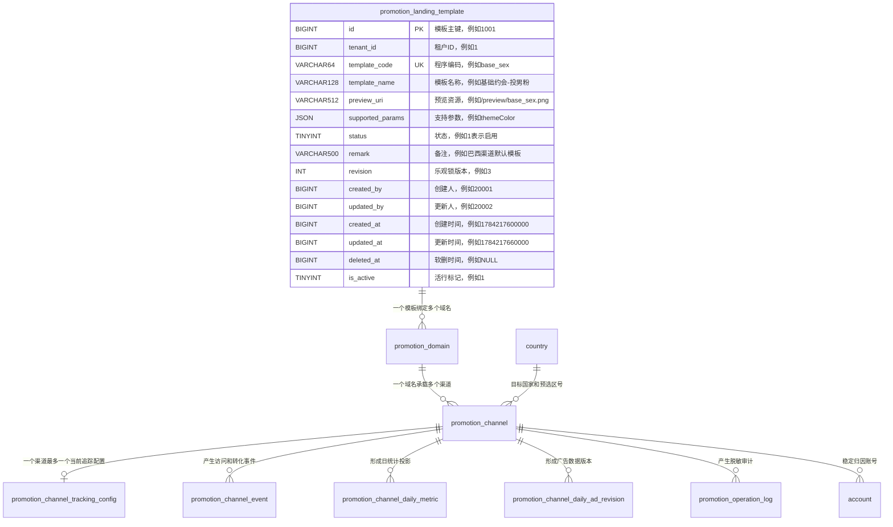

# Promotion Template, Channel, and Statistics Data Model Implementation Plan

> **For agentic workers:** REQUIRED SUB-SKILL: Use superpowers:subagent-driven-development (recommended) or superpowers:executing-plans to implement this plan task-by-task. Steps use checkbox (`- [ ]`) syntax for tracking.

**Goal:** Add the approved eight-table MySQL data model, account compatibility columns, rollback/change records, real-DB migration tests, and a full-field ER diagram for promotion templates, channels, and channel statistics.

**Architecture:** Keep landing-page templates separate from existing group-marketing templates. Model domain ownership and sensitive tracking configuration as independent aggregates, retain raw attribution events as the rebuildable fact source, expose a daily projection for reporting, and version ad-input corrections instead of overwriting them.

**Tech Stack:** Java 17, Spring Boot 3.3.5, MySQL 8, Flyway, MyBatis-Plus tenant isolation, JUnit 5, AssertJ, Maven.

## Global Constraints

- Follow `docs/superpowers/specs/2026-07-17-promotion-template-channel-statistics-data-model.md` exactly.
- Create eight tenant-scoped tables; do not reuse `marketing_template` and do not add draw/reward/OTP/share-progress tables.
- Every new or modified SQL column comment must contain a Chinese business meaning and the literal word `例如` followed by an example value.
- Use `BIGINT` epoch milliseconds for business timestamps and `DATE` only for natural reporting dates.
- Use `DECIMAL` for money/rates; never use `FLOAT` or `DOUBLE`.
- Do not add physical foreign keys; preserve `Controller -> Service -> Mapper` boundaries for later API work.
- Use generated active/current markers for nullable soft-delete/temporal uniqueness.
- Preserve unrelated dirty-worktree files and stage only files from this plan.
- Do not claim DbTest success without real output from the configured MySQL test database.

---

## File Map

- Create `armada-api/src/test/java/com/armada/promotion/PromotionSchemaSqlContractTest.java`: fast, database-free contract checks for the migration resource, table set, generated markers, comments, and forbidden types.
- Create `armada-api/src/test/java/com/armada/promotion/PromotionDataModelMigrationDbTest.java`: real MySQL `information_schema` and constraint behavior checks.
- Create `armada-api/src/main/resources/db/migration/V058__promotion_template_channel_statistics.sql`: eight tables plus guarded `account` compatibility changes.
- Create `.harness/changes/promotion-template-channel-statistics/summary.md`: requirements, decisions, verification evidence, and remaining deployment work.
- Create `.harness/changes/promotion-template-channel-statistics/db-migrations.sql`: exact reviewed migration SQL copy.
- Create `.harness/changes/promotion-template-channel-statistics/rollback.sql`: ordered manual rollback with safety preconditions.
- Create `docs/business/promotion-template-channel-statistics-data-model.md`: full ER diagram, all-field meanings/examples, formulas, lifecycle, and compatibility notes.
- Modify `.harness/wiki/数据模型.md`: add the eight tables and the two changed `account` columns after schema verification; if MySQL is unavailable, record regeneration as unverified rather than claiming live extraction.

---

### Task 1: Add Failing Schema Contracts

**Files:**
- Create: `armada-api/src/test/java/com/armada/promotion/PromotionSchemaSqlContractTest.java`
- Create: `armada-api/src/test/java/com/armada/promotion/PromotionDataModelMigrationDbTest.java`

**Interfaces:**
- Consumes: approved table/field/index definitions from the design spec.
- Produces: tests that require classpath resource `db/migration/V058__promotion_template_channel_statistics.sql` and the migrated MySQL schema.

- [ ] **Step 1: Write the database-free migration contract test**

Create `PromotionSchemaSqlContractTest` with these concrete assertions:

```java
package com.armada.promotion;

import static org.assertj.core.api.Assertions.assertThat;

import java.io.IOException;
import java.nio.charset.StandardCharsets;
import java.util.List;
import java.util.Objects;
import org.junit.jupiter.api.Test;

class PromotionSchemaSqlContractTest {

    private static final String MIGRATION =
            "db/migration/V058__promotion_template_channel_statistics.sql";

    private static final List<String> TABLES = List.of(
            "promotion_landing_template",
            "promotion_domain",
            "promotion_channel",
            "promotion_channel_tracking_config",
            "promotion_channel_event",
            "promotion_channel_daily_metric",
            "promotion_channel_daily_ad_revision",
            "promotion_operation_log");

    @Test
    void migrationCreatesApprovedTableSetAndAccountCompatibility() throws IOException {
        String sql = migrationSql();
        for (String table : TABLES) {
            assertThat(sql).contains("CREATE TABLE " + table + " (");
        }
        assertThat(sql).contains("ADD COLUMN promotion_channel_id BIGINT");
        assertThat(sql).contains("MODIFY COLUMN channel_name VARCHAR(128)");
        assertThat(sql).contains("idx_account_promotion_channel");
    }

    @Test
    void migrationUsesGeneratedMarkersAndNoFloatingPointMoney() throws IOException {
        String sql = migrationSql().toUpperCase();
        assertThat(sql).contains("GENERATED ALWAYS AS (IF(DELETED_AT IS NULL, 1, NULL)) VIRTUAL");
        assertThat(sql).contains("GENERATED ALWAYS AS (IF(VALID_TO IS NULL, 1, NULL)) VIRTUAL");
        assertThat(sql).doesNotContain(" FLOAT", " DOUBLE");
    }

    @Test
    void everyDeclaredBusinessColumnCommentContainsExample() throws IOException {
        String sql = migrationSql();
        for (String table : TABLES) {
            String createBlock = createTableBlock(sql, table);
            for (String line : createBlock.lines().toList()) {
                String trimmed = line.trim();
                if (trimmed.matches("[a-z][a-z0-9_]*\\s+.*") && trimmed.contains("COMMENT")) {
                    assertThat(trimmed).as(table + " column comment: " + trimmed).contains("例如");
                }
            }
        }
    }

    private String migrationSql() throws IOException {
        try (var stream = Objects.requireNonNull(
                getClass().getClassLoader().getResourceAsStream(MIGRATION), MIGRATION)) {
            return new String(stream.readAllBytes(), StandardCharsets.UTF_8);
        }
    }

    private String createTableBlock(String sql, String table) {
        int start = sql.indexOf("CREATE TABLE " + table + " (");
        int end = sql.indexOf(") ENGINE=InnoDB", start);
        assertThat(start).as(table + " start").isGreaterThanOrEqualTo(0);
        assertThat(end).as(table + " end").isGreaterThan(start);
        return sql.substring(start, end);
    }
}
```

- [ ] **Step 2: Write the real MySQL migration test before the migration**

Create `PromotionDataModelMigrationDbTest extends DbTestBase` with tests that:

```java
@Test
void v058CreatesAllApprovedTables() { /* assert all eight tableExists */ }

@Test
void everyNewColumnCommentContainsMeaningAndExample() {
    /* information_schema.columns: every non-generated and generated column comment contains "例如" */
}

@Test
void indexesUseApprovedLeftmostColumnOrder() {
    assertThat(indexColumns("promotion_channel_event", "uq_promotion_channel_event_key"))
            .containsExactly("tenant_id", "event_key");
    assertThat(indexColumns("promotion_channel_daily_metric", "uq_promotion_channel_daily_metric"))
            .containsExactly("tenant_id", "channel_id", "country_code", "stat_date", "source_type");
    assertThat(indexColumns("promotion_channel_daily_ad_revision", "uq_promotion_channel_daily_ad_current"))
            .containsExactly("tenant_id", "channel_id", "country_code", "stat_date", "current_marker");
}

@Test
void accountKeepsSnapshotAndAddsStableChannelReference() {
    assertThat(columnType("account", "promotion_channel_id")).isEqualTo("bigint");
    assertThat(characterLength("account", "channel_name")).isEqualTo(128L);
    assertThat(indexColumns("account", "idx_account_promotion_channel"))
            .containsExactly("tenant_id", "promotion_channel_id", "deleted_at", "created_at");
}
```

Use helper queries against `information_schema.tables`, `columns`, and `statistics`. Add transactional JDBC behavior tests for duplicate active template code, cross-tenant active domain collision, duplicate event key, and dual-current ad revision rejection.

- [ ] **Step 3: Run the fast test and verify RED**

Run:

```powershell
cd armada-api
mvn -q -Dtest=PromotionSchemaSqlContractTest test
```

Expected: FAIL because `db/migration/V058__promotion_template_channel_statistics.sql` does not exist. The failure must be the missing migration resource, not a Java compilation error.

- [ ] **Step 4: Record real-DB RED availability**

If `armada-api/.env` exists, run:

```bash
cd armada-api && ./dbtest.sh 'PromotionDataModelMigrationDbTest'
```

Expected before migration: FAIL because the first new table is absent. If `.env` is absent, record `NOT RUN: armada-api/.env missing`; do not fabricate RED evidence.

- [ ] **Step 5: Commit the tests**

```bash
git add armada-api/src/test/java/com/armada/promotion/PromotionSchemaSqlContractTest.java \
        armada-api/src/test/java/com/armada/promotion/PromotionDataModelMigrationDbTest.java
git commit -m "test: define promotion schema contract"
```

---

### Task 2: Implement the Flyway Migration

**Files:**
- Create: `armada-api/src/main/resources/db/migration/V058__promotion_template_channel_statistics.sql`

**Interfaces:**
- Consumes: Task 1 contract tests.
- Produces: eight MySQL tables and `account.promotion_channel_id`/expanded channel snapshot.

- [ ] **Step 1: Recheck Flyway head**

Run:

```powershell
Get-ChildItem armada-api/src/main/resources/db/migration -File | Sort-Object Name | Select-Object -Last 5 -ExpandProperty Name
```

Expected: V057 is still the latest. If another migration now owns V058, rename this task's migration and both tests to the next free version before writing it.

- [ ] **Step 2: Create the eight tables**

Write the exact columns, types, defaults, generated columns, comments, and indexes from the approved design spec. Use this table order:

```sql
CREATE TABLE promotion_landing_template (...);
CREATE TABLE promotion_domain (...);
CREATE TABLE promotion_channel (...);
CREATE TABLE promotion_channel_tracking_config (...);
CREATE TABLE promotion_channel_event (...);
CREATE TABLE promotion_channel_daily_metric (...);
CREATE TABLE promotion_channel_daily_ad_revision (...);
CREATE TABLE promotion_operation_log (...);
```

Every column declaration must use a comment shaped like:

```sql
channel_code VARCHAR(32) CHARACTER SET utf8mb4 COLLATE utf8mb4_bin NOT NULL
    COMMENT '稳定公开短码,例如 A8K2M9QX'
```

Use `ENGINE=InnoDB DEFAULT CHARSET=utf8mb4 COLLATE=utf8mb4_0900_ai_ci` on every table.

- [ ] **Step 3: Add guarded account changes**

Use `information_schema.columns/statistics` plus prepared statements so the new column and index are safe when a partially prepared test schema already contains them:

```sql
SET @promotion_channel_id_exists := (
    SELECT COUNT(*) FROM information_schema.columns
    WHERE table_schema = DATABASE() AND table_name = 'account'
      AND column_name = 'promotion_channel_id'
);
SET @promotion_channel_id_sql := IF(
    @promotion_channel_id_exists = 0,
    'ALTER TABLE account ADD COLUMN promotion_channel_id BIGINT DEFAULT NULL COMMENT ''稳定推广渠道ID(→promotion_channel.id),历史账号可为空,例如 5001'' AFTER channel_name',
    'SELECT 1'
);
PREPARE stmt FROM @promotion_channel_id_sql;
EXECUTE stmt;
DEALLOCATE PREPARE stmt;

ALTER TABLE account
    MODIFY COLUMN channel_name VARCHAR(128) DEFAULT NULL
        COMMENT '推广渠道名称快照,历史筛选兼容字段,例如 KK-代投印度-抽奖';
```

Apply the same guard pattern to `idx_account_promotion_channel`.

- [ ] **Step 4: Run the fast contract test and verify GREEN**

Run:

```powershell
cd armada-api
mvn -q -Dtest=PromotionSchemaSqlContractTest test
```

Expected: PASS, exit code 0.

- [ ] **Step 5: Run the existing SQL/time test subset**

Run:

```powershell
cd armada-api
mvn -q -Dtest=PromotionSchemaSqlContractTest,EpochMillisSchemaDbTest -DfailIfNoTests=false test
```

Only run `EpochMillisSchemaDbTest` when DB credentials are configured. Otherwise run the contract test alone and record the missing DB prerequisite.

- [ ] **Step 6: Commit migration**

```bash
git add armada-api/src/main/resources/db/migration/V058__promotion_template_channel_statistics.sql
git commit -m "feat: add promotion channel data model"
```

---

### Task 3: Add Change Record and Rollback

**Files:**
- Create: `.harness/changes/promotion-template-channel-statistics/summary.md`
- Create: `.harness/changes/promotion-template-channel-statistics/db-migrations.sql`
- Create: `.harness/changes/promotion-template-channel-statistics/rollback.sql`

**Interfaces:**
- Consumes: final migration SQL from Task 2.
- Produces: auditable forward/rollback artifacts for review and deployment.

- [ ] **Step 1: Create change summary**

Include requirement source, approved spec, table list, account compatibility, rejected approaches, exact verification commands/output, and a deployment section marked `未部署`.

- [ ] **Step 2: Copy the exact forward migration**

`db-migrations.sql` must be byte-for-byte equivalent in SQL statements to the Flyway migration. Compare with:

```powershell
$a = Get-Content -Raw armada-api/src/main/resources/db/migration/V058__promotion_template_channel_statistics.sql
$b = Get-Content -Raw .harness/changes/promotion-template-channel-statistics/db-migrations.sql
if ($a -ne $b) { throw 'migration copies differ' }
```

- [ ] **Step 3: Write safe rollback order**

The rollback script must:

```sql
-- Precheck: abort manual rollback if any account.channel_name exceeds 64 characters.
SELECT COUNT(*) AS channel_name_too_long
FROM account
WHERE CHAR_LENGTH(channel_name) > 64;

ALTER TABLE account DROP INDEX idx_account_promotion_channel;
ALTER TABLE account DROP COLUMN promotion_channel_id;
ALTER TABLE account MODIFY COLUMN channel_name VARCHAR(64) DEFAULT NULL
    COMMENT '推广渠道名';

DROP TABLE promotion_operation_log;
DROP TABLE promotion_channel_daily_ad_revision;
DROP TABLE promotion_channel_daily_metric;
DROP TABLE promotion_channel_event;
DROP TABLE promotion_channel_tracking_config;
DROP TABLE promotion_channel;
DROP TABLE promotion_domain;
DROP TABLE promotion_landing_template;
```

State clearly that production rollback requires exporting event and revision facts and explicit environment confirmation.

- [ ] **Step 4: Verify forward copy and rollback names**

Run the PowerShell equality check and search every created table name in rollback SQL. Expected: equality check exits 0 and all eight drop statements exist.

- [ ] **Step 5: Commit change record**

```bash
git add .harness/changes/promotion-template-channel-statistics
git commit -m "docs: record promotion schema migration"
```

---

### Task 4: Generate Full-Field ER Diagram and Data Dictionary

**Files:**
- Create: `docs/business/promotion-template-channel-statistics-data-model.md`
- Modify: `.harness/wiki/数据模型.md`

**Interfaces:**
- Consumes: the exact Task 2 migration schema.
- Produces: reviewer-readable relational graph and canonical schema documentation.

- [ ] **Step 1: Create the complete Mermaid ER diagram**

Use one `erDiagram` containing all eight tables plus `account` and `country`. Each entity must list every field and a quoted Chinese description with an example:



Use these exact ordered field sets for the remaining new-table entity blocks, and use the SQL column comment from Task 2 as the quoted meaning/example text:

```text
promotion_domain:
id, tenant_id, domain_host, landing_template_id, created_by, updated_by,
created_at, updated_at, deleted_at, is_active

promotion_channel:
id, tenant_id, channel_code, channel_name, owner_user_id,
promotion_domain_id, target_country_id, preselected_country_id, platform,
theme_color, is_in_app_open_allowed, status, status_reason, revision,
created_by, updated_by, created_at, updated_at, deleted_at, is_active

promotion_channel_tracking_config:
id, tenant_id, channel_id, provider_type, tracking_id,
access_token_ciphertext, encryption_key_id, token_fingerprint,
token_expires_at, last_probe_status, last_probe_event_name,
last_probe_event_id, last_probe_error_code, last_probe_error_message,
last_probed_at, created_by, updated_by, created_at, updated_at,
deleted_at, is_active

promotion_channel_event:
id, tenant_id, channel_id, country_code, source_type, event_type,
event_key, visitor_key_hash, account_id, request_id, stat_date,
occurred_at, created_at

promotion_channel_daily_metric:
id, tenant_id, channel_id, country_code, stat_date, source_type,
page_view_count, uv_count, login_request_count,
login_request_visitor_count, login_success_count,
login_success_visitor_count, login_success_account_count,
unbind_account_count, same_day_unbind_account_count,
source_watermark_event_id, revision, computed_at, created_at, updated_at

promotion_channel_daily_ad_revision:
id, tenant_id, channel_id, country_code, stat_date, revision_no,
data_source, currency_code, spend, impressions, clicks, service_rate,
other_fee, valid_to, current_marker, changed_by, change_reason, created_at

promotion_operation_log:
id, tenant_id, object_type, object_id, action_type, result_status,
request_id, before_summary, after_summary, reason_code, reason_message,
operator_id, occurred_at, created_at
```

The existing `account` node must list the new `promotion_channel_id` and the retained `channel_name`/`number_source` snapshot fields. The existing `country` node must list `id`, `iso2`, `name_zh`, and `phone_prefix`; the complete field dictionaries remain mandatory only for the eight tables created by this migration.

Do not omit generated columns, audit columns, or account compatibility columns. If rendering is too wide, add two detail diagrams after the mandatory full graph.

- [ ] **Step 2: Add exact field dictionaries**

For every table, add a Markdown table with: field, SQL type, nullable/default, meaning, example, relationship/index. Copy field types and comments from the migration rather than the pre-implementation spec.

- [ ] **Step 3: Add lifecycle and formula notes**

Document URL derivation, domain exclusivity, Token encryption, event idempotency, daily projection rebuild, exact cross-day UV behavior, ad-revision transaction, account dual-write, and all derived formulas.

- [ ] **Step 4: Update generated-model wiki carefully**

If a configured real MySQL DbTest has successfully applied V058, export `information_schema` and run `.harness/wiki/gen_datamodel.py`, then merge the generated eight table sections and changed account fields into `.harness/wiki/数据模型.md`.

If the real DB is unavailable, add the migration-defined sections with an explicit source note in the change summary and mark live regeneration `NOT RUN`; do not state that the wiki was extracted from a database.

- [ ] **Step 5: Check diagram/schema parity**

Run a script or deterministic search comparing the migration's table/column names with the Mermaid and field dictionaries. Expected: no missing table or column names.

- [ ] **Step 6: Commit documentation**

```bash
git add docs/business/promotion-template-channel-statistics-data-model.md .harness/wiki/数据模型.md
git commit -m "docs: add promotion schema relationship map"
```

---

### Task 5: Real-DB Verification and Final Evidence

**Files:**
- Modify: `.harness/changes/promotion-template-channel-statistics/summary.md`

**Interfaces:**
- Consumes: migration, DbTests, change record, and documentation.
- Produces: evidence-backed completion status.

- [ ] **Step 1: Run fast contract tests**

```powershell
cd armada-api
mvn -q -Dtest=PromotionSchemaSqlContractTest test
```

Expected: exit code 0.

- [ ] **Step 2: Run real migration DbTest when `.env` is configured**

```bash
cd armada-api && ./dbtest.sh 'PromotionDataModelMigrationDbTest'
```

Expected: all migration schema and behavior tests pass. If `.env` is absent, record exactly `NOT RUN: armada-api/.env missing` and do not mark the database acceptance line complete.

- [ ] **Step 3: Run proportional regression tests**

With DB credentials:

```bash
cd armada-api && ./dbtest.sh 'PromotionDataModelMigrationDbTest,EpochMillisSchemaDbTest,AccountMapperDbTest'
```

Without DB credentials, run only database-free tests and Maven compilation:

```powershell
cd armada-api
mvn -q -DskipTests compile
mvn -q -Dtest=PromotionSchemaSqlContractTest test
```

- [ ] **Step 4: Perform migration/document consistency checks**

Run `git diff --check`, verify forward SQL copies match, verify all eight tables appear in rollback and ER docs, and verify no secret-like sample token appears in tracked files.

- [ ] **Step 5: Update evidence and commit**

Write exact commands and outputs into the change summary, then:

```bash
git add .harness/changes/promotion-template-channel-statistics/summary.md
git commit -m "test: record promotion schema verification"
```

- [ ] **Step 6: Final review**

Use `superpowers:verification-before-completion`. Report passing evidence, explicitly report any DbTest blocked by missing `.env`, and link the migration, rollback, ER/data dictionary, tests, and change summary.

---

## Self-Review

- Spec coverage: all eight tables, account compatibility, field comments/examples, full-field ER graph, rollback, wiki, contract tests, real DbTest, and evidence are mapped to tasks.
- Placeholder scan: no implementation step depends on undefined behavior; H5 draw/reward/OTP/share tables remain explicitly excluded.
- Type consistency: table and column names match the approved spec; migration/test/docs all use V058 subject to a final collision check.
- Execution mode: repository policy for this session forbids subagent delegation, so execution must be inline with `superpowers:executing-plans` after workspace isolation is decided.
