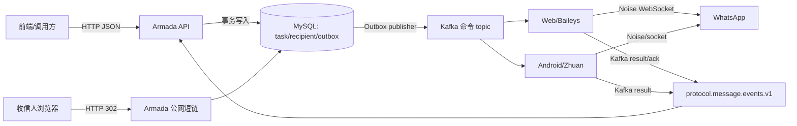

# WhatsApp 超链任务六方案跨仓代码评审与验收方案

> 评审日期：2026-08-28
>
> 评审基线：Armada `03aeca98afd4870b83e5727f6b3d8de353266844`；Web 协议 `da762517ac1907aba1f9cfc27004804057ae0269`；Android/Zhuan `8c7e33a06699c2aeda26ea70331c54ee20491e2c`
>
> 评审范围：六个超链任务方案、共享契约、Armada 当前消息路由、Web/Baileys、Android/Zhuan、测试环境 Runner、压测与观测
>
> 本文只做静态代码和设计评审；未部署、未连接远程 Kafka/Redis/数据库，也未操作真实 WhatsApp 账号。

## 1. 结论先行

当前结论是 **HOLD / 有条件不通过**。六份方案已经把页面、数据模型、任务生命周期、统计和归因主干描述得比较完整，但还不能直接按文档开工，更不能据此宣布两种协议已经支持超链私聊。

必须先关闭以下五个 P0：

1. Android Kafka 消息链路目前只接受 `@g.us` 群 JID，超链所需的个人 JID 还未接入其异步 prepare/dispatch/ACK 状态机。
2. ACK 契约没有端到端闭环：Armada 只处理发送结果，Web 的 `message.ack` 缺少任务关联，Android 没有送达/已读事件回流。
3. `accountSendConcurrency=20` 与真实实现不符：Android 是“每账号并行准备 20、实际 socket dispatch 串行”；Web 是“每 worker 串行执行”，不能把 20 当作真实 WhatsApp 发送并发。
4. Web 消息命令缺少等价于 Android 的持久幂等状态；Redis pending 对消息又不会安全重放，崩溃窗口可能形成重复触达或永久悬挂。
5. H3/H6 提议的 `application/domain/infrastructure.persistence/Repository` 分层违反 Armada 仓库既有 `Controller -> Service -> Mapper` 和“不新增 Repository 层”的结构红线。

六方案可保留为产品和数据口径基线，但 H3 生命周期方案必须先修订为跨仓可实现的协议契约，其他方案再以修订后的 H3 为依赖落地。

## 2. 本次实际核对的方案

- [共享契约](../specs/2026-08-28-hyperlink-task-shared-contract.md)
- [H1 任务列表](../specs/2026-08-28-hyperlink-task-list-design.md)
- [H2 新建/编辑](../specs/2026-08-28-hyperlink-task-editor-design.md)
- [H3 生命周期与协议发送](../specs/2026-08-28-hyperlink-task-lifecycle-design.md)
- [H4 收信统计](../specs/2026-08-28-hyperlink-task-recipient-stats-design.md)
- [H5 账号统计](../specs/2026-08-28-hyperlink-task-account-stats-design.md)
- [H6 归因分析](../specs/2026-08-28-hyperlink-task-attribution-analysis-design.md)
- [测试环境验收用例](../specs/2026-08-28-hyperlink-task-staging-acceptance-test-cases.md)

## 3. Armada 到两种协议的真实交互方式

### 3.1 控制面走 HTTP，发送数据面走 Kafka

建议冻结下面的边界：



具体口径：

- 前端创建、编辑、启动、暂停、统计查询和导出走 Armada HTTP API。
- 任务调度不应同步 HTTP 调用协议层；应在业务事务内写 `protocol_command_outbox`，事务提交后异步投递 Kafka。
- Web 使用通用 `protocol.master.commands.v1`；Android 使用独立 `protocol.android.message.commands.v1`。两者不是同一个 topic。
- Kafka key 当前均使用 `protocolAccountId`，其目的应冻结为“同账号稳定落在同一分区并保持顺序”。
- 协议结果汇入 `protocol.message.events.v1`；目前 Armada 只接受 `message.send_result_reported`。
- 短链点击是独立公网 HTTP 数据面，不经过 Kafka，也不应该等待协议进程。

现有协议仓仍保留若干 HTTP 消息接口，但新超链任务不应旁路 Outbox/Kafka 直接调用它们，否则会丢失统一调度、幂等、回执和审计。

### 3.2 当前拓扑并不对称

| 环节 | Web/Baileys 当前事实 | Android/Zhuan 当前事实 | 评审结论 |
|---|---|---|---|
| 命令 topic | 通用 master topic，账号上下线/群/消息共用 | 消息专用 topic | Web 有跨类型队头阻塞风险 |
| Kafka consumer | PM2 只有一个 master consumer；未设置 `partitionsConsumedConcurrently` | `messageconcurrency=4`，四个 consumer 共享 dispatcher | 不能只看分区数推导吞吐 |
| consumer group | 单个稳定 group | 多 consumer 同 group | 必须在环境清单冻结 group 名和实例数 |
| Kafka key | `protocolAccountId` | `protocolAccountId` | 可维持账号内顺序 |
| 二级队列 | master 按账号归属写入 4 个 Redis Stream | 进程内每账号 coordinator/queue | Web 有 Kafka -> Redis 的额外恢复窗口 |
| 准备并发 | 无独立 prepare 池 | 每账号 20、全局 1024 | “20”只在 Android prepare 层成立 |
| 真正发送 | 每个 worker 的 stream loop 顺序 `await`，一个 worker 同时一条 | 每账号 dispatch lane 串行，不同账号可并行 | 两端都不是每账号 20 条 socket 并发 |
| ACK 等待 | Baileys `sendMessage/relayMessage` 完成后发布发送结果；客户端状态另发 `message.ack` | socket 提交后 ACK 收尾异步；账号下一条不必等待前一条 ACK | 必须分开“提交、server ACK、送达、已读” |
| 幂等恢复 | 没有 commandId 状态机；消息 pending 不自动重放 | Redis `PROCESSING -> RESULT_STORED -> PUBLISHED`；stale PROCESSING 变 `SEND_RESULT_UNKNOWN` | Web 是上线阻断缺口 |

### 3.3 多分区、多消费者现状

- Android 的 perf2 配置已有 12 分区、4 个消息 consumer。这证明代码支持多 consumer，但不等于 test1/生产已按同样拓扑创建。
- Web 代码只有一个 Kafka master consumer。即使 topic 有多个分区，默认也没有把分区并发配置显式冻结，且 master 转发命令时逐条等待 Redis `XADD`。
- Armada 的消息结果 listener 未声明 `concurrency`，`ProtocolMessageEventConsumerProperties` 也没有并发字段；单个 API 实例默认只有一个 listener consumer。横向多实例可增加 consumer 数，但实际副本数和 topic 分区数目前没有形成环境契约。
- test1 部署配置中的 `EXPECTED_KAFKA_TOPICS`、`EXPECTED_KAFKA_GROUPS` 未冻结时，深检会跳过这一类验证，不能证明环境拓扑与设计一致。

实施前必须形成版本化清单，至少包含：topic、分区数、复制因子、key、consumer group、每个实例 consumer 数、实例副本数、最大消息字节、保留期、DLT、rebalance 策略和预期最大 lag。

## 4. 并发口径必须重新命名和冻结

“并发”至少有四种，不能再共用一个数字：

| 维度 | 含义 | 当前 Web | 当前 Android | 建议字段/指标 |
|---|---|---:|---:|---|
| ingress concurrency | 同时从 Kafka 取命令的 consumer/partition 数 | 1 个 master，分区并发未配置 | 4 个 consumer | `consumerConcurrency` |
| prepare concurrency | 素材、设备、加密等准备并发 | 与 worker 执行串在一起 | 每账号 20、全局 1024 | `accountPrepareConcurrency` |
| dispatch concurrency | 真正向 WhatsApp socket 提交的并发 | 每 worker 1；账号随 worker 归属 | 每账号 1，不同账号并行 | `accountDispatchConcurrency` |
| ACK in-flight | 已提交但未取得最终口径结果的消息数 | 未形成业务级门控 | ACK 收尾可并行 | `accountAckInFlight` |

因此：

- 把方案中的 `accountSendConcurrency=20` 改为 `accountPrepareConcurrency=20`，除非未来确实要允许同一账号同时提交 20 条消息；后者不建议直接做，会破坏间隔控制并显著放大风控风险。
- `maxConcurrentNum=protocolCount*15` 当前只是产品显示/计算值，不能冒充协议容量。它应明确是“同时执行账号数上限”还是“任务内命令 in-flight 上限”。
- `defaultSubTaskNum=50` 应只定义为领取/派发批次大小，不能参与业务成功率或 WhatsApp 并发解释。
- 跨任务共享同一账号时必须使用全局账号租约/信号量，而不是只看任务内 `account_usage`。需要冻结 acquire、续租、释放、崩溃回收、TTL、fencing token、fail-closed 和指标。
- Web payload 当前没有携带 `sendIntervalMs`，即使 Armada 命令模型有此字段，Web 端也无法执行同账号间隔。这是必须补齐的协议字段。

建议默认安全语义：每账号 `dispatchConcurrency=1`，允许多账号并行；准备并发和 ACK in-flight 通过压测决定，但不改变 socket 提交串行与账号间隔。

## 5. WhatsApp 接口和协议层拆解

### 5.1 Web/Baileys 使用的接口

- 普通文本、图片、链接卡片：`sock.sendMessage(jid, content)`。
- 按钮卡片：构造 `viewOnceMessageV2Extension -> interactiveMessage -> nativeFlowMessage`，再调用 `sock.relayMessage(jid, message, relayOptions)`。
- 链接卡片媒体：`prepareWAMessageMedia`；链接预览使用 Baileys 生成的消息内容。
- 发送结果：命令执行完成后发布 `message.send_result_reported`。
- 状态回执：监听 Baileys `messages.update`，转为 `message.ack`。
- Baileys 继续负责 WAProto 编码、设备寻址、Signal 会话/加密、Noise WebSocket 和服务端节点解析；Armada 业务代码没有直接处理加密报文。

Web 的底层 API 接受通用 JID，技术上能发送私聊；但当前 Kafka 命令 parser 和 payload 仍以 `groupJid`、营销任务四元组为必填，并未落地超链关联。

### 5.2 Android/Zhuan 使用的接口

存量 HTTP 代码已有：

- `WaApp.SendTextMessage`
- `WaApp.SendImageMessage`
- `WaApp.SendHyperLinkMessage`

私聊底层会处理 PN/LID、设备列表、Signal/Axolotl 会话与逐设备加密，再构造 `MessageNode` 写 socket 并等待 server ACK。因此 Android 不是“完全没有私聊能力”，而是这项能力尚未进入 Armada 的 Kafka 异步消息状态机。

当前 Armada Android adapter 与 Zhuan consumer 只接受 `groupJid @g.us`，调用的是群消息 `PrepareText/PrepareImage/PrepareLinkCard/PrepareButtonCard`。直接把字段名改成 `jid` 不会自动获得私聊能力。

另外，存量 `SendHyperLinkMessage` 不能原样复用：它是同步等待 ACK 的 HTTP 路径，部分模板要求媒体，而且按钮文案存在固定 `click here` 的兼容逻辑；新链路需要保留设计中的 CTA 文案，并接入 prepared/async 状态机。

### 5.3 是否已经“完全拆解 WhatsApp 报文”

答案是 **没有**。当前方案拆到了业务 JSON 和部分 WhatsApp 应用消息结构，但没有形成可评审、可回归的完整 wire 契约。

还缺：

1. Web 与 Android 各消息类型的版本化字段表和脱敏 golden fixture。
2. PN JID、LID JID、设备 JID 的解析、规范化、转换和未注册号码分类。
3. 文本、图片、link preview、native flow button 对应 WAProto 字段的逐项映射。
4. Web `relayMessage` 的 stanza attributes/additionalNodes 与 Android `MessageNode` 的等价性说明。
5. 私聊逐设备加密 fan-out、device-sent message、message secret/媒体密钥等元数据边界。
6. server ACK、单钩、双钩、已读、失败/撤回的状态映射与乱序规则。
7. Android/Web/WhatsApp 客户端版本的兼容矩阵和回退策略。

验收不应抓取或保存生产明文密钥。应在专用测试账号下保存“加密前业务 payload + 脱敏 protobuf JSON/节点结构 + messageId/ACK 时间线”，必要时只保存加密后帧的长度、tag、时间和 hash。

## 6. 代码评审阻断项

### P0-01 Android 私聊没有接入 Kafka 异步链路

**证据**：`internal/armada/message_command.go` 在路由、引用解析和完整校验三处都要求 `groupJid` 以 `@g.us` 结尾；`message_sender.go` 只调用群消息 prepare。

**影响**：H3 写出的 `jid + PRIVATE` 目前只是目标模型，实际发送会在 Zhuan consumer 解析阶段被拒绝。

**修正**：在 Armada、Android wire schema 和 Zhuan 中同时引入 `jid/targetKind`；新增 private prepare/dispatch；PN/LID 解析、未注册分类、设备解析和 ACK 均纳入同一 commandId 状态机。上线前保留旧 `groupJid` 兼容读取，但新私聊不得伪装成群字段。

### P0-02 ACK 没有端到端关联

**证据**：Armada listener 只支持 `message.send_result_reported`，parser 强制读取营销字段和 `groupJid`；Web `message.ack` 只有 `key/status/ackedAt`，Android 只回传 server ACK 意义上的发送结果。

**影响**：recipient 无法可靠区分“已提交、server ACK、送达、已读”，H4/H5/H6 的指标会混用或永远不更新。

**修正**：冻结统一事件 envelope：`eventId/eventType/schemaVersion/tenantId/source/commandId/protocolAccountId/jid/targetKind/messageId/hyperlinkTaskId/recipientId/roundNo/status/occurredAt`。协议层必须维护 `messageId -> commandId/业务关联` 的持久或可恢复映射；Armada 使用 eventId 和状态单调性幂等消费。Android 若暂不支持送达/已读，产品和 API 必须明确显示“不支持/未知”，不能按成功补齐。

### P0-03 并发 20 的业务承诺错误

**证据**：Android `messageprepareaccountconcurrency=20`，但每账号只有一个 dispatch lane；Web 每个 Redis Stream worker 顺序执行命令。

**影响**：容量估算、页面 maxConcurrentNum、超时、账号额度和压测目标都会失真，并可能诱发 WhatsApp 风控。

**修正**：按第 4 节四个维度改名；任务调度只控制活跃账号数和待处理窗口；真实容量以协议基准压测结果冻结。

### P0-04 Web 幂等与崩溃恢复不完整

**证据**：Web 没有 Android 的 `PROCESSING/RESULT_STORED/PUBLISHED` 状态机；worker pending 恢复只把账号下线等安全命令重放，消息命令保持 pending；event publisher 达到 inflight 或重试失败会落本机 DLQ。

**影响**：Kafka/Redis 重复可能造成物理重复发送；进程在发送后、发结果前崩溃会留下未知消息；本机 DLQ 未回放时 Armada 永远收不到结果。

**修正**：为 Web 增加 commandId 状态机和结果 outbox，至少与 Android 语义对齐：新命令只发送一次；已有结果只重发结果；stale processing 返回 `SEND_RESULT_UNKNOWN`，不盲目物理重发。明确外部 WhatsApp 副作用不能做到严格 exactly-once。

### P0-05 Armada 包结构违反仓库红线

**证据**：H3 提议 `application/domain/infrastructure.persistence` 和 Mapper/Repository；H6 也使用 Repository 语义。Armada 规范要求业务域内 `Controller -> Service -> Mapper`，禁止新增 Repository 层。

**影响**：即使功能正确也无法按仓库门禁合并，并会形成双重架构。

**修正**：在 `hyperlink` 业务域下使用 `controller/service/mapper/model`；事务编排在 Service；MyBatis SQL 只放 Mapper/XML；跨域通过平台 port/backend，不引入 Repository 包。

## 7. 重要问题与设计补充

### P1-01 Web 共用 master topic 容易队头阻塞

账号生命周期、群命令和消息命令共用 Web master topic，一个 master 再逐条 `XADD`。超链大批量发送可能拖慢账号上下线和控制命令。建议新建 Web 消息专用 topic/group，或至少提供按分区并行与控制命令优先级；不能只增加 Kafka 分区却仍由单 master 串行处理。

### P1-02 H3 对现代码的描述有误

方案称 Web `executeMessageSend` 会调用 `resolveGroupSendability`，当前 Kafka worker 路径并没有该调用。超链 PRIVATE 分支的评审应基于真实代码重新画路径，不能在不存在的分支上增量设计。

### P1-03 全局账号租约只有概念，没有算法

同一账号可能被多个超链任务或既有营销任务同时使用。需要统一的账号副作用仲裁器，冻结 holder、fencing token、TTL/renew、释放、崩溃回收、暂停取消和运维强制解锁，且 Web/Android 共用同一业务口径。

### P1-04 公网点击可能形成 runtime 热行

H6 的首触事务按 `recipient -> runtime` 加锁。同一任务短时间大量点击会竞争单条 runtime 记录。建议点击事务只幂等更新 recipient 并写点击增量/outbox，runtime 由投影器批量合并；若保留同步 runtime 更新，必须针对同一短码热键做专项压测并证明锁等待可接受。

### P1-05 号码到 JID 不能只做字符串拼接

`digits@s.whatsapp.net` 只是候选 PN JID。协议需处理国家码归一、未注册、PN -> LID、设备列表空、隐私限制和账号级查询风控。号码探测不能在大批发送前逐个无界调用 WhatsApp USync。

### P1-06 发送结果、送达和已读必须分栏

Android 当前“成功”是 server ACK，不是收信人送达；Web `messages.update` 才可能继续产生送达/已读。统计模型必须保留 UNKNOWN/UNSUPPORTED，不能把 `send_result success` 当成双钩或已读。

### P1-07 结果 consumer 和投影器需要独立容量设计

消息结果是所有账号共享的回流热点。需要配置 listener concurrency、按 task/recipient 的幂等索引、批量写入和投影水位；DLT 必须可查询、可受控回放，不能只有 Kafka 中一条不可见消息。

## 8. 修订后的跨仓契约

建议先冻结最小命令模型：

```text
MessageSendCommand
  schemaVersion
  commandId
  tenantId
  source = HYPERLINK_TASK
  protocolBackend = WEB | ANDROID
  protocolAccountId
  target { jid, kind = PRIVATE }
  payload { type, text, imageAssetRef, linkCard, buttonCard }
  correlation { hyperlinkTaskId, recipientId, roundNo }
  policy { sendIntervalMs, notBeforeAt }
```

规则：

- `commandId` 全局唯一且稳定，业务重试新建 attempt 时才产生新 commandId。
- Kafka key 为 `protocolAccountId`；同账号 socket dispatch 保持串行。
- 图片只传可跨进程读取的 AssetRef，不在 Kafka 中无限放大 base64。
- `jid/targetKind` 为新字段；迁移期可兼容读取旧 `groupJid`，但超链私聊只发新格式。
- 两个协议都必须输出同一结果字段；能力差异通过稳定 reason/status 表达，不得私自丢字段或伪成功。
- Web 与 Android 都以“结果先持久化，再发布 Kafka”为恢复原则。
- 明确语义是“业务状态幂等 + 已知结果不重复物理发送 + 崩溃窗口返回 UNKNOWN”，不宣传 WhatsApp 外部副作用 exactly-once。

## 9. 代码审核执行方案

按以下顺序分 PR，任何一层未通过不得提前合并其上层业务：

### PR-1：契约与能力矩阵

- 修改共享设计，关闭本文件 P0/P1。
- 提供 JSON Schema/OpenAPI、Web/Android golden payload、事件状态机和 reason code 表。
- 明确 Android 送达/已读是否支持；明确账号并发四维口径。
- 不改业务代码。

### PR-2：两协议基础能力

- Armada 通用 `jid/targetKind/hyperlinkCorrelation`。
- Web 专用消息入口、发送间隔、command 状态/结果 outbox、ACK 关联。
- Android private prepare/dispatch、CTA 保真、PN/LID 和 unregistered 分类。
- 两端契约测试使用同一组 golden fixture。

### PR-3：Armada 数据模型和 H2/H3

- Flyway 建表、唯一索引、租户索引、状态约束和回滚/兼容说明。
- `controller/service/mapper/model` 结构落地，不引入 Repository。
- 任务准备 Saga、全局账号租约、recipient/usage 幂等、投影和 reconciliation。
- Outbox 与业务状态同事务；禁止事务中等待 Kafka/WhatsApp。

### PR-4：H1/H4/H5/H6 查询与导出

- 列表不得 JOIN 大 recipient 表；详情分页都必须租户隔离。
- 统计只读投影，展示 `metricsUpdatedAt`。
- 点击链路做并发首触和热行专项测试。
- 导出复用现有异步 job，不在 HTTP 请求内拼大文件。

### PR-5：前端与联调

- 只调用已冻结 API，不复刻状态推导。
- Web/Android 能力差异、UNKNOWN/UNSUPPORTED、统计水位可见。
- WhatsApp 预览只表示近似效果，真实客户端兼容由 canary 验证。

每个 PR 必审：租户隔离、状态单调、幂等键、事务边界、外部副作用、重复/乱序/超时/崩溃、DLT/回放、指标、敏感信息、跨协议一致性和测试证据。

## 10. 测试环境验收方案

完整用例已经整理在[测试环境验收用例](../specs/2026-08-28-hyperlink-task-staging-acceptance-test-cases.md)。当前状态只能是 `TEST_DESIGNED / NOT_RUN`，不能写成已验收。

### 10.1 环境前置

1. 冻结 Armada、前端、Web、Android 四个实际运行 revision，Runner 必须从服务端观测，不能只相信 plan 声明。
2. 冻结 Kafka topics/groups/partitions、Redis key/stream 前缀、数据库 schema version、服务副本数和配置快照。
3. 准备独立 tenant、10 万/50 万 recipient 合成数据、Web/Android 测试账号、白名单收信号码和独立短域名。
4. 真机 canary 必须有账号租约、号码白名单、单次条数上限、总日额度、发送间隔、超时和 kill switch。
5. 每个用例输出 request/response、DB 前后、outbox、Kafka offset、Redis 状态、协议日志、messageId/ACK 时间线和最终断言；敏感号码和消息正文脱敏。

### 10.2 分层验收

| 层 | 目标 | 关键验收 |
|---|---|---|
| L0 静态契约 | 四仓一致 | schema/golden fixture、topic/key/group、reason/status 全一致 |
| L1 单元/数据库 | 本地确定性 | 10 表迁移、真实 Mapper XML、事务、租户、唯一键、状态机、并发首触 |
| L2 集成 | 不触达真实 WA | API -> DB/outbox -> Kafka -> 协议模拟器 -> event -> recipient/projection 全链路 |
| L3 协议 canary | 真实兼容 | Web/Android 各发送文本、图片、链接卡、按钮卡到白名单号码，核对真机和 ACK |
| L4 故障恢复 | 语义可信 | 重复/乱序、consumer kill/rebalance、Redis/Kafka/DB 短断、结果发布失败、DLT 回放 |
| L5 soak | 长稳 | 60 分钟起步，观察 lag、内存、goroutine/thread、投影收敛、未知结果和重复 |
| L6 性能 | 容量和退化 | HTTP、短链、Kafka 模拟发送、查询/导出分别压测 |

### 10.3 H1-H6 的验收重点

- H1：10 万 recipient 不得进入列表主查询；租户、分页、排序、快照水位正确。
- H2：创建/编辑校验、版本冲突、复制不复制运行数据、素材引用和协议能力校验。
- H3：一人一次、轮次、暂停/恢复/取消、账号租约、重复/乱序回执、UNKNOWN 和 reconciliation。
- H4：recipient 分页和状态筛选准确；发送、送达、已读不混用；导出与页面同一快照口径。
- H5：账号实时占用与历史统计分离；封禁只对明确协议信号计数，普通网络失败不得误判。
- H6：短码不可枚举、冻结 HTTP(S) 目标、并发首访 UV=1/PV=2、302 正确、热键无锁雪崩。

### 10.4 放行硬门禁

- P0 全部关闭，跨仓契约测试全部通过。
- Web/Android 白名单 canary 四种消息形态都得到预期 server ACK；宣称支持的送达/已读状态与真机一致。
- 同 commandId 重投不再次物理发送；不可判定崩溃窗口进入 UNKNOWN，不自动盲发。
- 重复/乱序事件不倒退状态、不重复计数；DLT 可见且可受控回放。
- Kafka lag、Redis pending、outbox 和投影水位在停止注入后于约定窗口内归零。
- 10 万基线和 50 万容量档下查询达到设计冻结的 P95；无全表扫描、死锁、OOM 或进程重启。
- Runner 报告证据完整，所有 revision 与环境指纹可追溯。

## 11. Runner 能发挥的作用和需补充内容

### 11.1 当前 Runner 适合做什么

`armada-deploy/staging-accept` 是持久化、单 worker、串行的测试编排与证据收集器。它已有：

- plan/stage 执行、SQLite 状态、日志、报告和 checksum；
- 超时、取消、恢复、进程组 TERM/KILL 和 daemon 崩溃恢复；
- 同一 state dir 单实例锁，避免两个 Runner 同时操作环境；
- 通过受信 wrapper 调用 Git、SSH、Kafka、Redis、Playwright 或观测脚本的扩展边界。

它应该继续作为“验收控制面和证据引擎”，不应该变成协议 worker，也不应该自己承载高并发压测流量。

### 11.2 当前不能做什么

- P0 Runner 只接受 `safety=read-only`，不能直接执行真实 WhatsApp 写操作。
- stage 串行、fail-fast，没有 DAG 并行和资源级互斥租约。
- read-only 目前是声明式约束，不是 OS 级强沙箱。
- 不会自动证明 plan 里的 revision 就是服务器实际 revision。
- 证据保留期、磁盘上限和自动归档策略未闭环。
- Linux/systemd/CGO/进程组行为仍需在目标机验证。

### 11.3 为超链验收要补什么

1. 受信 wrapper：fixture 创建/清理、API 用例、DB 对账、Kafka lag/事件、Redis Stream/pending、协议日志和浏览器点击。
2. `observedRevision` stage：从四个真实服务读取镜像 digest/commit/config hash，和 plan 比较。
3. case 级结构化结果：`caseId/status/assertions/evidence/blockReason`，支持 PASS/FAIL/BLOCKED/SKIPPED。
4. 真实 canary 安全信封：明确环境、tenant、账号、收信白名单、消息模板、条数预算、时间窗、租约和审批记录；与 read-only profile 完全隔离。
5. 资源租约与 kill switch：防止两个任务复用同一 WhatsApp 账号或号码。
6. 故障注入 wrapper：只允许预定义、可恢复、目标明确的 consumer kill/restart、网络短断和事件重放。
7. 证据保留与脱敏：配额、过期清理、hash、权限、号码/正文/token 脱敏。
8. 压测触发器：Runner 只启动 k6/专用 generator 和观测器、收集结果，不在 Runner 进程里造高并发。

## 12. 能否压测、怎么压

可以压测，但必须把“平台容量”和“真实 WhatsApp 兼容”分开。绝不能用大量真实 WhatsApp 私聊来测系统吞吐。

### 12.1 四条独立压测曲线

#### A. HTTP 控制面

- 对象：列表、详情、账号统计、收信统计、趋势、创建/校验、action、导出提交/轮询。
- 工具：k6 或等价工具。
- 数据：10 万 recipient 基线、50 万容量档、1000 账号桶、3 轮；多租户并发。
- 模式：5 分钟 warm-up，阶梯升压，15 分钟稳态，停止后观察恢复。
- 结果：QPS、p50/p95/p99、错误率、慢 SQL、连接池和每接口 SQL 数。

#### B. 公网短链

- 对象：分布式短码、同一短码热键、首次/重复/并发首访、无效/过期短码。
- 使用合成短码和测试库，不需要 WhatsApp。
- 单独测 302 延迟、DB 锁等待、UV/PV 正确性、热点 runtime 行和目标站延迟隔离。

#### C. Kafka 发送与回流数据面

- Armada 正常写 outbox，由协议模拟器消费命令并按可控延迟生成 server ACK/送达/已读/失败/乱序/重复事件。
- 分别测试 Web topic 和 Android topic，逐步提高活跃账号数、每账号待处理数和事件回流率。
- 验证 outbox 吞吐、partition skew、consumer lag、Redis pending、幂等、投影收敛和 DLT。
- 这是系统容量主测试，不触达真实 WhatsApp。

#### D. 真实 WhatsApp canary

- Web/Android 各 1～2 个测试账号，只发到授权白名单号码。
- 低速、小量、固定模板，用于证明真实报文兼容、CTA、媒体、messageId、server ACK 和客户端展示。
- 不用于推导 QPS，不做突发，不和容量压测同时运行。

现有 `perf2_loadtest` 只会恢复既有营销任务并观察 Android 消息 Kafka/资源，不能覆盖新超链 API、私聊、Web、短链、查询和 ACK 投影。可以复用它的 offset/资源采样方法，不能把它的结果当作本功能压测结果。

### 12.2 压测顺序

1. 空跑和 1x 基线，确认数据正确与观测完整。
2. 2x、4x、8x 阶梯升压，每档至少保持 10～15 分钟。
3. 发现首个瓶颈后停止加压，记录饱和点、失败形态和恢复时间。
4. 修复后重复同一数据集和脚本，禁止换口径“跑绿”。
5. 执行 60 分钟 soak；稳定后再评估 6h/24h，而不是默认直接长跑。
6. 最后单独做低速真机 canary。

吞吐门槛应先用基线实测冻结，当前不应凭设计文档拍一个每秒发送数。第一轮建议使用以下安全门槛：零数据丢失、零重复业务计数、UNKNOWN 可解释、停止注入后 lag 可排空、无 OOM/重启/死锁；CPU 稳态尽量低于 70%、内存低于 75%、DB 池占用低于 70%，这些资源阈值先作为建议值，基线后再正式签字。

## 13. 必须监控什么

### 13.1 Kafka

- 每 topic/group/partition 的生产/消费速率、current lag、oldest lag age、partition skew。
- consumer 数、assignment、rebalance 次数/时长、poll/commit 错误。
- DLT 条数、最老年龄、reason 分布和回放结果。

### 13.2 Armada/数据库

- outbox `PENDING/LOCKED/SENT/DEAD` 数量、最老年龄、claim/dispatch/publish 吞吐。
- API QPS、p50/p95/p99、4xx/5xx、超时、导出队列。
- DB pool active/wait、慢 SQL、rows examined、锁等待、死锁、redo/IO、主从延迟。
- recipient 状态迁移、usage in-flight、runtime/round/account_stat 投影水位与 reconciliation 差异。
- 短链 QPS、302 延迟、invalid/expired、首触冲突、runtime 热行锁等待。

### 13.3 Web/Baileys

- master Kafka lag、路由吞吐、每 worker Redis Stream `XLEN/XPENDING/oldest pending`。
- 每 worker 命令执行时间、账号数、队列长度、事件循环延迟、heap/GC、PM2 restart。
- send result/ack 发布成功率、本地 DLQ 数量/年龄/磁盘占用/回放。
- 按账号脱敏统计 dispatch interval、ACK in-flight、UNKNOWN、重连和限流。

### 13.4 Android/Zhuan

- 四个 consumer 的 assignment/lag/commit，dispatcher 每账号 pending/preparing/ready/active。
- prepare token 使用量（账号/全局）、prepare/ready-wait/typing/dispatch/server-ACK 延迟。
- `PROCESSING/RESULT_STORED/PUBLISHED/SEND_RESULT_UNKNOWN` 数量和最老年龄。
- goroutine、heap、GC、socket sender queue、进程重启和账号连接状态。

### 13.5 业务 SLI 与告警

- accepted -> server ACK 成功率和时延。
- server ACK -> delivered/read 的成功率、时延和 unsupported 占比，按协议分开。
- 重复 command/event、状态倒退拒绝、物理重复嫌疑、UNKNOWN 和 unregistered 比例。
- outbox/Kafka/Redis/投影任一水位超过门槛即告警；账号封禁/受限异常上升立即触发 kill switch。

所有指标至少带 `env/protocol/topic/group/schemaVersion/source`；高基数字段如 phone、jid、commandId 不直接作为常驻 Prometheus label，应进入脱敏日志和 trace。

## 14. 最终放行路径

建议顺序：

1. 先修订 H3 及共享契约，关闭五个 P0。
2. 先落 Web/Android 私聊、幂等、ACK 能力并做协议 golden test。
3. 再落 Armada 数据和生命周期，之后才做 H1/H4/H5/H6 查询。
4. 使用模拟协议完成全量集成、故障和容量测试。
5. 部署 test1 后由 Runner 固化 revision、拓扑、数据和证据。
6. 获得真实 WhatsApp canary 授权后，小量验证 Web/Android 真机表现。
7. 所有门禁通过后再决定灰度，不把“能进 Kafka”当作“已发送”，也不把“server ACK”当作“已送达/已读”。

在以下四个产品/技术决策签字前，不建议进入实现：

- Android 本期是否承诺送达/已读；若不承诺，页面如何显示 UNKNOWN/UNSUPPORTED。
- 同一业务 attempt 的失败重试是否允许再次物理发送；Android 当前进程内 ACK 失败最多重试一次，需要统一口径。
- Web 是否拆出消息专用 topic/master，还是接受共用 master 的容量与故障域。
- `accountSendConcurrency=20` 是否正式改名为 prepare concurrency，并把每账号真实 dispatch 固定为 1。

## 15. 本次评审状态

- 六份新设计：已通读并完成跨仓静态复核。
- 当前代码：尚未实现 `/api/hyperlink-tasks` 和完整超链私聊链路，本文不是“代码已完成”的验收报告。
- 测试：未执行远程集成、真机、soak 或压测；现有用例是后续执行基线。
- 部署：未执行。部署需要另行明确 test1 目标、四仓 revision、数据库/Kafka 变更范围和真实 canary 授权。
