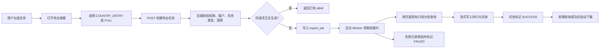

# 营销任务数据导出开发前设计

> 状态：`APPROVED / IMPLEMENTING`  
> PRD：营销任务数据导出需求文档 V1.1（2026-07-27）  
> 评审范围：Armada 后端、wheel-saas-pure-web 前端、MySQL、Excel 文件存储  
> 结论：P0 口径已经确认，方案进入实现与验证阶段；剩余展示细节沿用现有页面口径，不阻塞开发。

## 1. 结论摘要

本需求不是在现有列表上简单增加一个同步 Excel 下载接口。PRD 同时要求：

- 单选、多选营销任务；
- 按国家导出真实进群号码；
- 导出任务、群组、账号、消息发送结果等全量统计；
- 大数据后台生成、幂等防重、状态查询、过期和自动下载；
- 严格租户隔离、独立导出权限、完整手机号保护和审计；
- 导出字段、状态和时间均沿用页面当前展示口径。

建议采用“一套异步导出任务 + 两种数据投影 + 一个 Excel 写入器”的方案。现有 FastExcel、营销发送尝试记录、国家主数据和 RBAC 可以复用；现有任务调度、协议发送和结果回写逻辑不修改。

“实际进群号码”的数据来源已确认：`account` 表保存受控账号号码，`join_task_result` 保存账号进群结果，二者通过 `account_id` 关联。不能只查询 `account` 表，因为账号表本身不能证明账号进入了哪个群、是否成功。

已确认的实施口径：

1. 国家选项新增 `scope=marketing-export`，来源复用系统 `country` 国家字典及其字段编码，只返回真实且启用的国家/地区，不返回 `MIXED`；补齐字典缺失的 `DG` 后共 249 条。
2. 本期采用异步导出任务 + 后端持久化挂载目录，满足生成中、成功、失败、过期、下载和重启后仍可访问；文件保留 7 天。
3. 新成功进群记录写入独立 `joined_at`；历史记录为空时按方案 A 回退 `updated_at`，该值属于历史近似时间。
4. 导出状态、统计、展示文字和时间格式沿用现有营销任务页面/详情口径，不另建与页面相冲突的业务定义。
5. 本期不建设导出记录入口；前端轮询本次任务，成功后自动下载。后端保留按任务 ID 查询状态和下载能力，供后续记录入口复用。

## 2. 能力定义

### 2.1 目标能力

有 `tenant:marketing_task:export` 权限的当前租户用户，可以在普通“营销任务”页面选择一个或多个任务，点击同一个“导出”按钮后创建以下任一导出：

- `COUNTRY_ENTRY`：按所选国家/地区导出明确成功进群的手机号明细；
- `FULL`：导出营销任务汇总和群组明细。

系统后台生成 `.xlsx`，前端轮询本次任务，成功后自动下载。文件中的数据必须来自同一租户，字段值和时间展示与用户点击导出时所在页面的现有口径一致，并保留可追踪的导出审计信息。

### 2.2 核心不变量

- 前端传入的任务 ID、国家、统计值均不可信，业务值由后端重新校验和计算。
- 任意查询、导出任务、文件下载都必须带 `tenant_id` 约束。
- 请求中的任一任务不可见或类型不支持时，整个请求失败，禁止静默漏导。
- 国家进群明细只统计 `join_task_result.status='SUCCESS'` 且 `group_jid`、账号号码均有效的明确成功事实；失败、待处理和号码缺失不能算成功。
- 国家进群去重键固定为 `task_id + phone + group_jid`。
- 消息结果以 `marketing_task_send_attempt` 为事实源，禁止使用前端计数或仅依赖任务主表累计字段。
- 导出时不调用协议层，不实时刷新群或账号，不改变任务状态机。
- Excel 中手机号、任务 ID、群组 ID、发送账号均按文本写入。
- 所有文本单元格必须防止 Excel 公式注入。
- 已执行的 Flyway 文件不得修改；数据库变化只增加新的后续版本迁移。

### 2.3 非目标

- 不修改普通营销、拉群营销的调度和发送流程。
- 不在“拉群营销”页面增加本需求的导出入口。
- 不在前端拼装 Excel 或计算业务统计。
- 不通过导出触发实时群检测、账号上线或协议查询。
- 不补造不存在的历史进群成功事实。
- 不建设通用报表平台；本次只提供营销任务导出需要的最小任务、文件和审计能力。

## 3. 当前实现对账

### 3.1 普通营销任务

当前普通营销页面和接口为：

- 前端：`wheel-saas-pure-web/src/views/task/group-marketing/`
- 前端 API：`wheel-saas-pure-web/src/api/marketing-task.ts`
- 后端入口：`MarketingTaskController`，基路径 `/api/marketing-tasks`
- 后端权限：`tenant:marketing_task:view`
- 列表 SQL：`MarketingTaskMapper.xml` 的 `TaskFilter` 固定 `business_type = 1`

数据链路为：

```text
marketing_task
  -> marketing_task_target        账号 × 群组目标
      -> marketing_task_send_attempt  每轮发送尝试与最终结果
```

该链路能够支持任务汇总、群组发送结果、发送账号、首末发送时间和失败原因。它自身不保存进群账号号码，但可以用实际发送成功记录中的 `group_jid` 关联进群任务事实。

### 3.2 进群任务与账号事实

当前系统对“受控账号进入群组”的结果使用以下关系保存：

```text
account
  -> join_task_result
```

关键字段含义如下：

| 表.字段 | 字段含义 | 在导出中的用途 |
|---|---|---|
| `marketing_task_send_attempt.group_jid` | 本次营销发送实际对应的 WhatsApp 群唯一标识，例如 `120...@g.us`；它是群 ID，不是手机号 | 确认选中营销任务实际营销过哪些群 |
| `join_task_result.group_jid` | 进群任务成功后协议返回的 WhatsApp 群唯一标识 | 与营销发送的 `group_jid` 关联 |
| `join_task_result.status` | 进群执行结果；`SUCCESS` 表示已得到明确进群成功结果 | 只选择明确成功记录 |
| `join_task_result.account_id` | 执行进群操作的 Armada 受控账号 ID，关联 `account.id` | 找到实际进群账号 |
| `account.ws_phone` | 受控账号的完整 WhatsApp 手机号 | “实际进群号码”的主数据来源 |
| `join_task_result.account` | 执行时记录的账号号码或账号标识快照 | `account` 已软删或号码为空时的历史回退值 |
| `join_task_result.updated_at` | 该进群结果记录的最后更新时间，不是专用进群成功时间 | 仅作为历史进群时间的近似回退 |

因此，业务所说“号码在 `account` 表中有记录”是合理的，但完整事实必须同时使用两张表：

```text
join_task_result 证明：这个账号成功进入了这个 group_jid
account           提供：这个 account_id 对应的完整 WhatsApp 手机号
```

拉群营销的料子表描述的是“目标客户/料子号码”，与本次业务确认的“平台受控进群账号”不是同一概念，本方案不再把拉群营销执行材料作为 `COUNTRY_ENTRY` 的号码事实源。

### 3.3 国家/地区主数据

现有 `country` 表包含 ISO2、中文名、英文名、展示区号和国旗，是本功能唯一的国家/地区字典与字段编码来源，但存在以下差距：

- 当前种子为 248 条，不是 PRD 的 249 条；
- 现有 `/api/admin/countries/options` 只支持 `scope=ip`，会返回 `MIXED`，且只取 `is_ip_supported=1`；
- `country.phone_prefix` 是展示字段，不是可靠的手机号判国规则；
- 存在 `+1-787/939` 等多前缀合并文本；
- 存在完全相同区号对应多个国家/地区的情况。

已确认的完全相同区号冲突包括：

| 区号 | 国家/地区 ISO2 |
|---|---|
| `+1` | CA、US |
| `+7` | KZ、RU |
| `+47` | NO、SJ |
| `+61` | AU、CX、CC |
| `+64` | NZ、PN |
| `+212` | MA、EH |
| `+262` | YT、RE |
| `+290` | SH、TA |
| `+358` | AX、FI |
| `+500` | FK、GS |
| `+590` | GP、BL、MF |
| `+599` | BQ、CW |
| `+672` | AQ、NF |

### 3.4 可复用能力

- `cn.idev.excel:fastexcel` 已存在，无需新增 Excel 依赖。
- `GroupCreationMarketingExportWorkbookWriter` 可参考样式、字符串格式和附件响应处理，但不能复用其同步 `byte[]` 生成方式处理大文件。
- `marketing_task_send_attempt` 已包含 `submitted_at`、`result_at`、轮次、尝试序号和结果，可重建截止快照时的成功、失败和未决结果。
- `group_link_preview` 和 `group_link_health` 已保存群名、成员数、是否仅管理员发言和健康状态的最近快照。
- `account_state` 可提供当前账号状态。
- `sys_menu` / `sys_role_menu` 可增加独立按钮权限。

### 3.5 当前缺失能力

- 没有通用异步导出任务和导出记录表；
- 没有 OSS、S3、MinIO 或其他共享对象存储实现；
- 没有覆盖 PRD 全字段的营销导出查询；
- 没有国家手机号前缀唯一映射规则；
- 没有营销导出专用权限；
- 没有通用操作审计表，导出审计需要由导出任务记录自身承载。

## 4. 开发前阻碍项

### 4.1 已确认：普通营销任务如何关联“实际进群号码”

产品入口和交互已经明确：只在普通“营销任务”页面提供一个导出按钮，弹窗内支持 `COUNTRY_ENTRY` 和 `FULL` 两种模式，与“拉群营销”页面无关。

业务已确认“实际进群号码”指平台控制进入群组的受控账号，号码保存在 `account` 表。结合当前代码和表结构，冻结以下关联口径：

```text
选中的 marketing_task
  -> marketing_task_send_attempt
       条件：status=1（SUCCESS），group_jid 非空
  -> join_task_result
       条件：tenant_id 相同、group_jid 相同、status='SUCCESS'
  -> account
       左连接条件：account.id = join_task_result.account_id，且 tenant_id 相同
  -> 实际进群号码
       主值：account.ws_phone
       回退：join_task_result.account
```

补充规则：

1. `group_jid` 只是群组唯一标识，用于连接“营销过的群”和“成功进群记录”，不能当作手机号导出。
2. `account` 只提供号码；是否成功、进入哪个群，以 `join_task_result` 为准。账号已软删除或主表号码为空时，允许回退到进群结果中的历史账号快照。
3. `PENDING`、`FAILED`、空 `group_jid`、空账号号码均不导出。
4. 手机号去除 `+`、空格、横线等非数字字符后按文本写入。
5. 最终按 `marketing_task_id + 规范化手机号 + group_jid` 去重；重复成功记录保留最早进群时间。
6. 不读取群当前成员列表，也不调用协议层实时查询；退出群或被移除不影响已经落库的历史成功事实。

该口径是“任务实际营销过该群 + 账号曾明确成功进入该群”的群组范围关联，不表示进群一定由该营销任务直接触发。同一群被多个营销任务成功营销时，同一进群号码会分别归属到这些任务。若产品以后要求证明“号码由某一个营销任务直接带来”，当前模型不足，需要在进群结果中额外保存来源任务 ID；本期不扩大到该因果归属模型。

### 4.2 已确认：249 国家清单与共享区号固定映射

当前 248 条清单补充 `DG`（Diego Garcia，`+246`）后作为本期 249 条基准。新增
`scope=marketing-export` 时只返回 `is_enabled=1` 的真实国家/地区，字段包含
`iso2/nameZh/nameEn/phonePrefix/flag`，不受 `is_ip_supported` 限制，也不包含 `MIXED`。

手机号判国按规范化号码最长前缀匹配。`+1-787/939` 等组合展示区号拆成独立前缀；完全相同的共享区号通过 `country_phone_prefix_mapping` 配置表明确映射到唯一 ISO2，禁止依赖查询顺序或代码硬编码随机选择。无法匹配国家的号码不进入指定国家结果，并计入导出任务未识别数量。

### 4.3 已确认：异步文件的生产存储位置

PRD 的后台生成和下载要求文件在请求结束后仍可访问。生产多实例环境不能依赖容器本地临时目录。

当前部署没有 OSS/S3/MinIO，本期采用后端持久化挂载目录，不把 Excel BLOB 写入数据库：

- 应用目录：`${MARKETING_EXPORT_STORAGE_DIR:/app/data/marketing-exports}`；
- Docker 将宿主机 `./data/marketing-exports` 挂载到该目录；
- 数据库只保存相对 `storage_key`、文件名、大小、状态和审计字段；
- 下载接口只接受本次导出任务 ID，不接收任意磁盘路径；
- 文件成功后保留 7 天，过期后禁止下载并由清理任务删除；
- 单实例/单宿主机部署可直接满足当前业务。未来扩为多宿主机时，仅替换文件存储实现，不改变导出接口和业务 SQL。

### 4.4 已确认：历史进群时间口径

当前 `join_task_result` 只有通用 `updated_at`，没有独立的成功时间。后续实现应新增 `joined_at`，并在进群结果首次更新为 `SUCCESS` 时写入，重复回调不能覆盖该时间。

采用方案 A：`joined_at` 为空时使用现有 `updated_at` 作为历史近似进群时间；新数据首次成功时准确写入 `joined_at`，重复回调不覆盖。

### 4.5 已确认：数据截止与页面展示时间口径

用户确认导出时由服务端记录统一的 `snapshot_at`，它表示本工作簿的数据统计截止时间，不接受前端传入。发送、进群等带事实时间的数据都以 `snapshot_at` 为截止边界，两个工作表共用同一截止时间；任务、群组、账号的状态文字和所有时间格式复用现有营销任务页面/详情的展示口径。文件实际生成完成时间单独记录为 `finished_at`，不得用它替代数据统计截止时间。

当前任务、账号和群状态表没有历史版本，因此这些页面状态字段只能读取 Worker 处理时的最新落库值；本期不虚构历史状态。该限制不影响发送与进群事实按 `snapshot_at` 截止，并在设计和验收中明确保留。

### 4.6 P1：统计口径仍需确认

以下字段现有模型不能无歧义推导：

| 字段 | 问题 | 推荐口径 |
|---|---|---|
| 计划发送条数 | 循环任务和动态群没有持久化的未来发送计划 | 定义为截止快照已生成的 attempt 数，另将 `SUBMITTED` 计入结果未知；若产品要求理论计划量，需要新增计划事实 |
| 业务跳过 | PRD 只有成功、失败、未知，未定义 `SKIPPED` | 不计成功/失败/未知，发送状态为“未发送”，最新原因保留跳过原因 |
| 群解散与群封禁 | 当前归一状态会把 `CHAT_SUSPENDED`、`CHAT_TERMINATED` 归入 `GROUP_BANNED` | 按原因码拆成“群封禁/群解散”，无明确原因时归“未知” |
| 发言权限 | `announce_only=1` 只说明群仅管理员可发言，还要结合发送账号的 `is_admin`；PRD 又同时列出“无发言权限”和“群组全员禁言” | `announce_only=0` 为可发言；`announce_only=1 AND is_admin=0` 为无发言权限；`announce_only=1 AND is_admin=1` 为可发言；“群组全员禁言”是否作为群配置独立展示需业务确认 |
| 加入任务时间 | 同一群可能由不同账号、不同时间产生多个目标 | 取该任务该 `group_jid` 最早 `marketing_task_target.created_at` |
| 动态群加入任务时间 | 账号动态目标没有为每个群预建 target，只有首次生成 attempt 时才固化群 | 取该任务该 `group_jid` 最早 attempt `created_at` |
| 营销群组总计 | 动态群只有真正生成 attempt 后才有持久化的任务×群事实，无法统计尚未生成 attempt 的“未来执行范围” | 统计截止快照已生成 target 或 attempt 的去重群组；若要统计未来理论范围需新增计划事实 |
| 群成员数 | preview、health、拉群执行分别保存不同时间的快照 | 截止事务快照内按 health → preview → 拉群执行依次回退，全部为空才留空 |
| 在线账号/异常账号 | 在线由 `login_state=1` 判断；封禁、受限、风控、禁言分别来自不同列，同一账号可能同时在线且异常 | 推荐两个指标独立统计，允许同一账号同时计入在线和异常；异常条件需冻结为明确枚举集合 |
| 首次/最后发送时间 | attempt 同时有 `attempted_at`、`submitted_at` 和 `result_at` | 取实际进入发送执行的 `attempted_at`；`SKIPPED` 不算实际发送，未发送留空 |
| 失败原因 | PRD 同时写“最近一次失败原因”和“存在多个失败原因时分号分隔”，在任务×群粒度下可能存在多账号、多重试 | 推荐只取最新轮次内所有失败 attempt 的去重原因，按时间和 ID 排序后用分号拼接；历史轮次不拼接 |
| 备注 | PRD 未说明任务备注还是群备注 | 群组明细取 `group_link.remark`，任务汇总不增加备注列 |
| 完整手机号权限 | PRD 说“授权角色”，未给第二权限码 | 导出权限本身即代表允许导出完整手机号，不再叠加第二权限 |

## 5. 推荐总体方案



设计只增加导出旁路，不调用和不修改现有营销调度器。导出查询直接读取已经落库的业务事实。

## 6. 后端设计

### 6.1 模块边界

建议在 `com.armada.marketing.export` 下集中新增：

- `MarketingTaskExportController`
- `MarketingTaskExportService` / `MarketingTaskExportServiceImpl`
- `MarketingTaskExportMapper` + MyBatis XML
- 导出请求、任务实体、状态枚举和响应 VO
- `MarketingTaskExportWorker`
- `MarketingTaskExportWorkbookWriter`
- `ExportFileStorage` 端口及确定后的生产实现

保持 `Controller -> Service -> Mapper`。营销域读取国家数据必须调用 `CountryService`，禁止直接跨域调用 `CountryMapper`。

### 6.2 接口契约

#### 国家选项

```http
GET /api/marketing-task-exports/countries
Authorization: Bearer ...
```

响应项：

```json
{
  "iso2": "ID",
  "nameZh": "印度尼西亚",
  "nameEn": "Indonesia",
  "phonePrefix": "+62",
  "flag": "🇮🇩"
}
```

规则：

- 只返回启用且未删除的真实国家，不返回 `MIXED`；
- 后端返回完整清单，前端按中文名、英文名、ISO2、展示区号本地搜索；
- 接口需要导出权限，避免无权限用户进入完整手机号导出流程。

#### 创建导出任务

```http
POST /api/marketing-task-exports
Content-Type: application/json
```

```json
{
  "exportMode": "COUNTRY_ENTRY",
  "taskIds": [101, 102],
  "countryIso2s": ["ID", "MY"]
}
```

返回 `202 Accepted`：

```json
{
  "code": 0,
  "message": "ok",
  "data": {
    "id": 9001,
    "exportMode": "COUNTRY_ENTRY",
    "status": "PENDING",
    "snapshotAt": 1785200000000,
    "summaryRowCount": 0,
    "detailRowCount": 0,
    "createdAt": 1785200000000,
    "downloadReady": false
  }
}
```

后端校验：

- `taskIds` 原始集合非空且不超过 100 项，随后进行有序去重；
- 所有任务均属于当前租户、未删除、当前用户可见；
- 任务必须是普通营销页面可见的 `business_type=1` 任务；
- `COUNTRY_ENTRY` 必须选择至少一个国家，原始集合不超过 249 项；
- 国家 ISO2 必须来自创建请求时冻结的有效国家清单；
- 国家 ISO2 必须是两位 ASCII 大写字母，重复 ISO2 只校验一次；
- `FULL` 的国家集合为空；
- 已有相同用户、模式、排序后任务集合、国家集合的生成中任务时返回原任务。
- 同一租户、同一用户同时最多一个 `PENDING/PROCESSING` 作业；不同范围请求需等待当前作业完成后再提交。

#### 查询本次导出状态

```http
GET /api/marketing-task-exports/{jobId}
```

只允许当前用户在当前租户查询本次任务。状态：

- `PENDING`（等待 Worker 领取）
- `PROCESSING`（Worker 已领取并生成文件）
- `SUCCESS`
- `FAILED`

本期不单独持久化 `EXPIRED` 状态；成功文件超过 `expires_at` 后下载接口按过期拒绝并提示重新导出，后台清理文件和存储元数据。

#### 下载

```http
GET /api/marketing-task-exports/{jobId}/download
```

只有当前租户、当前用户、状态为成功且文件未过期时可下载。下载时再次校验 `tenant:marketing_task:export`，不返回真实存储地址。

### 6.3 导出任务表

新增后续 Flyway 迁移，禁止修改现有 V080 或任何已执行迁移。建议新增 `marketing_task_export_job`：

| 字段 | 用途 |
|---|---|
| `id` | 主键 |
| `tenant_id` | 租户隔离 |
| `created_by` | 操作用户 |
| `export_mode` | `COUNTRY_ENTRY`=按国家进群明细，`FULL`=全量数据 |
| `status` | `PENDING`=待处理，`PROCESSING`=生成中，`SUCCESS`=成功，`FAILED`=失败 |
| `task_ids_json` | 冻结后的任务 ID 集合 |
| `country_iso2s_json` | 冻结后的国家集合；FULL 为空 |
| `request_hash` | 防重复请求哈希 |
| `active_request_hash` | 生成列；仅生成中非空，用于唯一约束 |
| `active_created_by` | 生成列；仅活动作业写入创建用户 ID，保证同租户同用户同时最多一个活动作业 |
| `snapshot_at` | 用户确认导出时由服务端记录的数据统计截止时间(epoch 毫秒) |
| `summary_row_count` | 任务汇总数据行数 |
| `detail_row_count` | 国家或群组明细数据行数 |
| `file_name` | 下载文件名 |
| `content_type` | XLSX MIME |
| `storage_key` | 内部对象键，不返回前端 |
| `file_size` | 文件字节数 |
| `error_message` | 失败原因，限制长度 |
| `lease_until` | Worker 处理租约截止时间 |
| `claim_token` | Worker 领取令牌，防止旧实例覆盖结果 |
| `attempt_count` | 后台领取处理次数 |
| `finished_at` | 文件生成完成或失败时间 |
| `expires_at` | 文件过期时间 |
| `lease_until` | Worker 短租约，支持进程异常后恢复 |
| `attempt_count` | 后台生成尝试次数 |
| `started_at` / `finished_at` | 执行时间 |
| `created_at` / `updated_at` | 审计时间 |

索引至少包含：

- 当前用户记录：`tenant_id, created_by, created_at, id`
- Worker 调度：`status, lease_until, id`
- 生成中防重：`tenant_id, created_by, active_request_hash` 唯一索引

任务表同时承载 PRD 要求的操作人、模式、任务、国家、快照、行数、文件名、结果和失败原因审计。文件过期只删除对象并改状态，审计记录按独立保留期保留。

### 6.4 进群成功时间

在 `join_task_result` 增加：

```text
joined_at BIGINT NULL COMMENT '受控账号首次明确进群成功时间(epoch毫秒)'
```

现有进群结果终态更新 SQL 在设置 `status='SUCCESS'` 时，同时写入 `joined_at=COALESCE(joined_at, #{now})`。已有条件更新和幂等回调保证首次成功时间不被覆盖。该变化只补充审计时间，不改变原有进群结果、账号状态和任务状态机。

### 6.5 权限迁移

在“营销任务”菜单下增加按钮节点：

```text
menu_key: MarketingTaskExport
menu_type: B
perm_key: tenant:marketing_task:export
```

新迁移按 `tenant_id + menu_key` 幂等插入所有启用租户，不修改 V071。是否默认授权给非管理员角色必须由运营决定；系统内置租户管理员继续按现有动态权限规则获得权限。

### 6.6 Worker 与一致性快照

Worker 按短租约领取任务，设置租户上下文后执行：

1. 领取创建接口已经写入 `snapshot_at` 的任务；
2. 所有发送和进群事实查询显式增加 `事实时间 <= snapshot_at`；
3. 按稳定顺序查询并使用流式 Workbook 写入，避免完整文件进入 JVM 堆；
4. 在持久化挂载目录中先写同目录 `.part` 临时文件；
5. 写入完成后原子移动为正式 XLSX；
6. 原子更新文件元数据、行数、过期时间和成功状态；
7. 最终清理残留临时文件。

发送事实严格按用户点击时的 `snapshot_at` 截止；任务、账号和群组的状态文案复用页面当前状态投影。该边界与当前页面的数据能力一致，并在导出记录中保留快照时间供追踪。

消息尝试按截止时间重建：

- `submitted_at <= snapshot_at` 且 `result_at IS NULL OR result_at > snapshot_at`：结果未知；
- `result_at <= snapshot_at AND status=1`：成功；
- `result_at <= snapshot_at AND status=2`：失败；
- `attempted_at <= snapshot_at AND status=3`：业务跳过。

## 7. 数据口径

### 7.1 COUNTRY_ENTRY

已确认的事实关联：

```text
选中的 marketing_task (business_type=1)
  -> marketing_task_send_attempt (status=1，即 SUCCESS；group_jid 非空)
      -> 同 tenant_id、同 group_jid 的 join_task_result (status=SUCCESS)
          -> account (LEFT JOIN：id、tenant_id 均与 join_task_result 一致)
```

这里的 `account` 是号码主数据，`join_task_result` 是进群成功事实，两者缺一不可。号码历史回退使用 `join_task_result.account`，不读取群当前成员列表。

| 导出列 | 数据来源/规则 |
|---|---|
| 进群时间 | `join_task_result.joined_at`；历史按第 4.4 节确认的策略 |
| 任务 ID/名称 | `marketing_task.id/task_name` |
| 国家/地区、国家区号 | 冻结的前缀规则匹配结果和国家快照 |
| 实际进群号码 | `account.ws_phone` 优先，`join_task_result.account` 回退；清洗为纯数字字符串 |
| 群名称/群组 ID | 群名按 attempt/preview/group_link 的固定优先级回退；群 ID 为关联使用的 `group_jid` |
| 群状态 | 截止一致性快照内的最新可用群状态 |
| 发言权限 | `group_link_preview.announce_only` 与发送账号对应 membership 的 `is_admin` 联合判定；具体展示按第 4.6 节确认 |
| 发送账号 | 任务目标 `account_phone` 快照优先，账号表为回退 |
| 营销条数 | 同任务、同群截止快照的成功 attempt 数 |

SQL 最终按 `task_id + phone + group_jid` 去重。若同一键出现多条成功事实，保留最早进群成功时间；其它展示字段按确定性的最新记录回退，不允许随机聚合。

无匹配行时任务失败，错误文案为“所选任务和国家没有符合条件的成功进群数据”，不生成空文件。

### 7.2 FULL：营销任务汇总

一行一个任务，多任务末尾增加“合计”。合计只对可加总的数值字段求和，不跨任务去重。

| 指标 | 推荐数据源 |
|---|---|
| 创建/开始/结束时间 | `marketing_task.created_at/started_at/finished_at` |
| 群组总数 | 截止快照已生成 target 或 attempt 的不同 `group_jid`；无 JID 时使用稳定 `group_link_id` 回退键，动态群限制见第 4.6 节 |
| 群状态分类数 | 第 4.6 节确认后的统一群状态投影 |
| 营销账号总数 | 截止快照已经产生 attempt 的不同 target 对应 `account_id`；尚未实际执行的已选账号不计入 |
| 在线/异常账号数 | 对上述实际使用账号读取一致性快照中的 `account_state/login_state/risk_status/mute_status`，是否允许重叠按第 4.6 节确认 |
| 计划发送条数 | 按第 4.6 节最终确认口径 |
| 成功/失败/未知数 | 由 attempt 的 `submitted_at/result_at/status` 重建 |
| 任务状态 | 一致性快照读取到的任务状态 |
| 数据快照时间 | `export_job.snapshot_at` |
| 文件导出时间 | `export_job.finished_at` |

### 7.3 FULL：群组明细

粒度固定为 `task_id + group_key`，其中 `group_key` 优先 `group_jid`，缺失时回退 `group_link_id`。同一群由多个账号发送时仍只导出一行。

| 导出列 | 数据来源/规则 |
|---|---|
| 加入任务时间 | 固定群取同任务、同群最早 target `created_at`；动态群取最早 attempt `created_at` |
| 任务 ID/名称 | 任务主表 |
| 群名称/群组 ID | 最新有效 attempt/target/preview 快照按固定优先级回退 |
| 群状态/发言权限 | 统一群状态投影；发言权限联合 `announce_only` 与发送账号的 membership `is_admin` 判定 |
| 群成员数 | health → preview → group-pull execution 回退；均无值则空 |
| 累计成功进群号码数 | 同租户、同 `group_jid` 的成功 `join_task_result`，按规范化后的账号号码去重统计 |
| 计划/成功/失败/未知发送数 | attempt 聚合及确认后的计划口径 |
| 发送账号 | 最新有效 attempt 对应 target 的账号号码快照 |
| 账号状态 | 一致性快照中的 `account_state` |
| 首次/最后发送时间 | 最早和最晚非 `SKIPPED` attempt 的 `attempted_at` |
| 发送状态 | 按 7.4 节计算 |
| 失败原因 | 按第 4.6 节确认的范围，对失败 attempt 原因去重并使用分号拼接 |
| 备注 | `group_link.remark` |

### 7.4 群组发送状态

建议按以下优先级，避免同一行命中多个状态：

1. 没有 attempt：`未发送`；
2. 任务执行中且存在截止快照未决 attempt：`发送中`；
3. 成功 > 0，失败 = 0，未知 = 0：`成功`；
4. 成功 = 0，失败 > 0，未知 = 0：`失败`；
5. 成功 > 0，且失败 > 0 或未知 > 0：`部分成功`；
6. 成功 = 0，未知 > 0：`结果未知`；
7. 只有跳过：`未发送`，最新原因显示跳过原因。

## 8. 国家前缀规则设计

不能直接把 `country.phone_prefix` 用作 SQL `LIKE` 判断。本期新增平台主数据表 `country_phone_prefix_mapping`，只处理“完全相同区号对应多个国家/地区”的唯一展示选择：

| 字段 | 说明 |
|---|---|
| `normalized_prefix` | 主键；纯数字共享国际区号，例如 `1`、`61` |
| `country_iso2` | 该共享区号唯一展示的国家/地区 ISO2 |
| `remark` | 共享范围与选择依据说明 |
| `created_at/updated_at` | 审计时间(epoch 毫秒) |

规则：

- 号码先去除非数字字符；
- 只匹配启用规则；
- 最长前缀优先；
- 相同前缀只接受配置表中的唯一 ISO2；缺少或失效配置时视为无法识别，禁止依赖查询顺序；
- 创建导出任务时冻结用户选择的 ISO2 列表；本期映射配置由 Flyway 固化，生成期间不在线修改；
- 无匹配国家的号码不进入指定国家结果，并记录未识别数量到任务日志。

若产品不允许新增规则表，至少必须提供一份由业务维护、经过测试锁定的唯一映射配置；禁止在 Mapper SQL 中散落硬编码国家判断。

## 9. Excel 与文件规则

### 9.1 工作表

- `COUNTRY_ENTRY`：`国家进群数据`；超过行上限时为 `国家进群数据_1`、`_2`。
- `FULL`：`营销任务汇总`、`群组明细`；群组明细超过行上限时编号拆分。
- 每张表第 1 行为表头并冻结；开启自动筛选；不合并明细单元格。
- Excel 单表最大 1,048,576 行，预留表头后每表最多 1,048,575 条数据。

### 9.2 单元格

- 时间：`yyyy-MM-dd HH:mm:ss`；
- 计数：整数；
- 手机号、任务 ID、群组 ID、发送账号：文本；
- 缺失时间、未采集成员数：空单元格；
- 未知枚举：统一写“未知”，禁止混用 `NULL`、`-`、`无`；
- 任务名、群名、备注和失败原因等文本若以 `= + - @` 开头，写入前加安全前缀，防止公式注入。

### 9.3 文件名

按照 PRD 的模式、任务数量、国家数量和 `yyyyMMdd_HHmmss` 生成；替换 Windows/Linux 非法字符并限制长度。文件名只使用任务名称快照，不直接使用前端传入文本。

## 10. 前端设计

前端继续使用 Vue 3、TypeScript、Element Plus 和现有营销任务页面拆分方式：

- `GroupMarketingTaskTable.vue`：复用现有多选状态，在普通“营销任务”列表增加有权限才展示的“导出”按钮；
- 新增局部 `MarketingTaskExportDialog.vue`：选择模式和国家，不直接调用 API；
- `useGroupMarketingTaskPage.ts`：维护弹窗、提交、防重复点击、本次任务轮询和成功后自动下载；
- `src/api/marketing-task-export.ts`：封装国家、创建任务、查询本次任务和下载接口；
- 本期不增加导出记录入口；后续直接复用后端任务状态与下载接口扩展；
- 不把导出表格数据放入 Pinia；
- 所有请求通过 API 模块，不在 Vue 页面直接调用 Axios。

交互：

1. 未选择任务时导出按钮禁用；
2. 提交期间禁用重复提交；
3. 后端返回已有任务时提示“相同导出正在生成”；
4. 生成成功后自动触发文件下载并停止轮询；
5. 失败展示后端安全错误文案；
6. 任务过期时提示重新导出，不触发下载；
7. 国家支持全选、清空、单选、多选，并按中文、英文、ISO2、区号搜索。

按钮显示必须同时受后端菜单权限和接口鉴权控制，不能只靠前端隐藏。

## 11. 错误处理

| 场景 | 处理 |
|---|---|
| 未选择任务 | 前端阻止；后端仍返回参数校验错误 |
| 任务跨租户、不可见或已删除 | 整单失败，不部分导出 |
| 模式与任务类型不匹配 | 返回明确业务错误 |
| 国家不存在或已停用 | 整单失败 |
| 国家模式无数据 | FAILED，不生成空文件 |
| FULL 无群明细 | 仍生成汇总，群组明细只有表头 |
| Worker 异常退出 | 租约过期后按最大次数重试 |
| 文件上传失败 | 不标记成功，记录失败原因 |
| 下载时文件不存在 | 标记失败或过期并提示重新导出 |
| Excel 超过配置上限 | 创建前预估或生成中安全终止，提示缩小任务范围 |

日志不得输出完整手机号、文件内容、Access Token、存储凭据或下载签名。

## 12. 性能与容量

- 查询使用游标分页，排序键必须稳定，例如 `id ASC`；
- Writer 分批写入，禁止把全部行或完整文件放入 JVM 堆；
- 导出查询优先使用现有 `tenant_id + task_id` 索引；实施时对真实 MySQL 执行 `EXPLAIN` 后再决定新增组合索引；
- Worker 并发数和单租户并发数配置化，默认建议全局 2、单租户 1；
- 不在导出事务中调用网络或协议接口；
- 查询耗时、临时文件大小、持久化目录剩余容量和导出失败率需要监控。

## 13. 测试与验证

### 13.1 后端

- Controller：权限、202 响应、下载 Header、过期和跨用户访问；
- Service：任务可见性、类型约束、国家校验、请求哈希、防重复；
- Mapper/H2：租户条件、明细去重、空值和状态聚合；
- 国家进群关联：只取营销发送成功的群、只取成功进群结果、`account.ws_phone` 主值和结果快照回退；
- 归属边界：同一群被多个所选任务成功营销时分别归属，未营销成功的任务不能借用该群进群数据；
- MySQL DbTest：JSON、生成列唯一键、CTE/窗口函数、前缀最长匹配和真实执行计划；
- 进群时间：首次成功写入、重复回调不覆盖；
- 快照：快照后到达的结果在当前文件中仍为未知；
- Workbook：两种模式、合计行、文本格式、冻结、筛选、分表、空明细；
- 安全：Excel 公式注入、文件名注入、完整手机号不进入日志；
- Worker：租约竞争、进程恢复、上传失败、重试上限和临时文件清理；
- 租户隔离：同 ID、跨租户任务和导出记录均不可访问。

### 13.2 前端

- 无选择时不能提交；
- 普通营销任务导出弹窗固定提供两种模式；
- 国家搜索、全选、清空和参数规范化；
- 无权限不显示入口，接口 403 有统一提示；
- 重复点击只产生一次创建请求；
- 生成中、成功、失败、过期四态；
- Blob 下载和 UTF-8 文件名；
- 聚焦测试、`typecheck`、`lint` 和生产构建。

### 13.3 容量验收

至少准备以下数据量验证：

- 10 个任务、10 万国家明细；
- 100 个任务、100 万群组明细并触发表拆分；
- 生成期间持续产生发送结果，确认整份文件快照一致；
- 并发提交相同请求，确认只生成一个活动任务。

## 14. 发布与回滚

推荐顺序：

1. 确认第 4 节全部 P0 决策；
2. 新增后端迁移、导出任务和存储能力，但不开放菜单权限；
3. 发布 Worker 和接口，内部账号验证小数据/大数据；
4. 发布前端入口；
5. 按角色授权 `tenant:marketing_task:export`；
6. 观察生成耗时、失败率、MySQL 和存储指标后逐步放量。

回滚时先回收按钮权限并停止 Worker，再回退前端和应用代码。已执行 Flyway 不回退、不修改；新增表和列保留，不影响原任务发送逻辑。成功文件按原有效期继续可下载或由运维清理。

## 15. 验收标准

- 普通“营销任务”页面只有一个导出入口，弹窗固定支持 COUNTRY_ENTRY 和 FULL 两种模式；
- “拉群营销”页面不增加本需求入口；
- 国家选项与最终 249 清单一致，共享区号结果可由配置和测试复现；
- 国家导出只包含明确成功进群且符合国家规则的号码，并按三字段去重；
- 全量导出字段、合计和发送状态符合冻结口径；
- 同一工作簿使用页面既有展示与时间口径，文件完成时间单独记录；
- 大数据在后台生成，重复请求复用活动任务，前端轮询成功后自动下载；本期不建设导出记录入口；
- 跨租户、无权限、不可见任务和过期文件均无法访问；
- 导出不改变营销任务、账号、群组、调度和协议层任何状态；
- 通过聚焦单测、MySQL 数据访问验证、前端类型检查和生产构建。

## 16. 待确认清单

| 编号 | 优先级 | 需要确认 | 推荐选择 |
|---|---|---|---|
| Q2 | 已确认 | 249 国家最终清单 | 现有清单补 `DG/+246`，营销导出 scope 返回 249 个真实选项 |
| Q3 | 已确认 | 共享区号唯一映射 | 最长前缀优先，同前缀由配置表映射唯一 ISO2 |
| Q4 | 已确认 | 生产文件存储 | 当前单宿主机使用持久化挂载目录，文件 7 天过期 |
| Q5 | 已确认 | 历史进群时间 | `updated_at` 作为历史近似，新数据写独立成功时间 |
| Q6 | 已确认 | 时间与页面口径 | 记录点击导出时间；字段、状态、统计和时间格式沿用页面现有展示 |
| Q7 | P1 | 计划发送和 SKIPPED 口径 | 计划=截止快照已生成 attempt；SKIPPED 不计结果 |
| Q8 | P1 | 群封禁/解散映射 | 依据明确原因码拆分，否则未知 |
| Q9 | P1 | 文件、审计保留和容量限制 | 文件 7 天，审计 180 天；上限压测后冻结 |
| Q10 | 后续 | 导出记录可见范围 | 本期不建设记录入口，后续产品确认后开发 |
| Q11 | P1 | 发言权限中的“群组全员禁言” | 确认是否就是 `announce_only=1`；发送账号是管理员时仍应显示可发言 |
| Q12 | P1 | 在线账号与异常账号是否允许重叠 | 推荐允许重叠，分别反映连接状态和业务可用状态 |
| Q13 | P1 | 失败原因的多值范围 | 推荐只拼接最新轮次内的去重失败原因 |

Q1 已确认：通过营销成功记录的 `group_jid` 关联成功的 `join_task_result`，再由 `account_id` 查询 `account.ws_phone`；`join_task_result.account` 作为历史号码回退。P0 决策均已确认，当前进入正式实现、测试和评审阶段。
