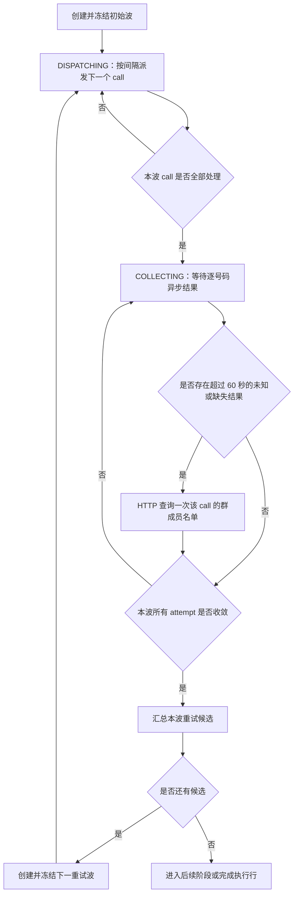

# 普通群链接拉人波次并行派发与粘性拉手设计

## 1. 文档状态

- 设计日期：2026-08-09
- 适用模式：普通群链接模式（`NORMAL_LINK`）的拉人执行阶段
- 设计结论：采用“显式内部波次 + 波内定时派发 + 波后统一重试 + 执行行级粘性拉手”
- 前端口径：波次是后端内部实现，不新增前端配置和操作入口
- 业务代码状态：本文只固化已确认设计，不代表实现完成

本文是 `2026-08-08-normal-link-pull-retry-takeover-design.md` 的增量替代设计。逐号码执行台账、明确失败最多额外重试 3 次、成功不可降级、协议命令不可复用等既有原则继续有效；以下内容取代旧设计中的串行批次推进、每个批次轮换拉手、回执驱动下一批次以及群成员查询失败后自动释放重试等规则。

## 2. 背景与根因

当前拉人执行链路把“上一批次结果已经收口”作为规划下一批次的前置条件：只要存在 `SUBMITTED` 的 `pull_task_pull_call`，规划器就停止；逐号码回调又在整批关闭后才唤醒执行行。因此，任一回调延迟或缺失都会让下一批次长时间不能发送。

当前实现还在每次批量拉人调用后推进 `next_puller_index`。即使拉手仍然在线且可继续执行，下一批也会切换拉手，无法满足“同一拉手持续执行，只有不可用时才接管”的业务要求。

本次调整需要解除两种不必要的耦合：

1. 下一次拉人调用的派发时间不能依赖上一调用的结果回执。
2. 下一次拉人调用的拉手选择不能因为上一调用完成而自动轮换。

## 3. 目标与非目标

### 3.1 目标

1. 一个初始波次内的所有拉人调用按配置间隔依次派发，不等待前一调用的成功、失败或未知回执。
2. 每个号码的回执异步写入逐号码执行台账，并立即更新该号码当前业务结果。
3. 只有当前波次的计划调用全部派发完成，且所有逐号码结果均收敛后，才汇总重试候选并创建下一波。
4. 明确失败执行“首次执行 + 最多 3 次额外重试”，第 4 次明确失败为最终失败。
5. 一个群执行行持续使用同一拉手；仅当拉手离线、封禁、解绑、触达受限、限流、权限不足或出现其他确定无法继续拉人的账号级原因时才切换。
6. 迟到、重复、乱序回调保持幂等；旧拉手回调不得清除已经接管的新拉手。
7. 暂停、恢复、人工结束和服务重启后，波次进度可从数据库可靠恢复。

### 3.2 非目标

- 不在页面展示“波次”，不新增波次参数。
- 不改变普通群链接以外任务的派发模型。
- 不把 Kafka 改成同步结果等待；逐号码结果仍异步回流。
- 不改成“持续扫描所有未发送和失败状态”的无边界循环。
- 不对历史已完成任务批量回填波次。
- 不执行远程发布、真实数据库迁移或历史数据修复。

## 4. 术语

| 术语 | 定义 |
| --- | --- |
| 波次（wave） | 后端内部的一组冻结目标。先派发本波全部调用，再统一等待和汇总本波结果 |
| 拉人调用（call） | 一次真实发送给 WhatsApp 的批量加成员命令，对应 `pull_task_pull_call` |
| 用户口中的“五轮拉人” | 本设计中是一个波次内按间隔派发的五个 `call`，不是五个重试波 |
| 初始波 | 由本执行行尚未执行的原始站台号、料子号生成的第一个波次 |
| 重试波 | 上一波完全收敛后，仅由仍需重试的号码生成的新波次 |
| 执行台账（attempt） | 某个号码在某次 `call` 中的一次不可覆盖执行事实 |
| 粘性拉手 | 执行行当前选中的拉手；跨调用、跨波次继续使用，直到出现切换条件 |
| 拉手分配代次 | 每次重新选择拉手时递增的序号，用于隔离旧拉手迟到回调 |
| 结果收集保护时间 | 已提交调用等待明确逐号码回执的时间，当前默认 60 秒 |

## 5. 核心设计决策

### 5.1 采用显式内部波次

创建波次时冻结本波号码集合和调用拆分结果。回调只能更新号码结果，不能把提前失败的号码重新塞回正在派发的当前波。冻结后不得新增号码或把号码移动到另一调用；如果尚未提交的号码被迟到成功覆盖，允许只取消该号码，不能补入其他号码。

因此调度决策只依赖两个事实：

- `DISPATCHING` 阶段是否还有计划调用未派发；
- `COLLECTING` 阶段是否还有本波执行记录未收敛。

不再使用“全局取所有 `UNCONSUMED/FAILED` 号码”的方式推进，否则早到失败会与尚未发出的初始号码混在一起，形成隐式且不可审计的波次。

### 5.2 派发时钟与结果时钟分离

- 派发时钟只控制本波下一个调用何时可以提交。
- 结果时钟只控制已提交调用何时转入未知核实。
- 回调不得提前、推迟或重置下一调用的派发时间。

### 5.3 重试只在波后生成

明确失败、`UNKNOWN + NOT_STARTED`、名单确认不在群的号码可以在回调到达时立即更新状态，但只能登记为“下一波候选”。当前波没有完全收敛前，不创建该号码的新执行记录。

### 5.4 拉手按执行行保持粘性

当前拉手保存在群执行行，不再在每个 `call` 完成后轮换。`next_puller_index` 只在首次选择和真正切换拉手时推进。

## 6. 总体流程



回调消费与上图并行运行：任何时刻收到结果都写原 `call` 和原 `attempt`，但不直接驱动波内下一调用。

## 7. 波次状态机

### 7.1 状态定义

| 状态 | 含义 | 允许动作 |
| --- | --- | --- |
| `DISPATCHING` | 已冻结本波号码，仍有 `PLANNED` 调用待派发 | 按间隔提交下一调用；处理回调；必要时切换拉手 |
| `COLLECTING` | 本波所有计划调用均已提交、明确未开始或取消 | 处理回调；执行未知结果核实 |
| `SETTLED` | 本波所有执行记录均已收敛 | 汇总并创建下一波，或进入后续阶段 |
| `CANCELED` | 人工结束后取消尚未提交的波次 | 只接收已提交调用的迟到回调 |

波次创建和号码冻结在同一事务完成，创建成功后直接进入 `DISPATCHING`，不暴露中间 `PLANNING` 状态。

### 7.2 `DISPATCHING -> COLLECTING`

满足以下条件时转换：

- 本波没有 `PLANNED` 的调用；
- 每个冻结调用已经进入 `SUBMITTED`、`WRITTEN_BACK`、`UNKNOWN` 或 `CANCELED`；
- 没有正在持有派发租约但尚未完成数据库确认的调用。

该转换只看派发事实，不等待逐号码结果。

### 7.3 `COLLECTING -> SETTLED`

本波所有逐号码执行记录必须进入以下任一收敛状态：

- `CLOSED + SUCCESS`；
- `CLOSED + FAILED`；
- `RELEASED + UNKNOWN/NOT_STARTED`，可进入下一波；
- 名单核实后 `CLOSED + SUCCESS`；
- 名单核实后 `RELEASED + UNKNOWN`，可进入下一波；
- 群成员查询失败后的 `CLOSED + UNKNOWN`，作为最终未知；
- 尚未提交即被人工结束或迟到成功淘汰的 `CANCELED`。

## 8. 数据模型

### 8.1 新增 `pull_task_pull_wave`

一行表示一个群执行行的一次内部波次，建议字段如下：

| 字段 | 说明 |
| --- | --- |
| `id` | 波次主键 |
| `tenant_id` | 租户 ID |
| `task_id` | 拉群任务 ID |
| `group_execution_id` | 群执行行 ID |
| `wave_no` | 执行行内单调递增波次序号 |
| `wave_type` | `INITIAL/RETRY` |
| `wave_status` | `DISPATCHING/COLLECTING/SETTLED/CANCELED` |
| `planned_call_count` | 本波冻结调用数 |
| `next_call_seq` | 下一个待派发的波内调用序号 |
| `next_dispatch_at` | 下一调用最早派发时间 |
| `dispatch_completed_at` | 全部计划调用处理完成时间 |
| `settled_at` | 所有结果收敛时间 |
| `version` | 乐观锁版本 |
| `created_at/updated_at` | 创建与更新时间 |

约束和索引：

- 唯一约束：`tenant_id + group_execution_id + wave_no`。
- 同一执行行最多一个活动波次，通过执行行的 `active_pull_wave_id` 和条件更新保证。
- 调度索引：`tenant_id + wave_status + next_dispatch_at + id`。

`planned_call_count`、`next_call_seq` 是持久化检查点，不依赖进程内计数；服务重启后从数据库继续。

### 8.2 调整 `pull_task_group_execution`

新增：

| 字段 | 说明 |
| --- | --- |
| `active_pull_wave_id` | 当前活动波次；波次结束并创建下一波时原子替换 |
| `active_puller_group_account_id` | 当前粘性拉手角色行 ID |
| `puller_assignment_seq` | 拉手分配代次；每次切换递增 |

保留现有 `next_puller_index` 作为循环选取游标，但不再随每个调用推进。

### 8.3 调整 `pull_task_pull_call`

新增：

| 字段 | 说明 |
| --- | --- |
| `pull_wave_id` | 所属波次；历史调用允许为空 |
| `wave_call_seq` | 波内稳定调用序号 |
| `puller_assignment_seq` | 提交时使用的拉手分配代次 |

新调用增加唯一约束：`tenant_id + pull_wave_id + wave_call_seq`。

波次创建时冻结调用的参与者集合，但拉手绑定延迟到真实提交前。为此，`PLANNED` 调用及其 attempt 的 `puller_group_account_id/puller_account_id` 允许为空；提交事务中再写入当前拉手和分配代次。调用一旦进入 `SUBMITTED`，拉手、参与者集合、命令 ID 和幂等键均不可修改。

### 8.4 调整逐号码执行台账

`pull_task_pull_call_member_attempt` 继续作为逐号码不可覆盖事实，并通过所属 `call` 归属波次。建议增加 `pull_wave_id` 冗余列、`puller_assignment_seq` 拉手分配代次及调度索引，减少波次收敛时的跨表扫描，并让逐号码事实可以独立校验其提交身份。

既有字段语义调整：

- `PLANNED` attempt 可暂时没有拉手；
- `SUBMITTED` 时必须与调用绑定相同的拉手及拉手分配代次；
- `failure_count_before` 继续只记录明确失败次数；
- 早到失败可以释放聚合活动槽，但波次候选查询必须排除当前活动波中的号码；
- 群成员查询失败时 attempt 进入 `CLOSED + UNKNOWN`，聚合状态为 `UNKNOWN`，不再占用活动槽，也不自动重试。

### 8.5 不以聚合状态代替波次成员关系

料子和站台的聚合状态用于页面统计与当前业务结果；下一重试波的候选必须由上一波 attempt 事实生成，不能仅查询全局 `UNCONSUMED/NOT_JOINED/FAILED`。

这条约束保证早到失败只登记为下一波候选，不会混入当前波尚未派发的调用。

## 9. 波次规划

### 9.1 初始波

首次进入拉人执行阶段时，在一个事务中：

1. 锁定群执行行，确认没有活动波次。
2. 选择所有尚未执行且符合现有业务条件的站台号和料子号。
3. 按现有单次拉人数量规则和稳定顺序拆成多个调用。
4. 创建波次、全部 `PLANNED` 调用及全部 `PLANNED` attempt。
5. 把 `active_pull_wave_id` 指向新波次。
6. 设置首个 `next_dispatch_at`。

本波号码和调用拆分完成后冻结。回调、暂停和服务重启都不能重新随机拆分本波。

### 9.2 重试波

上一波进入 `SETTLED` 后，在一个事务中从上一波事实汇总候选：

- 明确失败且累计明确失败次数小于 4；
- `UNKNOWN + NOT_STARTED`；
- 群成员名单查询成功且确认不在群。

排除：

- 已成功号码；
- 累计第 4 次明确失败号码；
- 群成员查询失败后终态未知号码；
- 人工结束后取消号码。

若候选为空，清空 `active_pull_wave_id` 并进入后续任务阶段；否则创建下一 `RETRY` 波并原子替换活动波次。

### 9.3 明确失败次数

固定业务规则：

```text
首次执行失败：failure_count = 1，进入重试波 1
重试波 1 失败：failure_count = 2，进入重试波 2
重试波 2 失败：failure_count = 3，进入重试波 3
重试波 3 失败：failure_count = 4，最终失败
```

未知、缺失回调、`NOT_STARTED` 和名单确认不在群都不增加明确失败次数。它们没有独立次数上限，继续沿用现有“直到成功、明确失败达到上限或人工结束”的业务规则。

## 10. 波内非阻塞派发

### 10.1 派发条件

调度器只需确认：

- 任务和执行行允许发起新动作；
- 波次为 `DISPATCHING`；
- 当前时间达到 `next_dispatch_at`；
- 存在下一个 `PLANNED` 调用；
- 已获得数据库租约。

不查询上一调用是否已回调，不要求上一调用进入 `WRITTEN_BACK`。

### 10.2 派发事务与外部调用

采用现有“短事务认领、事务外协议调用、短事务确认”边界：

1. 条件认领波次和下一个 `PLANNED` 调用。
2. 读取或选择当前粘性拉手并执行派发前实时状态检查。
3. 在提交事实中冻结调用使用的拉手、分配代次、命令 ID 和幂等键。
4. 事务外发送协议命令。
5. 根据“已接受、确定未开始、无法确认是否开始”写入调用和 attempt 状态。
6. 只要本次可能产生了 WhatsApp 副作用，就按提交时间计算下一调用的派发时间。

禁止在数据库事务中等待 HTTP、Kafka 回执或群成员查询。

### 10.3 下一调用时间

下一调用时间基于本次提交时间，而不是结果回执时间：

```text
next_dispatch_at = submitted_at + max(
    configured_pull_interval,
    persisted_random_silence
)
```

随机静默沿用既有 3～5 秒策略，并在计算时持久化。回调到达时不得修改 `next_dispatch_at`。

派发前检查明确发现拉手不可用时，因为尚未产生 WhatsApp 副作用，可以在同一个到期窗口内切换拉手并继续尝试当前调用；不消耗一个波内调用序号，也不额外等待一个完整拉人间隔。

协议命令已经被接受或无法排除已经开始时，本调用视为已经派发；即使随后回调 `NOT_STARTED`，也只能在下一重试波处理其中号码，不能插队重发当前波。

## 11. 回调入账

### 11.1 回调只写原始执行身份

Kafka 逐号码回调使用 `tenant_id + command_id + target_jid/phone` 定位原 `call` 和原 `attempt`：

- 成功立即写聚合成功，之后不可降级；
- 明确失败立即保存原因、增加明确失败次数，并登记下一波候选；
- `UNKNOWN + NOT_STARTED` 立即释放为下一波候选，不增加失败次数；
- `UNKNOWN + UNCERTAIN` 保持待核实；
- 缺失回调在保护时间结束后转成 `UNKNOWN + UNCERTAIN`。

“只写台账”不是只写日志，而是记录本次执行事实并同步更新该号码当前成功、失败或未知状态；它仅表示回调不能直接改变波内派发节奏。

### 11.2 迟到、重复和乱序

优先级保持：

```text
任意一次成功事实 > 当前有效执行结果 > 已释放或已替代的旧执行结果
```

- 重复回调幂等，不重复增加失败次数。
- 旧执行迟到失败或未知只补原台账，不覆盖新执行。
- 旧执行迟到成功可把聚合结果提升为成功。
- 新调用尚未提交时发现旧成功，只取消该号码的 `PLANNED` attempt；同一调用的其他号码和波内顺序保持不变。若调用已无参与者，则取消整个空调用。
- 新调用已经提交时不能撤回；保留两次执行事实，聚合结果仍以成功为准。
- 群成员查询失败形成最终未知后，迟到失败只补台账且不重新开启波次；迟到成功仍可提升为成功。

### 11.3 回调不得推进波内派发游标

回调可以触发：

- attempt 和参与者聚合状态转换；
- 调用收口；
- 未知核实条件更新；
- 拉手不可用标记和有条件接管。

回调不得直接增加 `next_call_seq`，不得基于回调时间重写 `next_dispatch_at`，不得在当前波中创建失败号码的新调用。

## 12. 未知结果与群成员核实

### 12.1 传输方式

逐号码执行结果通过 Kafka 异步回流；群成员名单核实不走 Kafka，而是控端通过统一 `GroupMemberListPort` 发起同步只读请求：

- Web/Baileys：HTTP `GET /v1/groups/{groupJid}/participants?accountId=...`，由协议层 Master 路由到账号所在 Worker；
- Android：通过 Android Native HTTP Client 查询群成员。

每个存在未知结果的 `call` 最多发起一次完整名单查询尝试，本地批量比对该调用全部未知号码，不按号码逐个请求。查询失败也视为本次尝试已经结束，不无限重复 HTTP 请求。

### 12.2 保护时间

沿用当前配置：

```yaml
armada.task.pull-execution-dispatcher:
  result-reconciliation-delay-ms: 60000
  result-reconciliation-interval-ms: 30000
```

- 从 `call.submitted_at` 起保护 60 秒；
- 扫描器每 30 秒运行一次；
- 因此首次名单核实通常发生在提交后 60～90 秒；
- 扫描批量和负载可能让实际时间略晚；
- 已收到明确成功或失败的号码不等待该保护时间。

### 12.3 核实结果

| 情况 | 处理 | 是否进入下一波 | 是否增加失败次数 |
| --- | --- | --- | --- |
| 名单查询成功且号码在群 | 成功收口 | 否 | 否 |
| 名单查询成功且号码不在群 | 释放为待重试 | 是 | 否 |
| 名单查询失败或没有可用查询账号 | 最终 `UNKNOWN` | 否 | 否 |
| 协议明确 `NOT_STARTED` | 无需查名单，释放为待重试 | 是 | 否 |

群成员查询失败不能假设号码不在群，否则可能重复拉人；同时也不能永久阻塞波次，因此本次设计将其收口为最终 `UNKNOWN`。后续迟到成功仍可提升结果。

## 13. 粘性拉手与接管

### 13.1 首次选择

群执行行第一次派发拉人调用时：

1. 按现有稳定角色顺序，从 `next_puller_index` 选择可用拉手。
2. 写入 `active_puller_group_account_id`。
3. 将 `puller_assignment_seq` 增加 1。
4. 推进 `next_puller_index` 到该拉手之后，供真正切换时使用。

后续调用和后续重试波继续使用该拉手，不再次推进游标。

### 13.2 派发前实时识别

每次真实提交前重新确认当前拉手：

- Armada 账号仍存在且仍绑定；
- 账号业务状态允许执行；
- 协议运行态在线；
- 拉手没有处于风险冷却或本群不可用状态。

离线、封号、解绑既可能在派发前实时检查发现，也可能发生在检查和协议执行之间并通过回执暴露，两条路径必须使用同一接管入口。

### 13.3 接管原子性

每个已提交 `call` 保存 `puller_group_account_id + puller_assignment_seq` 快照。账号级失败回调触发接管时，只有满足以下条件才能清除当前拉手：

```text
execution.active_puller_group_account_id == call.puller_group_account_id
AND execution.puller_assignment_seq == call.puller_assignment_seq
```

接管事务：

1. 标记原拉手不可用、冷却或仅对当前群不可用。
2. 使用调用快照条件校验当前拉手和当前代次。
3. 按 `next_puller_index` 选择下一可用拉手。
4. 在一次条件更新中写入新拉手（没有资源时写空），并把分配代次从 `g` 更新为 `g + 1`。
5. 更新拉手选择游标；后续尚未提交调用在提交时绑定新拉手和新代次。

每次当前分配发生变化只递增一次代次。没有可用拉手时先写空并递增；以后补充资源重新分配时再次递增。

代次比较是必需的：即使执行行以后出现 `A -> B -> A`，来自第一次 A 的迟到回调也不能淘汰第二次启用的 A。

### 13.4 没有可用拉手

当前波保持原状态并进入既有“拉手不足”资源等待：

- `DISPATCHING` 波不再派发新调用；
- 已提交调用继续接收回调和未知核实；
- 补充可用拉手后，从当前波的 `next_call_seq` 继续；
- 已成功号码和已提交调用不重新执行。

## 14. 错误分类

### 14.1 触发换拉手

| 语义 | 典型信号 | 处理 |
| --- | --- | --- |
| 账号不存在、解绑或离线 | `ACCOUNT_NOT_FOUND`、`ACCOUNT_NOT_ONLINE` | 标记离线，切换拉手 |
| 凭据失效、封控或需要重新认证 | `NEED_REAUTH` 及等价运行态 | 标记不可用，切换拉手 |
| 主动触达受限 | `ACCOUNT_REACHOUT_RESTRICTED` | 进入风险冷却，切换拉手 |
| 拉人限流 | `RATE_LIMITED` | 按既有冷却时间标记，切换拉手 |
| 当前群没有拉人权限 | `GROUP_PERMISSION_DENIED` | 标记该拉手对当前执行行不可用，切换拉手 |

错误码名称以统一 `ProtocolErrorCode` 为准；Web 与 Android 的原始错误必须先映射为统一语义。

### 14.2 不触发换拉手

| 语义 | 典型信号 | 处理 |
| --- | --- | --- |
| 单号码隐私或号码无效 | 具体参与者的明确失败 | 只处理该号码 |
| 群封禁、群满员、群不存在 | `GROUP_UNAVAILABLE` 或已确认群封禁 | 结束该群执行，不靠换拉手解决 |
| Owner 路由过期 | `NOT_OWNER` | 刷新路由并按基础设施策略重试 |
| 网络、HTTP、Worker 临时故障 | `NETWORK`、`TIMEOUT`、`HTTP_ERROR`、`WORKER_BUSY`、`TEMPORARY_FAILURE` | 按是否可能已开始决定重试或未知核实，不永久淘汰账号 |
| 单账号瞬时繁忙 | `ACCOUNT_BUSY` | 短暂退避；没有账号级不可用证据时保持粘性 |

临时故障如果能够确定命令未开始，可以重试当前未提交调用；如果无法排除已经开始，必须按未知结果处理，禁止立即重投同一批号码。

## 15. 暂停、恢复与人工结束

### 15.1 暂停

- 暂停只禁止新调用派发和新波次创建。
- 已提交调用的 Kafka 回调继续入账。
- 已满足 60 秒条件的未知结果允许继续执行只读名单核实，避免状态丢失。
- 当前波、派发游标和下一派发时间保持持久化。

### 15.2 恢复

- 恢复后继续原活动波，不重建、不重新随机拆分。
- 如果原 `next_dispatch_at` 已过期，恢复时最多立即派发一个调用，之后重新按正常间隔推进。
- 禁止为了追赶暂停期间错过的时间一次性突发派发多个调用。

### 15.3 人工结束

- 立即禁止新调用和新波次。
- 取消尚未提交的 `PLANNED` 调用及 attempt。
- 已提交调用继续接受回调，并在保护时间后完成未知核实。
- 结果收敛只更新台账和统计，不再唤醒业务阶段或创建重试波。

## 16. 并发、幂等与崩溃恢复

### 16.1 多实例调度

- 波次和调用使用短租约或条件更新认领。
- `next_call_seq` 只在提交事实确认后通过版本条件推进。
- 相同波次调用只能被一个实例认领。
- 同一参与者的唯一活动槽约束继续防止跨波重复占用。

### 16.2 命令幂等

- 每个 `call` 使用唯一命令 ID 和幂等键。
- 调用进入“可能已开始”后不能生成新命令重投原调用。
- 服务在 HTTP 返回前崩溃时，根据持久化提交状态和相同幂等键恢复，不能重新分配号码。

### 16.3 回调幂等

- Kafka 重复消息不能重复增加失败次数。
- 回调只允许对预期 attempt 状态做条件转换。
- 调用关闭、波次收敛、下一波创建均使用条件更新；多个最后回调并发到达时只能有一个线程完成波次切换。

### 16.4 查询幂等

- 群成员名单按 `call` 认领，避免多实例重复查询。
- 查询成功后保存核实完成状态。
- 查询失败收口为最终未知，不由后续扫描重复发起无限 HTTP 请求。

## 17. 兼容与迁移

### 17.1 历史完成数据

- 不回填历史已完成 `call` 和 attempt 的波次 ID。
- 新增关联字段对历史行允许为空。
- 查询和统计继续兼容无波次的历史事实。

### 17.2 部署时正在执行的任务

不批量改写已经提交的调用：

- 已存在 `SUBMITTED/UNKNOWN` 调用时，先按旧事实正常收敛，禁止重投。
- 已存在 `PLANNED` 调用时，可将其作为兼容调用安全纳入首个活动波；参与者集合和幂等键保持不变。
- 没有开放调用时，直接从剩余号码创建初始波。
- 首个兼容波收敛后，后续全部使用新波次模型。

迁移逻辑必须是逐执行行、幂等、可重启的，不执行全库历史重算。

## 18. API、页面与统计

- 创建任务接口和现有拉人间隔配置不变。
- 前端不展示波次，不要求用户理解 `INITIAL/RETRY`。
- 任务详情仍按号码聚合状态统计成功、最终失败、未知和执行中。
- 失败重试候选在下一波创建前可以显示为待重试，但不能重复计入总人数。
- 波次与调用序号仅用于日志、诊断和内部详情。
- “最近执行时间”按最近一次真实调用提交更新，不按回调时间伪造新的执行动作。

## 19. 可观测性

至少记录以下结构化字段和指标：

- `tenantId/taskId/groupExecutionId/waveId/waveNo/callId/waveCallSeq`；
- 当前拉手角色行 ID、账号 ID、拉手分配代次；
- 波次计划调用数、已派发调用数、待收敛 attempt 数；
- 波内实际派发间隔；
- 每波成功、明确失败、未开始、未知、最终未知和下一波候选数；
- 拉手切换原因、旧/新拉手和切换代次；
- 因旧代次不匹配而忽略的接管请求数；
- 群成员 HTTP 查询成功、失败、跳过和耗时；
- 提交后超过 60 秒、90 秒、180 秒仍未收敛的调用数；
- 暂停恢复后的首次派发时间和是否抑制突发追赶。

日志必须沿用号码脱敏规则，禁止记录协议凭据、会话内容和完整敏感载荷。

## 20. 测试策略

### 20.1 波内派发

1. 五个调用按配置间隔依次提交，即使第一个调用一直是 `SUBMITTED`，第二至第五个仍按时派发。
2. 第一调用提前成功、失败、未知均不改变后续调用的 `next_dispatch_at`。
3. 本波最后一个调用处理完成后立即进入 `COLLECTING`，不要求结果已经齐全。
4. 暂停期间不派发；恢复时不突发补发多个调用。
5. 服务重启后从持久化 `next_call_seq` 和 `next_dispatch_at` 继续。

### 20.2 波后汇总

1. 早到失败只进入下一波候选，不混入当前波。
2. 当前波还有未收敛 attempt 时不创建下一波。
3. 当前波全部收敛后，只把符合规则的号码放入下一波。
4. 成功号码不进入任何后续波。
5. 首次执行加 3 次明确失败重试，总执行次数最多 4 次。
6. `NOT_STARTED` 和名单确认不在群不增加明确失败次数。

### 20.3 未知结果

1. 提交未满 60 秒不查询名单。
2. 扫描间隔为 30 秒时，首次核实落在 60～90 秒窗口。
3. 一次群成员 HTTP 查询在本地核实同一调用的所有未知号码。
4. 在群号码成功，不在群号码进入下一波。
5. 查询失败或没有查询账号时收口为最终未知且不进入下一波。
6. `UNKNOWN + NOT_STARTED` 不查询名单。
7. 最终未知后的迟到成功可以提升成功，迟到失败不重开波次。

### 20.4 粘性拉手

1. 同一拉手跨五个调用、跨重试波持续使用。
2. 调用完成不会推进拉手游标。
3. 派发前发现离线、封号或解绑，在当前到期窗口切换后继续提交。
4. 回执返回限流、触达受限或权限不足后，后续调用使用下一拉手。
5. 单号码失败不切换拉手。
6. 群不可用结束群执行，不盲目轮换全部拉手。
7. A 切换到 B 后，A 的迟到回执不能清除 B。
8. A 切换到 B 再切回 A 后，第一次 A 的迟到回执不能清除第二次 A。
9. 无可用拉手进入资源等待，补充拉手后从当前波继续。

### 20.5 并发与幂等

1. 多实例并发只能派发同一波次调用一次。
2. 重复 Kafka 回调不重复增加失败次数或重复创建下一波。
3. 多个最后结果并发到达时只创建一个重试波。
4. HTTP 超时导致副作用不确定时不立即重投原号码。
5. 人工结束后不创建新波，但已提交结果仍可入账。
6. 兼容任务的旧开放调用不被重复提交。

### 20.6 验收示例

一个初始波包含五个调用，间隔 10 秒：

```text
T+00s 发送 call-1
T+10s 发送 call-2，不关心 call-1 是否回执
T+20s 发送 call-3
T+30s 发送 call-4
T+40s 发送 call-5，波次进入 COLLECTING
```

假设结果为：

- 20 个号码成功；
- 3 个号码明确失败；
- 2 个号码 `NOT_STARTED`；
- 1 个号码缺失回调，名单核实后确认不在群；
- 1 个号码名单查询失败。

则当前波全部收敛后：

- 20 个成功永久排除；
- 3 个明确失败增加失败次数；
- 2 个 `NOT_STARTED` 和 1 个名单不在群不增加失败次数；
- 上述 6 个号码组成下一重试波；
- 名单查询失败的 1 个号码终态未知，不自动重拉；
- 如果拉手始终可用，下一波继续使用同一拉手；如果期间收到账号级受限结果，下一波及其后续未提交调用使用接管拉手。

## 21. 实现影响范围

### 21.1 Armada 后端

- Flyway 增量脚本：波次表、执行行粘性拉手字段、调用波次字段与索引；
- 波次实体、枚举、Mapper/XML 和 H2 真实映射测试；
- 初始波与重试波规划事务；
- 波内派发调度器与持久化派发时钟；
- 回调服务移除“批次收口后唤醒下一调用”的串行耦合；
- 波次统一收敛服务；
- 拉手实时检查、粘性选择、代次化接管；
- 未知结果名单核实的最终未知语义；
- 暂停、恢复、结束和兼容任务处理；
- 查询统计、日志和自动化测试。

### 21.2 协议层

现有逐号码 Kafka 回调和群成员 HTTP 查询合同原则上可复用。实现阶段需要审计 Web 与 Android 的错误映射，确保账号离线、重新认证、触达受限、限流和群权限不足能稳定映射到统一错误码；仅在缺失映射时补充协议代码和合同测试。

### 21.3 前端

原则上无功能改动。若现有详情页不能展示最终 `UNKNOWN`，只做已有结果枚举的兼容展示，不暴露波次配置。

## 22. 上线与回滚边界

- 数据库只做向前兼容的增量结构变更，不删除既有字段和历史事实。
- 新代码部署前必须先完成兼容迁移测试和旧开放调用恢复测试。
- 建议通过后端配置开关启用新波次调度，便于灰度；关闭开关只阻止新执行行进入波次模型，不能把已经进入波次模型的执行行切回旧串行模型。
- 回滚代码必须仍能容忍新增表和可空字段；已创建波次的执行行不能由不认识波次状态的旧调度器继续派发。
- 真实环境开关、迁移、灰度和回滚操作不属于本文档编写任务，实施前需另行确认目标环境。

## 23. 设计约束总结

1. 波内派发只等时间，不等上一调用结果。
2. 回调立即更新号码事实，但不驱动波内派发，也不把失败号码混回当前波。
3. 本波全部调用派发且全部结果收敛后，才创建下一重试波。
4. 明确失败最多额外重试 3 次；成功不可降级。
5. 未知结果保护 60 秒，群成员名单通过 HTTP 查询而非 Kafka。
6. 名单查询失败收口为最终未知，避免重复拉人和任务卡死。
7. 一个群执行行保持同一拉手，只有确定不能继续拉人时才切换。
8. 拉手 ID 与分配代次共同隔离迟到回调。
9. 暂停不阻断回调，恢复不突发补发，结束不创建新调用或新波。
10. 波次是内部实现，不改变前端创建参数和用户操作方式。
