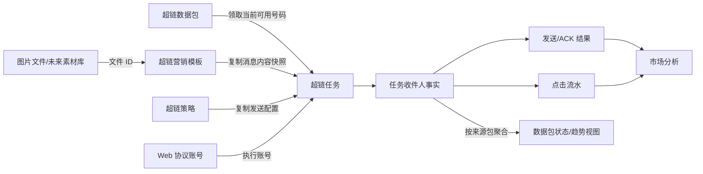
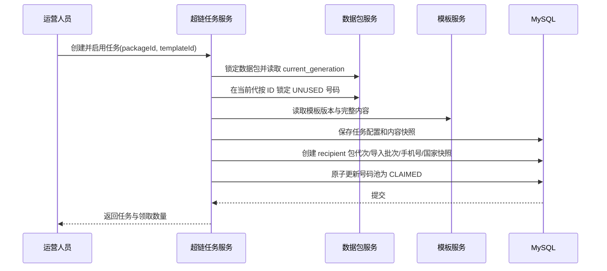

# 超链数据包与超链营销模板一期详细方案

本文定义超链营销第一阶段的可实施范围：先交付“超链数据包”和“超链营销模板”两个菜单，并冻结它们与后续超链任务、图片素材、发送回执、点击追踪和市场分析之间的契约。

> 关键结论：两个菜单可以先开发，但只能视为“创建侧独立、运行与分析侧强关联”的前置资源。对外行为按竞品复刻，内部不能复制竞品把可变资源和任务结果混在一起的缺陷。

> **修订记录（2026-08-27 第三版）**：综合评审后，进一步修正覆盖导入、统计写热点和跨文档消息契约。
>
> 1. 覆盖导入由“同事务硬删旧号码”改为**代际切换**：先写新代，再原子切换，旧代后台清理（§4.3、§6.1～6.2）。
> 2. 发送/送达/失败计数从 `data_package` 主表移到 `data_package_stat` 读模型，避免 ACK 并发争抢主表（§6.3、§7.1）。
> 3. 任务不再强引用会被清理的 `data_package_phone.id`，改存数据包、代次、导入批次、手机号和国家快照（§6.6）。
> 4. 模板与任务统一使用同一套 `HyperlinkMessageContent` 字段长度和按钮 JSON（§5.2、§6.5、§6.6）。
> 5. 单包总量限制改为可配置安全阈值，默认 500000，不再作为覆盖事务正确性的前提（§2.3、§4.2）。
> 6. 前后端字段级接口以
> `2026-08-27-hyperlink-data-template-phase1-api-contract.md` v1 为准；本文保留业务和实施解释。
>
> `docs/business/hyperlink-marketing-data-model.md` 已同步为全模块唯一 Schema 事实源；本文负责一期范围、API、流程和实施拆分，不再保留另一套冲突字段。

## 1. 实施前必须遵守的结论

1. 新业务落在独立的 `com.armada.hyperlink` 域，不扩展现有群组营销 `marketing_template`。
2. 数据包是可重复选择的容器；包内号码是可消费资源。未来任务只领取当前代次的可用号码，并创建独立的收件人快照。
3. `data_package_phone` 保存某一代号码成员和当前池状态；完整发送历史属于未来的 `hyperlink_task_recipient`，任务不依赖可被清理的号码行主键。
4. 模板保存完整消息内容，包括推广链接和按钮目标参数。竞品页面“模板不保存跳转链接”的提示与实际保存逻辑冲突，本方案以实际 payload 为准。
5. 任务选择模板后必须复制内容快照，执行时不能动态读取仍可编辑的模板。
6. 模板图片保存稳定素材 ID，不保存裸 URL；本期该 ID 指向 `marketing_template_file`，不执行表改名。
7. 双图文类型保留枚举值，但一期不开放创建和编辑。竞品当前新建入口也只开放单图文、普通按钮、卡片按钮。
8. 本期不做号码预探测、不伪造发送/送达/点击数据，也不提前创建没有写入方的任务和分析表。
9. Flyway 版本在实施前按目标分支实时最高版本重新分配。`origin/1.0.3-snapshot` 已存在 V140，旧文档中的 V140～V145 编排不可直接使用。

## 2. 目标与非目标

### 2.1 一期目标

- 新增“超链营销”一级目录下的“超链数据包”和“超链营销模板”菜单。
- 支持数据包创建、查询、改名、备注、软删除、TXT 追加导入、TXT 覆盖导入和号码明细分页。
- 支持模板创建、查询、查看、编辑、复制、软删除、消息预览和图片上传/选择。
- 建立稳定的租户隔离、权限、审计、错误响应和测试基线。
- 冻结未来任务读取数据包、引用模板和生成快照的业务语义。

### 2.2 一期不做

- 超链任务、超链策略、账号筛选、Web/Android 协议发送。
- 发送成功、单钩、双钩、已读、封号、失败原因的真实回写。
- `fail_404` 预探测、失败号码重置。
- 短码、域名、点击流水、访问趋势、点击记录导出和市场分析。
- 完整图片素材管理页、素材标签和素材删除。
- `marketing_template_file` 到 `resource_asset` 的表改名。
- 持久化 `task_ref_count` 等暂无可靠写入方的冗余计数。

### 2.3 有意保留的竞品差异

| 项目 | 竞品行为 | Armada 一期决定 | 原因 |
|---|---|---|---|
| 单次 TXT 行数 | 最多 100000 | 最多 5000 | 沿用当前已确认设计；先保证同步事务稳定 |
| 单个数据包总号码数 | 未发现固定上限 | 默认 500000，可配置 | 平台安全阈值，不写死为数据库产品规则；采用代际切换后不影响覆盖原子性 |
| 国家风险阻断 | 阻断 MY/SG/HK/CN/MO/TW | 不阻断 | Armada 当前没有该产品要求 |
| 双图文模板 | 枚举存在但入口隐藏且编辑会降级成单图文 | 枚举保留、接口明确拒绝 | 不复制静默数据损坏 |
| 图片保存 | 前端主要保存 URL/路径 | 保存文件 ID | 保证租户校验和后续素材迁移 |
| 模板引用数 | 页面展示 `task_ref_count` | 一期返回 0，不落列 | 任务尚不存在；避免计数漂移 |

## 3. 业务边界



依赖规则：

- 数据包不保存模板、策略、账号或素材 ID。
- 模板不保存数据包、策略、账号、并发、调度或实际短码。
- 模板和数据包只在未来的任务聚合中汇合。
- 市场分析读取任务收件人、发送回执和点击事实，不直接依赖可覆盖、可删除的当前数据包号码行。
- 业务域之间只调用 Service，禁止 `hyperlink` 直接调用 `marketing` Mapper。

## 4. 数据包业务语义

### 4.1 容器与号码消费规则

- 数据包可以被多个任务先后选择。
- 一个任务启动时只领取该包中 `UNUSED` 的当前有效号码。
- 领取必须原子完成：同一号码不能被两个并发启动的任务同时领取。
- 号码发送成功、送达或确认未注册后保持已消费状态。
- 可重试失败未来允许重置回 `UNUSED`；未注册状态不允许重置。
- 任务创建的收件人必须保存手机号、国家、来源包、包代次和导入批次快照；不长期依赖号码行主键。
- 历史任务结果以任务收件人为事实源；数据包号码上的状态只是当前资源池投影。

一期没有任务，因此导入的号码全部处于 `UNUSED`。该状态不是假数据，而是资源池的真实初始状态。

### 4.2 追加导入

1. 读取并完整校验 TXT，任何数据库变更前先得到解析结果。
2. 文件内重复号码只保留一条，其余计入 `duplicatedRows`。
3. 与 `current_generation` 中已有号码重复的记录跳过，不改变原号码的池状态。
4. 校验「当前代号码数 + 本次新增号码数」不超过配置项 `maxPhonesPerPackage`；超限整体拒绝并提示当前余量。
5. 新号码以 `UNUSED` 状态插入。
6. 同事务更新包的 `phone_count`、`data_package_stat.unused_count` 和导入批次结果。

**包总量安全阈值**：单次导入上限 5000 只约束一次操作，追加可以重复发生。后端配置
`armada.hyperlink.data-package.max-phones` 默认 500000，用于防止误操作造成单包无限膨胀。
它不是数据库约束，也不是覆盖正确性的前提；调整阈值不需要 Flyway。

### 4.3 覆盖导入

1. 先完整解析新文件，解析失败时原数据包保持不变。
2. 锁定 `data_package` 主行，串行化同一数据包的导入、删除和改名操作。
3. 如果未来存在运行中任务正在领取或使用该数据包，返回冲突，不允许覆盖。
4. 计算 `nextGeneration = currentGeneration + 1`，把本次号码插入新代次；旧代次此时仍可正常读取。
5. 新号码全部从 `UNUSED` 开始，写入完成后原子更新 `current_generation`、`phone_count` 和 `data_package_stat`。
6. 事务提交后新请求只能看到新代次；旧任务继续使用自己的收件人快照。
7. 旧代次由后台清理任务在保留期后分批硬删，不进入覆盖事务。

**为什么采用代际切换**：

- 覆盖的关键事务只插入本次文件的最多 5000 条号码并切换一个整数，不删除最多数十万旧行。
- 插入或校验失败时不切换 `current_generation`，原数据包天然保持可用，不需要反向补偿。
- 数据包查询统一带 `generation = current_generation`，不存在“删到一半看到空包”的窗口。
- 旧代次有明确的后台清理方，不会像永久软删行一样无界增长。
- 历史任务保存代次、导入批次、手机号和国家快照，不依赖旧号码行是否仍存在。

旧代次保留 30 天。代次 `g` 的退役时间取成功切到 `g+1` 的覆盖导入批次 `finished_at`；
清理任务只删除退役满 30 天的代次，每批最多 2000 行并单独提交，避免长事务和复制延迟。

### 4.4 删除规则

- 一期删除数据包采用**软删除，只标记 `data_package.deleted_at`，不动号码行**。
- 未来存在运行中任务引用时返回 409；已完成任务不会阻止删除，因为任务保存快照。
- 删除后不能再被新任务选择，历史任务仍展示 `dataPackageNameSnapshot`。
- 不提供物理删除接口。
- 号码行由同一个后台清理任务在包软删满 30 天后按代次、分批硬删。
- 所有号码明细、国家筛选和统计查询必须先确认父包未删除，禁止只凭 `packageId + tenantId` 直接读取孤儿号码。

## 5. 模板业务语义

### 5.1 消息类型

| code | 枚举 | 一期 UI | 一期 API | 说明 |
|---:|---|---|---|---|
| 1 | `SINGLE_LINK_PREVIEW` | 开放 | 接受 | 单图文/链接预览消息 |
| 2 | `DOUBLE_IMAGE_TEXT` | 隐藏 | 拒绝 | 保留兼容位，不允许静默转成 1 |
| 3 | `NORMAL_BUTTON` | 开放 | 接受 | 普通按钮消息 |
| 4 | `CARD_BUTTON` | 开放 | 接受 | 卡片按钮消息 |

### 5.2 统一消息内容契约

模板和未来任务必须使用同一套内容结构和同一套后端校验器：

```json
{
  "schemaVersion": 1,
  "messageType": 3,
  "title": "新品福利",
  "content": "点击按钮查看详情",
  "linkDescription": null,
  "promotionLink": null,
  "buttons": [
    {
      "type": "CTA_URL",
      "displayText": "立即查看",
      "targetValue": "https://example.com/promo",
      "useShortLink": true,
      "sort": 1
    }
  ],
  "cardText": null,
  "linkPreviewAssetId": null,
  "bodyMainAssetId": 123
}
```

一期按钮 UI 只允许一个 `CTA_URL`。JSON 使用数组并保留 `type`、`sort`，为以后增加 `CTA_CALL`、`CTA_COPY` 和多按钮留下兼容空间；未开放类型由后端明确拒绝。

`useShortLink` 只表示模板默认意图。真正的短码必须在任务和收件人确定后生成，模板中永远保存原始 URL。

### 5.3 字段校验矩阵

| 字段 | 单图文 | 普通按钮 | 卡片按钮 | 约束 |
|---|---|---|---|---|
| `templateName` | 必填 | 必填 | 必填 | 去空格后 1～128，同租户未删记录唯一 |
| `title` | 必填 | 必填 | 必填 | 最长 512 |
| `content` | 必填 | 可空 | 可空 | 单图文最长 2000；按钮类最长 200 |
| `linkDescription` | 必填 | 清空 | 清空 | 最长 512 |
| `promotionLink` | 必填 | 清空 | 清空 | 最长 2048，合法 `http/https` URL |
| `linkPreviewAssetId` | 必填 | 清空 | 清空 | JPG/JPEG，最大 500KB，同租户 |
| `bodyMainAssetId` | 清空 | 可空 | 可空 | JPG/JPEG，最大 500KB，同租户 |
| `buttons` | 清空 | 恰好 1 个 | 恰好 1 个 | 一期只允许 `CTA_URL` |
| `cardText` | 清空 | 清空 | 必填 | 最长 500 |

服务端保存前必须按消息类型清空不生效字段，避免用户先切换类型后遗留脏数据。

### 5.4 模板复制、更新和删除

- 复制由服务端完成，只复制业务内容和图片引用，不复制 ID、创建人、时间和未来任务引用。
- 副本命名依次尝试“原名称 副本”“原名称 副本 2”等，直到租户内唯一。
- 更新请求携带 `version`，使用乐观锁防止两个运营人员互相覆盖。
- 每次成功更新令 `version + 1`。数据库列、DTO 字段、文中表述统一用 `version`，
  不出现 `templateVersion` 等别名。
- 未来任务保存 `sourceTemplateId + sourceTemplateVersion + 完整内容快照`，
  其中 `sourceTemplateVersion` 取自模板的 `version`。
- 精准复刻竞品时，存在任务引用的模板不允许删除；引用数通过任务表实时查询，不在模板表维护易漂移计数。
- 一期任务尚未落地，模板删除只做软删除。

## 6. 一期数据模型

### 6.1 `data_package`

一行表示一个号码包。

| 字段 | 类型 | 说明 |
|---|---|---|
| `id` | `BIGINT` | 主键 |
| `tenant_id` | `BIGINT NOT NULL` | 租户 ID |
| `package_name` | `VARCHAR(128) NOT NULL` | 数据包名称 |
| `remark` | `VARCHAR(255)` | 备注 |
| `current_generation` | `INT NOT NULL DEFAULT 1` | 当前可见号码代次；覆盖成功后原子递增 |
| `phone_count` | `INT NOT NULL DEFAULT 0` | 当前代次号码总数 |
| `version` | `INT NOT NULL DEFAULT 1` | 名称/备注的乐观锁版本；统计更新不修改它 |
| `created_by` | `BIGINT` | 创建人 |
| `created_at` | `BIGINT NOT NULL` | epoch 毫秒 |
| `updated_at` | `BIGINT NOT NULL` | epoch 毫秒 |
| `deleted_by` | `BIGINT` | 删除人 |
| `deleted_at` | `BIGINT` | 软删时间 |
| `is_active` | 生成列 | 未删为 1，已删为 NULL |

索引：

- `UNIQUE(tenant_id, package_name, is_active)`：同租户有效名称唯一。
- `INDEX(tenant_id, deleted_at, id)`：列表分页。
- `INDEX(tenant_id, created_at, id)`：创建时间筛选。

`data_package` 是低频写的主数据，不承载发送、ACK 和失败回流计数。列表指标由 §6.3
`data_package_stat` 一对一提供，避免同一数据包的高并发发送都争抢主表。

国家不落在包主表。列表当前页需要的国家集合，以当前代次为条件批量查询
`data_package_phone` 的 DISTINCT `country_iso2`；国家筛选候选直接读取 `country` 主数据，
不在 `/countries` 接口现场统计全租户手机号数量。

### 6.2 `data_package_phone`

一行表示某数据包的一条号码成员及其当前池投影。

| 字段 | 类型 | 说明 |
|---|---|---|
| `id` | `BIGINT` | 主键 |
| `tenant_id` | `BIGINT NOT NULL` | 租户 ID |
| `data_package_id` | `BIGINT NOT NULL` | 数据包 ID |
| `generation` | `INT NOT NULL` | 所属号码代次；查询当前号码必须等于主表 `current_generation` |
| `source_import_id` | `BIGINT NOT NULL` | 产生当前成员的导入批次 |
| `phone` | `VARCHAR(32) NOT NULL` | 仅数字的完整国际号码 |
| `country_iso2` | `CHAR(2)` | 导入时解析并快照，未知为 NULL |
| `pool_status` | `TINYINT NOT NULL DEFAULT 1` | 1未使用 2已领取 3发送成功 4已送达 5可重试失败 6未注册 |
| `created_at` | `BIGINT NOT NULL` | epoch 毫秒 |
| `updated_at` | `BIGINT NOT NULL` | epoch 毫秒 |

本表无软删列。覆盖通过主表切换 `current_generation` 让旧代立即不可见，后台清理任务再按代次硬删；
删包也由清理任务硬删全部代次。号码表不需要第二套软删状态。

索引：

- `UNIQUE(tenant_id, data_package_id, generation, phone)`：同一代次包内去重；新代可重新导入同号。
- `INDEX(tenant_id, data_package_id, generation, pool_status, id)`：未来任务领取和号码明细筛选。
- `INDEX(tenant_id, data_package_id, generation, country_iso2, id)`：当前代国家集合与筛选。
- `INDEX(tenant_id, source_import_id, id)`：导入结果追溯。

`pool_status` 不是发送历史。未来每次投递的完整状态、失败码、协议消息 ID、ACK 和点击都保存在任务收件人/投递尝试表；这里只维护当前号码是否还能被领取的投影。

### 6.3 `data_package_stat`

一行表示一个数据包的列表读模型，主键与数据包 ID 相同。

| 字段 | 类型 | 说明 |
|---|---|---|
| `data_package_id` | `BIGINT` | 主键 |
| `tenant_id` | `BIGINT NOT NULL` | 租户 ID |
| `generation` | `INT NOT NULL` | 本行统计对应的数据包代次 |
| `unused_count` | `INT NOT NULL DEFAULT 0` | 未使用号码数 |
| `claimed_count` | `INT NOT NULL DEFAULT 0` | 已领取号码数 |
| `sent_count` | `INT NOT NULL DEFAULT 0` | 当前停留在单钩的号码数 |
| `delivered_count` | `INT NOT NULL DEFAULT 0` | 当前已送达号码数 |
| `retryable_failed_count` | `INT NOT NULL DEFAULT 0` | 当前可重试失败号码数 |
| `unregistered_count` | `INT NOT NULL DEFAULT 0` | 当前确认未注册号码数 |
| `updated_at` | `BIGINT NOT NULL` | 最近投影更新时间 |
| `reconciled_at` | `BIGINT` | 最近一次全量校准时间 |

约束与维护规则：

- `UNIQUE(tenant_id, data_package_id)`，列表按数据包 ID 一对一 LEFT JOIN，不扫描号码表。
- 一期导入与覆盖在同一事务内维护统计；覆盖切代时重置为 `unused_count=n`、其余为 0。
- 未来领取、发送、ACK 和失败通过可靠事件按批次、幂等更新本表，不要求每个协议事件都锁主表。
- `data_package.phone_count` 必须等于六个状态计数之和；内部 reconciliation 服务可按当前代号码重算。
- reconciliation 是运维能力，不暴露普通租户 HTTP 接口，也不增加菜单权限。
- `click_uv_count` 的事实源尚未上线，本期不落列；点击功能上线时再扩展读模型。

### 6.4 `data_package_import`

一行表示一次 TXT 导入审计。

| 字段 | 类型 | 说明 |
|---|---|---|
| `id` | `BIGINT` | 主键 |
| `tenant_id` | `BIGINT NOT NULL` | 租户 ID |
| `data_package_id` | `BIGINT NOT NULL` | 数据包 ID |
| `generation` | `INT` | 本次导入写入的代次；审计刚创建时为空，锁定包后写入目标代次 |
| `import_mode` | `TINYINT NOT NULL` | 1追加 2覆盖 |
| `status` | `TINYINT NOT NULL` | 1处理中 2成功 3失败 |
| `source_file_name` | `VARCHAR(255) NOT NULL` | 原始文件名，不保存原 TXT |
| `total_rows` | `INT NOT NULL DEFAULT 0` | 读取行数 |
| `accepted_rows` | `INT NOT NULL DEFAULT 0` | 实际生效号码数 |
| `invalid_rows` | `INT NOT NULL DEFAULT 0` | 非法号码行数 |
| `duplicated_rows` | `INT NOT NULL DEFAULT 0` | 文件内或包内重复行数 |
| `failure_reason` | `VARCHAR(512)` | 失败摘要，不记录号码明文 |
| `created_by` | `BIGINT` | 操作人 |
| `created_at` | `BIGINT NOT NULL` | 开始时间 |
| `finished_at` | `BIGINT` | 完成时间 |

索引：

- `INDEX(tenant_id, data_package_id, created_at, id)`：包内导入历史。
- `INDEX(tenant_id, data_package_id, generation, status, finished_at)`：按下一代成功时间判断旧代清理资格。
- `INDEX(tenant_id, status, created_at, id)`：失败审计。

导入批次先以独立短事务创建为“处理中”，此时 `generation` 为空。业务事务锁定包主行后确定并写入
目标代次，成功时标记成功；业务事务回滚后，
由独立失败记录器标记失败并保存脱敏原因。定时恢复任务把超时停留在“处理中”的批次标记失败，
避免进程崩溃留下永久处理中记录。

### 6.5 `hyperlink_template`

一行表示一个可复用的超链消息内容模板。

| 字段 | 类型 | 说明 |
|---|---|---|
| `id` | `BIGINT` | 主键 |
| `tenant_id` | `BIGINT NOT NULL` | 租户 ID |
| `template_name` | `VARCHAR(128) NOT NULL` | 模板名称 |
| `message_type` | `TINYINT NOT NULL` | 1单图文 2双图文 3普通按钮 4卡片按钮 |
| `message_schema_version` | `INT NOT NULL DEFAULT 1` | 消息 JSON 契约版本 |
| `title` | `VARCHAR(512) NOT NULL` | 标题：单图文=消息标题；按钮类=按钮气泡上方加粗大字 |
| `content` | `TEXT` | 按 `message_type` 取义：1=链接卡片下方正文(≤2000)；3/4=按钮气泡正文(≤200)；2 保留位 |
| `link_description` | `VARCHAR(512)` | 链接描述（标题下灰色小字）。仅 `message_type=1` 有值，其余类型存 NULL |
| `promotion_link` | `VARCHAR(2048)` | 原始推广链接。仅 `message_type=1` 有值；按钮类的跳转地址在 `buttons[].targetValue` |
| `buttons` | `JSON` | 版本化按钮数组。仅 `message_type` 为 3/4 有值 |
| `card_text` | `VARCHAR(500)` | 卡片底部小字。仅 `message_type=4` 有值 |
| `link_preview_asset_id` | `BIGINT` | 链接预览图素材 ID。仅 `message_type=1` 有值 |
| `body_main_asset_id` | `BIGINT` | 正文主图 / 卡片 header 图素材 ID。`message_type` 为 3/4 时可有值 |
| `remark` | `VARCHAR(255)` | 备注 |
| `version` | `INT NOT NULL DEFAULT 1` | 乐观锁和来源版本 |
| `created_by` | `BIGINT` | 创建人 |
| `created_at` | `BIGINT NOT NULL` | epoch 毫秒 |
| `updated_at` | `BIGINT NOT NULL` | epoch 毫秒 |
| `deleted_at` | `BIGINT` | 软删时间 |
| `is_active` | 生成列 | 未删为 1，已删为 NULL |

索引：

- `UNIQUE(tenant_id, template_name, is_active)`：同租户有效名称唯一。
- `INDEX(tenant_id, message_type, deleted_at, id)`：列表筛选。
- `INDEX(tenant_id, created_at, id)`：创建时间筛选。

一期不在数据库声明跨业务域外键，但 Service 必须按当前租户校验两个素材 ID。原因是现有表由 `marketing` 域管理，跨域引用通过 Service 约束，避免绕过租户边界。

**列名为什么是 `*_asset_id` 而不是 `*_file_id`（评审修正）**

一期这两列存的确实是 `marketing_template_file.id`，但 §13.3 已经明确未来要迁到通用
`resource_asset`。若现在按当前实现命名 `*_file_id`，迁移完成后列名就名不副实，要么长期误导，
要么再补一次 Flyway 改列名。

因此**现在就按目标语义命名**：列名 `*_asset_id`，值在一期指向 `marketing_template_file.id`，
迁移时只换指向、不换列名。这与 §8.4「DTO 对外使用 AssetId 语义」保持一致——
DTO、DB 列、未来目标表三者用同一套词汇，不制造第二套命名。

`message_type` 与各内容列的对应关系已在上表逐列写明，校验矩阵见 §5.3，
两处必须一致；服务端保存前按 `message_type` 归一化清空不生效列。

### 6.6 暂不落地但已经冻结的任务快照

未来 `hyperlink_task` / `hyperlink_task_content` 至少保存：

```text
data_package_id
data_package_generation
data_package_name_snapshot
source_template_id
source_template_version
message_schema_version
message_type
title(512)
content(TEXT)
link_description(512)
promotion_link(2048)
buttons(JSON，使用 §5.2 结构)
card_text(500)
link_preview_asset_id
body_main_asset_id
```

未来 `hyperlink_task_recipient` 至少保存：

```text
hyperlink_task_id
data_package_id
data_package_generation
source_import_id
recipient_phone_snapshot
recipient_country_iso2_snapshot
send_status / fail_code / fail_reason
sent_at / delivered_at / read_at
```

`hyperlink_task_recipient` 不保存 `data_package_phone_id`：号码代次会按保留期清理，持久强引用必然悬空。
数据包、代次、导入批次、手机号和国家快照已经足够完成历史展示、审计和分析。

一次收件人可能因双图文或重试对应多次协议发送，任务阶段必须增加 `hyperlink_delivery_attempt`；
`protocol_message_id`、物理消息分片和每次重试结果属于 attempt，不得把多个 ID 塞进 recipient 字符串字段。

`hyperlink_delivery_attempt` 至少保存：

```text
hyperlink_task_id / recipient_id
attempt_no / message_part_no
account_id / sender_phone_snapshot / sender_country_iso2_snapshot
protocol_id / protocol_message_id
status / fail_code / fail_reason
sent_at / delivered_at / read_at / failed_at
```

唯一键冻结为 `(tenant_id, recipient_id, attempt_no, message_part_no)`；ACK 按
唯一的 `(tenant_id, account_id, protocol_id, protocol_message_id)` 回关联，防止不同账号或协议消息 ID 空间碰撞。

## 7. 数据包 API

统一返回 `ApiResponse<T>`，分页统一使用 `PageResult<T>`；请求和响应字段使用 camelCase。

### 7.1 列表

```http
GET /api/data-packages?page=1&pageSize=20&name=philippines&createdFrom=1787846400000&createdTo=1787932799999&countryIso2s=PH,ID
```

一期查询参数：`page`、`pageSize`、`name`、`createdFrom`、`createdTo`、`countryIso2s`。未来 UV 区间筛选随点击功能增加，不提前增加无数据来源的参数。

```json
{
  "code": 0,
  "message": "ok",
  "data": {
    "list": [
      {
        "id": 101,
        "name": "菲律宾新客",
        "remark": "8 月活动",
        "countries": ["PH"],
        "metrics": {
          "totalCount": 4800,
          "unusedCount": 4800,
          "usedCount": 0,
          "sentCount": 0,
          "deliveredCount": 0,
          "failedCount": 0,
          "unregisteredCount": 0,
          "clickUvCount": 0
        },
        "version": 1,
        "createdAt": 1787881200000,
        "updatedAt": 1787881200000
      }
    ],
    "page": 1,
    "pageSize": 20,
    "total": 1,
    "totalPages": 1
  }
}
```

**指标来源**：`totalCount` 读取 `data_package.phone_count`，其余池状态指标读取
`data_package_stat`（§6.3）。列表页按主键一对一 JOIN，不对 `data_package_phone` 做聚合。
任务和点击尚未上线时，非导入指标为真实的 0，不从前端制造随机或 mock 数据。

`clickUvCount` 一期恒为 0 且**不落列**——它的事实源是未来的 `hyperlink_task_recipient`，
按 `dataPackageId` 汇总（§13.5）。点击功能上线时再决定是否为它增加一个计数列，
现在落列就是没有写入方的死列。

统计口径（由计数列直接给出或简单相加）：

| 指标 | 口径 |
|---|---|
| `totalCount` | `phone_count` |
| `unusedCount` | `data_package_stat.unused_count` |
| `usedCount` | `phone_count - data_package_stat.unused_count` |
| `sentCount` | `data_package_stat.sent_count` |
| `deliveredCount` | `data_package_stat.delivered_count` |
| `failedCount` | `data_package_stat.retryable_failed_count + data_package_stat.unregistered_count` |
| `unregisteredCount` | `data_package_stat.unregistered_count` |

> **`failedCount` 与 `unregisteredCount` 有意重叠**：未注册号码同时计入两者。这是对齐竞品
> 「失败总数 / 未开通 WS」合并列的展示口径，**不是缺陷**。后续维护者不要把它当 bug 改掉。
>
> `pool_status` 是互斥单值，号码从发送成功更新为已送达后只计入 `delivered_count`，
> 不再计入 `sent_count`。因此 `sentCount` 是"停留在单钩"的数量，不是"曾经达到单钩"的累计量；
> 累计口径要等 `hyperlink_task_recipient` 上线后从任务事实取。

### 7.2 创建和更新

```http
POST /api/data-packages
Content-Type: application/json

{
  "name": "菲律宾新客",
  "remark": "8 月活动"
}
```

```http
PUT /api/data-packages/101
Content-Type: application/json

{
  "name": "菲律宾新客第二批",
  "remark": "已复核",
  "version": 1
}
```

一期不实现竞品单独改名端点；统一使用 `PUT /api/data-packages/{id}` 完整更新名称、备注和版本，
避免前后端并行时出现两套可选合同。

### 7.3 导入

```http
POST /api/data-packages/101/import
Content-Type: multipart/form-data

mode=APPEND
file=@phones.txt
```

成功响应：

```json
{
  "code": 0,
  "message": "ok",
  "data": {
    "importId": 9001,
    "mode": "APPEND",
    "totalRows": 1200,
    "acceptedRows": 1160,
    "invalidRows": 10,
    "duplicatedRows": 30,
    "generation": 1,
    "phoneCountAfterImport": 5960
  }
}
```

解析规则：

- UTF-8 文本，可接受首行 BOM。
- 每行一个号码，去除行首尾空白。
- 号码必须是 6～20 位纯数字；不自动猜测或补国家码。
- 空行忽略，不计入 `totalRows`。
- 单次最多 5000 个非空行；超限整体拒绝。
- 文件内先去重，再判断追加模式下的包内重复。
- 非法行不写库，但在结果中计数；只要文件本身可解析，合法行仍可导入。
- 空文件或覆盖模式清洗后没有任何合法唯一号码时整体拒绝，不切换代次；追加模式全部重复可正常返回 `acceptedRows=0`。
- 国家按 `country_phone_prefix_mapping` 的最长前缀匹配，无法识别时 `countryIso2=null`，不阻止导入。
- 覆盖模式先完成解析，再开启新代次写入和指针切换事务；不会在关键事务内删除旧代号码。

### 7.4 号码明细

```http
GET /api/data-packages/101/phones?page=1&pageSize=50&phone=639&poolStatus=UNUSED&countryIso2=PH
```

返回 `id`、`generation`、`phone`、`countryIso2`、`poolStatus`、`sourceImportId`、`createdAt`。
接口只查询父包的 `current_generation`；一期允许完整展示手机号，导出能力上线时再增加独立权限、OTP 和审计。

### 7.5 删除和辅助接口

```text
DELETE /api/data-packages/{id}
GET    /api/data-packages/countries
GET    /api/data-packages?forTask=true
```

`GET /api/data-packages/countries` 返回 `country` 主数据中的筛选候选，不扫描
`data_package_phone` 做全租户计数：

```json
{
  "code": 0,
  "message": "ok",
  "data": [
    { "value": "PH", "countryIso2": "PH", "nameZh": "菲律宾" },
    { "value": "ID", "countryIso2": "ID", "nameZh": "印度尼西亚" },
    { "value": "UNKNOWN", "countryIso2": null, "nameZh": "未识别" }
  ]
}
```

`value=UNKNOWN, countryIso2=null` 是固定的「未识别」选项。多国家查询参数使用逗号分隔字符串，
例如 `countryIso2s=PH,ID,UNKNOWN`。列表按国家筛选使用当前代号码上的 EXISTS 条件；
列表返回的 `countries` 只对当前页包 ID 批量查询 DISTINCT，不做全租户号码计数。

`forTask=true` 是冻结给未来任务选择器的查询语义：只返回未删除、至少有一条 `UNUSED` 号码的数据包，且返回 `unusedCount`。一期可以实现并测试，任务页面无需同时上线。

### 7.6 一期不开放的兼容端点

以下竞品接口保留在接口路线图，不创建空实现：

```text
POST /api/data-packages/{id}/reset-failed
GET  /api/data-packages/{id}/visit-trend
GET  /api/data-packages/{id}/visit-trend/export
GET  /api/data-packages/{id}/export
POST /api/data-packages/export
POST /api/data-packages/clicks/export
```

## 8. 模板 API

### 8.1 列表和详情

```text
GET /api/hyperlink-templates?page=1&pageSize=20&name=福利&messageType=3
GET /api/hyperlink-templates/{id}
GET /api/hyperlink-templates/options?messageType=3&keyword=福利&limit=50
```

`options` 为未来任务选择器提供轻量数据，避免复制竞品一次加载 10000 条模板的实现。

列表返回：`id`、`name`、`messageType`、标题摘要、两个图片预览地址、`taskRefCount`、`version`、创建/更新时间。`taskRefCount` 一期由 Service 明确返回 0，不落数据库列；任务上线后改为按 `source_template_id` 做引用查询。

### 8.2 创建和更新

```http
POST /api/hyperlink-templates
Content-Type: application/json

{
  "name": "菲律宾新客普通按钮",
  "messageType": 3,
  "schemaVersion": 1,
  "title": "新人福利",
  "content": "活动数量有限",
  "linkDescription": null,
  "promotionLink": null,
  "buttons": [
    {
      "type": "CTA_URL",
      "displayText": "立即查看",
      "targetValue": "https://example.com/promo",
      "useShortLink": true,
      "sort": 1
    }
  ],
  "cardText": null,
  "linkPreviewAssetId": null,
  "bodyMainAssetId": 123,
  "remark": "默认模板"
}
```

```http
PUT /api/hyperlink-templates/{id}
Content-Type: application/json

{
  "version": 3,
  "name": "菲律宾新客普通按钮",
  "messageType": 3,
  "schemaVersion": 1,
  "title": "新人福利",
  "content": "活动数量有限",
  "linkDescription": null,
  "promotionLink": null,
  "buttons": [
    {
      "type": "CTA_URL",
      "displayText": "立即查看",
      "targetValue": "https://example.com/promo",
      "useShortLink": true,
      "sort": 1
    }
  ],
  "cardText": null,
  "linkPreviewAssetId": null,
  "bodyMainAssetId": 123,
  "remark": "默认模板"
}
```

PUT 是完整对象更新，不支持局部 PATCH；不生效字段也按合同显式发送 `null` 或 `[]`，服务端仍需归一化。

### 8.3 复制和删除

```text
POST   /api/hyperlink-templates/{id}/copy
DELETE /api/hyperlink-templates/{id}
```

复制成功返回新模板详情。删除有运行中或历史任务引用时按精准复刻要求返回 409，并返回可读提示；一期没有任务引用时直接软删除。

### 8.4 图片 API 兼容方案

一期继续使用：

```text
POST /api/marketing-template-files
GET  /api/marketing-template-files/{id}/content
```

需要按 Controller 方法调整权限，而不是只修改类级权限：

- `POST /api/marketing-template-files` 在 `upload` 方法增加 `hasAnyAuthority`，接受现有营销模板查看权限，
  或超链模板创建/编辑权限。
- `GET /api/marketing-template-files/{id}/content` 扩展该方法已有的 `hasAnyAuthority`，增加超链模板
  查看/创建/编辑权限，同时保留群营销、历史群和拉群营销等现有权限。

这样已有群营销页面不受影响，只有超链权限的运营人员也能完成上传和回显。`HyperlinkTemplateService`
仍须通过 `MarketingTemplateFileService` 校验：

- 文件存在且属于当前租户。
- 实际内容可以解码为 JPEG，不只信任请求 MIME。
- 文件不超过 500KB。
- 不允许跨租户绑定图片 ID。

模板 DTO 对外使用 `AssetId` 语义，数据库暂存旧文件 ID。未来增加 `/api/resource-assets` 和素材菜单时，只迁移 API 适配层，不改变模板/任务对稳定 ID 的引用。

## 9. 错误与并发规则

| 场景 | HTTP/业务错误 | 处理 |
|---|---|---|
| 名称重复 | 200 / `40901 CONFLICT` | 返回“名称已存在” |
| 资源不存在或已软删 | 200 / `40401 NOT_FOUND` | 不泄露其他租户是否存在同 ID |
| 非法号码、URL、按钮或图片 | 200 / `40001 VALIDATION` | 返回具体字段提示 |
| 双图文一期提交 | 200 / `40001 VALIDATION` | 返回“一期暂不支持双图文” |
| 版本不一致 | 200 / `40901 CONFLICT` | 提示刷新后重试 |
| 同一数据包并发导入 | 200 / `40901 CONFLICT` 或锁等待后串行 | 不允许结果互相覆盖 |
| 运行中任务引用时覆盖/删包 | 200 / `40901 CONFLICT` | 保留当前号码集 |
| 模板已被任务引用时删除 | 200 / `40901 CONFLICT` | 保留模板 |
| 图片跨租户或不存在 | 200 / `40401 NOT_FOUND` | 不返回真实归属信息 |

Armada 当前 `GlobalExceptionHandler` 对可恢复 `BusinessException` 使用 HTTP 200 + 非零业务码；401/403
仍由安全链返回真实 HTTP 状态。数据库唯一键是最终并发保护，Service 预查只负责友好提示，不能代替
唯一键和受影响行数检查。完整消息和字段合同见 API 合同 §7。

## 10. 后端落位

```text
com/armada/hyperlink/
  controller/
    DataPackageController.java
    HyperlinkTemplateController.java
  service/
    DataPackageService.java
    DataPackageImportService.java
    HyperlinkTemplateService.java
    impl/
  mapper/
    DataPackageMapper.java
    DataPackagePhoneMapper.java
    DataPackageStatMapper.java
    DataPackageImportMapper.java
    HyperlinkTemplateMapper.java
  converter/
    DataPackageConverter.java
    HyperlinkTemplateConverter.java
  model/
    entity/
    dto/
    vo/
    enums/
```

实现规则：

- 严格保持 `Controller → Service → Mapper`。
- 分页、筛选、聚合下推 SQL，不允许内存分页。
- 导入解析和批量插入分开；批量 INSERT 建议每批 500～1000 行。
- 数据包列表只 JOIN `data_package_stat`；内部校准服务按当前代重算统计，不暴露租户 HTTP 入口。
- 旧代号码与已软删包号码由后台任务每批最多删除 2000 行，每批独立提交。
- import Mapper 只更新代次指针/总数，编辑 Mapper 只更新名称/备注/version；禁止用整实体更新互相覆盖字段。
- 所有关联 ID 都按当前租户重新查询，不能信任前端。
- 按钮 JSON 的序列化、反序列化和校验集中在 converter/validator，不散落在 Controller。
- 不提前创建空的任务 Service。本文的任务快照定义就是未来跨期契约。
- 日志只记录包 ID、导入批次 ID 和计数，不记录完整手机号、文件内容或推广链接参数。

## 11. 前端落位与页面设计

整个超链模块有六个菜单，新增 `hyperlink` 顶层业务目录是合理的，不将页面塞进现有 `material` 或 `task`。

```text
src/api/
  hyperlink-data-package.ts
  hyperlink-template.ts

src/views/hyperlink/
  data/
    index.vue
    components/
      DataPackageFormDialog.vue
      DataPackageImportDialog.vue
      DataPackagePhoneDrawer.vue
    composables/
      useDataPackagePage.ts
      useDataPackageImport.ts
  templates/
    index.vue
    components/
      HyperlinkTemplateDrawer.vue
      HyperlinkMessagePreview.vue
      HyperlinkButtonEditor.vue
      HyperlinkAssetField.vue
    composables/
      useHyperlinkTemplatePage.ts
```

### 11.1 数据包页面

- 筛选：名称、创建日期、国家。
- 表格：名称、国家、总数、未使用、已使用、发送成功、已送达、失败、未注册、点击 UV、创建时间。
- 一期发送和点击类指标真实显示 0；相应操作按钮隐藏，不展示不可用的假入口。
- 行操作：查看号码、追加导入、覆盖导入、编辑、删除。
- 导入弹窗：选择模式、选择 TXT、显示规则、确认前显示文件名和行数；最终结果以后端为准。
- 号码抽屉：手机号、国家、池状态、导入批次、导入时间，服务端分页。

### 11.2 模板页面

- 筛选：名称、消息类型、创建日期。
- 表格：名称、消息类型、标题摘要、预览图、任务引用数、更新时间、创建人。
- 行操作：查看、编辑、复制、删除。
- 编辑抽屉采用左右结构：左侧实时 WhatsApp 风格预览，右侧分段表单。
- 图片字段一期直接上传/回显，不要求先建设素材库页面。
- 切换消息类型时前端同步清理无效字段；后端再次归一化。
- 单个 `.vue` 控制在 400 行以内，复杂状态进入同域 composable。

### 11.3 菜单与路由

```text
超链营销              /hyperlink
  超链数据包          /hyperlink/data
  超链营销模板        /hyperlink/templates
```

组件路径由 `/api/tenant/me/menus` 返回，例如：

```text
hyperlink/data/index
hyperlink/templates/index
```

不依赖前端 mock 路由作为生产入口。

## 12. 权限设计

```text
tenant:hyperlink_data:view
tenant:hyperlink_data:create
tenant:hyperlink_data:import
tenant:hyperlink_data:edit
tenant:hyperlink_data:delete

tenant:hyperlink_template:view
tenant:hyperlink_template:create
tenant:hyperlink_template:edit
tenant:hyperlink_template:copy
tenant:hyperlink_template:delete
```

权限要求：

- 后端接口使用 `@PreAuthorize`，前端按钮权限只负责交互展示。命名沿用现有
  `tenant:<module>:<action>` 约定（对照 `tenant:marketing_template:view`、`tenant:pull_task:view`）。
- 统计校准是内部运维能力，不增加 `recount` 菜单权限，也不开放租户 HTTP 接口。
- 图片权限按 §8.4 分方法放行。Spring Security 的方法级 `@PreAuthorize` 会覆盖类级注解，因此
  `upload` 新增方法级表达式，`content` 扩展已有方法级表达式即可；不要删除任何现有读取权限。
- 数据包导入和删除必须记录操作人、包 ID、模式和计数。
- 未来手机号导出单独增加 `tenant:hyperlink_data:export`，并接入 OTP 与操作审计，不复用普通查看权限。

## 13. 未来菜单接入方式

### 13.1 超链任务



任务创建必须在同一租户内完成校验。锁号码建议按 ID 升序分批领取，并以
`generation = current_generation AND pool_status = UNUSED` 为条件更新，防止并发任务重复领取或领取到旧代号码。

### 13.2 超链策略

策略只保存账号筛选、账号上限、并发、发送间隔、任务模式等发送配置。选择策略时复制到任务；数据包和模板不引用策略。

### 13.3 图片素材库

未来新增素材菜单时：

1. 对外增加通用 `resource_asset` Service/API。
2. 兼容读取已有 `marketing_template_file` ID。
3. 先发布双读/兼容代码，再做数据迁移，不能直接改表名让旧实例失效。
4. 素材删除按模板和任务真实引用查询；有引用返回冲突。

### 13.4 发送、ACK 与失败重置

- 发送结果先写任务收件人/投递尝试，投递尝试是协议消息 ID、分片和重试结果的事实源。
- 领取时在任务事务内把当前代号码更新为 `CLAIMED`；后续发送与 ACK 通过可靠事件幂等更新
  `data_package_phone.pool_status` 和 `data_package_stat`，不在高频回执中锁 `data_package` 主行。
- `SENT` 对应单钩，`DELIVERED` 对应双钩。
- 协议明确返回未注册时才标记 `UNREGISTERED`；不做批量预探测。
- 重置失败只允许 `RETRYABLE_FAILED → UNUSED`，历史 recipient 仍保留。

### 13.5 点击与市场分析

- 短码按任务收件人生成，点击首先归属于 recipient。
- 数据包访问趋势通过 recipient 的 `dataPackageId` 汇总。
- 市场分析按发送账号国家、收件人国家和日期聚合任务事实。
- 覆盖导入、删包或改模板不能改变历史分析结果。

## 14. 迁移、发布和回滚

### 14.1 Flyway

- 实施前先同步目标分支并重新扫描全局最高版本。
- 使用连续的新版本：数据包相关四张表、模板表、菜单/RBAC；可按发布粒度合并迁移文件，文档不硬编码具体数字。
- 所有表和列写完整 `COMMENT`。
- 生成列 `is_active` 只用于**有软删的表**（`data_package`、`hyperlink_template`）的名称唯一约束，
  不能使用 `(tenant_id, name, deleted_at)` 直接唯一，因为 MySQL 允许多个 NULL。
  `data_package_phone` 无软删列，唯一键是
  `(tenant_id, data_package_id, generation, phone)`，不需要生成列。
- 完成后运行 `.harness/wiki/gen_datamodel.py` 更新自动数据模型文档。

### 14.2 发布顺序

1. 发布新增表和菜单权限迁移。
2. 发布后端 CRUD、导入和模板接口。
3. 发布前端菜单页面。
4. 给指定测试角色授权，完成租户隔离和端到端验收。
5. 默认不开放尚未实现的统计、导出和任务按钮。

全部为新增表和新增接口，不改名、不删除旧表，支持滚动发布。

### 14.3 回滚

- 应用回滚：撤回前后端版本并禁用新增菜单。
- 数据库优先保留新增表，避免用户已导入的手机号和模板丢失。
- 若必须结构回滚，先确认没有生产数据，再执行专用 rollback SQL 删除菜单记录和新表。
- 严禁在普通应用回滚中自动删除业务数据。

## 15. 测试方案

### 15.1 后端 H2/MyBatis 测试

数据包：

- 同租户名称唯一，不同租户允许同名。
- 查询、更新、删除不能访问其他租户数据。
- TXT BOM、空行、非法行、文件内重复、包内重复。
- 空文件和覆盖后零条合法号码被拒绝；追加全重复返回 0 且不改状态。
- 追加导入只增加新号码且不改变旧号码状态。
- 追加导致总量超过包上限时整体拒绝，且不产生任何写入。
- 覆盖导入成功后 `current_generation` 原子切到新代，列表和号码明细立即只看到新号码。
- 覆盖解析失败或批量插入失败时不切代，旧代号码和统计完整保留。
- 切代事务失败时新代插入与指针更新一起回滚，不留下可见的半包。
- 旧代保留期内可追溯，超过 30 天后按 2000 行一批清理，不产生长事务。
- 同一包并发导入不会相互覆盖。
- 包软删后允许重新使用原包名；号码行仍在表中，由清理任务处理。
- 覆盖后重新导入同一手机号不触发唯一键冲突。
- `forTask=true` 只返回存在未使用号码的有效包。
- 导入失败仍能留下 `FAILED` 审计；进程中断产生的超时 `PROCESSING` 能被恢复任务收敛。

统计读模型：

- 追加、覆盖后 `phone_count` 等于 `data_package_stat` 六个状态计数之和，且等于当前代实际行数。
- 切代时统计行的 `generation` 与包的 `current_generation` 同时更新，不出现跨代统计。
- 未来事件投影在重复投递和并发下幂等，计数不会丢更新或扣成负数。
- 内部 reconciliation 重算结果与增量投影一致，且不存在租户可调用的 `recount` API。
- 列表接口的 SQL **不包含对 `data_package_phone` 的聚合**——这条建议用 SQL 断言或
  Mapper XML 结构测试固化，防止后续被"顺手改回去"。

模板：

- 三种开放消息类型的字段矩阵校验。
- 双图文明确拒绝，不发生类型降级。
- URL、按钮、长度、图片类型和大小校验。
- 图片跨租户引用被拒绝。
- 切换类型后无效字段被清空。
- 乐观锁版本冲突。
- 复制名称连续编号和内容一致性。
- 软删、名称复用和未来引用保护查询。
- 按钮 JSON 往返序列化不丢字段。

所有数据库行为使用 test scope H2、真实 Mapper XML、MyBatis-Plus 租户插件和 Spring 事务，不用 mock Mapper 代替 SQL 验证。

### 15.2 前端测试

- API 参数和 camelCase 映射。
- 列表 loading、empty、error、分页和筛选。
- 无权限按钮不显示，直接调用接口仍被后端拒绝。
- 导入模式、文件规则、结果统计和失败提示。
- 模板类型切换、条件必填和实时预览。
- 图片上传、回显、清除和跨页面重新加载。
- 复制、版本冲突、软删除确认。
- `.vue` 文件行数和 TypeScript 类型检查。

### 15.3 端到端验收

1. 租户 A 创建数据包并追加导入 TXT。
2. 再次追加包含重复和非法行的 TXT，核对四类计数。
3. 覆盖导入新 TXT，确认旧号码不再出现在当前明细。
4. 租户 B 无法查看或引用租户 A 的包和图片。
5. 分别创建单图文、普通按钮、卡片按钮模板并核对预览。
6. 编辑模板触发版本递增；使用旧版本提交得到冲突。
7. 复制模板得到唯一副本名称。
8. 删除包和模板后列表不可见，数据库历史记录仍存在。

## 16. 开发任务拆分

每项控制在半天以内，按依赖顺序执行。

| 顺序 | 任务 | 产出 | 依赖 |
|---:|---|---|---|
| 1 | 同步分支并重新分配 Flyway 版本 | 无撞号迁移编号 | 无 |
| 2 | 数据包 Flyway 与 H2 schema 测试 | 四张数据包表和索引 | 1 |
| 3 | 数据包实体、Mapper、分页查询 | 列表和明细 SQL | 2 |
| 4 | 数据包 CRUD Service/Controller | 创建、编辑、删除、国家查询 | 3 |
| 5 | TXT 解析器和解析单测 | 规范化、去重、计数 | 2 |
| 6 | 追加/覆盖事务和 H2 测试 | 导入接口、包上限校验、代际切换 | 3、5 |
| 6b | 统计读模型维护与内部校准 | 导入同步统计 + 未来事件投影接口 | 6 |
| 6c | 旧代与已删包号码清理任务 | 保留期过后按代次分批硬删号码行 | 4、6 |
| 7 | 模板 Flyway 与 H2 schema 测试 | 模板表和索引 | 1 |
| 8 | 消息 DTO、枚举、JSON converter | 统一内容契约 | 7 |
| 9 | 模板校验器和资源文件校验 | 类型矩阵与租户校验 | 8 |
| 10 | 模板 CRUD、复制、软删除 | 模板接口 | 8、9 |
| 11 | 菜单/RBAC 迁移和接口鉴权 | 路由与按钮权限 | 4、10 |
| 12 | 前端数据包 API 与列表 | 数据包主页面 | 4 |
| 13 | 前端 TXT 导入与号码抽屉 | 数据包完整流程 | 6、12 |
| 14 | 前端模板 API、表单和预览组件 | 模板完整流程 | 10 |
| 15 | 图片上传权限与前端回显 | 模板图片闭环 | 9、14 |
| 16 | 前后端自动化与端到端验收 | 验收证据 | 11～15 |
| 17 | 自动数据模型和 change 记录更新 | 可恢复文档 | 16 |

## 17. 一期完成标准

- 两个菜单由后端动态菜单和 RBAC 驱动，不依赖生产 mock。
- 数据包 CRUD、追加/覆盖导入和号码分页使用真实 MySQL/MyBatis 路径。
- 覆盖导入具备完整事务回滚证据，切代前旧号码持续可见，切代后新请求只读取新代。
- 数据包列表接口的执行计划不含对 `data_package_phone` 的聚合，池状态指标来自 `data_package_stat`。
- `phone_count`、统计读模型和当前代实际行数在追加、覆盖、并发场景下一致。
- 模板三种消息类型的前后端校验一致，双图文不会被静默转换。
- 模板保存真实推广链接、按钮目标参数和稳定图片 ID。
- 所有表、接口和关联查询完成租户隔离测试。
- 没有创建任务、点击、策略或分析的空表/假接口。
- 没有改名或破坏现有 `marketing_template_file` 和群组营销路径。
- 后端 Maven 测试、前端 typecheck/lint/build 和端到端验收均有真实输出。
- 设计文档、自动数据模型和 `.harness/changes/` 记录同步更新。

## 18. 事实、推断与已冻结决策

### 18.1 已核实事实

- 竞品任务选择数据包并在启用时要求数据包存在。
- 数据包页面的发送、送达、失败、未注册和点击指标来自任务结果链路。
- 竞品模板实际保存 `promotion_link`、按钮参数和图片字段。
- 竞品模板 UI 当前只开放 1、3、4 三种消息类型。
- 竞品选择模板后把内容复制进任务表单，模板不包含账号范围和数据包。
- Armada 当前群营销模板模型包含 `mentionAll`，与手机号私聊模板语义不同。
- Armada 当前图片存储表和接口已被多个群营销运行路径使用，直接改名存在发布风险。

### 18.2 基于事实的设计推断

- 数据包的“未使用/已使用/失败重置”说明号码需要一个当前资源池状态，但投递历史仍必须独立保存。
- 模板保存版本和任务内容快照，才能同时满足可编辑模板、历史审计和稳定执行。
- 图片保存 ID 而不是 URL，才能可靠执行租户校验、引用保护和未来素材迁移。

### 18.3 本方案冻结的产品决定

- 数据包容器可重复使用，任务只消费未使用号码。
- 一期单次导入最多 5000 行；单包安全阈值可配置、默认 500000，不做国家风险阻断。
- 覆盖导入采用代际切换，旧代和已软删包的号码由保留期清理任务分批硬删。
- 数据包列表的池状态指标由独立 `data_package_stat` 读模型给出，不做即时聚合，也不让高频 ACK 争抢主表。
- 单图文、普通按钮、卡片按钮一期上线；双图文明确延期。
- 模板保存推广链接和按钮目标 URL。
- 一期按钮上限为 1，类型只开放 URL 跳转。
- **可被引用的主数据**（数据包、模板）用软删除，历史任务依赖快照而不是活动主数据；
  **可轮换的号码明细**按代次切换并在保留期后清理；任务保存代次、导入批次、号码和国家快照，
  不持久依赖会被清理的号码行主键。

只要后续实现遵守“号码快照、内容快照、图片稳定 ID”三条跨期契约，先开发这两个菜单不会把超链任务、素材库、点击追踪和市场分析做死。
