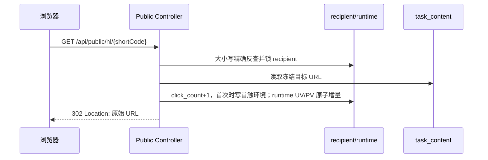

# 超链任务深度归因、访问趋势与封号原因详细设计（H6）

> 日期：2026-08-28
> 状态：待实施
> 上游合同：[超链任务公共契约](./2026-08-28-hyperlink-task-shared-contract.md)
> 详情外壳：[详情与收信人流水统计设计](./2026-08-28-hyperlink-task-recipient-stats-design.md)
> 数据模型：[超链营销数据模型](../../business/hyperlink-marketing-data-model.md) §4.5、§4.8、§4.12

## 0. 结论

三个 Tab 和公网短链不新增任何专用事实表：

| 能力 | 事实来源 |
|---|---|
| 公网短链、访问次数、首/末访问、首触环境 | `hyperlink_task_recipient` + `hyperlink_task_content` |
| 任务 UV/PV 快速摘要 | `hyperlink_task_runtime` |
| 深度归因列表/筛选/排序/导出 | `hyperlink_task_recipient` |
| 访问趋势 12～72 小时分桶 | 直接聚合 `hyperlink_task_recipient.first_visit_at/click_count` |
| 封号原因分布 | `hyperlink_task_account_usage.invalid_*` |

明确不建 `hyperlink_click`、`hyperlink_task_click_bucket_30m`、`hyperlink_task_ban`。一位 recipient 的第一访问环境
存一次，之后每次访问只增加 clickCount 和 lastVisitAt；趋势中的辅助 PV 按竞品说明全部归入该 recipient 的首次访问
时间桶。任务当前上限 10 万，配合现有索引可以直接查询。

## 1. 竞品证据总表

### 1.1 深度归因

| 证据 | 竞品事实 | Armada 实现 |
|---|---|---|
| E-H6-01 | 两个筛选：收件人手机号、发送账号手机号 | 两个模糊搜索框、Enter 搜索 |
| E-H6-02 | 有重置、搜索、导出、刷新、列设置 | 全部保留并实现 |
| E-H6-03 | 筛选区下显示“点击总数 / 单钩数 / 点击率” | 点击总数按竞品实际口径为筛选后点击 UV 行数 |
| E-H6-04 | 点击率提示“点击总数 / 单钩数；筛选会影响点击总数” | 分母固定任务 successNum，分子为当前筛选 UV |
| E-H6-05 | 11 列完整归因表 | 手机号、账号、次数、国家、设备、OS、浏览器、语言、IP、首访、近访 |
| E-H6-06 | 访问次数可排序，默认降序 | 唯一远程排序列 |
| E-H6-07 | IP 截断，hover 同时展示完整 IP 和原始 UA | 敏感权限下完整实现 |

### 1.2 访问趋势

| 证据 | 竞品事实 | Armada 实现 |
|---|---|---|
| E-H6-08 | 范围按钮 12/24/36/48/72 小时，默认 24 | 五个按钮完整 |
| E-H6-09 | 粒度 30/60/120 分钟，默认 30 | 三种粒度直接查询 |
| E-H6-10 | “趋势图 / 数据表”切换 | 两种展示使用同一响应 series |
| E-H6-11 | 有导出、刷新和“从第一个 UV 开始向后 N 小时”提示 | 完整实现 |
| E-H6-12 | 六卡：总 UV、点击率、任务开始、首次访问、UV 高峰、总 PV | 顺序、辅助文案一致 |
| E-H6-13 | 图表含新增 UV、累计点击率、PV（辅助），PV 默认隐藏 | ECharts 三 series、双 Y 轴 |
| E-H6-14 | 右侧趋势解读和底部新增 UV 最高的三个时段 | 后端返回 insights/topPeaks |
| E-H6-15 | 数据表五列并带口径 tooltip | 时间段、新增 UV、累计 UV、累计点击率、PV |
| E-H6-16 | PV 标注“按首次访问所在时间段近似归集” | 同一 recipient 全部 clickCount 归首访桶 |

### 1.3 封号原因

| 证据 | 竞品事实 | Armada 实现 |
|---|---|---|
| E-H6-17 | 顶部显示本任务去重封号总数 | usage 中 invalidAt 非空账号数 |
| E-H6-18 | 原因按占比降序显示，含百分比、进度条和账号数 | 完整 bucket 卡片 |
| E-H6-19 | 原始英文原因可显示中文解释，hover 看完整原因 | 四条竞品映射 + 未映射原样显示 |
| E-H6-20 | 无数据空态“该任务暂无封号记录” | 完整实现 |

证据来自只读竞品 `task-0vbZUOmq.js`、`visit-trend-tab-CVJUtu9z.js` 和路由 chunk。竞品前端不能证明后端
表结构；本方案的无独立事件表、隐私保留和直接分桶是用户确认后的 Armada 设计。

## 2. 公网短链落点

### 2.1 URL 与生成

- 公网入口固定 `GET /api/public/hl/{shortCode}`，无认证、无 tenantId/taskId 参数。
- shortCode 在 recipient 首次派发事务生成，全局唯一、ASCII 大小写精确、不可顺序枚举，长度 12～24。
- 消息启用 `useShortLink=true` 时，把唯一 CTA URL 替换为 `{publicBaseUrl}/api/public/hl/{shortCode}`。
- 原始目标 URL 继续冻结在 `hyperlink_task_content.promotion_link` 或唯一 `buttons[0].url`；不在 recipient 重复保存。
- 未开启深度追踪的 recipient.shortCode 为 null，消息继续使用原始 URL。

### 2.2 请求处理



处理细则：

1. Mapper 只为这一个查询使用 `@InterceptorIgnore(tenantLine="true")`；找到 recipient 后从行内 tenantId 继续查询。
2. shortCode 不存在、未绑定有效任务内容或目标 URL 已失效时返回 404/410，不能跳到用户输入的任意 query 参数。
3. 保存任务时已把目标校验为 HTTP(S)；跳转时再次限制 scheme，防止历史脏数据变成开放重定向。
4. 在短事务锁 recipient：`clickCount+1`、`lastVisitAt=now`；原 clickCount=0 时同时写 firstVisitAt 和首触字段。
5. 同一事务对 runtime：每次 `clickTotal+1`，首次时 `clickUvNum+1`；first/lastVisitAt 用原子 MIN/MAX 语义更新。
6. 提交成功后返回 302，带 `Cache-Control: no-store, private`；数据库失败不伪造成功统计，可返回 503 让浏览器重试。
7. IP 从受信任代理链解析；未配置受信任代理时只用 socket 地址，禁止盲信任任意 `X-Forwarded-For`。
8. GeoIP 使用本地数据库，UA 使用本地解析器；不得在跳转热路径同步调用外部服务。解析失败仍记录访问，派生字段为空。
9. 公网日志不得记录完整 shortCode、目标 URL 参数、IP 或 UA；按来源 IP/shortCode 做合理限流和异常指标，但不因
   相同 IP 去重 UV——UV 的唯一业务单位是 recipient。

### 2.3 首触与重复访问

首个成功请求固定保存 IP、原始 UA、browser、OS、device、language、country；后续访问不得覆盖首触环境，只更新
clickCount/lastVisitAt。两个并发首访通过 recipient 行锁确保只有一个成为首触，UV 只增加一次，PV 增加两次。

敏感首触环境保留 90 天。清理作业每批最多 2000 行，只清空 IP、UA、设备、系统、浏览器、语言、国家并写
attributionPurgedAt；clickCount、firstVisitAt、lastVisitAt、UV/PV 永久统计仍保留。

## 3. 深度归因 Tab

### 3.1 查询合同

```typescript
interface HyperlinkAttributionQuery {
  page: number;
  pageSize: 10 | 20 | 50 | 100 | 200;
  recipientPhone: string | null;
  senderPhone: string | null;
  sortField: "visitCount";
  sortOrder: "asc" | "desc";            // 默认 desc
}

interface HyperlinkAttributionItem {
  id: number;
  recipientPhone: string;
  senderPhone: string | null;
  visitCount: number;
  countryIso2: string | null;
  device: string | null;
  os: string | null;
  browser: string | null;
  language: string | null;
  ip: string | null;
  userAgent: string | null;
  firstVisitAt: number;
  lastVisitAt: number;
  attributionPurged: boolean;
  sensitiveVisible: boolean;
}
```

HTTP 响应严格使用公共 `PageResult<HyperlinkAttributionItem>`，不增加分页信封扩展字段。前端并行读取 H4 summary：
点击总数=`PageResult.total`，单钩数=`summary.successNum`，点击率=`total/successNum`。`sensitiveVisible` 在每一行
保持一致；空结果时前端根据当前权限状态显示脱敏提示，不需要改变公共分页结构。

查询固定 `click_count>0`。两个手机号均为模糊搜索，trim 后转义 LIKE；筛选后 `total` 就是竞品“点击总数”（实际为
点击过的去重 recipient 数），不是所有 clickCount 的求和。分母始终是整项任务 successNum，所以筛选会改变分子，
不会改变单钩分母；0 分母显示 `-`，其余保留两位。

### 3.2 11 列与工具栏

工具栏顺序：收件人手机号、发送账号手机号、重置、搜索；右侧导出、刷新、列设置。两个输入框都支持 Enter。

| 列 | 宽度 | 展示 |
|---|---:|---|
| 收件人手机号 | 150 | 字符串，空 `-` |
| 发送账号 | 150 | senderPhone，空 `-` |
| 访问次数 | 110 | 圆角数字标签，唯一可排序列 |
| 国家/地区 | 110 | ISO2，空 `-` |
| 设备 | 100 | 如 mobile，空 `-` |
| 操作系统 | 120 | 如 Android，空 `-` |
| 浏览器 | 120 | 如 Chrome/Samsung Browser，空 `-` |
| 语言 | 90 | 如 pt-BR，空 `-` |
| IP | 140 | 单行省略；hover 显示完整 IP + 原始 UA |
| 首次访问 | 160 | 系统时区日期时间 |
| 最近访问 | 160 | 系统时区日期时间 |

表格横向最小宽度 1480，高度 `calc(100vh - 410px)`，small、bordered。访问次数默认降序，同次数按 firstVisitAt
升序、id 升序稳定分页。清除 sorter 恢复 desc。分页与 H4 一致。

统计条固定显示“点击总数 {total}｜单钩数 {summary.successNum}｜点击率 {rate}”，tooltip 使用竞品原口径说明。

### 3.3 权限与隐私

- 普通 `view` 可看手机号、次数和已经派生的国家/设备/系统/浏览器/语言。
- 没有 `tenant:hyperlink_task:attribution_sensitive` 时，ip/userAgent 返回 null，页面列仍存在并显示 `-`。
- 有敏感权限时返回 IP 和 UA并写敏感读取审计；不能因为用户隐藏 IP 列就跳过后端权限。
- `attributionPurged=true` 时敏感和派生首触字段可能为空；前端 tooltip 提示“已按保留策略清理”，不能显示为“未访问”。

### 3.4 查询性能

使用 `idx_hyperlink_recipient_click(tenant_id, hyperlink_task_id, click_count, id)` 过滤点击行并完成默认 visitCount 排序；两个
手机号筛选分别利用 task+recipient phone 唯一索引和 sender_phone 索引。只选 11 个展示字段，不读取内容 JSON。

## 4. 深度归因导出

`POST /api/hyperlink-tasks/{id}/click-attribution/export` 复用当前两个手机号筛选和 visitCount 排序，返回公共异步作业。
创建和下载都必须同时校验 export + attribution_sensitive；作业中保存权限需求，不能由无敏感权限用户猜 jobId 下载。

CSV 顺序：收件人手机号、发送账号、访问次数、国家/地区、设备、操作系统、浏览器、语言、IP、User-Agent、首次访问、
最近访问、归因是否已清理。文件名 `hyperlink-click-attribution-{taskId}-{yyyyMMddHHmmss}.csv`，手机号/IP 都按文本写。

## 5. 访问趋势查询

### 5.1 请求

```typescript
type VisitRange = "12h" | "24h" | "36h" | "48h" | "72h";
type VisitGranularity = "30m" | "1h" | "2h";

interface HyperlinkVisitTrendQuery {
  range: VisitRange;                    // 默认 24h
  granularity: VisitGranularity;        // 默认 30m
}
```

range 必须能被 granularity 整除。改变范围或粒度立即刷新；按钮 loading 时请求序列号保证旧响应不能覆盖新选择。

### 5.2 响应

```typescript
interface HyperlinkVisitTrend {
  range: VisitRange;
  granularity: VisitGranularity;
  summary: {
    uvTotal: number;
    clickRate: number;
    taskStartAt: number | null;
    firstVisitAt: number | null;
    peakBucketTime: number | null;
    peakNewUv: number;
    pvTotal: number;
    pvPerUv: number;
  };
  series: Array<{
    bucketTime: number;
    bucketEndTime: number;
    newUv: number;
    cumulativeUv: number;
    cumulativeClickRate: number;
    pv: number;
  }>;
  insights: Array<{
    eventType: "TASK_START" | "FIRST_VISIT" | "SURGE_START" | "PEAK";
    eventTime: number;
    title: string;
    detail: string | null;
  }>;
  topPeaks: Array<{
    rank: 1 | 2 | 3;
    bucketTime: number;
    bucketEndTime: number;
    newUv: number;
  }>;
}
```

### 5.3 分桶口径

统计窗口不是“现在往前 N 小时”，而是从本任务第一个 UV 的 `firstVisitAt` 精确时刻向后 N 小时。假设首次访问为
`22:04:01`，30 分钟粒度的第一桶就是 `[22:04:01, 22:34:01)`，不是墙钟的 22:00 或 22:30。

```sql
SELECT FLOOR((first_visit_at - :anchorAt) / :bucketMs) AS bucket_no,
       COUNT(*) AS new_uv,
       SUM(click_count) AS pv
FROM hyperlink_task_recipient
WHERE tenant_id = :tenantId
  AND hyperlink_task_id = :taskId
  AND first_visit_at >= :anchorAt
  AND first_visit_at < :anchorAt + :rangeMs
GROUP BY bucket_no;
```

应用层补齐全部空桶并做前缀和：

```text
cumulativeUv[i]        = sum(newUv[0..i])
cumulativeClickRate[i] = cumulativeUv[i] / task.successNum
uvTotal                = cumulativeUv[last]
pvTotal                = sum(pv[*])
pvPerUv                 = pvTotal / uvTotal
```

每个 recipient 的 `clickCount` 全部累计到它的首访桶。这正是竞品“PV（辅助）：按首次访问所在时间段近似归集”的
口径；它不是每次点击真实发生时间的半小时统计，所以不需要 click 事件表或 30 分钟落地表。

任务没有 UV 时：firstVisitAt/peakBucketTime=null，其余计数和比率为 0，series/insights/topPeaks 返回空数组；页面六卡
仍正常显示，不造一个从任务开始时间起的假访问窗口。

### 5.4 高峰与趋势解读

- peak 为 newUv 最大桶；并列取最早桶。
- topPeaks 按 newUv desc、bucketTime asc 取最多 3 个，newUv=0 的桶不进入。
- insights 至少包含有效的 TASK_START、FIRST_VISIT 和 PEAK 事件。
- `SURGE_START` 属于从竞品可见“明显增高”反推的解释规则：当前桶 `newUv>=3`，且达到前 3 个桶平均值的 2 倍；
  前面没有非零桶时，第一个 `newUv>=3` 的桶也标记。连续命中只保留第一桶，避免右侧刷屏。
- 标题使用竞品可见文案：“任务开始发送”“出现首次访问”“新增访客开始明显增多”“UV 高峰”；detail 展示新增人数。

SURGE 阈值是 Armada 明确化实现，并非竞品前端证明的后端算法；若联调样本表明竞品阈值不同，只调整该纯函数，
不改变 API 或数据模型。

## 6. 访问趋势页面

### 6.1 顶部控制

依次显示：12/24/36/48/72 小时按钮、粒度下拉（30/60/120 分钟）、趋势图/数据表切换；右侧导出、刷新。
下方信息条固定为“数据统计范围：从第一个 UV 出现开始，向后 {N} 小时。”

### 6.2 六张指标卡

| 卡 | 主值 | 辅助文案 |
|---|---|---|
| 总 UV | uvTotal | 独立访客 |
| 点击率 | clickRate，两位百分比 | UV / 单钩人数 |
| 任务开始 | taskStartAt 日期+时间 | 北京时间 |
| 首次访问 | firstVisitAt 日期+时间 | 北京时间 |
| UV 高峰 | peakBucketTime 日期+时间 | 新增 {peakNewUv} 人 |
| 总 PV | pvTotal | 辅助 · 人均 {pvPerUv两位} 次 |

API 时间仍是 epoch，前端使用公共“系统时区”格式化器，不能跟浏览器本地时区漂移。当前部署系统时区为
`Asia/Shanghai`，所以竞品可见标签显示“北京时间”；如果以后系统时区允许配置，时间和值与系统配置一起变化，
不能只改值却继续硬编码错误的“北京时间”标签。

### 6.3 趋势图

- 标题“访问量走势”，副标题“北京时间 · 每 30 分钟/1 小时/2 小时统计”。
- 新增 UV：左轴柱状，蓝色；SURGE_START 桶橙色并标“明显增高”。
- 累计点击率：右轴绿色平滑线，默认显示。
- PV（辅助）：左轴灰色柱状，legend 中默认隐藏但可点击显示。
- tooltip 展示桶起止、新增 UV、累计点击率、PV；surge 桶追加“趋势：明显增高”。
- 右侧“趋势解读”按时间列事件，无事件显示“当前时段暂无趋势事件”。
- 图下“新增 UV 最高的 {N} 个时间段”，最多三项；空时显示“暂无高峰时段”。

### 6.4 数据表

| 列 | tooltip |
|---|---|
| 时间段（北京时间） | 结束时间为开区间 |
| 新增 UV | 首次访问落在本时间段的独立访客数 |
| 累计 UV | 截至本桶结束的累计独立访客数 |
| 累计点击率 | 累计 UV ÷ 任务单钩数，0 分母为 0% |
| PV（辅助） | 访问次数按首次访问桶近似归集，仅供参考 |

数据表不分页，最大 144 行（72h/30m）；small、bordered、最小宽度 840。

## 7. 访问趋势导出

`POST /api/hyperlink-tasks/{id}/visit-trend/export` 请求当前 range/granularity，返回公共异步导出作业。CSV 五列与数据表
一致，另在文件首部不插说明行，保证标准 CSV；口径说明放固定列名“PV（辅助，按首访桶归集）”。文件名
`hyperlink-visit-trend-{taskId}-{yyyyMMddHHmmss}.csv`。

任务趋势导出不弹竞品仅用于数据包敏感导出的 Google OTP；但仍校验 export 权限并写审计。

## 8. 封号原因分布

### 8.1 查询和响应

```typescript
interface HyperlinkBanStats {
  invalidAccountCount: number;
  stats: Array<{
    reason: string;
    note: string | null;
    count: number;
    percentage: number;
  }>;
}
```

`GET /api/hyperlink-tasks/{id}/ban-stats` 查询：

```sql
SELECT COALESCE(NULLIF(TRIM(invalid_reason), ''),
                NULLIF(TRIM(invalid_code), ''),
                '未知原因') AS reason,
       COUNT(*) AS account_count
FROM hyperlink_task_account_usage
WHERE tenant_id = ?
  AND hyperlink_task_id = ?
  AND invalid_at IS NOT NULL
GROUP BY reason
ORDER BY account_count DESC, reason ASC;
```

一行 usage 就是任务内一个唯一账号，所以 COUNT 天然去重。`invalidAccountCount=sum(count)`，percentage=
`count/invalidAccountCount*100`，保留一位；返回前按 percentage desc、reason asc。runtime.invalidAccountCount 用于顶部摘要，
ban-stats 从 usage 现场分组；投影收敛后两者必须相等，reconciliation 报警但不隐藏差异。

### 8.2 原因说明

复刻竞品四条解释（比较时忽略大小写）：

| 原始原因 | 中文说明 |
|---|---|
| `account_block_463` | 中途禁言，马上封号 |
| `account_offline` | 中途强制被掐掉，封号 |
| `logged out from another device` | 从主设备登录出，被强制下线 |
| `primary device was logged out` | 主设备直接掉了/封了 |

其他原因（如 `device_deleted`）原样展示，note=null；不能为追求中文而合并不同原始原因。原因行显示原文、可选 note、
一位百分比、彩色进度条和“{count} 个账号”；颜色按竞品橙/红/蓝/绿/紫/橘循环。原文过长时 hover 展示完整内容。

Tab 首次切入自动加载；竞品没有该 Tab 的搜索、导出或列设置，不自行添加。无数据展示“该任务暂无封号记录”。

### 8.3 何时记录封号

H3 接收协议发送失败或独立账号状态事件时，只有明确封号/失效语义才首次条件更新 usage：

- `invalidAt` 从 null 写事件时间；
- `invalidCode/invalidReason` 保存稳定码和已脱敏原始摘要；
- usageStatus 置 BANNED/INVALID；
- runtime.invalidAccountCount 原子 +1；
- 重复事件只允许补充空原因，不改变首次时间和计数。

普通收信人未注册、内容错误、网络超时不属于封号，不能进入本分布。

## 9. 接口与权限

| 方法 | 路径 | 权限 |
|---|---|---|
| GET | `/api/public/hl/{shortCode}` | 公网；限流，无租户认证 |
| GET | `/api/hyperlink-tasks/{id}/clicks` | view；敏感字段另校验 attribution_sensitive |
| POST | `/api/hyperlink-tasks/{id}/click-attribution/export` | export + attribution_sensitive |
| GET | `/api/hyperlink-tasks/{id}/visit-trend` | view |
| POST | `/api/hyperlink-tasks/{id}/visit-trend/export` | export |
| GET | `/api/hyperlink-tasks/{id}/ban-stats` | view |

所有租户接口先校验 task 归属；公网入口只能从 shortCode 反查自己的 tenant/task，不能接受调用方指定。深度归因敏感
读取和两类导出都写审计。

## 10. 代码落点

### 10.1 后端

- `controller/HyperlinkPublicRedirectController`：独立公网限流配置和无认证路由。
- `application/HyperlinkClickTrackingService`：shortCode 解析、首触事务、302 目标。
- `query/HyperlinkAttributionQueryService`：深度归因分页和脱敏。
- `query/HyperlinkVisitTrendQueryService`：动态分桶、series、insight/topPeak 纯函数。
- `query/HyperlinkBanStatQueryService`：usage 原因分组。
- `privacy/HyperlinkAttributionRetentionWorker`：90 天清理。
- `export`：ATTRIBUTION、VISIT_TREND writer。

公网 Controller 不能放进依赖登录 Principal 的租户 Controller；只有 repository 的 shortCode 精确方法允许忽略租户插件。

### 10.2 前端

```text
src/views/hyperlink/task/components/
├── AttributionTab.vue
├── AttributionIpCell.vue
├── VisitTrendTab.vue
├── VisitTrendChart.vue
└── BanReasonStatsTab.vue
```

复用 H4 Drawer/Summary/导出作业和公共表格列设置。

## 11. 测试

### 11.1 公网点击

- shortCode 大小写精确；无效 404；非法目标 scheme 410；不能通过 query 改写目标。
- 首次点击 UV+1/PV+1 并写全首触；重复点击只 PV+1 和更新 lastVisitAt。
- 两个并发首访最终 UV=1、PV=2；跨 recipient 各算 UV。
- 受信代理 IP、伪造 XFF、IPv4/IPv6、UA 截断、语言和 GeoIP 失败逐一验证。
- 数据库失败不返回假 302；日志不含完整 shortCode/IP/UA/目标参数。

### 11.2 深度归因

- 只返回 clickCount>0；两个手机号模糊筛选、visitCount 双向排序和稳定分页准确。
- 点击总数等于筛选后 total，不误用 PV；点击率分母固定 summary.successNum。
- 11 列映射、IP+UA tooltip、无敏感权限脱敏、90 天清理标志准确。
- 10/20/50/100/200 分页和异步敏感导出权限准确。

### 11.3 访问趋势

- 首访 22:04:01 时第一桶严格从 22:04:01 开始；左闭右开边界不重不漏。
- 5 范围 × 3 粒度全部返回正确桶数；空桶补零。
- 多次访问全部 PV 归 recipient 首访桶，uv/pv/cumulative/rate 公式准确。
- 无 UV、0 success、并列高峰、少于 3 个非零桶、surge 连续命中逐一验证。
- 图/表共用响应，PV 默认隐藏，导出与表数据逐行一致。
- 10 万 recipient、72h/30m 查询 P95≤800ms；执行计划命中 visit_trend 索引。

### 11.4 封号原因

- 同一账号重复封号事件只计一次；原因补全不改变 bannedCount。
- 四条说明大小写兼容，device_deleted 等未知原因原样显示。
- count、percentage、排序、颜色循环和空态正确。
- ban-stats 与 runtime invalidAccountCount 的 reconciliation 可发现漂移。

## 12. 竞品一致性红线

- [ ] 深度归因两个手机号筛选、重置、搜索、导出、刷新、列设置全部存在。
- [ ] 点击总数/单钩数/点击率统计条和口径提示完整。
- [ ] 11 列、IP+UA tooltip、访问次数排序、分页完整。
- [ ] 访问趋势 5 个范围、3 个粒度、图/表切换、导出、刷新完整。
- [ ] 趋势六张卡、三条 series、趋势解读、Top 3、五列表格完整。
- [ ] PV 明确按首访桶近似归集，不伪装成真实点击事件时序。
- [ ] 封号总数、原因原文/解释、百分比、彩条、账号数和空态完整。
- [ ] 四条竞品中文原因映射保留，未知原因不吞掉。
- [ ] 不建 hyperlink_click、30m bucket 或 task_ban 后，任何竞品可见能力都没有被删除。
- [ ] 公网短链在真实消息中可点击、正确 302，并可靠形成上述三类统计。

以上全部通过后，H6 才能标记完成。
