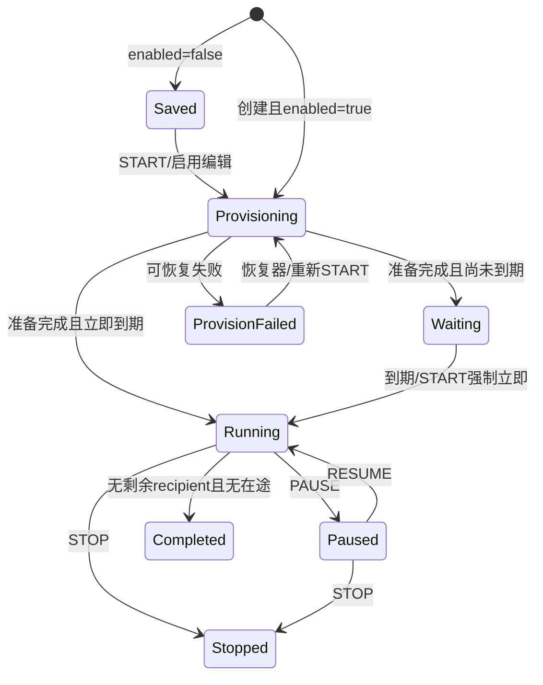

# 超链任务发布与运行生命周期详细设计（H3）

> 日期：2026-08-28
> 状态：待实施
> 上游合同：[超链任务公共契约](./2026-08-28-hyperlink-task-shared-contract.md)
> 表单合同：[任务表单与查看/复制设计](./2026-08-28-hyperlink-task-editor-design.md)
> 数据模型：[超链营销数据模型](../../business/hyperlink-marketing-data-model.md) §4

## 0. 结论

本方案负责把 H2 的一份 `HyperlinkTaskSaveRequest` 可靠地变成一项可运行、可暂停、可继续、可停止且可恢复的
超链任务。完整链路为：


最终实现必须同时满足以下硬约束：

1. 竞品可见的启用保存、最后核对、启动、暂停、继续、停止、即时/预发布/周期三种模式全部落地。
2. 同一任务内一个收信号码只有一行、只产生一个业务 `commandId`、只发生一次逻辑发送，不跨账号重试。
3. 余额不足、领取失败或协议通道不具备私聊能力时不能先发后补；任务留在可恢复准备态并展示明确失败原因。
4. Web 与 Android 都必须真正发送到个人 JID；不能把私聊目标传给现有群可发送性检查后假装支持。
5. `PAUSE/RESUME/STOP` 必须由后端条件更新保护；页面按钮矩阵不构成并发控制。
6. 任务停止只终止未提交的发送，保留已经提交的命令、ACK、点击、归因和审计事实。

## 1. 竞品证据与实现边界

### 1.1 已观察事实

| 证据 | 竞品事实 | Armada 必须实现 |
|---|---|---|
| E-H3-01 | 新建任务可选择“启用”；启用后进入运行准备 | 保存且启用走准备链，仅保存不领号、不计费 |
| E-H3-02 | 提交前展示余额、人数、单价、预计冻结金额并倒计时 7 秒 | 服务端报价 + 前端 7 秒最后核对；金额不能由前端自算 |
| E-H3-03 | 未开始任务提供“启动” | `START` 动作和二次确认 |
| E-H3-04 | 进行中任务提供“暂停”“停止” | 暂停不再派发新命令；停止为不可恢复终态 |
| E-H3-05 | 已暂停任务提供“继续”“停止” | 从原执行进度继续，不重新领料或生成第二条命令 |
| E-H3-06 | 启动确认文案为“确认启动任务「任务名」？” | H1 行动作确认弹框对齐 |
| E-H3-07 | 暂停提示“暂停后可在「已暂停」状态下恢复执行” | 暂停语义和文案对齐 |
| E-H3-08 | 继续提示“恢复后任务将继续按原策略发送” | 继续沿用冻结配置、账号上限和剩余 recipient |
| E-H3-09 | 停止提示“停止后任务将被终止，且无法恢复” | STOP 终态、不可再 START/RESUME |
| E-H3-10 | 三种模式为即时、预发布、周期；预发布允许新发信账号加入 | 三种调度规则完整实现 |
| E-H3-11 | 任务配置含账号并发、单账号上限、消息间隔和周期配置 | 调度器必须实际消费这些字段，不得只保存不生效 |
| E-H3-12 | 页面聚合数据约每分钟同步 | ACK 写事实，分钟级批量投影 runtime/account_stat |

上述证据来自只读竞品前端
`hylbuiaxykfrontendsource/readable/assets/task-0vbZUOmq.js` 和
`hylbuiaxykfrontendsource/readable/assets/router-CPQmbuR9.js`。竞品前端只能证明页面、动作、字段和接口形态，
不能证明其数据库事务、锁顺序和协议内部实现；本方案中的 Saga、租约、幂等键和 outbox 属于 Armada 适配设计。

### 1.2 本方案不重复定义的内容

- H2 冻结表单字段、回填、模板/策略/素材选择和 Save DTO。
- H1 冻结任务列表动作可见性与列表刷新。
- H4-H6 冻结详情查询、导出和分析页面。
- 10 张任务表的字段全集、索引及数值枚举以数据模型 §4 为准。

## 2. HTTP 合同

### 2.1 接口

| 方法与路径 | 用途 | 成功响应 |
|---|---|---|
| `POST /api/hyperlink-tasks/quote` | 获取最后核对报价 | `HyperlinkTaskQuote` |
| `POST /api/hyperlink-tasks` | 创建/复制创建 | `HyperlinkTaskMutationReceipt`，200 或 202 |
| `PUT /api/hyperlink-tasks/{id}` | 更新未开始任务 | `HyperlinkTaskMutationReceipt`，200 或 202 |
| `GET /api/hyperlink-tasks/{id}/provision-status` | 轮询当前提交的准备结果 | `HyperlinkTaskMutationReceipt` |
| `POST /api/hyperlink-tasks/{id}/action` | START/PAUSE/RESUME/STOP | `HyperlinkTaskMutationReceipt`，200 或 202 |

保存请求、Action 请求、回执和错误码完全使用公共契约，不另建草稿 DTO。POST、PUT、Action 分别要求
`tenant:hyperlink_task:create`、`tenant:hyperlink_task:edit`、`tenant:hyperlink_task:action`；报价按 purpose 要求
create 或 action；查看准备结果要求 `tenant:hyperlink_task:view`。

### 2.2 报价请求和响应

请求与响应直接复用公共契约 §4.2 的 `HyperlinkTaskQuoteRequest`、`HyperlinkTaskQuote` 和
`HyperlinkTaskQuoteBreakdown`，不得在 H3 再定义第二套字段。`purpose=CREATE` 由数据包、任务模式和最大执行账号数
报价；`purpose=START` 只传任务 ID，全部配置从已保存任务读取。

- 金额由后端使用 `BigDecimal` 计算；API 按公共契约返回 `number`，前端只能格式化展示，禁止用 JavaScript
  浮点数重新计算并参与账务判断。
- `recipientCount` 是冻结代次中可领取、按号码去重且不含已被其他任务领取的实际人数，不直接信任包列表计数。
- `quoteToken` 是签名的不透明短期票据，绑定租户、用户、报价 purpose、数据包 ID/代次/领取上界、任务模式、
  最大执行账号数、人数、价码、金额和过期时间；START 额外绑定任务 ID 和任务 version。数据库只落 `quote_id`，
  不保存 token 明文。
- 7 秒只是竞品前端最后核对倒计时，不等于报价有效期。倒计时结束后才能点确认；真正提交仍必须验证 token 未过期。
- 可用余额小于 `estimatedAmount` 时仍返回报价供用户查看，但确认按钮禁用；服务端也必须再次拒绝。
- 保存且 `enabled=false` 不要求 quote。普通创建且启用必须带 quoteToken；复制创建和 PUT 未开始编辑按公共契约由
  服务端对最新快照重新报价，不展示竞品没有的第二个 7 秒弹框；START 必须带 START quoteToken。

## 3. 双状态与准备状态

### 3.1 稳定状态

| 场景 | `enabled` | `runStatus` | `provisionStatus` | 是否进正常列表 |
|---|---:|---:|---|---|
| 仅保存 | false | 0 | NOT_REQUIRED | 是 |
| 启用后准备中 | true | 0 | PROCESSING | 否 |
| 已准备、等待延后时间 | true | 0 | READY | 是 |
| 正在发送 | true | 1 | READY | 是 |
| 已完成 | true | 2 | READY | 是 |
| 已暂停 | true | 3 | READY | 是 |
| 已停止 | true | 4 | READY | 是 |
| 准备失败待恢复 | true | 0 | FAILED | 否 |

保存为“启用 + 立即执行”时，准备完成即把首轮置为到期；调度器通常会很快把 `runStatus` 从 0 推到 1。
接口允许 READY 回执中的 `runStatus=0`，前端不能把这几百毫秒的正常窗口判成失败。

### 3.2 状态流



## 4. 创建、复制与未开始编辑

### 4.1 仅保存

同一个数据库事务内：

1. 校验 DTO、租户归属、素材引用、模板/策略弱引用和 `sourceTaskId`。
2. 写 `hyperlink_task`、`hyperlink_task_content`、`hyperlink_task_runtime`。
3. `runtime.is_enabled=0`、`run_status=0`、`provision_status=0`。
4. 不创建 claim、recipient、billing、round、usage、round_account 或 account_stat。

仅保存立即返回 200 + NOT_REQUIRED。复制创建只复制 H2 允许的配置字段；不能复制原任务的冻结代次、受众、余额、
轮次、发信账号、命令、统计和短码。

### 4.2 启用创建

启用创建采用“短事务建壳 + 可恢复分批准备”，不能把 10 万 recipient 放进 HTTP 大事务：

1. **建壳事务**：验证 quote，插入 task/content/runtime，建立 claim 作业，runtime=PROCESSING；提交后返回 202。
2. **冻结事务**：锁定数据包代次统计，固化 `data_package_generation`、包名、国家快照、最大 phone ID 和目标人数。
3. **领取批次**：每批最多 50 条，按 claim 游标将可用号码改为 CLAIMED，并 UPSERT 唯一 recipient。
4. **计费预约**：领取收敛后按实际唯一 recipient 人数校验报价并调用钱包冻结；不足或报价漂移不建首轮。
5. **首轮事务**：创建 round 1、选中账号并写 usage/round_account；设置 runtime.recipientTotal/currentRound。
6. **可见提交**：全部成功后 provision=READY；首轮到期时由调度器进入运行。

每一步都持久化进度。进程崩溃后恢复器从 claim/billing/round 状态续跑，不从头生成第二批受众。

### 4.3 未开始编辑

仅 `runStatus=0` 且 version 命中时允许编辑。分两类：

- **不影响冻结范围**：名称、内容、消息间隔、尚未开始的计划时间等按字段规则原子更新 task/content，递增 version。
- **影响冻结范围**：数据包、账号筛选、模式、账号上限、计价模式等变化，必须重新 quote。先把 runtime 隐藏为
  PROCESSING，分批释放旧 claim 和未提交 recipient，调整/释放原余额预约，删除未消费 round/usage/round_account，
  再按新范围准备。不能在一个事务中删除 10 万行，也不能在旧范围仍可派发时重建。

已经产生 `command_id` 或 `runStatus!=0` 时返回公共错误
`40910 HYPERLINK_TASK_STATE_CONFLICT`；绝不能通过复制旧事实实现编辑。

## 5. 数据包领取与任务级计费

### 5.1 recipient claim

`hyperlink_task_recipient_claim` 是任务从某个数据包代次领取收信号码的可恢复作业，不是“给每个发信人分配料子”。
它冻结：代次、领取上界、目标数、已扫描游标、已领取数、作业租约和失败恢复点。发信账号的分配发生在 round 和
recipient 派发阶段。

领取规则：

- 固定扫描 `phone.id <= upperPhoneId`，任务开始后新导入的号码不加入本任务。
- 通过代次级活动 claim 唯一键避免领取和释放同时执行；批次事务锁顺序固定为
  `recipient_claim → data_package_stat → data_package_phone → recipient`。
- `uq_hyperlink_recipient(tenant, task, phone)` 作为最后一道幂等防线。
- 每批提交后更新游标和计数；超时接管必须先验证租约过期和 version。
- STOP 或重建只释放尚未产生 `command_id` 的号码；已提交发送的来源事实保留。

### 5.2 billing reservation

`hyperlink_billing_reservation` 一行代表整项任务的报价、冻结、结算和释放，不按轮重复收费。外部钱包调用使用 Saga：

1. 事务内先写 `pending_operation` 和 `operation_idempotency_key`。
2. 提交事务后调用钱包。
3. 再用 version 条件更新外部单号和金额状态。
4. 未知结果由恢复器使用原幂等键查询/重试。

固定幂等键：首次冻结 `reserve:{taskId}`；调整、结算、释放使用外部预约号、任务 ID 和本地版本组成稳定键。
只结算唯一 recipient 的实际发送消费；STOP/完成后释放剩余金额。余额账本仍归钱包域，本表不能充当钱包总账。

## 6. 三种运行模式与轮次

### 6.1 通用轮次规则

- `hyperlink_task_round` 是调度恢复单元；同任务最多一个非终态 round。
- `hyperlink_task_round_account` 冻结本轮选中的账号，worker 重启后不得重新随机选号。
- `hyperlink_task_account_usage` 是跨轮同步执行状态，控制成功上限、在途并发和账号失效。
- recipient 只在第一次分配时写入 round/account；后续轮次只领取 `send_status=PENDING AND round_id IS NULL` 的剩余行。
- `defaultSubTaskNum=50` 仅为领取、分配和派发批量大小，不是业务字段，不改变“一人一次”。

### 6.2 即时 `instant`

- 只创建 round 1，首轮 `scheduledAt=now` 或 `now+delayMinutes`。
- 启用前必须至少有一个合格账号；零账号返回准备失败，不创建可运行空任务。
- 用 `maxUseAccount` 限制任务账号数，用 `concurrentNum` 限制同一时刻参与执行的账号数。
- 全部 recipient 终态且无在途后任务完成，不再创建轮次。

### 6.3 预发布 `rolling`

- 只创建 round 1；“新号自动加入”只指后来满足筛选条件的新发信账号，不吸收数据包后续导入的新收信人。
- 当前零账号可保留首轮等待；选号器按固定节奏重新匹配，匹配到后写 usage/round_account 再开始派发。
- 已分配 recipient 不换号，不因为新号加入而重新均衡。
- 到 `plannedEndAt` 后不再接纳新账号；剩余未提交 recipient 按产品停止语义收口，释放余额和料子。

### 6.4 周期 `cycle`

- `maxUseAccount` 表示每轮最多使用账号数且必须大于 0；`cycleIntervalMinutes>=1`。
- 一轮只对剩余 recipient 分配一批，绝不把同一 recipient 再发一遍。
- 本轮完成后若仍有未分配 recipient，在同一事务插入下一条 PLANNED round。
- 下一轮时间为 `max(previousScheduledAt + interval, now)`；宕机错过的周期不补跑、轮次不重叠。
- 某轮零账号时以“无账号”状态收口；有剩余 recipient 才创建下一轮等待新账号。

## 7. 账号选择、占槽与派发事务

### 7.1 账号选择

账号查询必须完整应用 H2 的 `accountFilter`：协议/设备、是否在线、账号类型、国家、好友数、注册天数、允许拉群、
轮号状态、导入方式、数据来源、导入批次和指定手机号；同时校验租户归属和当前协议能力。筛选 JSON 只是条件快照，
实际账号不会整批序列化进 task。

本轮选中账号写入 usage/round_account 快照。账号后续被删除或资料变化时，历史详情仍用快照展示；在线状态短暂波动
可以等待，明确封号/删除/协议失效则把 usage 标记不可用，并停止给它分配新 recipient。

### 7.2 一条发送的事务

派发 worker 每次按稳定顺序锁 `task_account_usage → recipient`：

1. 条件占用账号一个 `inFlight` 槽位，并预留不超过 `accountMaxSendNum` 的成功容量。
2. 锁定一行 PENDING recipient；首次写入不可变 round/account/sender/protocol 快照。
3. 生成稳定命令 ID：`hl:{tenantId}:{taskId}:{recipientId}`，长度不超过 64。
4. 若启用短链，生成全局大小写敏感 `shortCode`，把消息中的 CTA 改写为 Armada 公网地址。
5. 把 recipient 改为 SENDING，写 `commandId`、`nextDispatchAt`。
6. 在同一事务写现有 `protocol_command_outbox`；提交后才由 publisher 发 Kafka。

本地 adapter 拒绝命令时必须在可恢复事务中释放在途槽并把该 recipient 置最终失败。Kafka 超时、消费者重放或结果
事件丢失时，只查询/重发同一个 `commandId`；禁止创建 `attemptId`、第二条 recipient 或换另一个发信账号重发。

### 7.3 消息语义映射

| 任务类型 | 协议无关类型 | 必须使用的字段 |
|---:|---|---|
| 1 单图文 | `LINK_CARD` | title、content、linkDescription、promotionLink/短链、linkPreviewAsset |
| 2 双图文（历史） | 只读兼容的历史 serializer | 历史已保存字段完整回放；新建拒绝 |
| 3 普通按钮 | `BUTTON_CARD` | title、content、唯一 CTA 文案/URL、可选 bodyMainAsset |
| 4 卡片按钮 | `BUTTON_CARD` | title、content、cardText、唯一 CTA 文案/URL、bodyMainAsset |

协议 serializer 必须以竞品预览和真实 WhatsApp 气泡为准；字段不能只存在数据库却在发送时被丢弃。无论某协议内部
如何编码卡片，一行 recipient 对外仍是一条逻辑发送，只报告一个业务结果和主 `protocolMessageId`。

## 8. Java 协议适配合同

现有 `MessageSendCommand` 只定义 `MessageTarget(groupJid)` 和营销 `attemptId` 关联，不足以表示超链私聊。实施时：

```java
record MessageTarget(String jid, TargetKind kind) {}
enum TargetKind { GROUP, PRIVATE }

record HyperlinkCorrelation(Long taskId, Long recipientId) {}

record MessageCorrelation(
    Long tenantId,
    String source,
    MarketingCorrelation marketing,
    GroupCreationCorrelation groupCreation,
    HistoricalGroupCorrelation historicalGroup,
    HyperlinkCorrelation hyperlink
) {}
```

- `source="hyperlink_task"` 时 hyperlink 必填，其余三个业务关联为空。
- Web/Android wire payload 新增 `jid`、`targetKind`、`hyperlinkTaskId`、`hyperlinkRecipientId`。
- 迁移期可以继续输出/接受旧 `groupJid` 字段服务现有群营销，但内部一律使用通用 `jid`；不能把个人 JID 命名成群。
- `ProtocolMessageEventConsumer` 必须同时消费 `message.send_result_reported` 与 `message.ack`，并为
  `source=hyperlink_task` 选择唯一 Hyperlink sink；该分支不要求 marketing `attemptId/targetId/roundNo`。
- 结果和 ACK 必须透传 tenant、source、taskId、recipientId、commandId、protocolAccountId、jid、messageId、
  时间、成功标志及稳定失败码。

## 9. Web 与 Android 私聊能力

### 9.1 Web / Baileys

`armada-protocol/protocol-layer` 的当前 `executeMessageSend` 会对普通营销统一调用
`resolveGroupSendability`，超链必须新增 PRIVATE 分支：

- 校验个人 JID 为规范化 `<digits>@s.whatsapp.net`，不得进入群 metadata/权限/禁言预检。
- TEXT/LINK/IMAGE/LINK_CARD/BUTTON_CARD 继续使用 Baileys 的 JID 通用发送能力，但构建器要接受完整超链内容。
- `messageSendPayload` 明确识别 `source=hyperlink_task` 并校验 taskId+recipientId，而不是套普通营销四字段。
- 为通用消息发送增加持久化/可恢复的 `commandId` 状态；相同命令重放时返回已缓存结果，不再次物理发送。
- 发送成功发布 `message.send_result_reported`；Baileys `message.ack` 继续发布单钩、双钩、已读事件并携带关联。

### 9.2 Android / Zhuan

Android 已有命令状态与结果重放能力，但当前发送器按群目标准备上下文。新增私聊分支：

- 通过账号设备解析个人 peer JID，不查询群成员、群权限，不发送群 typing/mentionAll。
- 图片、链接卡片、普通按钮、卡片按钮使用 Android 私聊 serializer；图片引用沿用现有 tenant+SHA-256 资源缓存。
- `commandId` 状态机在成功、明确失败和未知结果恢复时均保持幂等；同一命令不得再次物理发送。
- 结果事件携带 hyperlink 关联；若 Android 能提供 delivery/read ACK，映射到统一事件，不能仅停留在发送成功。

### 9.3 能力门禁

实现不能只过单元测试。Web 和 Android 各使用授权测试账号、真实个人收信号完成：

1. 单图文含图片和链接；
2. 普通按钮含唯一 CTA；
3. 卡片按钮含标题、正文、卡片文字、图片和 CTA；
4. 同 command 重放不产生第二条消息；
5. 单钩/双钩/已读或通道可提供的真实 ACK 正确回写。

任何一种协议未通过时，该协议账号必须在超链账号匹配阶段排除或明确禁用，不能让用户创建后批量失败。

## 10. 结果、ACK 与统计投影

### 10.1 recipient 单调状态

```text
PENDING -> SENDING -> SUCCESS -> DELIVERED -> READ
                    \-> FAILED
                    \-> UNREGISTERED
```

- outbox 被 adapter 接受后记录 `submittedAt`；协议发送结果成功至少推进 SUCCESS，并保存 messageId/sentAt。
- delivery/read ACK 通过 `(tenantId, accountId, protocolId, protocolMessageId)` 唯一定位 recipient。
- ACK 重复、乱序按状态等级幂等推进；FAILED/UNREGISTERED/TASK_STOPPED 不被迟到 ACK 复活。
- 确认目标未注册 WhatsApp 使用 UNREGISTERED，同时属于 failedNum 和 unregisteredNum。
- 账号封禁/设备删除等错误既结束当前 recipient，也首次更新 account_usage.invalidAt/invalidReason；封号数按账号去重。

### 10.2 同步写与异步投影

ACK/发送结果事务只更新 recipient 和 account_usage，避免每条消息争抢 runtime：

- 成功或最终失败同步释放 `inFlight`；成功按口径占用账号成功额度。
- recipient 状态变化令 `needsMetricsProjection=1`。
- 投影器按 `FOR UPDATE SKIP LOCKED` 分批合并 task、round、task+account 增量，更新 runtime、round、
  `hyperlink_task_account_stat` 后回写 projectedStatus。
- `metricsUpdatedAt` 只由发送指标投影器推进；点击事务不伪造“一分钟前同步”的时间。
- reconciliation 可从 recipient 按任务重建三类聚合，投影表永远不是第二事实源。

## 11. START、PAUSE、RESUME、STOP

### 11.1 动作矩阵

| Action | 前置状态 | 原子结果 | 后续处理 |
|---|---|---|---|
| START | 未开始且可编辑 | version 条件更新；需要时进入 PROCESSING | 无冻结事实则完整准备；已 READY 等待任务把首轮改为立即到期 |
| PAUSE | 进行中 | runStatus=3，累计执行时长 | 不再领取/派发新 recipient；已入 outbox 的命令自然收口 |
| RESUME | 已暂停 | runStatus=1，设置 activeSinceAt | 从原 round、原 usage、原 recipient 继续 |
| STOP | 进行中或已暂停 | runStatus=4，终态 | 分批失败未提交 recipient、释放料子和余额、保留既有事实 |

START 必须携带有效 quoteToken：

- 仅保存任务没有冻结事实时，按当前保存 DTO 验证并启动准备链。
- 已启用且 READY、只是等待延后时间时，quote 仍用于确认当前冻结人数/费用，动作只把首轮 `scheduledAt` 改为 now，
  不二次领号、不二次冻结。
- FAILED 任务使用原作业恢复；若报价已过期或冻结范围变化，返回需要重新报价的明确错误，不静默换价。

### 11.2 STOP 分批收口

STOP 的状态切换同步完成，清理作业异步可恢复：

1. 立即禁止调度器领取新批次，关闭未开始 round。
2. 分批把 `command_id IS NULL` 的 PENDING recipient 改为 FAILED/TASK_STOPPED。
3. 已分配账号的行释放 usage 在途预留；未分配行进入 account_stat 的“未分配”桶。
4. 按 claim owner 释放对应 `data_package_phone`，但不删除 recipient 事实。
5. 结算已经发送的唯一 recipient，释放未消费预约余额。
6. 已入 outbox/协议的命令允许结果和 ACK 继续落库，但任务状态始终保持 STOPPED。

页面在 Action 成功后立即显示“已停止”，详情内尚未投影的计数允许按一分钟同步提示逐步收敛。

### 11.3 自动完成

只有同时满足以下条件才能把任务置 COMPLETED：

- 不存在未分配 PENDING recipient；
- 不存在 SENDING 或账号 inFlight；
- 不存在可恢复的活动 round；
- 计费结算/释放已达到可确认状态。

完成事务累计最后一段执行时长、写 `finishedAt`、清空 activeSinceAt；周期任务不得在最后一个 round 完成与下轮创建
之间留下不可恢复空档。

## 12. 并发、锁顺序与恢复

### 12.1 固定锁顺序

| 场景 | 顺序 |
|---|---|
| 派发/发送结果/ACK | `task_account_usage → recipient` |
| 轮次调度 | `round → runtime` |
| 公网点击 | `recipient → runtime` |
| 受众领取/释放 | `recipient_claim → data_package_stat → data_package_phone → recipient` |

所有 worker 先无锁选 ID，再按此顺序条件锁定；Service 不得自行改变顺序。大批量操作均以最多 50/配置批次短事务提交。

### 12.2 租约和恢复器

- claim、round、billing、协议 outbox 都必须有可查询状态、租约/version 和下一次重试时间。
- 接管只发生在租约过期后；恢复前先从事实表判断已完成步骤，不用内存计数猜测。
- 重试按指数退避并设上限；业务可恢复错误进入 FAILED/下一次重试，非法配置直接终止并显示稳定错误码。
- 定时校准检查：SENDING 超时但 outbox 无终态、usage.inFlight 与 recipient 不一致、投影落后、余额 pending 未收敛。

## 13. 前端交互

- H2 最后核对弹框完整展示 quote 六类事实；7 秒结束且余额充足才允许提交。
- POST/PUT/START 返回 PROCESSING 时关闭编辑抽屉，展示“任务正在准备”，按 `pollAfterMs` 轮询；不能重复提交。
- READY 后停止轮询、提示成功并刷新 H1；FAILED 展示后端 failureReason 和“重新报价/重试”入口。
- 四个 Action 使用 E-H3-06～09 的竞品确认文案；提交中按钮 loading，防重复点击。
- 409 状态冲突时刷新当前任务，不用前端旧状态覆盖服务器。
- PAUSE/RESUME/STOP 成功后同步刷新列表行和已打开的详情摘要。

## 14. 代码落点

### 14.1 后端

建议在 `armada-api` 新建 `com.armada.hyperlink.task` 领域包，分为：

- `controller`：Task mutation/quote/action/provision API。
- `application`：保存编排、准备 Saga、生命周期 Action。
- `domain`：状态机、模式策略、账号容量和消息构建。
- `infrastructure.persistence`：10 张任务表 Mapper/Repository。
- `worker`：claim、round scheduler、dispatcher、metrics projector、billing recovery/reconciliation。
- `protocol`：Hyperlink command factory、结果 sink、ACK sink。

现有平台协议层修改：

- `MessageSendCommand` 通用 target + HyperlinkCorrelation。
- Web/Android backend wire payload。
- `ProtocolMessageEventConsumer` 同时路由 send result 和 ACK。
- 复用 `protocol_command_outbox`，不新建超链发送 outbox 表。

### 14.2 协议项目

- `armada-protocol/protocol-layer`：超链 payload 解析、PRIVATE 分支、私聊卡片构建、command 状态幂等和 ACK 关联。
- `whatsapp-server-feature-android-zhuan/internal/armada`：hyperlink correlation、peer 私聊准备、结果/ACK 透传。

### 14.3 前端

- `src/api/hyperlink-task.ts`：quote/mutation/action/provision。
- `src/views/hyperlink/task/components/FinalReviewDialog.vue`：报价核对和 7 秒倒计时。
- `src/views/hyperlink/task/composables/useTaskMutation.ts`：202 回执、轮询和取消。
- H1 行动作继续由列表方案的 action matrix 驱动，不新建第二套状态判断。

## 15. 实施顺序

1. Flyway 建 10 张任务表及约束；先交付 Save/quote/provision 基础 API。
2. 完成 claim + billing Saga + 首轮创建，验证崩溃恢复和余额不足。
3. 扩展统一协议 target/correlation 和 Java 结果/ACK consumer。
4. 分别完成 Web、Android 私聊发送与 command 幂等；通过真机能力门禁。
5. 完成 round/usage/dispatcher、三种模式和四个生命周期动作。
6. 完成 recipient/runtime/round/account_stat 投影与 reconciliation。
7. 接入 H1/H2 前端，最后再放开启用开关和 START 按钮。

协议私聊未通过前可以开发页面和保存草稿，但生产环境不得允许任务启用。

## 16. 测试与验收

### 16.1 服务端测试

- quote token 绑定 DTO、租户、代次、上界和金额；篡改/过期/余额不足均拒绝。
- enabled=false 不生成任何执行/计费行；enabled=true 生成唯一 claim/billing/round。
- 10 万 recipient 分批准备，任意批次宕机后续跑不重复、不漏领。
- 同任务重复号码只产生一行；同 recipient 永远只有一个 commandId。
- 即时/预发布/周期分别验证零账号、新账号加入、周期不重发、漏周期不补跑。
- START/PAUSE/RESUME/STOP 合法转移、非法转移、version 冲突和双击幂等。
- PAUSE 后不派发新命令；RESUME 从原游标继续；STOP 未提交行全部 TASK_STOPPED。
- outbox 重投、协议结果重复、ACK 乱序/重复均不发生第二次发送和统计重复。
- 投影 worker 崩溃后 runtime/round/account_stat 可由 recipient 收敛重建。
- 计费 reserve/adjust/settle/release 未知结果使用相同幂等键恢复。

### 16.2 协议测试

- Web/Android payload 对现有群营销向后兼容；hyperlink 分支不要求 attemptId。
- PRIVATE 目标从不调用群 metadata/权限检查。
- 五种类型解析兼容，其中新任务仅允许 1/3/4，类型 2 只回放历史。
- 三种可新建消息类型逐一真机核对字段、图片、CTA 和跳转。
- 同 commandId 连续投递两次，收信端只有一条消息。
- send result、单钩、双钩、已读、未注册、账号失效事件准确关联 recipient。

### 16.3 竞品一致性红线清单

- [ ] 启用保存与仅保存语义均可用。
- [ ] 最后核对展示余额、人数、单价、预计冻结金额和 7 秒倒计时。
- [ ] 启动、暂停、继续、停止四个按钮、确认弹框、状态变化完整。
- [ ] 停止不可恢复，流水显示“失败 / 原因：任务已停止”。
- [ ] 即时、预发布、周期三个模式都真正影响调度。
- [ ] 预发布新账号加入，不错误吸收新导入收信人。
- [ ] 账号并发、单账号上限、消息间隔、延后和周期配置均真正生效。
- [ ] 单图文、普通按钮、卡片按钮在 Web/Android 私聊中完整发送，历史双图文可查看回放。
- [ ] 页面分钟级统计最终与 recipient 唯一事实一致。
- [ ] 任一竞品可见字段都进入实际协议内容或调度逻辑，不存在“页面能填、运行丢弃”。

以上复选项全部通过，H3 才能标记完成。
