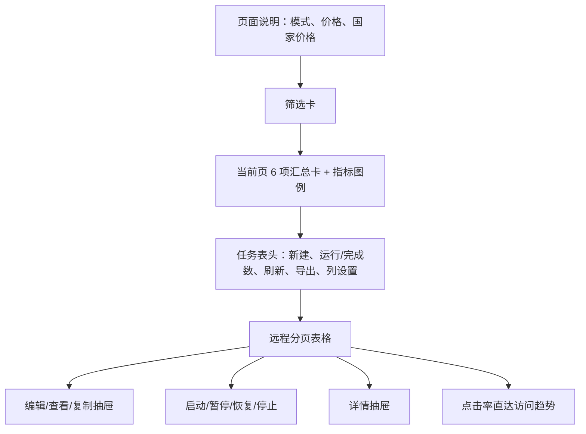

# 超链任务列表设计

> 状态：设计冻结候选，2026-08-28。本文是 H1，只负责列表页面及列表 CSV 导出。
> 公共 HTTP、DTO、状态、指标、权限和错误以
> [`2026-08-28-hyperlink-task-shared-contract.md`](./2026-08-28-hyperlink-task-shared-contract.md) v1.1 为准；
> 物理表与索引以 [`hyperlink-marketing-data-model.md`](../../business/hyperlink-marketing-data-model.md) §4 为准。

## 1. 目标与不可删能力

Armada 必须完整复刻竞品 `/hyperlink/task` 列表的可见能力：模式/价格说明、筛选、当前页指标卡、状态图例、
完整表格、列设置、手动刷新、CSV 导出、新建入口，以及每种状态对应的启动/暂停/恢复/停止、编辑/查看、详情和复制。

本方案不实现任务表单、详情 Tab 或生命周期内部事务；它只提供入口并消费 H2～H6/H3 的公共动作。
不存在删除按钮、批量删除、自动刷新和隐式轮询。唯一轮询例外是 H3 提交后的短期准备状态，不属于本页面常驻行为。

### 1.1 竞品证据与处理结论

| ID | 观察到的能力 | 证据 | 结论 |
|---|---|---|---|
| E-H1-01 | 任务名、状态、任务类型、目标国家、创建时间 5 类筛选及重置/搜索 | `task-0vbZUOmq.js:228-449` | 原样实现 |
| E-H1-02 | 页大小 10/20/50/100/200；任务名搜索时自动切 200 | `task-0vbZUOmq.js:4682-4698, 5619-5649` | 原样实现 |
| E-H1-03 | 页面展示普通/超级模式、价格、国家价格和三种任务模式说明 | `task-0vbZUOmq.js:5709-5898` | 原样实现，价格来自后端上下文 |
| E-H1-04 | 6 张当前页卡：任务数、发送总数、单钩、双钩、点击 UV、点击率 | `task-0vbZUOmq.js:5651-5710, 5899-5947` | 原样实现 |
| E-H1-05 | ID 到操作共 15 个逻辑列，支持横向滚动和列设置 | `task-0vbZUOmq.js:4836-5470, 5961-5974` | 全量实现，默认列不可少 |
| E-H1-06 | 未开始启动/编辑，进行中暂停/停止，暂停后恢复/停止；其余查看；所有任务都有详情/复制 | `task-0vbZUOmq.js:5369-5469` | 后端状态机再次校验 |
| E-H1-07 | 点击率是可点击入口，直接打开详情访问趋势 | `task-0vbZUOmq.js:5264-5312, 5618-5623` | 原样实现 |
| E-H1-08 | 列表 CSV 有 26 列，但竞品把 3/4 消息类型错误导成单图文 | `task-0vbZUOmq.js:5477-5576` | 保留导出能力，修正 1～4 映射 |
| E-H1-09 | 页面只有刷新按钮，并提示后端数据约每分钟同步 | `task-0vbZUOmq.js:5939-5960` | 不增加自动刷新 |
| E-H1-10 | 原始接口为 GET 列表，动作是 POST `{action}` | `router-CPQmbuR9.js:45952-46018` | 路径/DTO 按 Armada 公共契约适配 |

证据状态均为 **Observed**。Armada 的租户权限、JSON 命名、乐观锁、服务端全量导出和准备回执属于
**Adapted**，用于接入现有架构，不减少竞品功能。

## 2. 页面与交互

### 2.1 页面结构



前端目录固定在 `wheel-saas-pure-web/src/views/hyperlink/task/`，不要放进通用 `task/`：

```text
src/api/hyperlink-task.ts
src/views/hyperlink/task/index.vue
src/views/hyperlink/task/components/HyperlinkTaskIntro.vue
src/views/hyperlink/task/components/HyperlinkTaskSearchCard.vue
src/views/hyperlink/task/components/HyperlinkTaskMetrics.vue
src/views/hyperlink/task/components/HyperlinkTaskTable.vue
src/views/hyperlink/task/components/HyperlinkTaskRowActions.vue
src/views/hyperlink/task/composables/useHyperlinkTaskPage.ts
src/views/hyperlink/task/domain/list-display.ts
```

表格使用 `PureTableBar` + `@pureadmin/table`/`ElTable`，分页使用 `ElPagination`，确认使用 `ElPopconfirm`，
禁止自绘表格、分页、弹框和列设置。页面容器只装配，数据加载/筛选/动作放 composable，展示公式放纯函数。

### 2.2 顶部说明区

必须展示：

- 标题“WhatsApp 超链群发”和 `Hyperlink` 徽标。
- 当前运行价码是普通模式还是超级模式；超级模式增加明显徽标和加速说明。
- 当前参考单价与分国家价格标签；读取 `GET /api/hyperlink-tasks/create-context`，不写死金额。
- “一个任务 = 一个数据包 + 一组账号筛选 + 一条 WhatsApp 消息”的说明。
- 即时、预发布、周期三种模式说明，以及运行中可暂停、恢复、停止。

上下文失败不阻塞列表查询：价格位置显示“价格加载失败，点击重试”，但不能用 0 或假价格兜底。

### 2.3 筛选与分页

| UI 字段 | Query 字段 | 行为 |
|---|---|---|
| 任务名 | `taskName` | trim 后模糊查询；Enter 搜索 |
| 状态 | `runStatus` | 未开始 0、进行中 1、已完成 2、已暂停 3、已停止 4；不增加“已停用”选项 |
| 任务类型 | `taskMode` | 全部、`instant`、`rolling`、`cycle` |
| 目标国家 | `countryIso2` | 可搜索/清空，ISO2 精确命中任务国家快照中的任一国家 |
| 创建时间 | `createdAtStart/createdAtEnd` | epoch 毫秒，左闭右开 |

首次进入及重置后为第 1 页、20 条。普通搜索保持用户已选页大小并回第 1 页；为复刻竞品，任务名非空时
页大小自动切至 200，清空任务名后恢复 20。用户之后仍可手动选 10/20/50/100/200。

搜索期间保留旧表格并显示 loading；失败后保留筛选条件，表格进入可重试错误态，不能悄悄显示空数据。
空结果区分“暂无超链任务”和“当前条件没有结果”。

### 2.4 当前页指标卡

指标只对本次分页响应的 `list` 做前端汇总，不请求全库聚合：

| 卡片 | 公式 | 展示 |
|---|---|---|
| 任务数 | 当前页行数 | 整数 |
| 发送总数 | `Σ recipientTotal` | 保持竞品页面口径，实际是当前页受众总数 |
| 单钩数 | `Σ successNum` | 绿色单钩图标 |
| 双钩数 | `Σ deliveredNum` | 蓝色双钩图标，同时显示 `Σdelivered/Σsuccess` |
| 点击 UV | 仅 `shortLinkEnabled=true` 行的 `Σ clickUvNum` | 蓝色点击图标 |
| 点击率 | 上述 `ΣclickUvNum / ΣsuccessNum` | 两位小数，分母 0 显示 `-` |

卡片下方必须保留图例：单钩定义、双钩定义、双钩延迟提示、“预计落地率≈双钩率+20 个百分点”，以及
“本页面数据每 1 分钟同步一次”。提示同时说明“基于本页已加载任务”；禁止把当前页数字伪装成全部任务统计。

### 2.5 表格列

默认列顺序和功能如下，用户可以在列设置中隐藏非固定列，但不能永久删掉列定义：

| # | 列 | 字段/渲染规则 |
|---:|---|---|
| 1 | ID | `id` |
| 2 | 任务名称 | 名称、消息类型徽标、任务模式徽标及 tooltip、推广链接 |
| 3 | 数据包 | `dataPackageName` + `recipientTotal`；未选显示 `-` |
| 4 | 账号范围 | `accountFilter` 归一化标签；最多 3 个，剩余 `+N` tooltip；空为“未限制” |
| 5 | 营销目标国家 | `targetCountryIso2s` 国家标签；多国紧凑展示并可查看全部 |
| 6 | 状态 | `enabled=false` 优先显示已停用，否则按 `runStatus` |
| 7 | 账号统计 | 使用号数、封号数、号均发量 |
| 8 | 进度 | 单钩/失败/总受众，未开通 WS 数与占受众比例，绿/红进度条 |
| 9 | 双钩数/双钩率 | 双钩数、双钩率；tooltip 展示定义、延迟和预计落地率 |
| 10 | 点击 UV/点击率 | 未追踪显示 `-`；有值时点击率按钮直达 H6 访问趋势 |
| 11 | 最大执行账号数 | `actualConcurrency`，无值 `-` |
| 12 | 已执行时长 | `executionDurationSec` 格式化为 s/m/h |
| 13 | 结束/周期 | 即时 `-`；预发布结束时间；周期“每 N 分钟/小时/天” |
| 14 | 创建时间 | 系统时区显示 |
| 15 | 操作 | 固定右侧，宽度容纳双列按钮 |

第 8 列的可视进度按竞品使用 `successNum/recipientTotal` 和 `failedNum/recipientTotal`；它表达整包处理进度，
不替代公共合同里统计意义上的 `successNum/sendTotal`。`unregisteredNum` 是 `failedNum` 子集，不能再叠加到失败条宽度。

账号筛选摘要必须覆盖公共合同 `HyperlinkAccountFilter` 的全部字段，包括包含/排除国家、大洲、在线状态、手机号、
导入批次、协议、业务组、渠道、入库时间、好友/存活/注册区间、账号类型、平台、设备类型、导入方式、来源和拉群权限；
未知值显示稳定回退文本，不能直接丢掉。

### 2.6 行操作与入口

| 条件 | 操作 |
|---|---|
| `runStatus=0` | 启动、编辑、详情、复制 |
| `runStatus=1` | 暂停、停止、查看、详情、复制 |
| `runStatus=2` | 查看、详情、复制 |
| `runStatus=3` | 恢复、停止、查看、详情、复制 |
| `runStatus=4` | 查看、详情、复制 |

- 启动确认显示任务名，并先进入 H3 START 报价/确认流程；不能只发一个裸 action。
- 暂停提示“暂停后可恢复”；恢复提示“继续按原策略发送”；停止必须提示“终止后无法恢复”。
- 动作按钮提交期间只禁用本行同类按钮；成功使用回执更新行并刷新，冲突时提示并刷新事实状态。
- 编辑、查看、复制打开 H2 同一个抽屉的不同模式；详情打开 H4 公共详情抽屉。
- 点击率打开详情抽屉的 `visit-trend` Tab，并默认 H6 定义的 24 小时窗口。竞品列表 aria-label 中残留的
  “最近 6 小时”与实际趋势组件默认 24 小时冲突，Armada 以真实可见控件和请求参数为准，不复制这处文案缺陷。
- 所有按钮同时受后端权限和状态控制；没有 `delete` 按钮。

## 3. API 与后端查询

### 3.1 列表请求

```typescript
interface HyperlinkTaskListQuery {
  page: number;
  pageSize: 10 | 20 | 50 | 100 | 200;
  taskName: string | null;
  runStatus: 0 | 1 | 2 | 3 | 4 | null;
  taskMode: "instant" | "rolling" | "cycle" | null;
  countryIso2: string | null;
  createdAtStart: number | null;
  createdAtEnd: number | null;
}

interface HyperlinkTaskListItem extends HyperlinkTaskIdentity, HyperlinkTaskMetrics {
  promotionLink: string | null;
  dataPackageId: number | null;
  dataPackageName: string | null;
  accountFilter: HyperlinkAccountFilter;
  targetCountryIso2s: string[];
  plannedEndAt: number | null;
  cycleIntervalMinutes: number;
  createdAt: number;
}
```

`GET /api/hyperlink-tasks` 返回 `PageResult<HyperlinkTaskListItem>`，固定按 `created_at DESC, id DESC`。
任务名使用转义后的 `LIKE`；国家使用任务冻结快照；所有条件显式带当前 `tenant_id`，且只返回
`provision_status IN (NOT_REQUIRED, READY)`。列表一次 JOIN task/content/runtime，禁止逐行再查数据包、指标或账号统计。

读取来源：

| 响应信息 | 来源 |
|---|---|
| 低频配置、数据包/国家/筛选快照 | `hyperlink_task` |
| 消息类型、推广链接 | `hyperlink_task_content` |
| 双状态、发送/点击/账号投影、时长 | `hyperlink_task_runtime` |

`accountFilter` 已在 task 保存快照；列表不得为显示摘要去查当前账号表。号均发量由响应层按公共公式计算，
不读取 `hyperlink_task_account_stat`。`executionDurationSec` 运行中按 runtime 当前运行段实时计算。

### 3.2 列表导出

`GET /api/hyperlink-tasks/export` 接收与列表相同筛选、忽略分页，返回同步 CSV。导出当前筛选的全部命中任务，
不是仅导出浏览器当前页；这是对竞品客户端当前页导出的可靠性修正，按钮和用户能力不减少。

CSV 固定 26 列：ID、任务名称、推广链接、消息类型、营销目标国家、数据包、数据包号码数、账号范围、状态、
双钩数、双钩率、点击 UV 数、点击率、单钩数、失败数、未开通 WS、受众总数、使用号数、封号数、号均发量、
最大执行账号数、已执行时长、任务模式、计划结束时间、周期间隔、创建时间。

消息类型必须正确映射 1=单图文、2=双图文、3=普通按钮、4=卡片按钮；不能复制竞品把 3/4 导成单图文的错误。
账号筛选导出全部标签，不受列表“最多 3 个”限制。点击未开启时输出 `-`。

### 3.3 服务边界与权限

后端新增 `com.armada.hyperlink.task` 业务域：

```text
controller/HyperlinkTaskController
service/HyperlinkTaskQueryService
service/impl/HyperlinkTaskQueryServiceImpl
mapper/HyperlinkTaskMapper
model/dto/HyperlinkTaskListQuery
model/vo/HyperlinkTaskListItemVO
converter/HyperlinkTaskConverter
```

Controller 只做参数、认证和文件响应；Service 校验时间/国家/分页并组装派生字段；Mapper 完成租户化分页查询。
列表需要 `tenant:hyperlink_task:view`，导出需要 `tenant:hyperlink_task:export`，新建及各行操作按公共权限逐按钮控制。

## 4. 状态、错误与并发

- 列表请求用递增 request sequence 或取消前请求，晚返回结果不得覆盖新筛选。
- 手动刷新保留当前筛选、页码、页大小和列设置；筛选/重置才回第 1 页。
- Action 带当前 `version`。`40910` 后刷新行，不能乐观地保留错误状态。
- 导出期间按钮 loading；业务错误显示后端稳定消息，不下载错误 JSON 伪装成 CSV。
- `metricsUpdatedAt` 只展示发送指标新鲜度；点击数字可能更新更快，不触发前端自动轮询。
- 列设置存当前用户+租户+页面键，未知/新增列按默认策略合并，不能因为旧缓存永远隐藏新功能列。

## 5. 实施顺序与验收

1. 后端实现列表 Query/VO、Mapper 和导出，先用 H2 数据库测试锁定租户、筛选、排序和投影字段。
2. 前端实现展示纯函数和 API 类型，再实现 composable、页面区块和跨 H2/H3/H4/H6 入口。
3. 接入权限与错误态，最后用竞品截图尺寸核对横向表格和按钮矩阵。

验收必须覆盖：

- 5 类筛选、重置、Enter 搜索、任务名自动 200、五种页大小和远程分页。
- 普通/超级模式、参考价格、国家价标签、三模式说明及上下文失败重试。
- 6 张当前页卡及深度追踪分母；空页、部分任务未追踪和分母为 0。
- 15 个逻辑列、完整 tooltip、账号筛选全部标签、列设置、横向滚动、手动刷新。
- 五种运行状态和已停用优先级；启动/暂停/恢复/停止确认及编辑/查看/详情/复制全部入口。
- 点击率直达访问趋势；未追踪显示 `-` 且不可点击。
- 26 列 CSV、1～4 消息类型、全部筛选导出、UTF-8 中文文件名和无数据表头。
- Mapper H2：租户隔离、任务名转义、国家 JSON 命中、创建时间左闭右开、准备中任务不可见、稳定翻页。
- 10 万 recipient 的存在不影响列表查询：列表只读 1:1 task/content/runtime，验收 SQL 不得关联 recipient。

以下任何一项缺失都不算 H1 完成：新建、列设置、导出、刷新、任一行操作、价格/模式说明、任一默认列或点击率跳转。
