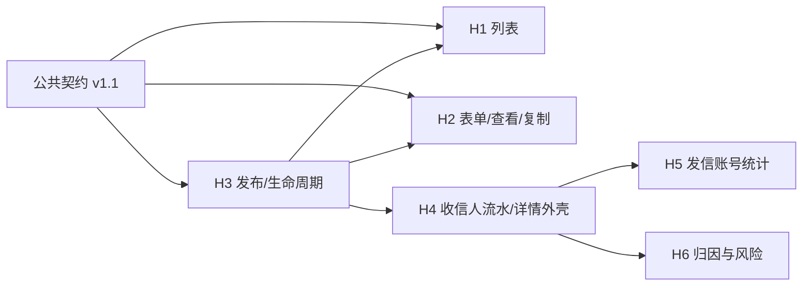

# 超链任务公共契约

> **冻结版本：v1.1，2026-08-28。** 本文是后续六份超链任务方案共同遵守的跨方案合同。
> 它只冻结 HTTP、共享 DTO、枚举、指标、权限、错误和职责边界，不复制数据库字段全集，也不展开单个页面的
> 组件、SQL、事务和测试实现。

## 0. 效力与使用方式

后续方案开始设计前必须先引用本文，不得各自重新定义同名字段或口径：

1. 超链任务列表。
2. 任务表单与查看/复制。
3. 任务发布与生命周期。
4. 详情——收信人流水统计。
5. 详情——发信账号维度统计。
6. 详情——归因与风险分析。

发生冲突时按以下顺序处理：

1. 用户本次明确确认的业务口径。
2. 本文的 HTTP 路径、JSON 字段、API 枚举、指标公式、权限和跨方案边界。
3. [`hyperlink-marketing-data-model.md`](../../business/hyperlink-marketing-data-model.md) §4 的物理表、字段、索引和写入规则。
4. [`2026-08-27-hyperlink-task-competitor-parity-detailed-design.md`](./2026-08-27-hyperlink-task-competitor-parity-detailed-design.md) 的竞品页面行为。
5. 六份后续方案各自的内部实现。

任何方案如果需要改变本文，必须先修改本文版本和变更记录，再同步其余受影响方案。不能在某一份方案中
悄悄定义第二种状态、统计公式或字段名。

明确不在本文重复维护的内容：10 张任务表的完整 DDL、账号筛选 SQL、调度事务、计费 Saga、协议私聊实现、
各页面全部列和组件树。这些分别由数据模型和对应方案负责。

## 1. 六份方案的职责边界

### 1.1 方案与接口所有权

| 编号 | 方案 | 主要交付 | 接口所有权 |
|---|---|---|---|
| H1 | 超链任务列表 | 筛选、当前页卡片、表格、列设置、刷新、列表导出、行操作入口 | `GET /api/hyperlink-tasks`、`GET /api/hyperlink-tasks/export` |
| H2 | 任务表单与查看/复制 | 四段表单、预览、模板/策略/数据包/素材选择、查看回填、复制预填、前端校验 | `GET /api/hyperlink-tasks/{id}`、`GET /api/hyperlink-tasks/create-context`、`POST /api/hyperlink-tasks/account-match-count`；共同定义 Save DTO |
| H3 | 任务发布与生命周期 | 报价、7 秒核对、创建/编辑编排、计费、领号、首轮、启动/暂停/继续/停止、准备状态 | `POST/PUT /api/hyperlink-tasks`、`POST /quote`、`GET /{id}/provision-status`、`POST /{id}/action` |
| H4 | 收信人流水统计 | 详情抽屉公共外壳、顶部摘要、状态图例、收信人查询/导出、详情公共导出作业外壳 | `GET /{id}/summary`、`GET /{id}/recipients`、`POST /{id}/recipients/export`、`GET /api/hyperlink-task-exports/{jobId}` 及下载 |
| H5 | 发信账号维度统计 | 默认累计查询、时间范围精确查询、未分配桶、排序和导出 | `GET /{id}/account-stats`、`POST /{id}/account-stats/export` |
| H6 | 归因与风险分析 | 公网短链落点、深度归因、访问趋势、封号原因三个 Tab 及导出 | `GET /api/public/hl/{shortCode}`、`GET /{id}/clicks`、`POST /{id}/click-attribution/export`、`GET /{id}/visit-trend`、`POST /{id}/visit-trend/export`、`GET /{id}/ban-stats` |

所有路径的 `{id}` 都是任务 ID，完整前缀均为 `/api/hyperlink-tasks`。表中的省略写法不能被实现成另一个前缀。

`POST/PUT /api/hyperlink-tasks` 是 H2 与 H3 的唯一交界：H2 冻结表单字段、回填和客户端校验，H3 负责服务端
应用编排和事务结果。接口只能有一套 Save DTO，禁止为了两个方案另建 `DraftSaveDTO` 和 `PublishSaveDTO`。

复制不是独立后端动作：H2 读取源任务、前端复制可编辑字段、任务名追加“副本”、清空数据包并以创建模式
调用 `POST /api/hyperlink-tasks`，请求用 `sourceTaskId` 标识复制来源。不新增 `/copy` 接口，也不继承源任务的
计费、recipient、round 和运行统计；`sourceTaskId` 只用于租户校验、重新报价和审计，不作为运行时绑定。

### 1.2 设计与实施依赖



设计文档可以按 H1→H6 顺序逐份完成；代码集成时，H3 的状态、运行投影和写入链是 H1/H2/H4 的后端前置，
H5/H6 复用 H4 交付的详情抽屉外壳与顶部摘要，不再各建一个详情弹框。

## 2. 通用 HTTP 合同

### 2.1 路径、命名和响应

- 租户业务路径统一使用 `/api/hyperlink-tasks`，不实现竞品 `/api/admin/**` 兼容路径。
- JSON 和查询参数使用 `camelCase`；数据库使用 `snake_case`，禁止直接暴露列名。
- 除文件下载和公网短链外，全部返回现有 `ApiResponse<T>`。
- 分页接口的 `data` 统一为现有 `PageResult<T>`，禁止各方案自造分页信封。
- 请求不接收 `tenantId`。租户只来自认证上下文，每个 task 查询先校验任务属于当前租户。

```typescript
interface ApiResponse<T> {
  code: number;
  message: string;
  data: T | null;
}

interface PageResult<T> {
  list: T[];
  page: number;
  pageSize: number;
  total: number;
  totalPages: number;
}
```

成功时 `code=0`、`message="ok"`。可恢复业务错误沿用现有全局行为：HTTP 200、`data=null`、前端以
`code !== 0` 判错；认证失效、拒绝访问和认证基础设施不可用仍分别使用 HTTP 401、403、503。

### 2.2 分页、排序、时间和空值

- `page` 从 1 开始；任务页面默认 `pageSize=20`，可选 10/20/50/100/200。
- 后端使用现有 `PageQuery`，并在任务 Query DTO 额外把交互式查询上限钳制为 200；导出不使用 `page/pageSize`。
- 需要排序的接口统一使用 `sortField`、`sortOrder=asc|desc`。每份方案必须列出自己的字段白名单；未知字段
  返回 `40001`，禁止拼接为 SQL。
- 所有请求和响应时间统一为 epoch 毫秒 `number`，表示 UTC 时刻；前端按系统时区显示，不传格式化字符串。
- 时间范围统一为 `[startAt, endAt)` 左闭右开；只传一端或 `startAt>=endAt` 返回 `40001`。
- ID 沿用当前项目合同为 `number`；手机号必须是字符串，禁止转为数字。
- ISO2 使用大写两位字符串；未知国家在响应中为 `null`，筛选选项的未知值使用 `UNKNOWN`。
- 响应字段必须存在：对象无值用 `null`，数组无值用 `[]`，计数无值用 `0`。
- 请求字符串先 trim；空串按 `null` 处理。数组去重后保存，空数组与未限定等价。

### 2.3 导出

- 五类导出固定为：任务列表、收信人流水、发信账号统计、深度归因、访问趋势。
- 导出复用当前页面的全部筛选和排序，但忽略分页；列顺序由对应方案冻结。
- 任务列表行数低，`GET /api/hyperlink-tasks/export` 直接返回 CSV 附件；必须带 UTF-8
  `Content-Disposition`、`X-Export-Count`，并暴露两个响应头。
- 四类详情导出可能达到 10 万行，统一 `POST` 创建异步作业，复用现有 `marketing_export_job` 的租约、快照、
  状态轮询、文件保留和过期清理能力，不能退回同步大查询。

```typescript
type HyperlinkTaskExportType =
  | "RECIPIENTS"
  | "ACCOUNT_STATS"
  | "ATTRIBUTION"
  | "VISIT_TREND";

type HyperlinkTaskExportStatus =
  | "PENDING"
  | "PROCESSING"
  | "SUCCESS"
  | "FAILED"
  | "EXPIRED";

interface HyperlinkTaskExportJob {
  id: number;
  exportType: HyperlinkTaskExportType;
  status: HyperlinkTaskExportStatus;
  snapshotAt: number;
  fileName: string | null;
  rowCount: number;
  errorMessage: string | null;
  createdAt: number;
  finishedAt: number | null;
  downloadReady: boolean;
}
```

- 创建详情导出成功返回 HTTP 202 + `ApiResponse<HyperlinkTaskExportJob>`；前端只在 PENDING/PROCESSING 时
  轮询 `GET /api/hyperlink-task-exports/{jobId}`，终态立即停止。
- SUCCESS 后通过 `GET /api/hyperlink-task-exports/{jobId}/download` 下载；只能访问当前租户、当前用户创建的作业，
  不能接收客户端文件路径。
- CSV 使用 `text/csv;charset=UTF-8` 和 UTF-8 BOM。文件名为
  `{业务英文名}-{taskId可选}-{yyyyMMddHHmmss}.csv`。
- `snapshotAt` 在创建作业时冻结，后续批次查询都加同一统计截止条件，避免长导出前后页口径漂移。
- 查询必须分批读取并流式/分段写出，不能一次 `SELECT *` 把 10 万行及宽字段全部装入内存。
- 没有命中数据时仍生成只有表头的合法 CSV，`rowCount=0`。

## 3. 公共枚举与状态

### 3.1 API 枚举

| 类型 | API 值 | 数据库存储 | 说明 |
|---|---|---:|---|
| `HyperlinkMessageType` | `1` | 1 | 单图文；新建可选 |
|  | `2` | 2 | 双图文；只读兼容，新建拒绝 |
|  | `3` | 3 | 普通按钮；新建默认 |
|  | `4` | 4 | 卡片按钮；新建可选 |
| `HyperlinkTaskMode` | `instant` | 1 | 即时群发 |
|  | `rolling` | 2 | 预发布 |
|  | `cycle` | 3 | 周期循环 |
| `HyperlinkTaskStartMode` | `now` | 1 | 立即执行 |
|  | `scheduled` | 2 | 延后指定分钟 |
| `HyperlinkTaskAction` | `START` | — | 未开始→进行中 |
|  | `PAUSE` | — | 进行中→已暂停 |
|  | `RESUME` | — | 已暂停→进行中 |
|  | `STOP` | — | 进行中/已暂停→已停止，终态 |
| `HyperlinkRecipientStatus` | `PENDING` | 1 | 待发 |
|  | `SENDING` | 2 | 已有唯一 command，等待结果 |
|  | `SUCCESS` | 3 | 至少单钩 |
|  | `DELIVERED` | 4 | 至少双钩 |
|  | `READ` | 5 | 已读 |
|  | `FAILED` | 6 | 最终失败 |
|  | `UNREGISTERED` | 7 | 确认未开通 WhatsApp；属于失败子集 |
| `SortOrder` | `asc` / `desc` | — | 排序方向 |

按钮类型固定为 `CTA_URL`。任务按钮必须恰好一个；通用组件中的复制、电话和快捷回复按钮不进入任务 DTO。

### 3.2 任务双状态

对外字段固定为 `enabled:boolean` 与 `runStatus:number`：

| `enabled` | `runStatus` | 页面展示 | 允许操作 |
|---:|---:|---|---|
| `false` | 任意历史值 | 已停用 | 未开始时可编辑/启动；可查看、复制、详情 |
| `true` | 0 | 未开始 | 启动、编辑、详情、复制 |
| `true` | 1 | 进行中 | 暂停、停止、查看、详情、复制 |
| `true` | 2 | 已完成 | 查看、详情、复制 |
| `true` | 3 | 已暂停 | 继续、停止、查看、详情、复制 |
| `true` | 4 | 已停止 | 查看、详情、复制 |

`enabled=false` 的展示优先级最高。Action 必须由后端条件更新校验，前端操作矩阵不能充当状态保护。
任务不存在删除按钮、删除权限和删除 API。

准备状态 `provisionStatus` 只用于 H3 创建、编辑和 START 回执，不进入正常任务列表状态筛选：

```typescript
type HyperlinkProvisionStatus = "NOT_REQUIRED" | "PROCESSING" | "READY" | "FAILED";

interface HyperlinkTaskMutationReceipt {
  taskId: number;
  provisionStatus: HyperlinkProvisionStatus;
  enabled: boolean;
  runStatus: 0 | 1 | 2 | 3 | 4;
  version: number;
  pollAfterMs: number | null;
  failureCode: number | null;
  failureReason: string | null;
}

interface HyperlinkTaskActionRequest {
  action: "START" | "PAUSE" | "RESUME" | "STOP";
  version: number;
  quoteToken: string | null;              // START 必填，其余动作必须为 null
}
```

启用创建/编辑或从仅保存任务执行 START，使用分批领号和计费恢复链时可以返回 `PROCESSING`；调用方显示
“任务正在准备，完成后进入列表”，按 `pollAfterMs` 调用 `GET /{id}/provision-status`。这类短时轮询只服务
当前提交回执，不等于给列表增加自动刷新。
`READY` 后停止轮询并刷新列表；`FAILED` 展示后端原因。准备中/失败待恢复的半成品不进入正常租户列表。
返回 `PROCESSING` 时 POST/PUT 使用 HTTP 202 并继续包在 `ApiResponse` 中；同步完成为 READY/NOT_REQUIRED 时
使用 HTTP 200。START 的 Action 同样遵循 202/200 规则；PAUSE/RESUME/STOP 同步返回
`provisionStatus=NOT_REQUIRED`。前端不能把 HTTP 202 当失败，也不能省略 Action 的乐观锁 `version`。

### 3.3 收信人状态硬规则

- 同一任务、同一收信号码只有一行和一个业务 command，不跨账号重试。
- ACK 只能按 `PENDING → SENDING → SUCCESS → DELIVERED → READ` 单调推进；终态失败不被迟到 ACK 覆盖。
- `UNREGISTERED` 是失败子类型：计入 `failedNum`，同时计入 `unregisteredNum`。
- 停止任务时，未提交协议且没有 command 的 recipient 保存为 `FAILED`，
  `failCode=TASK_STOPPED`、`failReason=任务已停止`；不存在 `SKIPPED` 状态。
- `TASK_STOPPED` 行计入任务失败和未分配账号桶；只有已经分配 round 的行才计入对应 round。

## 4. 共享请求与响应模型

### 4.1 保存任务

```typescript
interface HyperlinkTaskSaveRequest {
  version: number | null;                 // 创建为 null，更新必填
  sourceTaskId: number | null;            // 复制创建必填；普通创建/更新为 null
  taskName: string;
  messageType: 1 | 2 | 3 | 4;
  messageContent: HyperlinkMessageContent;
  taskMode: "instant" | "rolling" | "cycle";
  plannedEndAt: number | null;
  cycleIntervalMinutes: number;
  accountFilter: HyperlinkAccountFilter;
  messageIntervalMinSeconds: number;
  messageIntervalMaxSeconds: number;
  maxExecutingAccounts: number;
  maxUseAccounts: number;
  maxSendPerAccount: number;
  startMode: "now" | "scheduled";
  delayMinutes: number;
  dataPackageId: number | null;
  enabled: boolean;
  quoteToken: string | null;
}

interface HyperlinkMessageContent {
  linkPreviewAssetId: number | null;
  title: string;
  linkDescription: string | null;
  promotionLink: string | null;
  bodyMainAssetId: number | null;
  content: string | null;
  cardText: string | null;
  buttons: HyperlinkButton[];
}

interface HyperlinkButton {
  type: "CTA_URL";
  displayText: string;
  url: string;
  useShortLink: boolean;
}
```

`messageInterval*Seconds` 是 API 层 0.1 秒精度小数，服务端规范化为整数毫秒写入任务表。普通 POST 创建且
`enabled=true`、`sourceTaskId=null` 时 `quoteToken` 必填；复制 POST 和未开始任务 PUT 由服务端按最新快照
重新报价，不复用源任务 token。`sourceTaskId` 只允许 POST，PUT 必须为 `null`。POST/PUT 固定使用
`application/json`；图片先经素材接口上传，再只提交稳定 AssetId，
不为任务保存接口增加 multipart 第二种合同。
`enabled=true` 时 `dataPackageId` 必填；仅保存不发送时可为 `null`。

### 4.2 创建上下文与报价

```typescript
type HyperlinkPricingMode = "NORMAL" | "SUPER";

interface HyperlinkTaskCreateContext {
  pricingMode: HyperlinkPricingMode;
  priceCode: string;
  currencyCode: string;
  referenceUnitPrice: number;
  accountBalance: number;
  giftBalance: number;
  availableBalance: number;               // accountBalance + giftBalance
  protocolCount: number;
  maxConcurrentNum: number;               // protocolCount * 15
  accountSendConcurrency: 20;
  defaultSubTaskNum: 50;
}

type HyperlinkTaskQuoteRequest =
  | {
      purpose: "CREATE";
      taskId: null;
      dataPackageId: number;
      taskMode: "instant" | "rolling" | "cycle";
      maxExecutingAccounts: number;
    }
  | {
      purpose: "START";
      taskId: number;
      dataPackageId: null;
      taskMode: null;
      maxExecutingAccounts: null;
    };

interface HyperlinkTaskQuoteBreakdown {
  recipientCountryIso2: string | null;
  recipientCount: number;
  unitPrice: number;
  amount: number;
}

interface HyperlinkTaskQuote {
  quoteToken: string;
  expiresAt: number;
  dataPackageId: number;
  dataPackageGeneration: number;
  dataPackageName: string;
  recipientCount: number;
  pricingMode: HyperlinkPricingMode;
  priceCode: string;
  currencyCode: string;
  unitPrice: number | null;                // 多国家不同单价时为 null
  pricingBreakdown: HyperlinkTaskQuoteBreakdown[];
  estimatedAmount: number;
  accountBalance: number;
  giftBalance: number;
  availableBalance: number;
}
```

`quoteToken` 由服务端签发并绑定租户、当前用户、数据包及代次、任务模式、运行价码、分国家人数、金额和失效时间；
客户端不能提交单价、人数、余额或预计金额。金额后端统一用 `BigDecimal` 计算和序列化，前端只展示服务端值，
不得用 JavaScript 浮点结果参与冻结。7 秒是确认按钮的交互倒计时，不是报价有效期；是否过期只看 `expiresAt`。

`referenceUnitPrice` 仅用于新建页顶部展示。最终冻结一律使用 `HyperlinkTaskQuote`；多国家差异价时必须展示
`pricingBreakdown` 和 `estimatedAmount`，不能拿参考单价乘总人数覆盖服务端结果。

START 报价完全读取未开始任务里已经保存的配置；客户端不得借 `purpose=START` 覆盖数据包、任务模式或并发。
仅保存任务没有数据包时不能 START，必须先编辑补全配置。复制和未开始编辑不展示竞品没有的第二次 7 秒弹框，
由保存编排在服务端按最新数据包快照重新报价并完成预约，任何余额不足或价格变化都整笔失败。

### 4.3 账号筛选

`accountFilter` 必须携带 `filterSchemaVersion=1`，由后端白名单归一化后整体快照。未知键拒绝并返回 `40001`，
不能静默落库；国家码大写、ID 数组去重、最小值不得大于最大值。

```typescript
interface HyperlinkAccountFilter {
  filterSchemaVersion: 1;
  countryIso2s: string[];
  excludeCountryIso2s: string[];
  continent: string | null;
  groupIds: number[];
  channelIds: number[];
  protocolId: string | null;
  onlineStatus: "ONLINE" | "OFFLINE" | null;
  rotationStatus: 0 | 1 | 2 | 3 | null;
  accountType: 1 | 2 | null;
  platform:
    | "ANDROID_PERSONAL"
    | "ANDROID_BUSINESS_PRIMARY"
    | "ANDROID_BUSINESS_COMPANION"
    | "IOS_PERSONAL"
    | "IOS_BUSINESS_PRIMARY"
    | "IOS_BUSINESS_COMPANION"
    | null;
  widType: "web5" | "native6" | null;
  importMode: "six_segment" | "full_param" | null;
  groupInviteAllowed: boolean | null;
  phone: string | null;
  importBatchId: number | null;
  source: 0 | 1 | 2 | 3 | 4 | null;      // 买量/自登/买入/转入/群扫码
  friendCountMin: number | null;
  friendCountMax: number | null;
  retentionDaysMin: number | null;
  retentionDaysMax: number | null;
  registerDaysMin: number | null;
  registerDaysMax: number | null;
  createdAtFrom: number | null;
  createdAtTo: number | null;
}
```

后端固定附加账号有效、未导出、未被陌生人禁言三个条件，不作为 JSON 可编辑字段。`groupInviteAllowed` 仍由
用户筛选。API 使用稳定字段 `importBatchId`，不暴露竞品不稳定的 `importNo` 命名。

```typescript
interface HyperlinkAccountMatchCount {
  availableAccountCount: number;
  protocolCount: number;
  maxConcurrentNum: number;               // protocolCount * 15
}
```

### 4.4 任务身份与指标

所有列表、详情摘要和导出共用同一组名称：

```typescript
interface HyperlinkTaskIdentity {
  id: number;
  taskName: string;
  messageType: 1 | 2 | 3 | 4;
  taskMode: "instant" | "rolling" | "cycle";
  enabled: boolean;
  runStatus: 0 | 1 | 2 | 3 | 4;
  shortLinkEnabled: boolean;
}

interface HyperlinkTaskMetrics {
  recipientTotal: number;
  sendTotal: number;
  successNum: number;
  deliveredNum: number;
  readNum: number;
  failedNum: number;
  unregisteredNum: number;
  usedAccountCount: number;
  invalidAccountCount: number;
  clickUvNum: number;
  clickTotal: number;
  actualConcurrency: number;
  executionDurationSec: number;
  metricsUpdatedAt: number | null;
}

interface HyperlinkTaskSummary extends HyperlinkTaskMetrics {
  id: number;
  taskName: string;
  firstVisitAt: number | null;
  lastVisitAt: number | null;
}
```

字段名统一使用 `failedNum`、`unregisteredNum`、`invalidAccountCount`；页面文案可分别显示“失败数”、
“未开通 WS”、“封号数”，但 API 不允许同时出现 `failNum/fail404Num/bannedCount` 等第二套别名。

`executionDurationSec` 由后端根据 runtime 的累计秒数与当前运行段起点计算后返回。`metricsUpdatedAt` 只表示
发送指标投影完成时间；点击入口更新 UV/PV 时不得推进该字段。

## 5. 指标与刷新口径

### 5.1 原始计数

| 字段 | 唯一口径 |
|---|---|
| `recipientTotal` | 任务冻结的去重收信人数，含后来因停止而失败的未发号码 |
| `sendTotal` | 唯一 command 已被协议通道接受的 recipient 数；`TASK_STOPPED` 未提交行不计 |
| `successNum` | 至少达到单钩的 recipient 数 |
| `deliveredNum` | 至少达到双钩的 recipient 数，是 `successNum` 子集 |
| `readNum` | 已读 recipient 数，是 `deliveredNum` 子集 |
| `failedNum` | 当前最终失败 recipient 数，包含未注册和 `TASK_STOPPED` |
| `unregisteredNum` | 明确未开通 WhatsApp 的 recipient 数，是 `failedNum` 子集 |
| `usedAccountCount` | 实际至少分配过一个 recipient 的发信账号去重数 |
| `invalidAccountCount` | 本任务执行期首次封号/失效的发信账号去重数 |
| `clickUvNum` | `click_count>0` 的 recipient 数 |
| `clickTotal` | 所有 recipient.`click_count` 之和，即辅助 PV |

一个 recipient 只按当前最终状态贡献一次指标。乱序 ACK、投影重放和 reconciliation 不得重复计数。

### 5.2 派生指标

比率不落数据库，由前端共享计算工具和后端导出计算工具使用同一公式：

```text
单钩率       = successNum / sendTotal
双钩率       = deliveredNum / successNum
点击率       = clickUvNum / successNum
封号率       = invalidAccountCount / usedAccountCount
号均发量     = successNum / usedAccountCount
预计落地率   = min(99%, 双钩率 + 20 个百分点)
人均访问次数 = clickTotal / clickUvNum
```

分母为 0 时返回 0。百分比展示保留两位小数、`HALF_UP`；号均发量和人均访问次数保留一位小数、`HALF_UP`。
计算时先用完整精度，最后一步才舍入。预计落地率是经验值，必须标注“仅作参考”。

任务列表顶部六张卡只汇总**当前加载页**。其中点击率只取 `shortLinkEnabled=true` 的当前页任务：这些行的
`clickUvNum` 求和除以这些行的 `successNum` 求和；不能把未开启深度追踪的成功数放进分母，不能调用全库汇总
接口冒充当前页，也不能逐行百分比再平均。

### 5.3 数据新鲜度

- 任务列表和详情保留手动刷新，不增加常驻自动刷新。
- ACK 先写 recipient/account_usage，runtime/round/account_stat 由幂等投影器约每分钟合并。
- 页面显示“聚合数据约每分钟同步一次”，时间取 `metricsUpdatedAt`。
- 点击事务直接更新 recipient 与 runtime 点击计数，因此点击可能比发送投影更新得更快；它不改变
  `metricsUpdatedAt` 的发送指标含义。
- 只有创建/编辑后 `provisionStatus=PROCESSING` 的短生命周期轮询属于例外，READY/FAILED 后必须停止。

## 6. 公共接口索引

| Method | Path | 请求/响应 `data` | 权限 | 方案 |
|---|---|---|---|---|
| GET | `/api/hyperlink-tasks` | Query → `PageResult<HyperlinkTaskListItem>` | `view` | H1 |
| GET | `/api/hyperlink-tasks/export` | 同列表筛选/排序 → CSV | `export` | H1 |
| GET | `/api/hyperlink-tasks/create-context` | — → `HyperlinkTaskCreateContext` | `create` | H2 |
| POST | `/api/hyperlink-tasks/account-match-count` | `HyperlinkAccountFilter` → `HyperlinkAccountMatchCount` | `create` 或 `edit` | H2 |
| GET | `/api/hyperlink-tasks/{id}` | — → `HyperlinkTaskDetail` | `view` | H2 |
| POST | `/api/hyperlink-tasks/quote` | `HyperlinkTaskQuoteRequest` → `HyperlinkTaskQuote` | `create` 或 `action` | H3 |
| POST | `/api/hyperlink-tasks` | `HyperlinkTaskSaveRequest` → `HyperlinkTaskMutationReceipt` | `create` | H3 |
| PUT | `/api/hyperlink-tasks/{id}` | `HyperlinkTaskSaveRequest` → `HyperlinkTaskMutationReceipt` | `edit` | H3 |
| GET | `/api/hyperlink-tasks/{id}/provision-status` | — → `HyperlinkTaskMutationReceipt` | `view` | H3 |
| POST | `/api/hyperlink-tasks/{id}/action` | `HyperlinkTaskActionRequest` → `HyperlinkTaskMutationReceipt` | `action` | H3 |
| GET | `/api/hyperlink-tasks/{id}/summary` | — → `HyperlinkTaskSummary` | `view` | H4 |
| GET | `/api/hyperlink-tasks/{id}/recipients` | Query → `PageResult<HyperlinkRecipientItem>` | `view` | H4 |
| POST | `/api/hyperlink-tasks/{id}/recipients/export` | 同 Tab 筛选/排序 → `HyperlinkTaskExportJob` | `export` | H4 |
| GET | `/api/hyperlink-tasks/{id}/account-stats` | Query → `PageResult<HyperlinkAccountStatItem>` | `view` | H5 |
| POST | `/api/hyperlink-tasks/{id}/account-stats/export` | 同 Tab 筛选/排序 → `HyperlinkTaskExportJob` | `export` | H5 |
| GET | `/api/hyperlink-tasks/{id}/clicks` | Query → `PageResult<HyperlinkAttributionItem>` | `view` | H6 |
| POST | `/api/hyperlink-tasks/{id}/click-attribution/export` | 同 Tab 筛选/排序 → `HyperlinkTaskExportJob` | `export` + `attribution_sensitive` | H6 |
| GET | `/api/hyperlink-tasks/{id}/visit-trend` | Query → `HyperlinkVisitTrend` | `view` | H6 |
| POST | `/api/hyperlink-tasks/{id}/visit-trend/export` | 同趋势窗口/粒度 → `HyperlinkTaskExportJob` | `export` | H6 |
| GET | `/api/hyperlink-tasks/{id}/ban-stats` | — → `HyperlinkBanStats` | `view` | H6 |
| GET | `/api/hyperlink-task-exports/{jobId}` | — → `HyperlinkTaskExportJob` | `export` | H4 公共外壳 |
| GET | `/api/hyperlink-task-exports/{jobId}/download` | — → CSV 文件 | `export`；归因作业另需敏感权限 | H4 公共外壳 |
| GET | `/api/public/hl/{shortCode}` | 无效码 404；有效码记录访问后 302 | 公网入口，不使用租户权限 | H6 |

具体 Query、列表元素和 CSV 列由所属方案补齐；不能改变本表已有路径、公共字段或权限语义。

依赖资源接口继续复用现有模块，不由 H1～H6 重复实现：模板 options/detail、策略 options、
`GET /api/data-packages?forTask=true`、素材列表/上传、业务组/渠道选项和协议汇总。

## 7. 权限、敏感数据与审计

固定权限：

```text
tenant:hyperlink_task:view
tenant:hyperlink_task:create
tenant:hyperlink_task:edit
tenant:hyperlink_task:action
tenant:hyperlink_task:export
tenant:hyperlink_task:attribution_sensitive
```

没有 `delete` 权限。Controller 必须做后端方法级鉴权，前端权限只控制按钮展示。

- 普通深度归因列表需要 `view`；没有敏感权限时 IP、原始 UA 字段返回 `null`，同时返回
  `sensitiveVisible=false`，其他国家/设备/浏览器等派生字段按保留期正常展示。
- 深度归因完整导出同时要求 `export` 和 `attribution_sensitive`；其余导出只要求 `export`。
- 首触 IP、UA、设备、系统、浏览器、语言和访问国家保留 90 天；清理后返回
  `attributionPurged=true`，不能把已清理伪装成从未采集。
- 创建、编辑、START/PAUSE/RESUME/STOP、五类导出、敏感字段读取，以及计费冻结/调整/结算/释放全部写审计。
- 日志和错误消息不得打印完整手机号、短码目标 URL 参数、quoteToken、原始 UA 或 IP。

公网 `GET /api/public/hl/{shortCode}` 不使用租户认证，只允许按全局唯一、大小写精确的短码反查 recipient；
无效码返回 404，成功记录首触/累计访问后 302 到任务内容冻结的原始 URL。该入口不接受外部 `tenantId/taskId`。

## 8. 公共错误合同

不得依赖中文 `message` 做流程分支。实施 H3 时在共享 `ErrorCode` 增加下列稳定业务码，其余普通字段校验继续
使用现有通用码：

| `code` | 名称 | 使用场景 |
|---:|---|---|
| `40001` | `VALIDATION` | 字段、筛选、排序、时间范围、按钮或模式参数非法 |
| `40401` | `NOT_FOUND` | 当前租户下任务、数据包、模板、策略或素材不存在 |
| `40910` | `HYPERLINK_TASK_STATE_CONFLICT` | 状态/版本已变化、运行后编辑、非法 Action |
| `40911` | `HYPERLINK_QUOTE_STALE` | 报价过期或实际可领取人数变化，必须重新核对 |
| `40912` | `HYPERLINK_BALANCE_INSUFFICIENT` | 可用余额不足，不能进入派发 |
| `42210` | `HYPERLINK_ACCOUNT_UNAVAILABLE` | 即时启用任务没有符合条件的可用账号 |
| `42211` | `HYPERLINK_PROTOCOL_CAPACITY_INSUFFICIENT` | 协议数不能支撑请求并发 |
| `50310` | `HYPERLINK_BILLING_UNAVAILABLE` | 计费提供方不可用或结果待恢复 |
| `50311` | `HYPERLINK_DISPATCH_GUARD_UNAVAILABLE` | 跨任务账号并发保护不可用，发送失败关闭 |

报价过期、余额不足和状态冲突必须使用不同 code；不能都返回 `40901` 再让前端解析文案。
异步准备失败通过 `HyperlinkTaskMutationReceipt.failureCode/failureReason` 返回领域失败信息；轮询接口自身调用失败
仍使用 `ApiResponse` 错误码。

## 9. 跨方案不变量

以下规则任何一份方案都无权局部修改：

1. 任务域保持 10 张表；已确认表的勾选状态只在用户明确确认后修改。
2. 同一任务同一收信号码只发送一次；round 只分配剩余 recipient，不复制收信人。
3. task/content 同事务保存；task.`is_short_link_enabled` 只是按钮 `useShortLink` 的派生投影。
4. runtime 的执行时长只累计有效运行段；暂停不增长、继续续算。
5. `metricsUpdatedAt` 只代表发送指标投影，不被点击和生命周期写入推进。
6. 停止未提交 recipient 按 `TASK_STOPPED` 失败，不增加跳过状态。
7. account_usage 是调度同步状态和账号展示快照；account_stat 只存累计指标，不参与派发。
8. 访问趋势直接按 recipient.`first_visit_at` 分桶，同一 recipient 的全部 PV 归入首访桶，不建 30 分钟表。
9. 封号原因读取 account_usage 首次失效事实，不建单独封号表。
10. claim 在 OWNED 后释放代次操作锁；号码归属始终由 phone claim owner 隔离。
11. billing 一任务一行，待操作类型、幂等键和重试时间区分冻结、调整、结算和释放。
12. 任务列表和详情不自动刷新；仅准备回执允许有终点的短时轮询。

## 10. 后续六份方案的写作门禁

每份方案必须包含以下内容，缺一项不能进入编码：

- 明确引用本文版本和数据模型 §4，不复制整套公共枚举/DTO。
- 列出本方案独占的页面字段、Query、VO、CSV 列和排序白名单。
- 列出 Controller→Service→Mapper 边界、租户条件和索引命中路径。
- 列出本方案会写哪些表/列、不会写哪些共享投影，避免多写方整行覆盖。
- 列出空态、加载、失败、权限不足、状态冲突和重复提交行为。
- 给出前后端契约测试、Mapper H2 测试、状态/投影恢复测试及 `EXPLAIN ANALYZE` 验收数据量。
- 标出跨仓依赖；需要改前端或协议仓时，进入对应仓库并遵守其 `AGENTS.md`。
- 不创建生产 mock、占位余额、假统计、内存分页或未接真实写入方的死字段。

建议文档名称：

```text
2026-08-28-hyperlink-task-list-design.md
2026-08-28-hyperlink-task-editor-design.md
2026-08-28-hyperlink-task-lifecycle-design.md
2026-08-28-hyperlink-task-recipient-stats-design.md
2026-08-28-hyperlink-task-account-stats-design.md
2026-08-28-hyperlink-task-attribution-analysis-design.md
```

公共契约验收标准：六份方案可以独立撰写，但对同一请求字段、状态、指标、权限、错误和详情外壳只能得出
一种答案；需要跨方案的信息必须能在本文直接找到，不能依赖某个 Agent 的会话记忆。

### 10.1 v1.1 修订

- 六份方案完成后交叉核对，将趋势默认窗口统一为实际可见的 24 小时。
- `HyperlinkTaskSummary` 只保留详情真正需要的任务 ID/名称和公共指标，不再强制读取 content 才能返回 messageType；
  收信人统计继续只使用用户已确认的 task/runtime/recipient 三张表。
- 修正后续方案实际文件名；HTTP、Save DTO、状态、指标、权限和错误码没有另起第二套合同。
