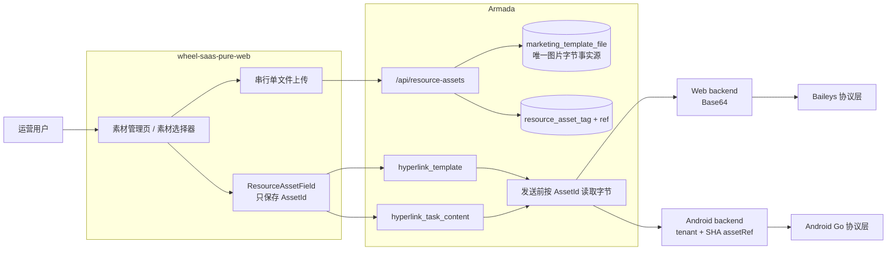

# 超链营销图片素材库详细实施设计

> 状态：可直接进入实施
> 分析日期：2026-08-29
> 涉及仓库：`armada`、`wheel-saas-pure-web`；`armada-protocol` 与
> `whatsapp-server-feature-android-zhuan` 只做回归验证，不改协议合同
> 上位设计：[`2026-08-27-hyperlink-task-strategy-asset-analysis-design.md`](./2026-08-27-hyperlink-task-strategy-asset-analysis-design.md)、
> [`hyperlink-marketing-data-model.md`](../../business/hyperlink-marketing-data-model.md)

## 实施前先读

本方案冻结以下口径，实施 Agent 不应重新发明另一套模型：

1. **不新建 `resource_asset` 字节表**。图片字节继续只存一份，事实源是
   `marketing_template_file`；素材管理能力通过给该表加列和增加标签关系表完成。
2. **页面与接口使用稳定 AssetId，不保存竞品的图片 URL**。竞品 URL 模型只作为交互参考，
   不得复制进 Armada 的模板、任务或协议消息合同。
3. **批量上传是前端逐张串行调用单文件上传接口**。竞品实际代码不是并发上传；旧总设计中
   “前端并发调用”的文字以本文为准。
4. **删除保护覆盖三类引用者**：旧 `marketing_template`、`hyperlink_template`、
   `hyperlink_task_content`。旧总设计只写模板与任务两类表，漏掉了旧营销模板引用。
5. **绑定和删除必须锁同一张素材行**，只查引用次数再删除不能解决并发竞态。
6. **不改 Web/Android 协议接口**。Armada 在发送边界把 AssetId 解成图片字节，协议层永远不认识
   `marketing_template_file.id`。
7. **迁移号不得直接照抄本文**。截至分析时主分支最大为 V156，超链任务工作树已使用 V157；
   实施前必须重新按 `sort -V` 检查全仓迁移号。若 V157 已合入，本功能从 V158 起分配。

## 1. 目标、范围与交付结果

图片素材是六个超链菜单中的共享基础能力。完成后，租户可以统一上传、检索、打标签、编辑和删除图片，
超链模板和超链任务可以从同一素材库选择图片，避免每次新建内容重复上传。

本期包含：

- 动态菜单 `/hyperlink/library` 和 `tenant:resource_asset:*` RBAC。
- 图片素材管理页。
- 批量上传弹框、编辑弹框、删除确认与引用保护。
- 可复用的素材选择弹框和素材字段组件。
- `marketing_template_file` 管理列、标签表、引用索引和存量名称回填。
- `/api/resource-assets` 完整接口。
- 超链营销模板的图片字段从“本地临时上传”切换为“素材库选择”。
- 超链任务的链接预览图、正文主图接入相同字段。
- Web、Android 两条发送链的回归验证。

本期不包含：

- 对象存储迁移、CDN 或公开图片 URL。
- 物理表 `marketing_template_file` 改名。
- 把旧群营销、群头像、剧本、招呼语等其他模块全部迁到新选择器。
- 超链策略或超链市场分析实现。
- 新的协议层图片 API 或协议 payload 字段。

## 2. 事实来源与证据边界

### 2.1 竞品静态前端基线

分析对象为本地合法取得的 `hylbuiaxykfrontendsource` 前端生产构建，页面 build time 为
`2026-08-26 20:28:08`。核心文件如下：

| Evidence | 文件 | SHA-256 | 用途 |
|---|---|---|---|
| E-001 | `readable/assets/library-C1_C9S_k.js` | `1164b2507db93db1fb9a9591c9a1a959b89415abe6c79cf33ec27c5bc7817028` | 素材管理页 |
| E-002 | `readable/assets/resource-asset-field-D7ze446Y.js` | `c5601c3cd55f6e9bc5aff1d01cb1c768c74733631e394ff07cacf6b2c8bbabb9` | 素材字段与选择器 |
| E-003 | `readable/assets/resource-asset-upload-modal-Cns3ms7s.js` | `ce38bda05100ca405e661e903c666946f8d56fc9c1481bfa77701128ebc99115` | 批量上传弹框 |
| E-004 | `readable/assets/resource-CF5a-p8A.js` | `85f95420dd091ea94c955b9d08634383c68c8594f6841ebb0df030073e9bf3f7` | 图片 URL 与校验工具 |
| E-005 | `readable/assets/router-CPQmbuR9.js` | `7e06fb1419f879474eb9eb4c091c425a1e82606a92753a35ab1f5c0d98a6e2fa` | 路由和资源 API |

复核命令：

```bash
cd ../hylbuiaxykfrontendsource
shasum -a 256 \
  readable/assets/library-C1_C9S_k.js \
  readable/assets/resource-asset-field-D7ze446Y.js \
  readable/assets/resource-asset-upload-modal-Cns3ms7s.js \
  readable/assets/resource-CF5a-p8A.js \
  readable/assets/router-CPQmbuR9.js
rg -n "resource-assets|批量上传图片|从素材库选择|确认删除该素材" readable/assets
```

静态前端可以证明页面行为、按钮、请求路径和客户端 fallback，不能证明竞品真实数据库表结构、事务隔离或
服务端引用统计 SQL。本文不会把前端的多字段 fallback 当成竞品后端事实。

### 2.2 Armada 当前事实

| Evidence | 当前代码 | 结论 |
|---|---|---|
| E-006 | `V035__marketing_template_file.sql` | `marketing_template_file` 已保存租户、原名、MIME、大小、MEDIUMBLOB 和软删时间 |
| E-007 | `MarketingTemplateFileServiceImpl` 及其测试 | 旧上传只检查 `image/*`，600KB PNG 也会落库 |
| E-008 | `HyperlinkMessageContentValidator` | 超链模板绑定时才严格检查 JPEG、500KB 和可解码性 |
| E-009 | `V001__marketing_template.sql` | 旧 `marketing_template.image_file_id` 仍引用同一文件表 |
| E-010 | `V154__hyperlink_template.sql` | 超链模板已有两列稳定素材 ID，但缺少素材反查索引 |
| E-011 | 超链任务 V157 工作树 | `hyperlink_task_content` 已有两列素材 ID 和反查索引，并复用超链内容校验器 |
| E-012 | `wheel-saas-pure-web` 模板页面 | 当前抽屉先暂存 `File`，保存模板时才调用旧上传接口；回显通过鉴权 Blob + Object URL |
| E-013 | Armada Web/Android backend 与两协议代码 | Web 接收 Base64；Android 接收 tenant+SHA assetRef；两者的输入均由 Armada 图片字节生成 |

### 2.3 Finding 与 Path

| Finding | Evidence | 结论 | 置信度 |
|---|---|---|---|
| F-001 | E-001～E-005 | 竞品完整交互由管理页、上传弹框、编辑弹框、选择弹框和素材字段组成；没有素材管理抽屉 | high |
| F-002 | E-003 | 批量上传是校验全批后逐张串行上传，部分失败保留失败项重试 | high |
| F-003 | E-006～E-011 | Armada 可以复用现有文件表和稳定 ID，但必须补管理元数据、三类引用统计和并发删除保护 | high |
| F-004 | E-012～E-013 | 应复制竞品 UX，不应复制 URL 存储；协议层无需新增合同 | high |

实现调用路径 P-001：

1. 用户在管理页或选择器上传 JPEG，前端校验后串行调用 `/api/resource-assets`。
2. Armada 再次校验真实字节并写入 `marketing_template_file` 与标签关系。
3. 模板/任务只保存返回的稳定 AssetId。
4. 发送时 Armada 按 AssetId 读取字节并构造 `MessageMedia`。
5. Web backend 转 Base64；Android backend 转 tenant+SHA assetRef。

## 3. 竞品交互逐项复刻

### 3.1 菜单和管理页

竞品菜单：

- 路径：`/hyperlink/library`
- 名称：图片素材
- 图标：`solar:gallery-wide-bold-duotone`
- 最终顺序：超链任务 → 超链数据包 → 超链营销模板 → 超链策略 → 图片素材 → 超链市场分析

页面顶部内容：

- 标题：`WhatsApp 素材库`
- 徽标：`Library`
- 说明：`统一管理上传的图片素材；支持 JPG，单张不超过 500KB。超链模板、剧本和招呼语新建时均可从素材库直接引用，避免重复上传。`
- 筛选项：素材名称、素材标签。
- 占位文案：`按名称搜索`、`按标签筛选（任意匹配）`。
- 操作按钮：重置、批量上传。

查询和分页：

- 默认 `page=1`、`pageSize=24`。
- 名称输入 300ms 防抖，触发查询前回到第 1 页。
- 标签多选后立即查询，任意一个标签匹配即命中。
- 页容量：12、24、48、96。
- 空态：`暂无图片素材`。

素材卡片：

- 网格自适应，桌面最小卡片宽度约 200px，移动端约 168px。
- 图片区比例 5:4，懒加载、`cover` 裁切。
- 显示素材名称与 `#ID`。
- 最多直接显示 3 个标签，剩余显示 `+N`；无标签显示 `无标签`。
- 显示 `宽 × 高`、人类可读文件大小、引用次数。
- 行为按钮：编辑、删除。
- 删除按钮在引用数大于 0 时禁用。

字段兼容 fallback 属于竞品前端观察，不应原样扩散到 Armada DTO：

- 大小读取顺序：`size_bytes ?? size ?? file_size ?? 0`。
- 引用读取顺序：`reference_count ?? ref_count ?? used_count ?? 0`。
- 名称读取顺序：`name || filename || URL basename || 素材 #id`。
- URL 读取顺序：`public_url || url || r2_url || path`。

Armada 应只返回一套 camelCase 字段，不实现这些历史兼容别名。

### 3.2 批量上传弹框

| 项目 | 竞品行为 | Armada 实施口径 |
|---|---|---|
| 标题 | 批量上传图片 | 相同 |
| 宽度 | 640px，最大不超过视口 | 相同 |
| 文件数 | 最多 100 张 | 相同，超出只保留前 100 张并提示 |
| 格式 | `.jpg,.jpeg,image/jpeg`；客户端实际按“扩展名或 MIME 任一命中”放行 | Armada 前端和后端都检查扩展名、MIME、JPEG magic 和 ImageIO 解码，不复制竞品的宽松缺陷 |
| 大小 | 每张不超过 500KB | `500 * 1024 = 512000` 字节 |
| 选图 | 点击或拖拽 | Element Plus `el-upload` drag |
| 公共标签 | 可选、多选、可搜索、回车新建 | 相同；应用到本批所有图片 |
| 校验 | 上传前校验全部待上传项 | 相同；任一待上传项非法则整批不开始 |
| 上传顺序 | `for...of` 逐张 await | **串行**，禁止改为 `Promise.all` |
| 进度 | 总进度 + 每文件进度/状态 | Axios `onUploadProgress` |
| 部分失败 | 成功项完成，失败项留在弹框 | 相同；按钮切换为重试语义 |
| 重试 | 只重试失败/待传项 | 已成功项不得重复上传 |
| 关闭 | 上传中禁止遮罩、ESC、关闭按钮 | 相同 |

弹框文案和按钮：

- 提示：一次最多 100 张，公共标签将应用于本次所有图片。
- 上传区：`点击或拖拽图片到此处`。
- 格式提示：`JPG/JPEG，最多 100 张，单张不超过 500KB`。
- 标签占位：`选择或输入标签`。
- 底部：`已选择 X/100`、取消、上传/重试。

错误映射：

- Armada 返回的中文业务校验直接显示。
- timeout：提示上传超时，可重试当前失败项。
- network error：提示网络异常。
- canceled：提示上传已取消。
- 5xx 或未知异常：提示上传失败并保留该项。

### 3.3 编辑与删除

编辑弹框：

- 标题：`编辑素材`。
- 宽度：`min(460px, viewport - 32px)`。
- 素材名称：必填、trim 后不能为空、最多 128 字、显示字数。
- 素材标签：多选、可过滤、可清空、可输入创建。
- 按钮：取消、保存。
- 成功文案：`素材信息已更新`，随后刷新列表和标签候选。

删除：

- 无引用时使用 Popconfirm：`确认删除该素材？`。
- 删除成功提示 `删除成功`，随后刷新列表和标签候选。
- 有引用时按钮禁用；若仍从其他入口触发，后端返回 40901。
- Armada 提示统一为：`该素材仍被 N 处模板或任务引用，不能删除`。

### 3.4 素材选择弹框

- 标题：`从素材库选择`。
- 宽度 960px，最大为视口宽度减 32px；禁止点击遮罩关闭。
- 默认 `page=1`、`pageSize=12`。
- 工具栏：名称搜索、标签筛选、批量上传。
- 名称占位：`搜索素材名称`；名称查询 300ms 防抖。
- 格式提示：`JPG/JPEG · 单张 ≤ 500KB`。
- 单选网格，卡片最小宽度约 132px，图片为正方形。
- 悬浮层展示名称、标签、尺寸和大小。
- 选中后显示高亮边框和勾选标识。
- 空态：`暂无符合条件的图片素材`，并提供批量上传入口。
- 底部显示总数、`已选 1 项`、分页、取消和 `使用该素材`。
- 未选择素材时 `使用该素材` 禁用。
- 弹框内上传成功后刷新列表；若新上传的第一张出现在当前返回页，自动选中它。

### 3.5 通用素材字段

有值时：

- 显示 48px 缩略图、素材名称和移除按钮。
- 整体可点击，hover 提示 `点击更换素材`。
- 只读状态显示但不可更换或移除。

无值时：

- 显示虚线选择区。
- 默认标题：`上传 / 从素材库选择`。
- 点击打开素材选择弹框。

竞品字段保存 URL，并根据 URL 再请求素材详情解析名称。Armada 字段必须改为 `number | null` 的
AssetId；显示名称由详情响应或选择结果提供，不能为了取名称再用 URL 反查。

### 3.6 竞品前端请求合同

E-005 中可直接观察到：

| 方法 | 竞品路径 | 前端用途 |
|---|---|---|
| GET | `/api/admin/resource-assets` | 列表和选择器 |
| GET | `/api/admin/resource-assets/tags` | 标签候选 |
| POST | `/api/admin/resource-assets` | multipart 单文件上传，带上传进度 |
| PUT | `/api/admin/resource-assets/{id}` | 修改 `name` 和 `tags` |
| DELETE | `/api/admin/resource-assets/{id}` | 删除素材 |
| GET | `/api/admin/resource-assets/{encodedUrl}` | 根据已保存 URL 恢复素材信息 |

竞品 query serializer 把数组 JSON 字符串化，上传的 `tags` 也是 multipart 中的 JSON 字符串。这些是竞品
前端请求事实，不是必须逐字复制的服务端协议。Armada 使用 `/api/resource-assets`、camelCase、重复 tags
query 参数和按 AssetId 获取详情；上传 tags 继续使用 JSON 字符串，以复用竞品上传弹框的简单合同。

## 4. Armada 冻结设计

### 4.1 目标数据流



### 4.2 稳定 ID 与租户范围

- `link_preview_asset_id`、`body_main_asset_id` 均直接引用 `marketing_template_file.id`。
- `/api/resource-assets` 是资源语义兼容层，不代表底层存在同名物理表。
- 所有素材、标签和关系均带 `tenant_id`，必须由 MyBatis 租户拦截器隔离。
- 素材库按**租户共享**实现，与当前文件查询的真实行为一致。
- V142 已给文件表加 `owner_user_id`，但当前 Entity/Mapper/Service 未使用它。素材库不得把它临时解释为
  用户私有过滤条件；若未来要改成用户私有资源，必须另立需求并完成存量归属迁移。
- 新 `created_by` 只作上传审计，不等于所有权。

## 5. 数据模型

### 5.1 扩展 `marketing_template_file`

最终新增列：

| 列 | 类型 | 空值 | 写入方 | 读取方 | 说明 |
|---|---|---|---|---|---|
| `asset_name` | `VARCHAR(128)` | 本期可空；目标 NOT NULL | 上传、编辑、迁移回填 | 管理列表、选择器 | 素材业务名称 |
| `width` | `INT` | 可空 | 新上传图片解析 | 卡片、选择器 | 像素宽；历史或解析失败为 NULL |
| `height` | `INT` | 可空 | 新上传图片解析 | 卡片、选择器 | 像素高；历史或解析失败为 NULL |
| `created_by` | `BIGINT` | 可空 | 新素材上传 | 审计展示 | 存量行为 NULL |
| `updated_at` | `BIGINT` | 本期可空；目标 NOT NULL | 上传、编辑 | 排查与审计 | 存量取 `created_at` |

保留现有 `owner_user_id`，不重复新增所有权列。

新增索引：

- `idx_marketing_template_file_name (tenant_id, deleted_at, asset_name, id)`。

名称搜索使用 `%keyword%` 时不能完全利用 `asset_name` 的 B-tree，但索引前缀仍可先限定租户和未删除集合；
禁止把当前租户全部素材拉进 Java 再做内存搜索或分页。

迁移必须分阶段执行：

1. 以 nullable 方式加列，所有列带 COMMENT，并用 `information_schema` 守卫。
2. `asset_name` 回填为 trim 后的 `original_filename`；空名称回填 `素材 #<id>`；统一截断到 128 字。
3. `updated_at` 回填 `created_at`。
4. 修改新 `ResourceAssetService` 和旧 `MarketingTemplateFileServiceImpl`，让两条上传路径以后都写
   `asset_name` 和 `updated_at`；旧路径仍保留原格式/大小规则。
5. 创建名称索引和三类引用索引。
6. 修改表结构后运行 `.harness/wiki/gen_datamodel.py` 更新自动数据模型文档。

**本次上线不得把这两列直接改成 NOT NULL**：Flyway 先于新应用启动，滚动发布期间旧实例仍可能插入 NULL。
待所有实例都已切到新写入逻辑并完成第二次空值回填后，才能在后续独立迁移中收紧 NOT NULL。列表在过渡期使用
`asset_name → original_filename → 素材 #id` 和 `updated_at → created_at` fallback。

宽高不在 Flyway 中解析 BLOB。新上传必须写入宽高；历史行可显示 `-`。选择历史图片时先按 MIME 和大小筛选，
最终绑定仍执行真实字节解码校验，因此不会把损坏图片写进新的超链模板或任务。

### 5.2 标签字典与关系

`resource_asset_tag`：

| 列 | 类型 | 说明 |
|---|---|---|
| `id` | `BIGINT` | 主键 |
| `tenant_id` | `BIGINT NOT NULL` | 租户 ID |
| `tag_name` | `VARCHAR(64) COLLATE utf8mb4_bin NOT NULL` | trim 后标签名；按大小写敏感精确值唯一 |
| `created_at` | `BIGINT NOT NULL` | epoch 毫秒 |

索引：

- `uq_resource_asset_tag (tenant_id, tag_name)`。

`resource_asset_tag_ref`：

| 列 | 类型 | 说明 |
|---|---|---|
| `id` | `BIGINT` | 主键 |
| `tenant_id` | `BIGINT NOT NULL` | 租户 ID |
| `file_id` | `BIGINT NOT NULL` | 逻辑关联 `marketing_template_file.id` |
| `resource_asset_tag_id` | `BIGINT NOT NULL` | 逻辑关联标签 ID |
| `created_at` | `BIGINT NOT NULL` | epoch 毫秒 |

索引：

- `uq_resource_asset_tag_ref (tenant_id, file_id, resource_asset_tag_id)`。
- `idx_resource_asset_tag_ref_tag (tenant_id, resource_asset_tag_id, file_id)`。
- `idx_resource_asset_tag_ref_file (tenant_id, file_id, id)`，供素材详情、编辑和删除清理。

竞品前端的标签归一化函数只做 `String(value).trim()`、去空和 JavaScript `Set` 精确去重，
`Promo` 与 `promo` 会保留为两个值；上传和编辑使用的可创建多选控件没有配置标签数量上限。
证据为 `resource-CF5a-p8A.js:58-63`、`resource-asset-upload-modal-Cns3ms7s.js:427-439` 和
`library-C1_C9S_k.js:515-529`。这能证明竞品前端是大小写敏感且未设显式上限，不能证明竞品后端也允许无限标签。

Armada 在不影响正常竞品交互的前提下增加以下服务端安全边界：

- 上传、编辑以及列表标签筛选均在 trim、去空、精确去重后最多接受 **20** 个标签；超过时返回
  `ErrorCode.VALIDATION`，消息 `每个素材最多设置 20 个标签`。前端在第 21 个标签加入前给出同文案提示。
- 单个标签 trim 后长度为 1～64 字符；multipart `tags` 必须是 JSON 字符串数组，数组内出现非字符串值时
  直接返回参数校验错误，不复制竞品用 `String(value)` 强制转换脏值的宽松行为。
- 保留用户输入的大小写和内部空格，只去除首尾空白。`tag_name` 使用 `utf8mb4_bin`，唯一索引与 Java
  精确去重语义一致，因此 `Promo` 与 `promo` 是两个不同标签；筛选也按精确值匹配。
- 20 个上限在去重后计算，重复标签不会消耗额度。卡片仍只直接展示前 3 个标签和 `+N`，不改变竞品视觉。

编辑素材时在同一事务中 upsert 标签字典并整体替换关系。标签字典行不因无人引用立即删除；`/tags`
只查询仍被活动素材使用的标签，因此废弃标签会自然从候选项消失。

### 5.3 引用索引与引用次数

必须新增：

- `marketing_template (tenant_id, image_file_id, deleted_at, id)`。
- `hyperlink_template (tenant_id, link_preview_asset_id, deleted_at, id)`。
- `hyperlink_template (tenant_id, body_main_asset_id, deleted_at, id)`。

`hyperlink_task_content` 在 V157 中已有：

- `(tenant_id, link_preview_asset_id, hyperlink_task_id)`。
- `(tenant_id, body_main_asset_id, hyperlink_task_id)`。

`reference_count` 不落列。列表只对当前页 AssetId 批量统计，禁止 N+1。实现可用五个索引友好的
`UNION ALL` 分支得到 `(asset_id, source_type, source_id)`，外层先按三列去重，再按 `asset_id` 计数：

1. 旧营销模板图片列。
2. 超链模板链接预览图列。
3. 超链模板正文主图列。
4. 超链任务链接预览图列。
5. 超链任务正文主图列。

这样同一条模板或任务即使异常地在两列指向同一素材，也只计为一处引用。删除保护只依赖真实引用查询，
不能依赖缓存或异步投影。

## 6. 后端 API 合同

所有 JSON 字段使用 camelCase；统一包在 Armada `ApiResponse.data` 中。

### 6.1 获取素材列表

```http
GET /api/resource-assets?page=1&pageSize=24&assetName=promo&tags=活动&tags=英语
```

参数：

| 参数 | 必填 | 规则 |
|---|---|---|
| `page` | 否 | 默认 1，最小 1 |
| `pageSize` | 否 | 管理页默认 24，选择器默认 12；只接受 12/24/48/96 |
| `assetName` | 否 | trim 后模糊匹配 |
| `tags` | 否 | 重复 query 参数；trim、去空、精确去重后最多 20 个；任意标签命中，大小写敏感 |
| `selectableOnly` | 否 | 选择器传 true，只返回 JPEG 且不超过 500KB 的历史兼容候选 |

前端不能依赖全局 `qs` 默认的 `tags[0]` 形式，本 API 要显式序列化为重复参数。

响应 data：

```json
{
  "list": [
    {
      "id": 128,
      "assetName": "promo-en.jpg",
      "contentUrl": "/api/resource-assets/128/content",
      "tags": ["活动", "英语"],
      "sizeBytes": 186432,
      "width": 1200,
      "height": 675,
      "referenceCount": 3,
      "createdBy": 42,
      "createdAt": 1787932800000,
      "updatedAt": 1787932800000
    }
  ],
  "page": 1,
  "pageSize": 24,
  "total": 57,
  "totalPages": 3
}
```

分页响应必须直接使用 `com.armada.shared.response.PageResult<T>`，因此 `totalPages` 是固定合同字段，
由 `PageResult.of` 根据 `total` 和 `pageSize` 推导；后端和前端均不得自造缺少该字段的分页 DTO。

查询顺序固定为：

1. SQL 分页读取元数据，**SELECT 中不包含 MEDIUMBLOB `content`**。
2. 按当前页 ID 批量读取标签。
3. 按当前页 ID 批量聚合引用次数。
4. Service 按分页顺序组装响应。

标签筛选必须在 SQL 中用 `EXISTS`/关系表完成，并配合 `COUNT(DISTINCT file.id)` 计算总数；禁止内存分页。
默认排序为 `created_at DESC, id DESC`，保证新上传素材优先出现在选择器第一页。

### 6.2 获取素材详情

```http
GET /api/resource-assets/{id}
```

返回与列表项相同的单条元数据 DTO，不读取/返回 `content`。模板或任务详情只有 AssetId、没有素材名称时，
`ResourceAssetField` 使用本接口恢复展示信息；不得按 URL 反查。

### 6.3 获取标签候选

```http
GET /api/resource-assets/tags
```

响应：

```json
{
  "tags": ["活动", "英语", "菲律宾"]
}
```

只返回当前租户活动素材实际引用的标签，按标签名稳定排序。

### 6.4 上传单张素材

```http
POST /api/resource-assets
Content-Type: multipart/form-data
```

multipart 字段：

- `file`：单个文件，必填。
- `tags`：JSON 字符串数组，可省略，例如 `["活动","英语"]`；元素必须为字符串，按统一标签规则归一化后
  最多 20 个。

后端必须重新校验：

- 文件非空。
- 文件名扩展名是 `.jpg` 或 `.jpeg`，忽略大小写。
- MIME 精确为 `image/jpeg`，忽略大小写。
- 实际字节长度不超过 512000。
- 前三个字节符合 JPEG magic。
- `ImageIO.read` 可解码且宽高大于 0。

上传成功返回一条完整素材 DTO。`assetName` 默认取 trim 后原文件名并截断到 128 字；缺失时使用
`image.jpg`。字节读取与图片校验在开启数据库事务前完成；文件、名称、宽高、上传人、更新时间和标签关系的
数据库写入必须在一个事务内完成。

不得收紧旧 `/api/marketing-template-files` 上传规则；该接口仍服务旧营销业务。超链模板和任务的新上传入口
统一切到 `/api/resource-assets`。

### 6.5 编辑素材

```http
PUT /api/resource-assets/{id}
Content-Type: application/json
```

```json
{
  "assetName": "菲律宾活动主图",
  "tags": ["活动", "菲律宾"]
}
```

规则：当前租户、未删除；名称 trim 后必填且最多 128 字；标签按统一规则 trim、去空、大小写敏感精确去重，
去重后最多 20 个。更新名称、标签关系和 `updated_at` 必须同事务提交。

### 6.6 删除素材

```http
DELETE /api/resource-assets/{id}
```

- 无引用：软删除文件，硬删除该文件的标签关系；返回成功。
- 有引用：返回 `ErrorCode.CONFLICT`（40901），消息
  `该素材仍被 N 处模板或任务引用，不能删除`。
- 素材不存在或已删除：返回 40401。

### 6.7 获取图片内容

```http
GET /api/resource-assets/{id}/content
```

- 响应 body 为原始字节，`Content-Type` 为保存的 MIME，`Cache-Control: no-cache`。
- 保留旧 `/api/marketing-template-files/{id}/content`，避免破坏现有调用方。
- 两个入口委托同一个 Service，不复制字节读取逻辑。

## 7. 并发、事务和删除安全

### 7.1 统一素材锁合同

在 `ResourceAssetService`/兼容文件 Service 中提供“校验并锁定可绑定素材”的跨业务入口。所有绑定方遵循：

1. 收集非空素材 ID。
2. 去重并按 ID 升序排序。
3. 在调用方现有事务中逐个 `SELECT ... FOR UPDATE` 锁定当前租户未删除的
   `marketing_template_file` 行。
4. 校验 MIME、大小、JPEG magic 和可解码性。
5. 再写入模板或任务引用。

必须接入的写方：

- `HyperlinkTemplateService` 创建、编辑、复制。
- 超链任务创建、未开始编辑；V157 当前通过 `HyperlinkMessageContentValidator` 读取图片，需要改为锁定校验。
- 旧 `MarketingTemplateService` 创建、编辑、**复制**中非空 `imageFileId` 的绑定。当前 `clone()` 会直接复制
  原模板的 `imageFileId`，若不接入同一素材锁，可能与删除事务并发产生悬空引用。

锁行 Mapper 必须沿用 Armada 已有的显式租户模式，禁止依赖租户插件自动改写 `FOR UPDATE`：

```java
@InterceptorIgnore(tenantLine = "true")
MarketingTemplateFile selectByIdForUpdate(
        @Param("tenantId") Long tenantId,
        @Param("id") Long id);
```

```sql
SELECT id, tenant_id, original_filename, content_type, size_bytes, content,
       asset_name, width, height, created_by, created_at, updated_at, deleted_at
FROM marketing_template_file
WHERE tenant_id = #{tenantId}
  AND id = #{id}
  AND deleted_at IS NULL
FOR UPDATE
```

- `tenantId` 必须取自非空 `TenantContext`，不得接收客户端传值。
- 调用方先对 AssetId 去重并升序，再逐个调用上述主键锁；模板和任务当前最多两个素材位，逐行锁不会形成
  批量 N+1 查询问题。
- 主键查询不加多余 `LIMIT 1`，避免 MyBatis-Plus/JSqlParser 重排 `LIMIT ... FOR UPDATE`。
- 锁定结果为空时统一返回 `图片不存在或已删除`；拿到锁后再校验实际字节，随后在同一事务中写引用。

删除事务遵循：

1. `SELECT ... FOR UPDATE` 锁定素材行。
2. 在锁内批量/精确统计三类引用。
3. 引用大于 0 时回滚并返回 40901。
4. 引用为 0 时软删除素材并清理标签关系。

绑定方和删除方锁同一行后，两种并发顺序都安全：先绑定则删除看到引用；先删除则绑定看到素材已删除。

### 7.2 列表和缩略图的 BLOB 边界

- 列表 Mapper 不得映射 `content`。
- 图片字节只从 content endpoint 按需读取。
- 前端不能直接把受保护 URL 填入 ``，因为浏览器不会自动附带 Axios Bearer Token。
- `ResourceAssetThumbnail` 必须通过 API 下载 Blob、创建 Object URL，并在翻页、替换和卸载时 revoke。
- Object URL 缓存必须有容量上限；管理页一页最多 96 张，默认只加载 24 张。
- 请求乱序时只接受最新 request id 对应的响应，避免快速翻页后旧 Blob 覆盖新卡片。

## 8. 权限设计

页面和管理操作权限：

```text
tenant:resource_asset:view
tenant:resource_asset:upload
tenant:resource_asset:edit
tenant:resource_asset:delete
```

接口权限不能只按独立素材菜单判断，否则只有模板/任务权限的运营无法使用嵌入式选择器。

| 接口 | 允许权限 |
|---|---|
| detail、list、tags、content | `resource_asset:view`，或相关 `hyperlink_template` / `hyperlink_task` 的 view/create/edit |
| upload | `resource_asset:upload`，或相关 `hyperlink_template` / `hyperlink_task` 的 create/edit |
| update | `resource_asset:edit` |
| delete | `resource_asset:delete` |

前端页面路由仍严格要求 `tenant:resource_asset:view`；选择器里的上传按钮按上传能力显示。后端
`@PreAuthorize` 才是最终授权，前端隐藏按钮不是安全边界。

上表“相关权限”展开后是 `tenant:hyperlink_template:view|create|edit` 和
`tenant:hyperlink_task:view|create|edit` 对应的六个实际 authority，不能把带竖线的简写字符串直接写进
`@PreAuthorize`。

旧 content endpoint 当前包含旧营销、拉群营销、建群营销、历史群和超链模板权限。扩展权限时只能增加，
不得删除既有权限。

## 9. 前端实施设计

### 9.1 文件拆分

建议目录：

```text
src/api/resource-asset.ts
src/components/ResourceAsset/
├── ResourceAssetField.vue
├── ResourceAssetPickerDialog.vue
├── ResourceAssetUploadDialog.vue
├── ResourceAssetThumbnail.vue
├── resource-asset.types.ts
└── useResourceAssetObjectUrls.ts
src/views/hyperlink/library/
├── index.vue
├── components/
│   ├── ResourceAssetCard.vue
│   └── ResourceAssetEditDialog.vue
└── composables/
    └── useResourceAssetPage.ts
```

页面禁止直接调用 Axios，只能调用 `src/api/resource-asset.ts`。Element Plus 是唯一基础 UI；不自绘
dialog、upload、pagination、select 或 popconfirm。`.vue` 超过 400 行优先拆分，600 行为合入红线。

### 9.2 页面状态

`useResourceAssetPage` 至少管理：

- query：page、pageSize、assetName、tags。
- list、total、loading、error。
- 300ms 名称防抖，组件卸载时清理 timer。
- upload dialog visible。
- edit dialog visible、editingAsset、saving。
- refresh 同时刷新 list 和 tag options。

编辑、删除、上传成功后均刷新列表和标签。删除当前页最后一条后，如果页码大于 1，应退到上一页再加载。

### 9.3 上传状态机

每个文件项状态：

```text
PENDING → UPLOADING → SUCCESS
                    ↘ FAILED → UPLOADING（重试）
```

- 新增/删除文件只允许在未上传状态，或按竞品允许删除失败项。
- 点击上传时一次性校验所有 PENDING/FAILED 项；有非法项则不发任何请求。
- 串行循环中每完成一项更新总进度。
- 部分成功时向父组件 emit 成功素材数组，但弹框保留失败项。
- 全部成功才关闭弹框。
- 上传超时建议单接口显式使用 45 秒，避免全局 10 秒 timeout 对慢网络过严。

### 9.4 选择器与字段合同

组件 v-model：

```ts
type ResourceAssetId = number | null;
```

选择事件携带展示快照，但父表单只持久化 ID：

```ts
interface ResourceAssetSelection {
  id: number;
  assetName: string;
  contentUrl: string;
  width: number | null;
  height: number | null;
  sizeBytes: number;
  tags: string[];
}
```

模板详情或任务详情已有 ID、但没有选择快照时，可按 ID 调用素材详情接口，或让模板/任务详情直接返回
`assetName` 展示快照。不得模仿竞品按 URL 编码后查询素材。

### 9.5 接入超链模板

当前 `HyperlinkTemplateDrawer.vue` 的 `el-upload` 应替换为 `ResourceAssetField`：

- 删除 `form.imageFile` 和“保存时先上传”路径。
- `form.assetId` 继续保留。
- 选择素材后立即得到 ID，不等待保存模板。
- 单图文绑定 `linkPreviewAssetId`。
- 普通按钮/卡片按钮绑定 `bodyMainAssetId`。
- 切换消息类型时沿用当前清空不适用素材的规则。
- 编辑回显显示真实素材名称，不再固定写 `已上传图片`。

### 9.6 接入超链任务

任务编辑器使用同一 `ResourceAssetField`：

- 链接预览图：单图文显示，必填，提示建议 16:9、JPG ≤500KB。
- 正文主图：按钮/卡片消息显示，是否必填沿用任务内容矩阵。
- 查看模式设置 readonly。
- 任务请求只提交 `linkPreviewAssetId` / `bodyMainAssetId`，不提交 multipart、不提交 URL。

超链任务分支合并时重点处理 `HyperlinkMessageContentValidator`：不能只调用非锁定的 `content(assetId)`；
创建/编辑事务应调用统一的素材锁定校验入口。

## 10. 菜单与 RBAC 迁移

新增菜单建议：

| 字段 | 值 |
|---|---|
| `menu_name` | 图片素材 |
| `menu_key` | `HyperlinkResourceAsset` |
| `menu_type` | `M` |
| `route_path` | `/hyperlink/library` |
| `component_path` | `hyperlink/library/index` |
| `perm_key` | `tenant:resource_asset:view` |
| `sort_no` | 50 |

按钮节点：上传素材、编辑素材、删除素材，分别对应 upload/edit/delete 权限。租户管理员按现有动态规则获得
全部节点，普通角色显式授权。

同时必须：

- 把 `hyperlink/library/index` 加入 `MenuManagementServiceImpl.ALLOWED_COMPONENTS`。
- 更新前端动态路由模块测试和开发 mock fallback。
- 最终六菜单 sort 预留为任务 10、数据包 20、模板 30、策略 40、素材 50、分析 60。
- 若其他分支已经调整菜单顺序，合并时以最终六菜单顺序为准，避免两个迁移互相覆盖。

## 11. 两协议边界与回归

Armada 超链任务发送链已经在 `HyperlinkMessageCommandFactory` 中按 AssetId 读取文件内容并构造
`MessageSendCommand.MessageMedia`。

Web：

- `WebMessageSendBackend` 把 `MessageMedia.bytes` 编码为 Base64。
- `armada-protocol/protocol-layer/src/messages/card-content.ts` 接受 Base64/URL 并把缩略图上传给 Baileys。

Android：

- `AndroidMessageSendBackend` 根据 tenant、图片字节 SHA-256 生成 `AndroidImageAssetRef` 并确保 Redis 资产存在。
- Android Go 服务的 `internal/armada/image_asset_loader.go` 解析引用、缓存和规范化图片，
  `message_sender.go` 再发送。

因此本功能不得：

- 把数据库 AssetId 写入 Kafka 或 HTTP 协议 payload。
- 让协议节点回调 Armada content endpoint。
- 为素材库新增 Web/Android 分支逻辑。

协议仓只运行既有图片消息、链接卡片和 Android assetRef 回归测试；若测试通过，不产生协议仓 commit。

## 12. 实施任务拆分与合并顺序

每个任务控制在约 4 小时内，可由其他 Agent 按依赖顺序领取：

| 顺序 | 任务 | 仓库 | 主要输出 |
|---|---|---|---|
| 1 | 迁移与实体 | armada | 管理列、标签表、引用索引、菜单/RBAC、迁移测试 |
| 2 | 素材 Mapper 与查询 | armada | SQL 分页、标签 any-match、标签批查、引用聚合、无 BLOB 列表测试 |
| 3 | 上传/编辑/内容 API | armada | 严格 JPEG 上传、标签事务、内容兼容入口、权限测试 |
| 4 | 删除与绑定锁 | armada | 行锁合同、三类引用保护、并发测试、模板/任务/旧模板接入 |
| 5 | 前端 API 与 Blob 基础件 | wheel-saas-pure-web | API、显式 tags serializer、缩略图 Object URL 生命周期 |
| 6 | 管理页和两个管理弹框 | wheel-saas-pure-web | 网格页、编辑、删除、响应式布局 |
| 7 | 上传弹框 | wheel-saas-pure-web | 100 张、全批校验、串行进度、部分失败重试 |
| 8 | 选择器与字段 | wheel-saas-pure-web | picker、field、上传嵌套、单选与回显 |
| 9 | 模板和任务接入 | 两业务分支 | 移除模板临时上传、任务两个素材位接入、合并冲突处理 |
| 10 | 联调与回归 | 四仓只读/两仓修改 | API、权限、两协议图片发送、构建与测试证据 |

推荐提交边界：后端 schema、后端 API/锁、前端基础组件、前端页面/业务接入分别提交，避免一个超大 commit。
不要在图片素材分支顺手修改协议实现。

## 13. 测试与验收清单

### 13.1 后端

- Flyway SQL 测试验证列、COMMENT、索引、标签表和菜单节点。
- 迁移回填验证空文件名、超长文件名、`updated_at` 和重复执行守卫。
- Mapper H2 测试验证名称搜索、标签任意匹配、分页总数和稳定排序。
- SQL/Mapper 测试证明列表查询不选择 `content`。
- 标签批量读取和引用聚合无 N+1。
- 上传测试覆盖空文件、伪扩展名、错误 MIME、超 500KB、错误 magic、不可解码 JPEG、合法 JPEG 和宽高。
- 编辑测试覆盖名称 trim、空名、128 字边界、标签精确去重、大小写、20/21 个边界、非字符串标签和事务回滚。
- 删除测试覆盖旧营销模板、旧营销模板复制、超链模板两个字段、超链任务两个字段和软删引用。
- 并发测试覆盖“绑定先获得锁”和“删除先获得锁”两种顺序。
- 锁行 Mapper 测试验证显式 `tenant_id`、`@InterceptorIgnore`、软删条件和 `FOR UPDATE`，不得依赖租户插件改写。
- 租户隔离测试覆盖列表、内容、编辑、删除和标签。
- 权限测试覆盖独立素材权限与模板/任务嵌入权限。

### 13.2 前端

- API 测试锁定 multipart 字段、重复 tags query、Blob responseType 和超时。
- 文件校验测试覆盖扩展名、MIME、大小、magic 和 100 张上限；标签测试覆盖 trim、精确去重、
  `Promo`/`promo` 共存以及 20/21 个边界。
- 串行测试证明第二个请求在第一个完成后才发起，禁止 `Promise.all` 回归。
- 部分失败测试证明成功项不重传、失败项可重试。
- Object URL 测试验证替换、翻页、关闭和卸载时 revoke。
- 管理页测试覆盖防抖、标签筛选、重置、分页、引用禁删和空态。
- 选择器测试覆盖单选、确认禁用、上传后刷新/选中和 readonly 字段。
- 模板测试证明保存请求只带 AssetId，不再调用旧上传接口。
- 任务测试证明两个素材字段按消息类型映射正确。
- 执行 `pnpm typecheck`、相关测试和 `pnpm build`。

### 13.3 业务验收

1. 一次选择 100 张合法 JPEG，可逐张看到进度并全部入库。
2. 第 37 张网络失败时，前 36 张保持成功，其余流程继续；重试不重复上传成功项。
3. 名称和任意标签筛选均由服务端分页返回正确总数。
4. 编辑名称和标签后，管理页与选择器同步刷新。
5. 被旧模板、超链模板或超链任务任一引用的素材均不可删除。
6. 无引用素材删除后不再出现在列表/选择器，旧 content URL 返回 404。
7. 模板和任务均可选择同一素材并正确回显。
8. Web 号与 Android 号各发送一次单图文和卡片按钮，图片真实送达。
9. 只有模板创建权限、没有素材菜单权限的用户仍可在模板选择器内浏览和上传；不能进入素材管理页或编辑/删除素材。

## 14. 已知技术债与非阻塞风险

- 图片仍存 MySQL MEDIUMBLOB。单次前端批次理论上最多写入约 50MB，串行上传只降低同时请求压力，
  不改变数据库线性增长。对象存储迁移需单独立项。
- 历史文件可能是 PNG、超 500KB 或损坏图片。管理页保留可见性，超链选择器只返回 MIME/大小合格候选，
  最终绑定再次解码；不全局收紧旧营销上传接口。
- `%keyword%` 名称搜索不是完全索引命中，但租户和软删前缀可限定范围。素材规模显著增长后再评估全文索引，
  本期不预建无使用证据的新基础设施。
- 物理表名与 API 资源名不一致是有意兼容，不能为“命名好看”在滚动发布中直接 `RENAME TABLE`。
- 竞品宣传素材库也供剧本和招呼语使用。本期只把组件做成可复用形状，不迁移这些尚未进入当前超链六菜单范围的调用方。

## 15. 完成定义

本功能只有在以下条件同时满足时才算完成：

- 管理页、上传、编辑、删除、选择器和字段行为与第 3 章一致。
- 数据模型只有一份图片字节事实，没有新增平行素材表。
- 列表无 BLOB、无内存分页、无 N+1。
- 删除与三类绑定方共享行锁合同，并有并发测试。
- 模板和任务只保存 AssetId，前端没有 URL 持久化。
- 两协议无需修改且真实图片发送回归通过。
- Flyway 号无冲突，自动数据模型、菜单白名单和相关设计引用同步更新。
- 后端测试、前端 typecheck/test/build 均有真实命令输出；未执行的验证不得写成已通过。
