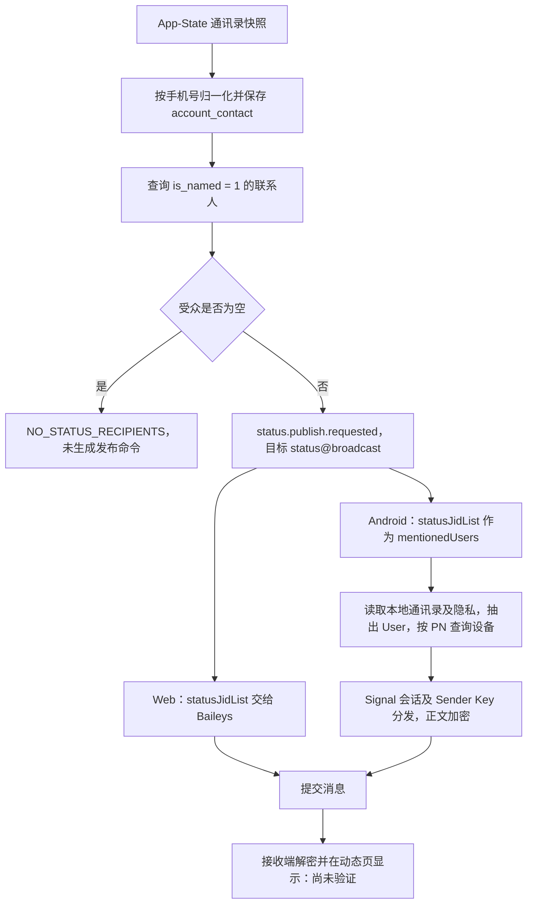

# 动态发布任务：LID 与 App-State 依赖分析

日期：2026-09-09。范围：当前源码、已有脱敏实测记录、上游源码和官方说明；未连接远程环境，未发布动态。

后续进展：用户同意继续后，已在独立 Android worktree 实现最小候选路径及单次实验入口。详见 [本地实现与验证记录](/Users/daishuaishuai/IdeaProjects/.codex-worktrees/lid-status-20260909/android/docs/status-lid-local-validation.md)。下文保留首次只读分析时的代码事实和证据边界；真实 Status 发布及手机端验收仍未执行。

## 结论

**使用 LID 作为动态受众有明确的技术依据，可能绕开“旧 App-State 密钥缺失 → 无法获得通讯录受众”的依赖；当前系统不能仅替换地址就实现。实际 Status 发布及接收端可见性仍待验证。**

动态的外层目标仍为 `status@broadcast`。LID 应出现在受众及设备地址中，不应把外层目标替换为某个 `@lid`；后者进入的是私人消息目标语义。

LID 是身份标识，不是 App-State 解密密钥。发送新 Status 使用 Signal 会话、Sender Key 分发及正文加密。没有旧 App-State 密钥不等于无法建立新消息会话，但仍需要真实登录身份、受众设备、可用加密会话和正确隐私语义。

## 证据范围

| 层次 | 已核对的事实 | 不能据此证明 |
| --- | --- | --- |
| 当前后端 | `f27a7a1d7e2b1c03655e460a4e3661ceb447d9e3`，本次源码检查 | 失败任务当时部署的版本 |
| 当前 Android 协议 | `155fc10a7e50bb93dbf57d5a9761cabdad708fda`，本次源码及定向单测 | WhatsApp 接受 LID Status、手机收到动态 |
| 当前 Web 协议 | `699a66f0ee39f539ad786d5abb750789b4cbc8ee`，依赖声明 Baileys `7.0.0-rc13` | 远端安装包、补丁及运行状态与本地一致 |
| 2026-09-08 隔离报告 | test1 账号 1714，空旧 App-State 密钥存储仍能查询自身云联系人 | 所有账号都可恢复同样数量、原动态失败任务就是此账号 |
| 原失败任务 | 用户报告此前受 App-State 问题影响；本次未收到环境/任务 ID | 已定位原任务的最终失败码与直接根因 |

本次没有读出或复制凭据、私有联系人清单、完整原始网络包。历史报告经本次重新打开核对，但没有重新执行历史在线实验。

## 当前调用链与确定存在的问题



### 1. 后端提前因受众为空终止

- `FeedTaskWorker.java:130` 查询受众；空列表立即记 `NO_STATUS_RECIPIENTS`，不生成 outbox 发布命令。
- `AccountMessagingAudienceServiceImpl.java:40` 使用 `selectNamedByAccount`。
- `AccountContactMapper.xml:59` 明确这是“通讯录里有名字”的口径；SQL 要求 `is_named = 1`，不是互存关系或完整 Status 隐私受众。
- `AccountContactNormalizer.java:37` 没有纯数字 `phone` 就丢弃记录；`54` 行以明文 fullName/firstName 派生 `named`。
- `V162__account_contact_sync.sql` 要求 `contact_phone NOT NULL`，唯一键使用 `(tenant_id, account_id, contact_phone)`。不能只删一个前置判断或给 LID 伪造手机号来复用现有模型。

**推断：**若原任务联系人快照因旧密钥缺失未恢复，可能在后端就失败，根本没有进入 WhatsApp 发布阶段。需要原任务明细与 outbox 才能确认这一条因果链。

### 2. Android 混用了受众和提及，且广播分支固定使用 PN

- `internal/armada/message_sender.go:199` 将 `StatusJIDList` 赋给 `mentions`，调用 `PrepareText/PrepareImage`。
- 文本 `internal/service/app/group.go:183`、图片 `375` 行的广播分支都会额外调用 `getStatusBroadcastRecipients()`。
- 两个分支都只补入 `contacts[0]`（存在时），再补自己及传入提及用户；实际目标不是单纯使用一份完整、经过隐私筛选的受众列表。
- `group.go:194`、`386` 行使用 `mentionedJID.User`，丢掉 `@lid` 域；随后 `SendGetUserDevices` 走手机号设备查询，路由固定 `GroupAddressingModePN`，发送者使用 PN 身份。
- `node/processor/iq.go:1860` 的手机号查询构造 `<contact>`；完整 JID 查询在另一个函数 `createIqUSyncQueryJIDs:1875`，构造 `<user jid=...>`，当前广播分支没有使用它。
- `node/nodes/message.go:835` 还把受众写入 `<meta status_setting="contacts"><mentioned_users>...`。这会产生提及语义，不是普通受众清单的等价表示。

**确定结论：**当前 Android 广播路径没有正确保留 LID 寻址。即使控端传入 `@lid`，也不能宣称支持 LID Status。

`getStatusBroadcastRecipients()` 读取本地通讯录并要求 FullName；还读取隐私列表。它本身没有直接调用 App-State 解密，依赖主要来自已同步的联系人数据。隐私白名单/黑名单与调用方传入列表没有统一求交，且节点固定声明 contacts，属于需要一并梳理的语义问题。

### 3. 发送加密与 App-State 是不同依赖

- `app/appstate.go:527`：联系人状态恢复使用 `DecodeAppStatePatch`，缺密钥进入 `ErrKeyNotFound` 处理。
- `app/appstate.go:679`：主设备 `Device == 0` 不会通过 companion 的 key-request 路径恢复旧 App-State 密钥。
- `node/node_processor.go:1038`：消息 Sender Key 分发使用 `CreateGroupSession`、`CreateSession` 和逐设备 `Encrypt`。
- `node/node_processor.go:1345`：Status 复用的发送加密段调用 `GroupEncrypt`，在已检查的链路中没有以 App-State 密钥作为正文加密输入。

**推断：**如果能独立得到真实受众 LID、设备和消息会话，可以研究不依赖历史 App-State 的新动态发送。不能把新 Sender Key 与伪造旧 App-State key 混为一谈，也不能由静态代码保证服务端接受。

### 4. Web 的受众接口更接近所需能力，但当前数据入口仍有缺口

- `protocol-layer/src/commands/worker-consumer.ts:887` 把 `statusJidList` 直接交给 `sock.sendMessage`，目标仍为 `status@broadcast`。
- 同文件 `1694` 行只做列表类型与空白检查，没有将 `@lid` 强制改为 PN。
- `worker/contact-store.ts:37` 的联系人投影仍要求能得到手机号；没有 PN 回退的 LID 返回 null。
- 依赖声明对应的 [Baileys v7.0.0-rc13 发送源码](https://github.com/WhiskeySockets/Baileys/blob/v7.0.0-rc13/src/Socket/messages-send.ts) 会将 Status 受众加入设备查询，并支持 LID 设备和 Sender Key 身份处理。这是上游实现依据，不是本系统线上验收。

## 历史实测为 LID 方案提供了什么依据

重新核对了两个脱敏报告：

- [2026-09-08 完整分页报告](/private/tmp/work/wa-contacts-mex-20260908/report/full-count.md)：旧 App-State 密钥登录前、每页后及收尾均为 0；11 页取得 1,091 条唯一云联系人记录，全部带 LID，`pn` 全空，metadata 未解密。
- [2026-09-08 后续隔离报告](/private/tmp/work/wa-contacts-recovery-20260908-1605/report/result.md)：新样本 10 条完成 LID scalar 解码和逐字节往返；3 个 LID 的 USync 查询响应匹配，未得到手机号。

云接口原始 LID 字段是 Base64 包装的 XMPP ADJID scalar，不能直接追加 `@lid`。需经过已有的严格解码，完整消费并验证往返一致，得到真正的身份域和用户值。

这些记录证明“获取受众身份”有可用的替代来源；不证明名单中每个人都满足 Status 可见关系，也不证明任何一条 LID Status 已发送成功。既有探针不在当前主分支相应源码路径中，仍需核对独立实现并正式接入，不能视为已上线能力。

## 普通受众与提及必须区分

WhatsApp 官方说明支持“所有联系人 / 排除部分联系人 / 仅分享给指定联系人”的 Status 隐私模式，同时说明提及某人可以让其看到该动态，即使不在普通受众中。因此当前把受众全部作为 mentionedUsers 的行为会改变产品语义，不能当作内部寻址细节处理。[官方 Status 隐私说明](https://faq.whatsapp.com/502161774931737/?cms_platform=web)

普通 Status 的可见性还涉及联系人保存关系、受众设置、拉黑及接收端状态；云联系人记录并不提供已确认的互存关系。官方故障说明要求核对双方联系人保存及状态受众。[官方可见性排查](https://faq.whatsapp.com/1691088408081689)

## 建议实现边界（尚未实施）

1. 将动态受众定义为真实、带来源和范围的 JID 集合，支持 PN/LID、手机号与姓名未知。优先基于账号域已有联系人事实扩展，先核对唯一键与同步删除语义，避免另建一套互相矛盾的通讯录。
2. 云联系人作为已验证支持账号的替代受众来源；保留来源、快照完整性、时间及账号/租户归属。不得将旧快照无条件覆盖当前联系人，也不得把所有 LID 标成互存或有姓名。
3. 普通受众与提及用户分开。按默认、白名单、黑名单模式正确计算受众；混合 PN/LID 时使用可信映射去重并核对黑名单，对外受众与自身设备同步分别处理。未知映射不能静默扩大受众。
4. Android 新建明确的 Status 准备入口，复用已有完整 JID 设备查询及加密组件；保持发送者身份、设备域、Signal 地址与 Sender Key 域一致。现有群 LID 路由可提供组件，但群元数据或 `addressing_mode=lid` 不能未经验证原样套用到 Status。
5. `status.publish.requested`、任务关联和 `status@broadcast` 可继续复用；协议契约需明确 `statusJidList` 是受众。若引入提及，应使用独立字段和明确的业务选择。
6. 分别记录候选受众数、隐私筛选后数量、实际设备数、加密覆盖、提交/ACK、接收端结果；不能只因自己设备存在或拿到消息 ID 就判定所有受众成功。

当前单次受众默认上限为 5,000（`FeedTaskSchedulerProperties:13`）。落地时需显式报告截断/分页与受众变化；不应直接把大批云联系人塞入提及清单。

## 最小验收方案（NOT_RUN）

先确认测试环境及自有收发账号，再实施小范围实验；本次仅分析，没有获得或执行实际发送任务。

| 对照 | 条件 | 要回答的问题 |
| --- | --- | --- |
| PN 基线 | 已知可见关系，两端正常，单条纯文本 | 当前 Status 发送链是否有独立于 LID 的基础故障 |
| LID 核心 | 同一接收者，仅用真实 LID，旧 App-State 密钥为 0，无历史消息会话缓存 | 是否真正绕过旧通讯录密钥及 PN 映射，能新建会话并在对端显示 |
| 隐私对照 | 受控账号分别在白名单/排除名单；不自动加提及 | 普通受众过滤是否正确 |
| 类型与设备 | 纯文本通过后单图、多设备、已存在 Sender Key 与重新分发 | 文本/图片及缓存条件是否一致 |

关键验收：实际外层目标 `status@broadcast`、受众设备域保持 LID、消息加密成功、ACK 无错误、接收者动态页显示且可解密。阅读回执只能作为补充，因为官方设置允许关闭阅读回执。

## 本次验证与未确认项

本地执行已有 6 项定向 Go 测试，涉及三个包，全部通过：Status 命令解析、Status 分发适配、纯 LID 群路由、混合域拒绝、LID 主设备判断、重试参与者保留 LID 域。

```sh
cd /Users/daishuaishuai/IdeaProjects/whatsapp-server-feature-android-zhuan
GOCACHE=/private/tmp/dynamic-publish-port.QcN273/go-build-main-cache GOPROXY=off go test ./internal/armada ./internal/service/app ./internal/service/node -run '^(TestParseMessageCommandAcceptsStatusPublishFeedTask|TestZhuanMessageSenderDispatchesStatusBroadcastWithoutGroupSendability|TestResolveGroupSendRouteDirectPureLID|TestResolveGroupSendRouteRejectsWrongDomainDevice|TestDetectPrimaryDeviceGapsLIDPrimaryPresent|TestRebuildAddressedParticipantsKeepsLIDDomain)$' -count=1
```

输出：三个包均 `ok`。Status 分发测试使用 fake client，不能覆盖真实广播准备、设备查询、加密及网络；群 LID 测试也不能证明 Status 可见性。没有运行全仓验收，没有修改业务代码或部署。

原失败任务还需确认：环境、任务 ID/时间、协议类型、凭据格式、账号明细 `fail_code/fail_reason`、对应 outbox 是否存在、协议最终结果及当时部署版本。若是 `NO_STATUS_RECIPIENTS`，先查受众来源；若命令已经发送，按设备查询、加密、ACK、接收端可见性分阶段定位，不能统称 App-State 失败。
