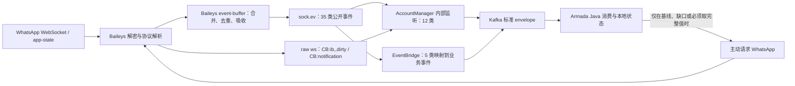

# Baileys / WhatsApp 事件与报文体手册

> 适用版本：`baileys@7.0.0-rc11` + 本仓库 `patches/baileys+7.0.0-rc11.patch`  
> 核对日期：2026-08-15  
> 权威入口：`node_modules/baileys/lib/Types/Events.d.ts`  
> 目标：优先使用 WhatsApp 已返回的事实，减少重复调用 `groupMetadata`、`groupInviteCode`、群列表、限制状态等主动查询。

本文描述的是 Baileys 在 `sock.ev` 上整理后的事件，不是 WhatsApp WebSocket 原始 BinaryNode。原始节点会先经过解密、协议解析和事件缓冲，事件可能被合并、吸收或丢弃，再交给 Armada。

如果把“所有返回事件”理解为 WhatsApp 服务端全部原始 tag/node，并不存在一个稳定、封闭、公开的有限清单；它会随服务端和实验开关变化。对应用层真正可维护的边界，是本文列出的锁定版本 35 个公开事件，再加项目确实使用的两个 raw hook。

## 先看结论

- 当前版本声明 **35 个公开事件**；源码能找到 34 个事件名的运行时发射点。`blocklist.set` 只有类型声明，没有直接 `emit`。
- `groups.participating` 是 Armada 本地 patch 新增事件，不属于原版 rc11。它源于 Baileys 收到 `groups dirty` 后发起的一次轻量 `participating` 查询，只含 `{id, subject?}`。
- 协议层当前只订阅 **12/35** 个事件；真正桥接到 Kafka 的 Baileys 事件只有 5 个。大量已经返回的消息、群资料、成员、联系人、回执和设置字段没有落库。
- 当前最明显的请求放大来自群事件：`groups.upsert` 已带完整 `GroupMetadata` 却再拉群列表；`groups.update` 已带变更字段却逐群拉 metadata；成员 add/remove 已带 delta，却由 Java 再拉完整 metadata；每次非历史群发送在 60 秒缓存未命中时还会预查 metadata。
- 默认 `dropInboundMessages=true` 会在普通入站消息解密和事件发射前 ACK 后丢弃；因此“代码监听了 `messages.upsert`”不代表默认生产配置能收到普通入站消息。
- 仓库中的 8,845 条运行快照只记录资源和聚合指标，不含原始事件 payload。本手册的报文结构来自锁定版本的类型、发射源码、patch 和测试 fixture，不冒充生产抓包样本。

建议把状态同步改成“**一次基线 + 事件增量 + 缺口/定期对账**”，而不是“每个事件到达后立刻回查 WhatsApp”。但在依赖 `groups.update` delta 前，应先修复或绕开 rc11 事件缓冲对同一群只保留首个 update 的问题。

## 事件从哪里来



三层状态必须分开看：

1. **类型声明**：`BaileysEventMap` 是否声明。
2. **运行时可达**：当前 Baileys 源码是否发射，以及 socket 配置是否会让事件到达。
3. **项目已消费**：Armada 是否订阅、保留字段并让下游真正使用。

## 全局报文规则

### Partial、批次与清除语义

- `connection.update`、`creds.update`、`chats.update`、`contacts.update`、`groups.update` 和 `messages.update[].update` 都是增量。字段缺失通常表示“不变”，不能用整个对象覆盖旧快照。
- 显式 `null`、空字符串或 falsey 值可能表示“清除/撤回”，必须按事件具体语义处理。例如 reaction 的 `text` 为空表示取消表情。
- 多数事件是数组批次，必须逐项处理；不能只取第一个元素。
- 建议幂等键使用 `accountId + eventName + 业务主键 + 服务端时间/版本`。消息主键优先使用完整 `WAMessageKey`，不要只用 `id`。

### 在线、离线与历史

- `messages.upsert.type='notify'` 通常代表在线实时消息；`append` 代表离线/历史追加。手机补回占位消息时也可能是 `notify`，并带 `requestId`。
- `messaging-history.set` 是多 chunk；`isLatest` 不是“最后一个 chunk”的可靠标志。完成或停滞应看 `messaging-history.status`。
- `call[].offline` 是明确字段；其它群、联系人和回执事件没有统一的 `offline` 标志。

### Event buffer 的已知行为

以下事件会进入 Baileys buffer：history、chat upsert/update/delete、contact upsert/update、message upsert/update/delete/reaction/receipt、group update。

- 同一窗口内的 reaction、receipt、message update 可能被吸收到 `messages.upsert`，之后不再单独发事件。
- `messages.upsert.requestId` 在当前 consolidation 过程中可能丢失。
- `messaging-history.set.lidPnMappings` 当前没有进入 buffered data，缓冲后可能丢失。
- `{jid, all:true}` 形态的 `messages.delete` 当前没有运行时发射点，buffer 也不处理这一分支。
- 同一 buffer 窗口内，同一 group id 的多个 `groups.update` 当前只保留首个 update，没有继续 merge。依赖群增量替代全量查询前必须先处理这一 rc11 风险。

### JSON 序列化和敏感字段

Baileys payload 不是天然 JSON：

- `Long`：规范化为安全整数；超出 JS 安全范围时转十进制字符串。
- `Date`：转 ISO-8601。
- `Uint8Array` / `Buffer`：只在确有业务需要时转 Base64；密钥和媒体密文默认不出协议层。
- `Boom` / `Error`：只保留清洗后的 `name/message/statusCode`，禁止透传代理 URL、凭据或堆栈。
- `undefined`：序列化时省略；`null` 保留，因为可能有清除语义。
- `chats.update.conditional` 是内部函数，不能序列化，也不应跨进程传递。

`creds.update`、QR 原文、所有密钥、配对码、routingInfo、JID/LID/手机号、消息正文、群名/描述、邀请码、媒体 URL/directPath/mediaKey/hash、位置和 vCard 都属于敏感数据。`creds.update` 只能合并持久化，禁止写日志或 Kafka。

## 35 个事件总览

“要回查？”列指收到事件后是否通常还需要主动请求 WhatsApp；“按需”表示只有业务确实需要事件中没有的完整值时才查。

| # | 事件 | 做什么 | 顶层报文 | Armada 当前处理 | 要回查？ |
|---:|---|---|---|---|---|
| 1 | `connection.update` | 连接、QR、在线、断线和限制状态变化 | `Partial<ConnectionState>` | 已监听；只保留部分 QR/限制/断线信息 | 否；基线或明确刷新时按需 |
| 2 | `creds.update` | Signal/设备认证凭据发生变化 | `Partial<AuthenticationCreds>` | 已监听；保存当前完整 creds | 否 |
| 3 | `messaging-history.set` | 历史同步 chunk：chat/contact/message/LID 映射等 | 对象，含 3 个数组和同步元数据 | 已监听；只使用 chats | 否 |
| 4 | `messaging-history.status` | 历史阶段完成或暂停 | `{syncType,status,explicit}` | 未监听 | 否 |
| 5 | `chats.upsert` | 新增/替换 chat 快照 | `Chat[]` | 已监听；只取群 suspended/terminated | 否 |
| 6 | `chats.update` | chat 增量变化 | `ChatUpdate[]` | 已监听；只取群 suspended/terminated | 否 |
| 7 | `lid-mapping.update` | PN 与 LID 身份映射变化 | `{pn,lid}` | 未监听 | 否 |
| 8 | `chats.delete` | 删除本地 chat | `string[]` | 未监听 | 否 |
| 9 | `presence.update` | 在线、输入、录音、最后在线变化 | `{id,presences}` | 未监听 | 否 |
| 10 | `contacts.upsert` | 新增/替换联系人 | `Contact[]` | 未监听 | 否 |
| 11 | `contacts.update` | 联系人名称、业务名、头像标记等增量 | `Partial<Contact>[]` | 未监听 | 头像只给 changed/removed 时按需查 URL |
| 12 | `messages.delete` | 按 key 删除消息，或声明清空会话 | union | 未监听 | 否 |
| 13 | `messages.update` | 消息 ACK、编辑、撤回、星标、错误等增量 | `{key,update}[]` | 已监听；只桥接 status/revoke | 否 |
| 14 | `messages.media-update` | 媒体重试结果，返回密文或错误 | `{key,media?,error?}[]` | 未监听 | 下载明文媒体时仍需下载 |
| 15 | `messages.upsert` | 实时/离线/历史消息批次 | `{messages,type,requestId?}` | 已监听；大量外层字段被丢弃 | 否；媒体字节按需下载 |
| 16 | `messages.reaction` | 表情新增、修改或删除 | `{key,reaction}[]` | 未监听 | 否 |
| 17 | `message-receipt.update` | 群/状态消息的送达、已读、播放回执 | `{key,receipt}[]` | 未监听 | 否 |
| 18 | `groups.upsert` | 新增/替换完整群资料 | `GroupMetadata[]` | 已监听但丢弃 payload，随后拉群列表 | **否；当前多查** |
| 19 | `groups.update` | 群标题、描述、权限、邀请码等增量 | `Partial<GroupMetadata>[]` | 已监听；只取 inviteCode，随后拉 metadata | **通常否；当前多查** |
| 20 | `groups.participating` | 本账号参与群的轻量 `{id,subject}` 列表 | `{id,subject?}[]` | 已监听并报 `account.groups_reported` | 不应再次查相同列表；完整成员按需 |
| 21 | `group-participants.update` | 成员 add/remove/promote/demote/modify | 单对象 | 已桥接；Java 仅直接消费 promote/demote | **通常否；add/remove 当前多查** |
| 22 | `group.join-request` | 入群申请创建、撤销、拒绝 | 单对象 | 未监听 | 否 |
| 23 | `group.member-tag.update` | 群成员标签变化 | 单对象 | 未监听 | 否 |
| 24 | `blocklist.set` | 完整黑名单快照 | `{blocklist}` | 未监听；当前版本无直接 emitter | 当前只能主动 fetch 基线 |
| 25 | `blocklist.update` | 黑名单新增/移除 delta | `{blocklist,type}` | 未监听 | 否 |
| 26 | `call` | 通话 offer/ringing/accept/terminate 等状态 | `WACallEvent[]` | 未监听 | 否 |
| 27 | `labels.edit` | 商业标签新增、编辑或删除 | `Label` | 未监听 | 否 |
| 28 | `labels.association` | 标签与 chat/message 关联变化 | `{association,type}` | 未监听 | 否 |
| 29 | `newsletter.reaction` | Channel 消息 reaction 计数变化 | 单对象 | 未监听 | 否 |
| 30 | `newsletter.view` | Channel 消息浏览数变化 | 单对象 | 未监听 | 否 |
| 31 | `newsletter-participants.update` | Channel 成员/角色变化 | 单对象 | 未监听 | 否 |
| 32 | `newsletter-settings.update` | Channel 设置变化 | `{id,update:any}` | 未监听 | 通常否，需保留未知字段 |
| 33 | `message-capping.update` | 新会话消息配额/封顶状态变化 | `NewChatMessageCapInfo` | 已桥接；只保留 3 个派生字段 | **否；当前字段不足可能多查** |
| 34 | `chats.lock` | chat 锁定状态变化 | `{id,locked}` | 未监听 | 否 |
| 35 | `settings.update` | locale、隐私、时间格式等设置变化 | discriminated union | 未监听 | 否；部分 rc11 分支有 emitter 缺口 |

## 详细报文体：公共类型

以下 TypeScript 表达的是监听器实际应处理的结构。`?` 代表字段可能缺失，`null` 与缺失不能混为一谈。

### `WAMessageKey`

```ts
type WAMessageKey = {
  remoteJid?: string | null
  fromMe?: boolean | null
  id?: string | null
  participant?: string | null

  // Baileys 扩展：LID/PN 双地址及服务端信息
  remoteJidAlt?: string
  remoteJidUsername?: string
  participantAlt?: string
  participantUsername?: string
  server_id?: string
  addressingMode?: string
  isViewOnce?: boolean
}
```

群消息的发送者通常在 `participant`；会话在 `remoteJid`。LID 模式下应同时保存主地址和 `*Alt` 映射，避免为了还原手机号再查 WhatsApp。

### `Contact`、`Chat`、`GroupMetadata`

```ts
type Contact = {
  id: string
  lid?: string
  phoneNumber?: string
  name?: string
  notify?: string
  username?: string
  verifiedName?: string
  imgUrl?: string | null       // 实际更新中还会出现 'changed' / 'removed'
  status?: string
}

type Chat = {
  id?: string | null
  messages?: HistorySyncMsg[] | null
  newJid?: string | null
  oldJid?: string | null
  lastMsgTimestamp?: number | Long | null
  lastMessageRecvTimestamp?: number
  unreadCount?: number | null
  readOnly?: boolean | null
  endOfHistoryTransfer?: boolean | null
  ephemeralExpiration?: number | null
  ephemeralSettingTimestamp?: number | Long | null
  endOfHistoryTransferType?: number | null
  conversationTimestamp?: number | Long | null
  name?: string | null
  pHash?: string | null
  notSpam?: boolean | null
  archived?: boolean | null
  disappearingMode?: object | null
  unreadMentionCount?: number | null
  markedAsUnread?: boolean | null
  participant?: GroupParticipantProto[] | null
  tcToken?: Uint8Array | null
  tcTokenTimestamp?: number | Long | null
  contactPrimaryIdentityKey?: Uint8Array | null
  pinned?: number | null
  muteEndTime?: number | Long | null
  wallpaper?: object | null
  mediaVisibility?: number | null
  tcTokenSenderTimestamp?: number | Long | null
  suspended?: boolean | null
  terminated?: boolean | null
  createdAt?: number | Long | null
  createdBy?: string | null
  description?: string | null
  support?: boolean | null
  isParentGroup?: boolean | null
  parentGroupId?: string | null
  isDefaultSubgroup?: boolean | null
  displayName?: string | null
  pnJid?: string | null
  shareOwnPn?: boolean | null
  pnhDuplicateLidThread?: boolean | null
  lidJid?: string | null
  username?: string | null
  lidOriginType?: string | null
  commentsCount?: number | null
  locked?: boolean | null
  systemMessageToInsert?: object | null
  capiCreatedGroup?: boolean | null
  accountLid?: string | null
  limitSharing?: boolean | null
  limitSharingSettingTimestamp?: number | Long | null
  limitSharingTrigger?: number | null
  limitSharingInitiatedByMe?: boolean | null
  maibaAiThreadEnabled?: boolean | null
}

type GroupParticipant = Contact & {
  isAdmin?: boolean
  isSuperAdmin?: boolean
  admin?: 'admin' | 'superadmin' | null
}

type GroupMetadata = {
  id: string
  notify?: string
  addressingMode?: 'pn' | 'lid'
  owner: string | undefined
  ownerPn?: string
  ownerUsername?: string
  owner_country_code?: string
  subject: string
  subjectOwner?: string
  subjectOwnerPn?: string
  subjectOwnerUsername?: string
  subjectTime?: number
  creation?: number
  desc?: string
  descOwner?: string
  descOwnerPn?: string
  descOwnerUsername?: string
  descId?: string
  descTime?: number
  linkedParent?: string
  restrict?: boolean
  announce?: boolean
  memberAddMode?: boolean
  joinApprovalMode?: boolean
  isCommunity?: boolean
  isCommunityAnnounce?: boolean
  size?: number
  participants: GroupParticipant[]
  ephemeralDuration?: number
  inviteCode?: string
  author?: string
  authorPn?: string
  authorUsername?: string
}
```

### `WAMessage` 外层

```ts
type WAMessage = {
  key: WAMessageKey
  message?: IMessage | null
  messageTimestamp?: number | Long | null
  status?: 0 | 1 | 2 | 3 | 4 | 5 | null
  participant?: string | null
  messageC2STimestamp?: number | Long | null
  ignore?: boolean | null
  starred?: boolean | null
  broadcast?: boolean | null
  pushName?: string | null
  mediaCiphertextSha256?: Uint8Array | null
  multicast?: boolean | null
  urlText?: boolean | null
  urlNumber?: boolean | null
  messageStubType?: number | null
  messageStubParameters?: string[] | any
  clearMedia?: boolean | null
  duration?: number | null
  labels?: string[] | null
  paymentInfo?: object | null
  finalLiveLocation?: object | null
  quotedPaymentInfo?: object | null
  ephemeralStartTimestamp?: number | Long | null
  ephemeralDuration?: number | null
  ephemeralOffToOn?: boolean | null
  ephemeralOutOfSync?: boolean | null
  bizPrivacyStatus?: number | null
  verifiedBizName?: string | null
  mediaData?: object | null
  photoChange?: object | null
  userReceipt?: IUserReceipt[] | null
  reactions?: IReaction[] | null
  quotedStickerData?: object | null
  futureproofData?: Uint8Array | null
  statusPsa?: object | null
  pollUpdates?: IPollUpdate[] | null
  pollAdditionalMetadata?: object | null
  agentId?: string | null
  statusAlreadyViewed?: boolean | null
  messageSecret?: Uint8Array | null
  keepInChat?: object | null
  originalSelfAuthorUserJidString?: string | null
  revokeMessageTimestamp?: number | Long | null
  pinInChat?: object | null
  premiumMessageInfo?: object | null
  is1PBizBotMessage?: boolean | null
  isGroupHistoryMessage?: boolean | null
  botMessageInvokerJid?: string | null
  commentMetadata?: object | null
  eventResponses?: object[] | null
  reportingTokenInfo?: object | null
  newsletterServerId?: number | Long | null
  eventAdditionalMetadata?: object | null
  isMentionedInStatus?: boolean | null
  statusMentions?: string[] | null
  targetMessageId?: WAMessageKey | null
  messageAddOns?: object[] | null
  statusMentionMessageInfo?: object | null
  isSupportAiMessage?: boolean | null
  statusMentionSources?: string[] | null
  supportAiCitations?: object[] | null
  botTargetId?: string | null
  groupHistoryIndividualMessageInfo?: object | null
  groupHistoryBundleInfo?: object | null
  interactiveMessageAdditionalMetadata?: object | null
  quarantinedMessage?: object | null

  // Baileys 扩展
  category?: string
  retryCount?: number
}
```

`status`：`0=ERROR`、`1=PENDING`、`2=SERVER_ACK`、`3=DELIVERY_ACK`、`4=READ`、`5=PLAYED`。深层 `object` 的唯一权威定义是同版本 `WAProto/index.d.ts`；它们是 protobuf 的递归对象，不能假设每次都完整出现。

### `IMessage` 内容分支

`message` 是 one-of 风格对象，但历史数据或 wrapper 可能嵌套。rc11 当前声明 95 个可选内容分支：

```text
conversation, senderKeyDistributionMessage, imageMessage, contactMessage,
locationMessage, extendedTextMessage, documentMessage, audioMessage, videoMessage,
call, chat, protocolMessage, contactsArrayMessage, highlyStructuredMessage,
fastRatchetKeySenderKeyDistributionMessage, sendPaymentMessage, liveLocationMessage,
requestPaymentMessage, declinePaymentRequestMessage, cancelPaymentRequestMessage,
templateMessage, stickerMessage, groupInviteMessage, templateButtonReplyMessage,
productMessage, deviceSentMessage, messageContextInfo, listMessage, viewOnceMessage,
orderMessage, listResponseMessage, ephemeralMessage, invoiceMessage, buttonsMessage,
buttonsResponseMessage, paymentInviteMessage, interactiveMessage, reactionMessage,
stickerSyncRmrMessage, interactiveResponseMessage, pollCreationMessage,
pollUpdateMessage, keepInChatMessage, documentWithCaptionMessage,
requestPhoneNumberMessage, viewOnceMessageV2, encReactionMessage, editedMessage,
viewOnceMessageV2Extension, pollCreationMessageV2, scheduledCallCreationMessage,
groupMentionedMessage, pinInChatMessage, pollCreationMessageV3,
scheduledCallEditMessage, ptvMessage, botInvokeMessage, callLogMesssage,
messageHistoryBundle, encCommentMessage, bcallMessage, lottieStickerMessage,
eventMessage, encEventResponseMessage, commentMessage,
newsletterAdminInviteMessage, placeholderMessage, secretEncryptedMessage,
albumMessage, eventCoverImage, stickerPackMessage, statusMentionMessage,
pollResultSnapshotMessage, pollCreationOptionImageMessage, associatedChildMessage,
groupStatusMentionMessage, pollCreationMessageV4, statusAddYours, groupStatusMessage,
richResponseMessage, statusNotificationMessage, limitSharingMessage, botTaskMessage,
questionMessage, messageHistoryNotice, groupStatusMessageV2, botForwardedMessage,
statusQuestionAnswerMessage, questionReplyMessage, questionResponseMessage,
statusQuotedMessage, statusStickerInteractionMessage, pollCreationMessageV5,
newsletterFollowerInviteMessageV2, pollResultSnapshotMessageV3
```

常见媒体分支已经带 `url`、`directPath`、`mediaKey`、文件哈希、mimetype、长度、尺寸和 caption 等下载元数据；通常无需再查“媒体 metadata”，但下载/解密实际字节仍是另一项操作。

## 详细报文体：连接、认证与历史

### 1. `connection.update`

用途：连接生命周期、登录 QR、离线通知接收状态、前台在线状态和 reachout 限制。

```ts
type ConnectionUpdate = Partial<{
  connection: 'open' | 'connecting' | 'close'
  lastDisconnect: {
    error: Boom | Error | undefined
    date: Date
  }
  isNewLogin: boolean
  qr: string
  receivedPendingNotifications: boolean
  legacy: {
    phoneConnected: boolean
    user?: Contact
  }
  isOnline: boolean
  reachoutTimeLock: {
    isActive?: boolean
    timeEnforcementEnds?: Date
    enforcementType?:
      | 'DEFAULT'
      | 'WEB_COMPANION_ONLY'
      | 'BIZ_QUALITY'
      | `BIZ_COMMERCE_VIOLATION_${string}`
  }
}>
```

常见断线码：`401` 未授权、`403` 禁止、`408` 超时、`411` 多设备不兼容、`428` 前置条件失败、`440` 连接被替换、`500` 内部错误、`503` 服务不可用、`515` 需要重启连接。业务判断应优先看 Boom `output.statusCode`，同时保存清洗后的错误类别和发生时间。

`enforcementType` 的 rc11 完整枚举为：

```text
DEFAULT
WEB_COMPANION_ONLY
BIZ_QUALITY
BIZ_COMMERCE_VIOLATION_ALCOHOL
BIZ_COMMERCE_VIOLATION_ADULT
BIZ_COMMERCE_VIOLATION_ANIMALS
BIZ_COMMERCE_VIOLATION_BODY_PARTS_FLUIDS
BIZ_COMMERCE_VIOLATION_DATING
BIZ_COMMERCE_VIOLATION_DIGITAL_SERVICES_PRODUCTS
BIZ_COMMERCE_VIOLATION_DRUGS
BIZ_COMMERCE_VIOLATION_DRUGS_ONLY_OTC
BIZ_COMMERCE_VIOLATION_GAMBLING
BIZ_COMMERCE_VIOLATION_HEALTHCARE
BIZ_COMMERCE_VIOLATION_REAL_FAKE_CURRENCY
BIZ_COMMERCE_VIOLATION_SUPPLEMENTS
BIZ_COMMERCE_VIOLATION_TOBACCO
BIZ_COMMERCE_VIOLATION_VIOLENT_CONTENT
BIZ_COMMERCE_VIOLATION_WEAPONS
```

Armada 当前的 `qrBase64` 实际装的是 QR 文本，不是图片 Base64；其 `expiresAt` 固定加 60 秒也不准确：首个 QR 约 60 秒，后续约 20 秒，并且当前没有发布 `qr: undefined` 的失效信号。

### 2. `creds.update`

用途：任何认证凭据增量变化时通知调用者持久化。监听器必须把 delta 合并进当前 creds，不能用 partial 替换完整对象。

```ts
type CredsUpdate = Partial<{
  signedIdentityKey: { public: Uint8Array; private: Uint8Array }
  signedPreKey: {
    keyPair: { public: Uint8Array; private: Uint8Array }
    signature: Uint8Array
    keyId: number
    timestampS?: number
  }
  registrationId: number
  noiseKey: { public: Uint8Array; private: Uint8Array }
  pairingEphemeralKeyPair: { public: Uint8Array; private: Uint8Array }
  advSecretKey: string
  me?: Contact
  account?: IADVSignedDeviceIdentity
  signalIdentities?: Array<{
    identifier: { name: string; deviceId: number }
    identifierKey: Uint8Array
  }>
  myAppStateKeyId?: string
  firstUnuploadedPreKeyId: number
  nextPreKeyId: number
  lastAccountSyncTimestamp?: number
  platform?: string
  processedHistoryMessages: Array<Pick<WAMessage, 'key' | 'messageTimestamp'>>
  accountSyncCounter: number
  accountSettings: {
    unarchiveChats: boolean
    defaultDisappearingMode?: {
      ephemeralExpiration?: number | null
      ephemeralSettingTimestamp?: number | Long | null
    }
  }
  registered: boolean
  pairingCode: string | undefined
  lastPropHash: string | undefined
  routingInfo: Buffer | undefined
  additionalData?: any
}>
```

这是最高敏感级别报文。Armada 目前虽然忽略回调参数，但保存的是已被 Baileys 原地更新后的 `state.creds`，语义上可行；仍应确保日志、指标和 Kafka 永不包含 payload。

### 3. `messaging-history.set`

用途：历史同步的一个 chunk。一次登录会收到多次，数组按反向时间排序。

```ts
type MessagingHistorySet = {
  chats: Chat[]
  contacts: Contact[]
  messages: WAMessage[]
  lidPnMappings?: Array<{ pn: string; lid: string }>
  isLatest?: boolean
  progress?: number | null
  syncType?: 0 | 1 | 2 | 3 | 4 | 5 | 6 | null
  pastParticipants?: Array<{
    groupJid?: string | null
    pastParticipants?: Array<{
      userJid?: string | null
      leaveReason?: 'LEFT' | 'REMOVED' | number | null
      leaveTs?: number | Long | null
    }> | null
  }> | null
  chunkOrder?: number | null
  peerDataRequestSessionId?: string | null
}
```

`syncType`：`0=INITIAL_BOOTSTRAP`、`1=INITIAL_STATUS_V3`、`2=FULL`、`3=RECENT`、`4=PUSH_NAME`、`5=NON_BLOCKING_DATA`、`6=ON_DEMAND`。

现状只消费 `chats` 的群 suspended/terminated；contacts、messages、LID 映射、历史成员和同步游标全部丢弃。若业务需要这些数据，应直接消费 chunk，不要对每条历史对象再次查询。

### 4. `messaging-history.status`

用途：标记某个历史同步阶段明确完成或因超时暂停。

```ts
type MessagingHistoryStatus = {
  syncType: 0 | 1 | 2 | 3 | 4 | 5 | 6
  status: 'complete' | 'paused'
  explicit: boolean
}
```

- bootstrap 可直接进入 `complete`。
- recent 收到 `progress=100` 时是 `complete, explicit=true`。
- 120 秒没有新 chunk 时是 `paused, explicit=false`，不是服务端明确宣告完成。

## 详细报文体：Chat、身份与联系人

### 5–11. Chat / LID / presence / contact

```ts
// 5. 新增或替换 chat 快照
type ChatsUpsert = Chat[]

// 6. chat 增量；字段见公共 Chat
type ChatsUpdate = Array<Partial<Chat & {
  conditional: (bufferedData: BufferedEventData) => boolean | undefined
  timestamp?: number
}>>

// 7. 手机号 JID 与 LID 的映射
type LidMappingUpdate = {
  pn: string
  lid: string
}

// 8. 删除 chat
type ChatsDelete = string[]

// 9. 一个 chat 内一个或多个参与者的在线状态
type PresenceUpdate = {
  id: string
  presences: Record<string, {
    lastKnownPresence:
      | 'unavailable'
      | 'available'
      | 'composing'
      | 'recording'
      | 'paused'
    lastSeen?: number
    groupOnlineCount?: number
  }>
}

// 10. 新增或替换联系人
type ContactsUpsert = Contact[]

// 11. 联系人增量
type ContactsUpdate = Array<Partial<Contact>>
```

注意：

- 当前 presence 解析会把 `paused` 归一化成 `available`，把 audio composing 转成 `recording`。
- `contacts.update.imgUrl` 的运行时头像删除标记是 `'removed'`，改变标记是 `'changed'`；类型注释中的 `null` 不覆盖全部实际情况。只有业务确实需要真实头像 URL 时才调用头像查询。
- `lid-mapping.update` 应直接维护身份映射缓存。丢弃它会导致后续业务为了 PN/LID 互转再请求或做不可靠猜测。

## 详细报文体：消息与回执

### 12. `messages.delete`

用途：删除一组明确消息，或声明整个 chat 的消息被清除。

```ts
type MessagesDelete =
  | { keys: WAMessageKey[] }
  | { jid: string; all: true }
```

当前 rc11 只确认 `keys` 分支有 emitter。对方撤回一条消息通常不是这个事件，而是 `messages.update`，其中 `update.message=null` 且 stub type 为 revoke。

### 13. `messages.update`

用途：对已有消息做 partial 更新，包括 ACK、编辑、撤回、星标、placeholder、poll/event update、retry 和发送错误。

```ts
type MessagesUpdate = Array<{
  key: WAMessageKey
  update: Partial<WAMessage>
}>
```

Armada 当前只在 `status` 存在或 `message === null` 时桥接：

```ts
type CurrentMessageAckData = {
  key: WAMessageKey
  status: number | 'revoked'
  ackedAt: string // 本地时间，不是 WhatsApp 服务端时间
}
```

这会丢掉错误 stub 参数、编辑后的内容、星标、poll/event、retry 等信息。发送被限制时，Baileys 可能把原因放在 `messageStubParameters`，只保留泛化的 `status=error` 会迫使下游猜测或补查。

### 14. `messages.media-update`

用途：媒体重新上传/重试请求的结果。每项要么有新密文材料，要么有错误。

```ts
type MessagesMediaUpdate = Array<{
  key: WAMessageKey
  media?: {
    ciphertext: Uint8Array
    iv: Uint8Array
  }
  error?: Boom
}>
```

密文和 IV 不应直接写日志/Kafka。收到成功结果不等于已经取得媒体明文。

### 15. `messages.upsert`

用途：新增消息批次；既可能是实时入站，也可能是离线、历史、newsletter 或本机补回。

```ts
type MessagesUpsert = {
  messages: WAMessage[]
  type: 'append' | 'notify'
  requestId?: string
}
```

脱敏骨架：

```json
{
  "messages": [
    {
      "key": {
        "remoteJid": "<chat-jid>",
        "fromMe": false,
        "id": "<message-id>",
        "participant": "<sender-jid>"
      },
      "messageTimestamp": "<unix-seconds>",
      "pushName": "<redacted>",
      "message": {
        "extendedTextMessage": {
          "text": "<redacted>"
        }
      }
    }
  ],
  "type": "notify",
  "requestId": "<optional-request-id>"
}
```

Armada 当前把每条都发布成 `message.received`，没有保留批次 `type/requestId/fromMe`，并丢掉大部分 WAMessage 外层字段。分类器只识别 text/image/video/audio/document/location/contact/sticker/reaction，95 个内容分支中其它分支统一标成 `system`；原始 `content=msg.message` 仍被带出。

默认 `dropInboundMessages=true` 时，普通用户/群入站 message 节点会 ACK 后在解密和 emit 前丢弃。`s.whatsapp.net` 系统消息、历史通知、协议控制以及 call 转出的合成消息仍可能到达。默认 `emitOwnEvents=false` 又关闭本 socket 自己发送消息的本地回显。

### 16. `messages.reaction`

```ts
type MessagesReaction = Array<{
  key: WAMessageKey        // 被 reaction 的原消息
  reaction: {
    key?: WAMessageKey | null // reaction 动作消息本身
    text?: string | null       // 空/缺失表示取消
    groupingKey?: string | null
    senderTimestampMs?: number | Long | null
    unread?: boolean | null
  }
}>
```

直接更新本地消息 reaction 集合，不需要查询消息状态。注意它可能已被 buffer 吸收到同批 `messages.upsert[].reactions`。

### 17. `message-receipt.update`

```ts
type MessageReceiptUpdate = Array<{
  key: WAMessageKey
  receipt: {
    userJid?: string | null
    receiptTimestamp?: number | Long | null
    readTimestamp?: number | Long | null
    playedTimestamp?: number | Long | null
    pendingDeviceJid?: string[] | null
    deliveredDeviceJid?: string[] | null
  }
}>
```

该事件主要承载群聊/状态按参与者区分的回执；单聊 ACK 常在 `messages.update.status`。两者都应驱动本地消息状态，不需要轮询 WhatsApp。

## 详细报文体：群

### 18. `groups.upsert`

用途：新增或替换完整群资料。

```ts
type GroupsUpsert = GroupMetadata[]
```

它已经包含 `participants`、subject/desc、权限、community、owner、size、ephemeral、inviteCode 等完整字段。Armada 当前只记录数量/JID/subject 是否存在，随后调 `groupFetchParticipatingSummaries()`；这是本手册识别出的首个明确多查点。

### 19. `groups.update`

用途：群资料增量更新。

```ts
type GroupsUpdate = Array<Partial<GroupMetadata>>
```

常见 payload：

```json
[
  {
    "id": "<group-jid>",
    "subject": "<redacted-new-subject>",
    "announce": true,
    "restrict": false,
    "inviteCode": "<redacted>",
    "author": "<operator-jid>"
  }
]
```

真实事件通常只带其中一两个变更字段。当前协议层只直接使用 `inviteCode/author`，然后对每个 update 发布 metadata 同步请求。正确做法是 merge 已出现的字段；只有需要事件未提供的完整 participant snapshot、检测到版本缺口或对账时才查 metadata。

但是 rc11 buffer 对同一窗口同一 group id 只保留首个 update。修复该问题前，不能把该事件视作绝对完整的变更日志，需保留低频对账或缺口恢复。

### 20. `groups.participating`

用途：报告当前账号参与群的轻量列表。**本仓 patch 专有**。

```ts
type GroupsParticipating = Array<{
  id: string
  subject?: string
}>
```

它不是 WhatsApp 直接 push 的完整群报文：Baileys 收到 `groups dirty` 后主动发一次 `w:g2 participating` 查询，再将结果裁剪成这个事件。监听它后不能再次调用相同群列表查询，否则会形成查询回环。它足以做群成员关系存在性和 subject 基线，不足以回答 participants/desc/role/permissions。

patch 内部还计算了 `skippedGroupCount`，但没有随事件发出；协议层随后也没补 `snapshotComplete`。Java 在 `snapshotComplete=null, skipped=0` 时会推断为完整快照，存在把漏报群误判为离群的风险。

### 21. `group-participants.update`

用途：一个群的一次成员动作。

```ts
type GroupParticipantsUpdate = {
  id: string
  author: string
  authorPn?: string
  authorUsername?: string
  participants: Array<Contact & {
    isAdmin?: boolean
    isSuperAdmin?: boolean
    admin?: 'admin' | 'superadmin' | null
  }>
  action: 'add' | 'remove' | 'promote' | 'demote' | 'modify'
}
```

`modify` 表示号码/身份变更。事件已经给出操作者、参与者的 PN/LID/username/contact 信息和角色。Armada bridge 目前只保留每人的 `id/lid/phoneNumber` 与 `operator=author`；Java 又明确忽略 add/remove，只把 promote/demote 当作本地 delta，因此 add/remove 会触发一次完整 metadata 查询。

推荐把五种 action 都做成幂等成员事实。只有需要精确完整成员快照、身份无法解析或检测到事件缺口时才拉 metadata。如果变化成员是本账号，当前协议层还会额外拉一次所有参与群列表；此时可以先按 action 更新成员关系，再低频对账。

### 22. `group.join-request`

```ts
type GroupJoinRequest = {
  id: string
  author: string
  authorPn?: string
  authorUsername?: string
  participant: string
  participantPn?: string
  action: 'created' | 'revoked' | 'rejected'
  method: 'invite_link' | 'linked_group_join' | 'non_admin_add' | undefined
}
```

当前源码只覆盖一部分 stub，仍有 TODO。应保留未知/新增 method，不要因枚举外值丢整条事件。

### 23. `group.member-tag.update`

```ts
type GroupMemberTagUpdate = {
  groupId: string
  participant: string
  participantAlt?: string
  label: string
  messageTimestamp?: number
}
```

用于更新群成员标签；直接按 group + participant merge，无需查群 metadata。

## 详细报文体：黑名单、通话与标签

### 24–25. `blocklist.set` / `blocklist.update`

```ts
// 声明为完整快照，但 rc11 当前没有直接 emitter
type BlocklistSet = {
  blocklist: string[]
}

// 增量；同一事件可带一组 JID
type BlocklistUpdate = {
  blocklist: string[]
  type: 'add' | 'remove'
}
```

因为 `fireInitQueries=false`，连接初始化不会自动 fetch blocklist。若业务需要完整基线，只能显式 `fetchBlocklist()` 并缓存返回值；之后用 `blocklist.update` 做增量。

### 26. `call`

```ts
type CallEvent = Array<{
  chatId: string
  from: string
  callerPn?: string
  isGroup?: boolean
  groupJid?: string
  id: string
  date: Date
  isVideo?: boolean
  status:
    | 'offer'
    | 'ringing'
    | 'preaccept'
    | 'transport'
    | 'relaylatency'
    | 'timeout'
    | 'reject'
    | 'accept'
    | 'terminate'
  offline: boolean
  latencyMs?: number
}>
```

后续状态会复用缓存字段，但当前实现不会自动把 `groupJid` 回填到所有后续状态，消费者应按 call `id` 合并整个生命周期。

### 27–28. `labels.edit` / `labels.association`

```ts
type LabelsEdit = {
  id: string
  name: string
  color: number       // 0..19
  deleted: boolean
  predefinedId?: string
}

type LabelAssociation =
  | { type: 'label_jid'; chatId: string; labelId: string }
  | { type: 'label_message'; chatId: string; messageId: string; labelId: string }

type LabelsAssociation = {
  association: LabelAssociation
  type: 'add' | 'remove'
}
```

这两类事件已经足够维护标签和关联表，不应再查完整标签列表。

## 详细报文体：Newsletter、配额与设置

### 29–32. Newsletter

```ts
type NewsletterReaction = {
  id: string
  server_id: string
  reaction: {
    code?: string
    count?: number
    removed?: boolean
  }
}

type NewsletterView = {
  id: string
  server_id: string
  count: number
}

type NewsletterParticipantsUpdate = {
  id: string
  author: string
  user: string
  new_role: string
  action: string
}

type NewsletterSettingsUpdate = {
  id: string
  update: any
}
```

标准 reaction 更新有时只给 `count=1` 且没有 `removed`。participants 的 `new_role/action` 目前是开放字符串；settings 既可能来自 MEX 任意设置对象，也可能是二进制解析出的 `{name?, description?}`。这些事件必须保留未知字段，并用 schema version 演进，不能做封闭枚举后静默丢弃。

### 33. `message-capping.update`

用途：新会话消息额度和封顶状态变化。

```ts
type MessageCappingUpdate = {
  total_quota?: number
  used_quota?: number
  cycle_start_timestamp?: string
  cycle_end_timestamp?: string
  server_sent_timestamp?: string
  ote_status?:
    | 'NOT_ELIGIBLE'
    | 'ELIGIBLE'
    | 'ACTIVE_IN_CURRENT_CYCLE'
    | 'EXHAUSTED'
  mv_status?:
    | 'NOT_ELIGIBLE'
    | 'NOT_ACTIVE'
    | 'ACTIVE'
    | 'ACTIVE_UPGRADE_AVAILABLE'
  capping_status?: 'NONE' | 'FIRST_WARNING' | 'SECOND_WARNING' | 'CAPPED'
}
```

Armada 当前只发布 `cappingStatus/remaining/cycleEnd`，丢失 total、used、cycle start、server timestamp 和 OTE/MV。应保留规范化后的完整原始字段，从事件维护本地当前值；只在连接基线、状态过期或用户明确刷新时主动查询。

### 34. `chats.lock`

```ts
type ChatsLock = {
  id: string
  locked: boolean
}
```

这是 chat lock delta，直接 merge 即可。

### 35. `settings.update`

用途：app-state 同步到的账号设置变化。

```ts
type SettingsUpdate =
  | { setting: 'unarchiveChats'; value: boolean }
  | { setting: 'locale'; value: string }
  | {
      setting: 'disableLinkPreviews'
      value: { isPreviewsDisabled?: boolean | null }
    }
  | {
      setting: 'timeFormat'
      value: { isTwentyFourHourFormatEnabled?: boolean | null }
    }
  | {
      setting: 'privacySettingRelayAllCalls'
      value: { isEnabled?: boolean | null }
    }
  | {
      setting: 'statusPrivacy'
      value: {
        mode?: 0 | 1 | 2 | 3 | null
        userJid?: string[] | null
      }
    }
  | {
      setting: 'notificationActivitySetting'
      value: 0 | 1 | 2 | 3
    }
  | {
      setting: 'channelsPersonalisedRecommendation'
      value: { isUserOptedOut?: boolean | null }
    }
```

`statusPrivacy.mode` 对应 allow/deny/contacts/close-friends 四种模式，实际语义应以同版本 proto enum 为准。

- `statusPrivacy.mode`：`0=ALLOW_LIST`、`1=DENY_LIST`、`2=CONTACTS`、`3=CLOSE_FRIENDS`。
- `notificationActivitySetting`：`0=DEFAULT_ALL_MESSAGES`、`1=ALL_MESSAGES`、`2=HIGHLIGHTS`、`3=DEFAULT_HIGHLIGHTS`。

rc11 有两个已知缺口：

- `unarchiveChats` 虽在 union 中声明，但当前走的是 `creds.update({accountSettings:{unarchiveChats}})`，没有发 `settings.update`。
- `notificationActivitySetting` 源码使用 truthy 判断，枚举值 `0` 可能被跳过。

## 当前 Armada 的事件覆盖

### 已订阅 12 类

协议层当前订阅：

```text
connection.update
creds.update
messaging-history.set
chats.upsert
chats.update
messages.upsert
messages.update
groups.upsert
groups.update
groups.participating
group-participants.update
message-capping.update
```

另有两个 raw WS 监听：

- `CB:ib,,dirty`：只识别和记录 `groups dirty`。
- `CB:notification`：只把 `w:gp2` 的 suspended/terminated 提升为 `group.health_reported`。

未订阅的 23 类：

```text
messaging-history.status
lid-mapping.update
chats.delete
presence.update
contacts.upsert
contacts.update
messages.delete
messages.media-update
messages.reaction
message-receipt.update
group.join-request
group.member-tag.update
blocklist.set
blocklist.update
call
labels.edit
labels.association
newsletter.reaction
newsletter.view
newsletter-participants.update
newsletter-settings.update
chats.lock
settings.update
```

不要为了追求“35/35”而把所有 payload 原样丢进 Kafka：presence 高频、history 体积大、creds 极敏感。正确目标是为每类事件明确 **忽略、内部缓存、聚合、持久化或业务发布** 的策略。

### 真正桥接到 Kafka 的 5 个来源

| Baileys 来源 | 当前业务事件 | 主要丢失 |
|---|---|---|
| `connection.update` | QR、`account.restricted` | isNewLogin、pending、isOnline、断线日期/完整错误；QR 字段命名和 TTL 不准 |
| `messages.upsert` | `message.received` | batch type/requestId/fromMe、时间、participant、status、stub、receipts、reactions 等 |
| `messages.update` | `message.ack` | 编辑、星标、poll/event、retry、错误 stub 等 |
| `group-participants.update` | `group.participant_changed` | authorPn/username、联系人资料、admin 原始字段 |
| `message-capping.update` | `account.new_chat_capping` | total/used/start/server time/OTE/MV |

Kafka envelope 本身是：

```ts
type ProtocolEventEnvelope<T> = {
  traceId: string
  eventId: string
  event: string
  version: string
  accountId: string
  occurredAt: string
  workerId: string
  evidence?: unknown
  data: T
}
```

这层 envelope 不是 Baileys 原始 payload；一旦 `data` 在 bridge 中被裁剪，下游无法恢复。应先定义领域事件的完整最小事实，再做显式字段映射和版本化。

### 默认配置下的可达性

```text
syncFullHistory=false
fireInitQueries=false
markOnlineOnConnect=false
emitOwnEvents=false
dropInboundMessages=true
```

影响：

- `dropInboundMessages=true`：普通入站消息 ACK 后丢弃，默认基本没有普通 `message.received`。
- `emitOwnEvents=false`：本 socket 的发送和 app-state 操作不本地回显。
- `fireInitQueries=false`：不会自动拉 blocklist/privacy/props，初始快照类信息不完整。
- `syncFullHistory=false`：当前只明确跳过 `FULL`，`RECENT` 仍会同步。

任何“事件覆盖率”监控都应同时标注这些配置，否则会把配置性不可达误判成 Baileys 异常。

## 哪些额外请求可以取消

### 已确认的请求放大链路

| 触发 | 当前链路 | 为什么会多查 | 建议 |
|---|---|---|---|
| `groups.upsert` | 事件 → 1 秒防抖 → `groupFetchParticipatingSummaries()` | 事件已带完整 GroupMetadata，却完全没消费 | 直接 upsert 该群；全账号列表只做基线/对账 |
| `groups.update` | 每个 update → metadata sync task → `groupMetadata()` | subject/desc/权限等 delta 已在事件里 | merge present fields；buffer 修复后取消逐事件全查 |
| `groups.update.inviteCode` | 先发 invite delta → metadata sync → 可能再 `groupInviteCode()` | 同一个邀请码事实被使用后又重查 | 已有 inviteCode 时给 sync task 标记“邀请码已满足” |
| participant add/remove | 事件 → metadata sync task → `groupMetadata()` | 事件已有 action 和成员身份；Java 忽略 add/remove | 五种 action 全量做幂等 delta；缺口时才查快照 |
| 本账号 add/remove | 上述动作外，再拉所有参与群摘要 | 可先直接更新账号群关系 | delta 立即生效，群列表低频对账 |
| `groups.participating` | patch 已主动查一次 → 事件 | 若监听器再查同列表会回环 | 把该事件视为查询结果，不再触发同类查询 |
| 非历史群每次发送 | 60 秒缓存 miss → `groupMetadata()` → 仍然发送 | 查询主要为了给结果附 `groupStatus`，不是发送必要条件 | 用 chat/group/member 事件维护 sendability cache；未知时异步补查 |
| 限制/capping REST | 每次 HTTP → WhatsApp 主动 query | 已有 `connection.update` / `message-capping.update` 事件但缓存不完整 | 事件维护 current state；HTTP 默认读缓存，提供显式 refresh |

metadata sync 的 Java durable task 最多尝试 4 次，退避 1/5/30 分钟；需要邀请码时每次还可能再发一次 invite query。因此一个事件理论上可放大到最多 4 次 metadata + 4 次 invite 请求。

### 事件足够与仍需查询的边界

| 场景 | 事件是否足够 | 说明 |
|---|---|---|
| 群名称、描述、announce、restrict、memberAddMode、joinApprovalMode 变化 | 足够 | `groups.update` 出现的字段就是 delta；merge 即可 |
| 单个成员 add/remove/promote/demote/modify | 足够 | `group-participants.update` 已有主体、操作者和 action |
| 新建/首次收到一个群的完整资料 | 通常足够 | `groups.upsert` 是完整 GroupMetadata |
| 当前账号参与哪些群 | `groups.participating` 足够 | 只回答 id/subject 级别的成员关系 |
| 某群此刻精确的完整成员集合 | 可能要查 | 只有没有可靠基线、发现缺口或需要强一致快照时查 metadata |
| 联系人头像实际 URL | 可能要查 | update 可能只给 `changed/removed` 标记 |
| 消息 ACK、回执、reaction、撤回、编辑 | 足够 | 写本地消息状态；不要轮询 WhatsApp |
| 媒体基本信息 | 足够 | 消息分支已有下载元数据；实际文件字节仍需下载 |
| reachout/capping 当前状态 | 增量足够，基线按需 | 事件落缓存；连接恢复或过期时主动刷新一次 |
| blocklist 完整初始列表 | 要查一次 | `blocklist.set` 当前无 emitter；之后消费 update delta |
| 历史同步完成性 | 足够 | 用 `messaging-history.status`，不要凭 `isLatest` 猜 |

两个查询派生事件要特别防回环：

- `fetchAccountReachoutTimelock()` 本身会再发 `connection.update`；其监听器不能无条件调用相同查询。
- `groups.participating` 本身来自一次 participating 查询；其监听器不能再次触发 participating 查询。

## 推荐落地顺序

### P0：先止住确定的重复请求

1. 让 `groups.upsert` 直接写群 metadata，不再因该事件拉全账号群列表。
2. 让 Java 消费 participant add/remove delta，与现有 promote/demote 一样直接写本地事实。
3. `groups.update` 先直接写出现的字段；已有 `inviteCode` 时禁止同一任务再次查邀请码。
4. 去掉“每次非历史群发送前”的阻塞 metadata 预检，改成事件驱动缓存；未知状态只影响附加诊断，不阻止正常发送。
5. Kafka 的 capping 事件保留全部 8 个原始字段，让 REST 默认读缓存。

### P1：补齐事件状态库

建立按账号分区的轻量状态：

```text
account_state: connection / reachout / capping / settings / blocklist watermark
identity_map: pn <-> lid <-> username
chat_state: archive / mute / locked / suspended / terminated / ephemeral
group_state: metadata partial + participants + lastEventAt + reconciliation watermark
message_state: status / receipts / reactions / revoke / edit
sync_state: history syncType / progress / chunkOrder / status
```

每次更新必须区分 `absent` 与 `null`，记录来源和 `occurredAt`，并能幂等重放。不要把 presence 和完整历史长期塞进同一个热状态表。

### P1：修事件正确性缺口

- 修复 `event-buffer` 对同一 group id 多个 `groups.update` 只保留首项的问题。
- 保留 `messages.upsert.type/requestId/fromMe`，避免把 append 重放当实时入站。
- 保留 LID 映射、operator PN/username、participant admin 信息。
- 修正 `groups.participating` 的 `snapshotComplete/skippedGroupCount`，避免漏报群被判离群。
- 修正 QR 字段名、真实 TTL 和失效事件。
- 修 `notificationActivitySetting=0` 的 truthy 判断；为 `unarchiveChats` 明确唯一事件来源。

### P2：低频对账与可观测性

- connection open 后做一次带抖动的必要基线，不对每个事件做全量同步。
- 对群状态按账号做低频、限流、可取消的 reconciliation；只修复漂移。
- 监控 `event_received_total{event}`、`event_dropped_total{reason}`、`event_to_query_total{event,query}`、buffer merge/drop 和事件延迟。
- 对 `event_to_query_total` 建告警；目标是能解释每一次主动 WhatsApp 请求为什么不可由已有事件满足。

## 实现监听器时的最小规范

```ts
sock.ev.on('groups.update', async updates => {
  for (const update of updates) {
    if (!update.id) continue

    // partial merge：缺失字段不覆盖，显式 null 按字段语义处理
    await groupState.merge(update.id, normalizeGroupUpdate(update))

    // 只对“没有可靠基线 / 检测到事件缺口 / 强一致请求”排 reconciliation
    if (await groupState.needsReconciliation(update.id)) {
      await reconciliationQueue.enqueueOnce(update.id, 'event-gap')
    }
  }
})
```

所有事件处理器遵守：

1. 先规范化类型，再脱敏，再落状态/发布；不 `JSON.stringify(payload)` 打印原文。
2. 数组逐项处理，单项失败不能丢整批。
3. partial merge，不做整对象覆盖。
4. 事件写入和业务发布带幂等键。
5. 查询只能由明确的“基线缺失、事件缺口、强一致业务请求”触发，并记录 reason。
6. 查询结果如果又会产生同类事件，要带 correlation/source，防止循环。

## 原始 WS 节点边界

本项目还监听两个不是 `BaileysEventMap` 的节点，因此不计入 35 个公开事件：

```ts
type DirtyNode = {
  tag: string
  attrs: Record<string, string>
  content?: Array<{
    tag: 'dirty'
    attrs: {
      type: string
      timestamp?: string
    }
  }>
}

type NotificationNode = {
  tag: 'notification'
  attrs: Record<string, string>
  content?: BinaryNode[]
}
```

`CB:notification` 的 `w:gp2` 可能包含 group、participant 和 suspended/terminated 等嵌套 BinaryNode；其 schema 由节点 tag 决定，不应当作稳定 JSON API。优先消费 Baileys 已归一化事件，只在库尚未暴露必要字段时使用 raw 节点，并用 fixture 测试约束。

## 证据位置与维护方法

主要本地证据：

- 全部事件类型：`node_modules/baileys/lib/Types/Events.d.ts`
- 连接和 capping：`node_modules/baileys/lib/Types/State.d.ts`
- 消息与 key：`node_modules/baileys/lib/Types/Message.d.ts`
- 消息 protobuf：`node_modules/baileys/WAProto/index.d.ts`
- 群、联系人、call、label：`node_modules/baileys/lib/Types/*.d.ts`
- buffer 行为：`node_modules/baileys/lib/Utils/event-buffer.js`
- 本地 patch：`patches/baileys+7.0.0-rc11.patch`
- socket 配置：`src/config.ts`、`src/worker/socket-factory.ts`
- 项目监听：`src/worker/event-bridge.ts`、`src/worker/account-manager.ts`
- 群发送预检：`src/worker/group-sendability.ts`、`src/worker/worker-consumer.ts`
- Java metadata 查询链：`armada-api/.../GroupMetadataSyncRequestedSinkAdapter.java`、`GroupMetadataSyncTaskServiceImpl.java`、`GroupMetadataSyncJob.java`、`GroupMetadataSnapshotServiceImpl.java`、`HttpGroupMetadataAdapter.java`

升级 Baileys 或修改 patch 时，至少执行以下维护检查：

```bash
# 1. 锁定实际安装版本
npm ls baileys

# 2. 重新枚举 BaileysEventMap，并对比本手册的 35 行矩阵
sed -n '12,192p' node_modules/baileys/lib/Types/Events.d.ts

# 3. 搜索声明事件的运行时发射点
rg "\.emit\(|ev\.emit|ev\.emitWithSource" node_modules/baileys/lib

# 4. 重新检查项目订阅和主动查询
rg "\.ev\.on\(|\.ws\.on\(" src
rg "groupMetadata|groupFetchParticipating|groupInviteCode|fetchAccountReachout|fetchNewChat" src

# 5. 检查文档和 patch
git diff --check
```

运行快照不是 payload 证据。若要验证生产真实形态，应增加**短时、白名单事件、结构化脱敏**的 schema sampler：只记录事件名、字段路径、值类型、数组长度和枚举，不记录字段值；`creds.update` 和 QR 必须硬编码禁止采样。采样数据设短 TTL，并按 Baileys 版本标记，避免把旧版本形态当成当前契约。

## 版本边界

这份手册是版本化契约，不是 WhatsApp 永久公开规范。Baileys rc、WAProto 和服务端节点都可能变化：

- 升级依赖时，以新安装版本的 `Events.d.ts`、WAProto 和 runtime emitter 重新生成差异。
- 项目 patch 新增/删除事件时，必须同步本手册、bridge schema 和消费者契约。
- `newsletter-settings.update:any`、open string enum、raw BinaryNode 等不稳定区域必须保留未知字段。
- 不因一次未观察到事件就认定事件不存在；先检查 socket 配置、buffer、历史阶段和业务监听是否使它不可达。
